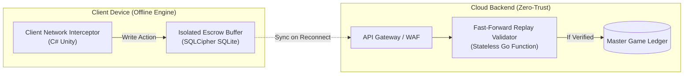

# Engineering PRD & Technical Spec: Coin Master Hybrid Offline-First

This document serves as the master engineering specification for the "Muni-Spins" Offline-First feature. It outlines the architecture, functional requirements, security boundaries, and telemetry needed to implement a robust, zero-trust offline state.

---

## 1. Functional Requirements (MoSCoW)

### Must Have (MVP Core)
*   **FR-OFF-01: Capped Budget Lease:** Offline sessions are strictly limited to 100 spins or a 12-hour validity window.
*   **FR-OFF-02: Cryptographic Hash-Chain:** Every action in offline mode must be chained using `SHA-256` to prevent memory tampering.
*   **FR-OFF-03: Ghost Village Cache:** The server provisions 5 NPC "Ghost" villages during the initial lease to isolate PvP actions.
*   **FR-OFF-04: Offline Escrow Storage:** Offline data is stored in a locally encrypted SQLite database (`SQLCipher AES-256`) and is completely segregated from the active game state.
*   **FR-OFF-05: Single-Device Token Mutex:** The lease token is cryptographically bound to a single device to prevent state duplication.

### Should Have (Monetization & UX)
*   **FR-MON-01: Vault Opening Animation:** A peak-dopamine visual sequence triggering upon successful network reconnection and ledger reconciliation.
*   **FR-MON-02: Reconnection Upsell:** Trigger a time-limited monetization offer immediately after the vault unloads.
*   **FR-UX-01: Ambient Offline Indicator:** Subtle UI indication (e.g., "Golden Wings" and "85 SPINS LEFT") instead of blocking network errors.
*   **FR-UX-02: Soft Block Screen:** A friendly message when the quota is reached, guiding the user to non-transactional actions like browsing Card Albums.

### Could Have (Future Expansions)
*   **FR-FUT-01: Local P2P Sync:** Allow playing and trading with nearby players on the same flight via Bluetooth/Local Wi-Fi.
*   **FR-FUT-02: Local Video Cache:** Caching Rewarded Video Ads for offline consumption.

### Won't Have (Explicit Out of Scope for MVP)
*   **Card Trading:** Disabled offline to prevent duping exploits.
*   **Social Chat/Guilds:** Disabled to prevent message delivery failures.
*   **Unlimited Spins:** Hard cap enforced.
*   **Heavy Asset Downloads:** New villages graphics will not download offline.

---

## 2. System Architecture & The 3-Block Solution

The architecture is designed to have a **Zero Blast Radius**. It does not alter the existing Master DB or Live Server logic for online players.

### 2.1 Component Architecture



### 2.2 Reconnection Flow & Load Flattening (Thundering Herd Prevention)

To prevent severe server load when hundreds of players regain connectivity simultaneously (e.g., plane landing):
*   **Randomized Jitter Algorithm:** The client delays the sync request by a random interval.
*   `SyncDelay = UniformRandom(200ms, 4500ms) + (RetryCount * 1000ms)`

---

## 3. Security Threat Model & Edge Cases

The fundamental rule is **Zero-Trust Client**. The server is the absolute source of truth.

### 3.1 Security Mechanics
1.  **Lease Token (JWT):** Signed via Ed25519 (KMS). Contains the player ID, spin quota, and expiration time.
2.  **Anti-Arbitrage (80% Rule):** Ghost villages hold only 80% of the coin average compared to live players. Gold/Joker cards cannot be drawn offline.
3.  **Time-Travel Protection:** Action timestamps are validated against `SystemClock.elapsedRealtime` (device uptime), not the OS time.

### 3.2 LiveOps & Grace Protocol
If a time-limited event (e.g., Viking Quest) ends while the user is offline:
*   The server audits the offline timestamps during reconciliation.
*   Points accumulated *before* the event's UTC end time are honored.
*   Rewards are delivered retroactively to the Player's Inbox.

---

## 4. Telemetry & BI Events

| Event Name | Trigger | Properties | Purpose |
| :--- | :--- | :--- | :--- |
| `offline_lease_granted` | Successful online lease generation. | `spin_quota`, `village_tier` | Penetration tracking. |
| `offline_spin_executed` | Spin in offline loop. | `spin_num`, `outcome_type` | Play depth analysis. |
| `offline_soft_block_shown` | 100-spin quota reached. | `duration_offline_sec` | Measure frustration vs engagement. |
| `offline_vault_reconciled` | Successful replay & ledger sync. | `total_coins`, `fraud_flag` | Technical validation & server load. |

---

## 5. Development Roadmap (3-Month Agile)

*   **Sprint 1:** Backend Escrow & Lease endpoints.
*   **Sprint 2:** Unity Client Engine (Hash-Chain & SQLCipher).
*   **Sprint 3:** Fast-Forward Replay Engine & Ghost Village assignment.
*   **Sprint 4:** UX/UI (Vault Animation, Soft Blocks).
*   **Sprint 5:** Chaos Engineering & Penetration Testing (Memory Injection).
*   **Sprint 6:** Rollout (5% Soft Launch -> 50% A/B Test -> 100% Global).

---

## Appendix A: Fast-Forward Replay Pseudocode

The validation function runs in `O(N)` without external DB calls, achieving <5ms latency per 100 spins.

```go
package offline_engine

import (
    "crypto/sha256"
    "encoding/hex"
    "fmt"
    "time"
)

type ReplayValidator struct {
    ExpectedSeed string
    InitialHash  string
    SpinQuota    int
}

func (v *ReplayValidator) ValidateSession(log *SessionPayload) (*ValidationResult, error) {
    if len(log.Actions) > v.SpinQuota {
        return nil, fmt.Errorf("quota exceeded")
    }

    currentHash := v.InitialHash
    prng := NewDeterministicPRNG(v.ExpectedSeed)
    var totalCoinsEarned int64 = 0

    for i, action := range log.Actions {
        // 1. Validate Deterministic Sequence
        expectedOutcome := prng.NextOutcome(action.BetMultiplier)
        if expectedOutcome.Type != action.Outcome {
            return &ValidationResult{Valid: false}, nil
        }

        // 2. Hash-Chain Verification
        dataToHash := fmt.Sprintf("%s|%s|%d|%d|%s", currentHash, action.ActionType, action.CoinsEarned, action.LocalTimestamp, action.Nonce)
        computedHash := sha256.Sum256([]byte(dataToHash))
        computedHashHex := hex.EncodeToString(computedHash[:])

        if computedHashHex != action.ActionHash {
            return &ValidationResult{Valid: false, Reason: "Broken chain"}, nil
        }

        currentHash = computedHashHex
        totalCoinsEarned += action.CoinsEarned
    }

    // 3. Final Signature Check
    if currentHash != log.FinalHash {
        return &ValidationResult{Valid: false, Reason: "Final hash mismatch"}, nil
    }

    return &ValidationResult{Valid: true, TotalCoinsEarned: totalCoinsEarned}, nil
}
```

## Appendix B: Lease Token JWT Schema
```json
{
  "header": {
    "alg": "EdDSA",
    "typ": "JWT"
  },
  "payload": {
    "sub": "player_uuid_98a72b4c",
    "iat": 1773057600,
    "exp": 1773100800,
    "session_id": "lease_sess_881920",
    "spin_quota": 100,
    "outcome_commitment": "sha256:lease-outcome-sequence-commitment",
    "ghost_village_ids": ["npc_vlg_01", "npc_vlg_04"],
    "initial_hash": "0000000000000000000000000000000000000000000000000000000000000000"
  }
}
```
