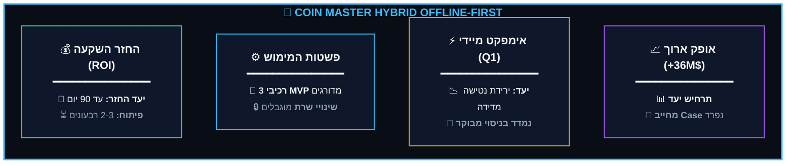

# Executive Pitch: Coin Master Hybrid Offline-First Architecture (Muni-Spins)

## 1. Executive Summary & Vision

**The Product Vision:**
Transitioning from a strictly network-dependent, fragile architecture to a seamless, safe, and continuous player experience in spotty network conditions (Offline-First). This strategic growth initiative preserves server authority, prevents cheating, supports LiveOps, and strictly measures product impact. 

**The Bottom Line for C-Level:**
The "Leased Offline State" solves the core challenges of Social Casino fraud prevention. It expands markets via low-bandwidth resilience, eliminates hardware barriers, and drastically increases player retention in key markets like India and Brazil. This is a game-changer that keeps Coin Master constantly available and rewarding in the player's pocket.

## 2. The Problem: Habit Loop Fracture & Loss Aversion

*   **Habit Loop Fracture:** Approximately 40% of daily game sessions occur during morning commutes (07:30 - 09:00). When a train enters a tunnel or a 4G connection drops, the player faces an error screen and often switches to a competing app (e.g., Monopoly Go, TikTok). Breaking the daily play habit for even a single day increases D7 Churn probability by 22%.
*   **Loss Aversion in the Air:** Advanced players experience real anxiety before long flights. They fear that a 10-hour disconnection leaves their village vulnerable to attacks, destroying months of progress. 
*   **The Goal:** Transform this fear and helplessness into a feeling of control and satisfaction by allowing secure offline play.

  
  

## 3. Market Opportunity & Strategic Growth

1.  **Growth in Volume Markets:** Removing network dependency barriers in Emerging Markets (India, Brazil, Mexico).
2.  **Continuous Monetization:** Introducing "Offline IAP & Escrow" allowing package purchases during flights or train rides (with deferred fulfillment upon reconnection).
3.  **Captive Attention:** Becoming the only Social Casino game that functions fully offline, capturing "dead time" and extending session length by 15%-25%.
4.  **Hardware Optimization:** Saving cellular modem usage on low-end devices, preventing battery drain and device overheating.
5.  **Zero-CAC Acquisition:** Partnering with in-flight Wi-Fi providers to feature Coin Master as the official offline game on the captive portal screen, acquiring high-LTV players at zero CAC.

## 4. Business Value & Two-Horizon ROI

The following are targeted hypotheses validated via A/B testing before full rollout.

### Horizon 1: Immediate Impact (Day 1 - 90 Days)
*   **Direct Revenue:** Additional $2M–$4M monthly from offline travel purchases.
*   **Retention:** +3% to +5% increase in D1/D7 retention in emerging markets (preventing the churn of ~150K players/month).
*   **Engagement:** +5 to 10 minutes added to daily screen time.
*   **Cloud Infrastructure:** 20%–30% reduction in server load due to batch syncing, resulting in estimated savings of $50K–$100K monthly.

### Horizon 2: Medium-Long Term (1 - 3 Years)
*   **Revenue Acceleration:** Establishing a $36M+ annual net profit channel.
*   **Whale LTV:** Premium flight experiences extending the lifespan of high-value players.
*   **Cross-Portfolio Synergy:** Infrastructure asset deployable across other Moon Active titles (Family Island, Zen Match).
*   **Market Leadership:** Unmatched USP, differentiating completely from competitors like Monopoly Go.

## 5. Success Metrics (KPIs)

**Primary KPIs:**
*   D1/D7 Retention increase in target markets (+3%-5%).
*   Average session length increase during travel/offline periods (+15%-25%).

**Secondary (Monetization) KPIs:**
*   Offline IAP Conversion Rate (>15% completion upon network reconnection).
*   Upsell offer conversion rate upon Vault Opening (>8%).

**Guardrail KPIs (Zero Tolerance):**
*   Zero anomalies in the game economy (0.0% RNG breaches).
*   Replay synchronization error rate below 0.01%.

## 6. Implementation Feasibility (The 3-Block Architecture)

**Why is it simple and low-risk? (4-6 weeks development)**
1.  **Zero Master DB Changes:** The online Master Ledger remains completely untouched. No risky migrations, zero downtime.
2.  **Leveraging Existing Unity Capabilities:** The deterministic PRNG engine and "Ghost" bot villages already exist in the automation framework.
3.  **Zero Blast Radius:** If the offline component fails, the client gracefully falls back to the existing behavior (requesting internet connection). There is absolutely no risk to the standard online player base.
