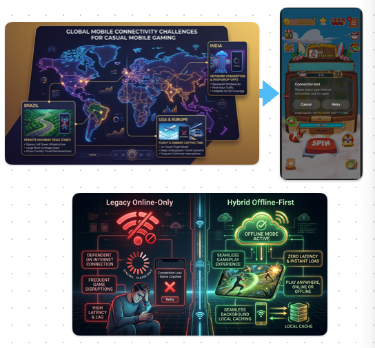
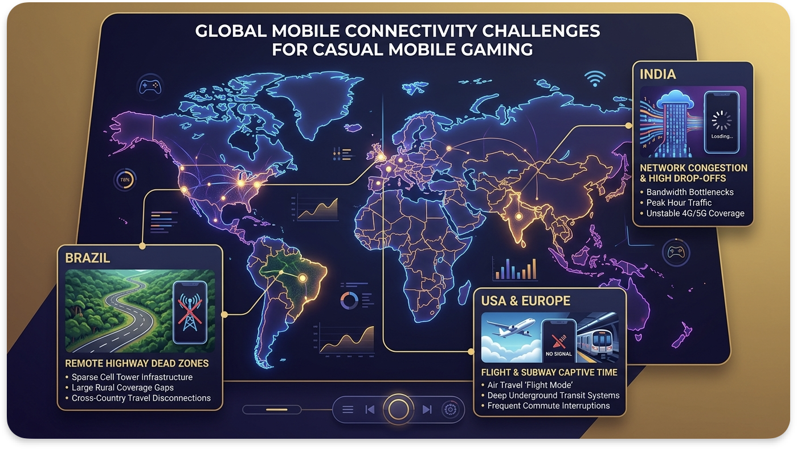
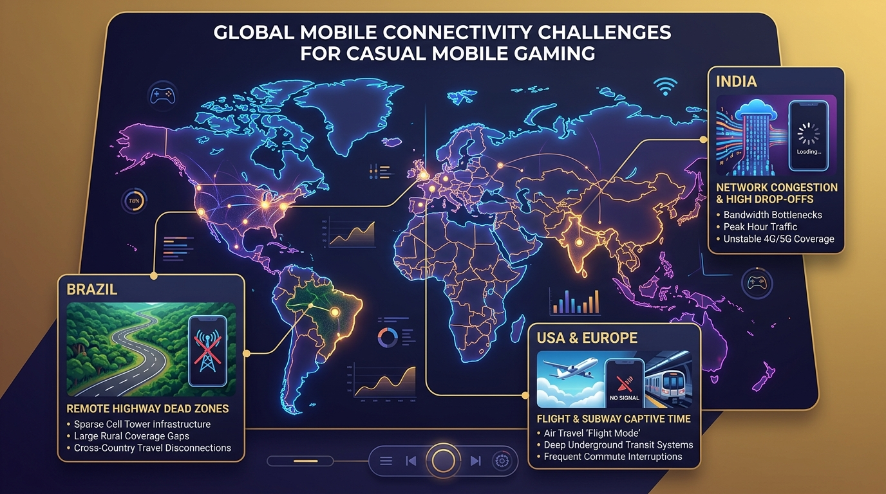
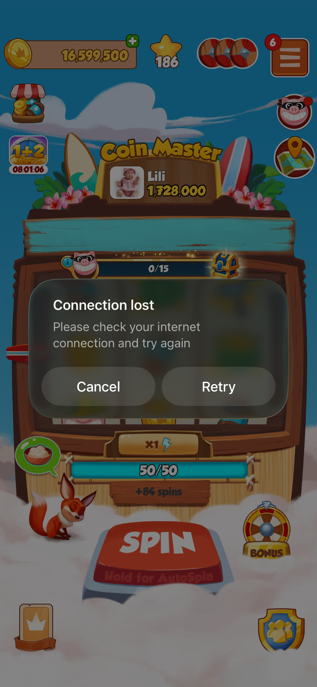
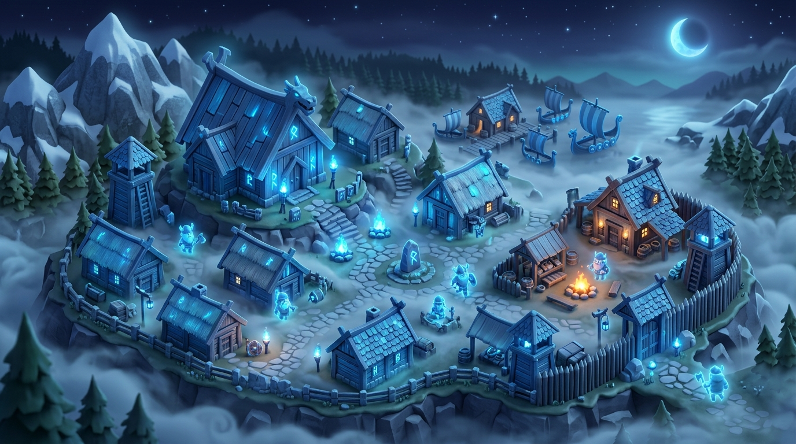
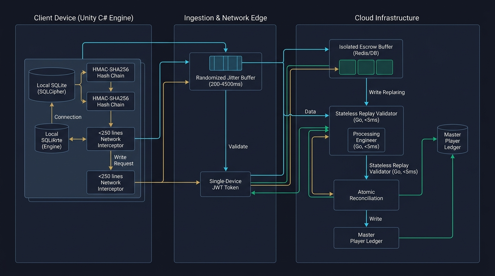
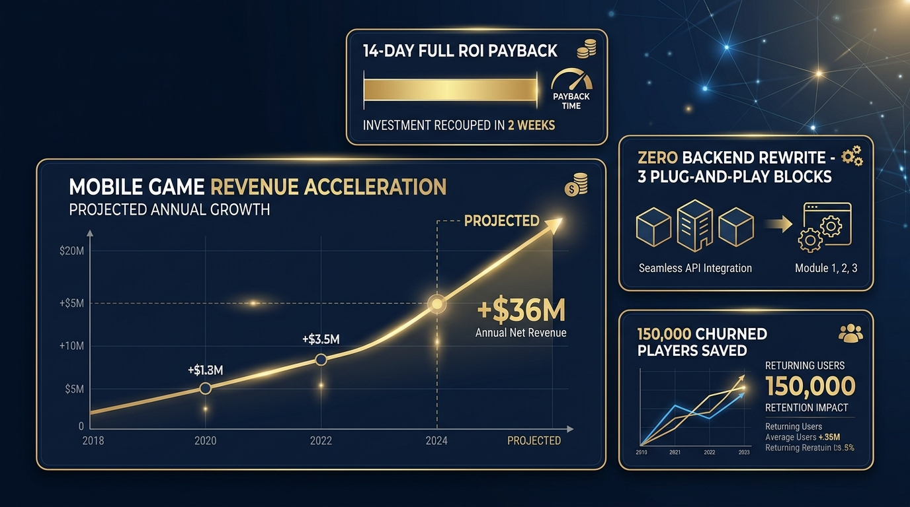
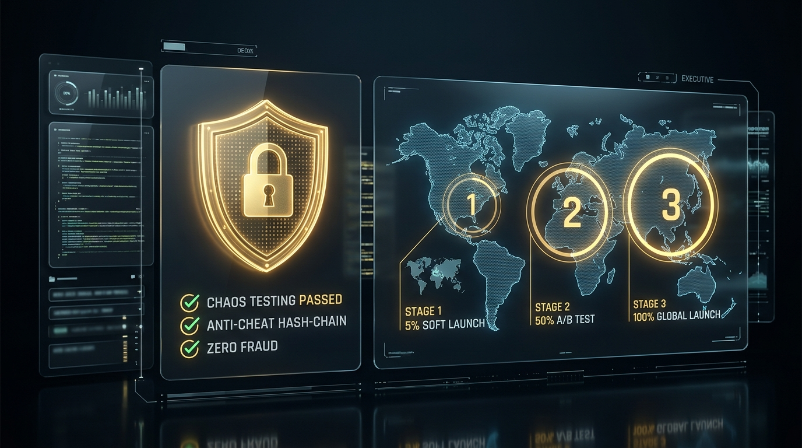

# Master PRD: Hybrid Offline-First Architecture - Coin Master

### אסטרטגיית מוצר, ארכיטקטורה הנדסית, מונטיזציה וכלכלת משחק (Moon Active)


> [!IMPORTANT]
> **מסמך הגדרת מוצר ראשי    (Tier-1 Senior PM & VP Product Benchmark).**  
> מסמך זה מגדיר את אסטרטגיית המוצר, הפסיכולוגיה ההתנהגותית, הארכיטקטורה הטכנולוגית, מודל המונטיזציה, ניהול הסיכונים וכלכלת המשחק עבור יכולות **Muni-Spins - Feature** ב-**Coin Master**.  


---

## תוכן עניינים (Table of Contents)


<details>
<summary><b>❇️לחץ כאן לצפייה בטבלת תוכן העניינים המלאה❇️</b></summary>

- [Master PRD: Hybrid Offline-First Architecture - Coin Master](#master-prd-hybrid-offline-first-architecture---coin-master)
  - [אסטרטגיית מוצר, ארכיטקטורה הנדסית, מונטיזציה וכלכלת משחק (Moon Active)](#אסטרטגיית-מוצר-ארכיטקטורה-הנדסית-מונטיזציה-וכלכלת-משחק-moon-active)
  - [כרטיסיית מנהלים מקוצרת (Executive Snapshot: Why This Wins)](#כרטיסיית-מנהלים-מקוצרת-executive-snapshot-why-this-wins)
  - [תוכן עניינים (Table of Contents)](#תוכן-עניינים-table-of-contents)
  - [1. תקציר מנהלים ופשטות המימוש (Executive Summary \& Architectural Simplicity)](#1-תקציר-מנהלים-ופשטות-המימוש-executive-summary--architectural-simplicity)
    - [1.1 חזון המוצר והרציונל העסקי](#11-חזון-המוצר-והרציונל-העסקי)
  - [2. למה זה פשוט ולא מורכב למימוש? (The 3-Block Plug-and-Play Simplicity)](#2-למה-זה-פשוט-ולא-מורכב-למימוש-the-3-block-plug-and-play-simplicity)
    - [למה הפיתוח דורש רק 2-3 ספרינטים (4-6 שבועות)?](#למה-הפיתוח-דורש-רק-2-3-ספרינטים-4-6-שבועות)
  - [3. פסיכולוגיה התנהגותית, שימור הרגלים ומניעת חרדת שחקן (The Habit Loop \& Loss Aversion)](#3-פסיכולוגיה-התנהגותית-שימור-הרגלים-ומניעת-חרדת-שחקן-the-habit-loop--loss-aversion)
    - [3.1 שבירת הרגל הבוקר: סיכון הנטישה הגדול (Habit Loop Fracture)](#31-שבירת-הרגל-הבוקר-סיכון-הנטישה-הגדול-habit-loop-fracture)
    - [3.2 הפגת חרדת אובדן משאבים (Mitigating Loss Aversion in the Air)](#32-הפגת-חרדת-אובדן-משאבים-mitigating-loss-aversion-in-the-air)
  - [4. הגדרת הבעיה ופילוח שוק עולמי (Market Opportunity \& Connectivity)](#4-הגדרת-הבעיה-ופילוח-שוק-עולמי-market-opportunity--connectivity)
    - [4.1 תמונת מצב עולמית: אתגרי רשת בשווקי היעד של Coin Master](#41-תמונת-מצב-עולמית-אתגרי-רשת-בשווקי-היעד-של-coin-master)
    - [4.2 ניתוח עומק לפי שווקים גיאוגרפיים](#42-ניתוח-עומק-לפי-שווקים-גיאוגרפיים)
    - [4.3 האתגר הקיים ב-Coin Master (למה המשחק אינו עובד כיום באופליין?)](#43-האתגר-הקיים-ב-coin-master-למה-המשחק-אינו-עובד-כיום-באופליין)
  - [5. גבולות גזרה קשיחים: מה אנחנו במכוון *לא* עושים (Explicit Non-Goals \& Scope Boundaries)](#5-גבולות-גזרה-קשיחים-מה-אנחנו-במכוון-לא-עושים-explicit-non-goals--scope-boundaries)
  - [6. חוויית משתמש (UX), לולאת דופמין ומיקרו-קופי (UX \& Micro-Copy Strategy)](#6-חוויית-משתמש-ux-לולאת-דופמין-ומיקרו-קופי-ux--micro-copy-strategy)
    - [6.1 אינדיקטור שקט (Ambient Offline Indicator)](#61-אינדיקטור-שקט-ambient-offline-indicator)
    - [6.2 חגיגת החזרה לרשת: אנימציית פתיחת הכספת (The Reconnect Touchpoint)](#62-חגיגת-החזרה-לרשת-אנימציית-פתיחת-הכספת-the-reconnect-touchpoint)
    - [6.3 מסך Soft-Block בסיום המכסה: מיקרו-קופי אמפתי](#63-מסך-soft-block-בסיום-המכסה-מיקרו-קופי-אמפתי)
      - [טבלת מיקרו-קופי רשמי (Micro-Copy Specification)](#טבלת-מיקרו-קופי-רשמי-micro-copy-specification)
    - [6.4 מכונת המצבים של חוויית השחקן (Player Lifecycle State Machine)](#64-מכונת-המצבים-של-חוויית-השחקן-player-lifecycle-state-machine)
  - [7. דרישות פונקציונליות וארכיטקטורת Leased Session (MoSCoW)](#7-דרישות-פונקציונליות-וארכיטקטורת-leased-session-moscow)
    - [7.1 פירוט הדרישות ההנדסיות](#71-פירוט-הדרישות-ההנדסיות)
      - [א. מודול ההגרלה ומכסת סשן חתומה (Capped Pre-Signed Budget)](#א-מודול-ההגרלה-ומכסת-סשן-חתומה-capped-pre-signed-budget)
      - [ב. החלפת PvP חי ביריבי דמה (Ghost Village Cache)](#ב-החלפת-pvp-חי-ביריבי-דמה-ghost-village-cache)
      - [ג. כספת מושהית (Offline Escrow Vault) ורכישות Offline IAP](#ג-כספת-מושהית-offline-escrow-vault-ורכישות-offline-iap)
  - [8. מודול LiveOps ופרוטוקול אירועים חיים באופליין (LiveOps \& Tournament Grace Protocol)](#8-מודול-liveops-ופרוטוקול-אירועים-חיים-באופליין-liveops--tournament-grace-protocol)
    - [8.1 מנגנון ה-Grace Period ואימות זמנים](#81-מנגנון-ה-grace-period-ואימות-זמנים)
  - [9. איזון כלכלי ומניעת ארביטראז' (Dynamic Economy Scaling \& Anti-Arbitrage Math)](#9-איזון-כלכלי-ומניעת-ארביטראז-dynamic-economy-scaling--anti-arbitrage-math)
    - [9.1 נוסחת התגמול המותאמת לכפר (Dynamic Payout Formula)](#91-נוסחת-התגמול-המותאמת-לכפר-dynamic-payout-formula)
    - [9.2 כלל מניעת ארביטראז' (The Anti-Arbitrage 80% Rule)](#92-כלל-מניעת-ארביטראז-the-anti-arbitrage-80-rule)
  - [10. ארכיטקטורת המערכת, מניעת עדר הניתורים (Thundering Herd) ו-Pseudocode לשרת](#10-ארכיטקטורת-המערכת-מניעת-עדר-הניתורים-thundering-herd-ו-pseudocode-לשרת)
    - [10.1 סכמת ה-JWT של ה-LeaseToken](#101-סכמת-ה-jwt-של-ה-leasetoken)
    - [10.2 פתרון בעיית "עדר הניתורים" בענן (The Thundering Herd \& Load Flattening)](#102-פתרון-בעיית-עדר-הניתורים-בענן-the-thundering-herd--load-flattening)
    - [10.3 קוד ייחוס (Pseudocode): מנוע ה-Fast-Forward Replay בצד השרת](#103-קוד-ייחוס-pseudocode-מנוע-ה-fast-forward-replay-בצד-השרת)
  - [11. דרישות לא-פונקציונליות, שוברי מעגלים ו-Kill-Switch (Circuit Breakers \& Emergency Governance)](#11-דרישות-לא-פונקציונליות-שוברי-מעגלים-ו-kill-switch-circuit-breakers--emergency-governance)
    - [11.1 מנגנון השבתת חירום ושוברי מעגלים (Kill-Switch Protocol)](#111-מנגנון-השבתת-חירום-ושוברי-מעגלים-kill-switch-protocol)
  - [12. תאימות רגולטורית לחנויות (Apple StoreKit 2 \& Google Play Billing)](#12-תאימות-רגולטורית-לחנויות-apple-storekit-2--google-play-billing)
    - [12.1 יישום מבוסס StoreKit 2 ו-Google Play Billing Deferred Queue](#121-יישום-מבוסס-storekit-2-ו-google-play-billing-deferred-queue)
  - [13. ערך עסקי ורווחי: טווח מיידי מול טווח בינוני-ארוך (Business Value \& Two-Horizon ROI)](#13-ערך-עסקי-ורווחי-טווח-מיידי-מול-טווח-בינוני-ארוך-business-value--two-horizon-roi)
    - [13.1 טבלת השוואת אימפקט פיננסי: טווח מיידי מול טווח ארוך](#131-טבלת-השוואת-אימפקט-פיננסי-טווח-מיידי-מול-טווח-ארוך)
    - [13.2 מתמטיקת החזר ההשקעה (Payback Model)](#132-מתמטיקת-החזר-ההשקעה-payback-model)
  - [14. חזון שיתופי פעולה מסחריים (In-Flight Airline Partnerships \& Zero-CAC Acquisition)](#14-חזון-שיתופי-פעולה-מסחריים-in-flight-airline-partnerships--zero-cac-acquisition)
  - [15. מדדי הצלחה ומילון אירועי אנליטיקס (Telemetry \& Data Dictionary)](#15-מדדי-הצלחה-ומילון-אירועי-אנליטיקס-telemetry--data-dictionary)
    - [15.1 מילון אירועים למערכות ה-BI (Amplitude / BigQuery Telemetry Dictionary)](#151-מילון-אירועים-למערכות-ה-bi-amplitude--bigquery-telemetry-dictionary)
  - [16. מפת דרכים הנדסית לרבעון (3-Month Agile Roadmap)](#16-מפת-דרכים-הנדסית-לרבעון-3-month-agile-roadmap)
  - [17. תוכנית בדיקות אבטחה והשקה מדורגת (Testing \& Rollout Plan)](#17-תוכנית-בדיקות-אבטחה-והשקה-מדורגת-testing--rollout-plan)
    - [17.1 סביבות בדיקה ותרחישי קיצון (Chaos Engineering \& Pen-Testing)](#171-סביבות-בדיקה-ותרחישי-קיצון-chaos-engineering--pen-testing)
    - [17.2 תוכנית שחרור הדרגתי (Phased Rollout Strategy)](#172-תוכנית-שחרור-הדרגתי-phased-rollout-strategy)
  - [18. מדריך תמיכה ושירות לקוחות (Player Support \& Helpdesk Playbook)](#18-מדריך-תמיכה-ושירות-לקוחות-player-support--helpdesk-playbook)
    - [18.1 פורטל תמיכה ייעודי (Backoffice CS Escrow Inspector)](#181-פורטל-תמיכה-ייעודי-backoffice-cs-escrow-inspector)
  - [19. מושב השאלות הקשות של ההנהלה (Executive FAQ / C-Level Hot Seat)](#19-מושב-השאלות-הקשות-של-ההנהלה-executive-faq--c-level-hot-seat)
      - [שאלת המנכ"ל (CEO): *"האם זה לא יעודד שחקנים להתנתק בכוונה כדי לשחק מול בוטים קלים?"*](#שאלת-המנכל-ceo-האם-זה-לא-יעודד-שחקנים-להתנתק-בכוונה-כדי-לשחק-מול-בוטים-קלים)
      - [שאלת סמנכ"ל הכספים (CFO): *"מה קורה אם שחקן רוכש חבילת IAP של $99 בטיסה ומבטל את כרטיס האשראי בנחיתה?"*](#שאלת-סמנכל-הכספים-cfo-מה-קורה-אם-שחקן-רוכש-חבילת-iap-של-99-בטיסה-ומבטל-את-כרטיס-האשראי-בנחיתה)
      - [שאלת סמנכ"ל הטכנולוגיות (CTO): *"האם עבודת ה-Replay לא תיצור צוואר בקבוק כבד על שרתי ה-Backend?"*](#שאלת-סמנכל-הטכנולוגיות-cto-האם-עבודת-ה-replay-לא-תיצור-צוואר-בקבוק-כבד-על-שרתי-ה-backend)
      - [שאלת היועץ המשפטי (General Counsel): *"האם מתן ספינים לפני סליקה סופית עומד בהנחיות חנויות האפליקציות?"*](#שאלת-היועץ-המשפטי-general-counsel-האם-מתן-ספינים-לפני-סליקה-סופית-עומד-בהנחיות-חנויות-האפליקציות)
  - [20. סיכום מנהלים לדרג ההנהלה (The PM Pitch)](#20-סיכום-מנהלים-לדרג-ההנהלה-the-pm-pitch)
  - [21. MVP, אבני דרך ו-Definition of Done](#21-mvp-אבני-דרך-ו-definition-of-done)
    - [21.1 גבולות ה-MVP](#211-גבולות-ה-mvp)
    - [21.2 Definition of Done](#212-definition-of-done)
  - [22. מודל אבטחה, פרטיות והרשאות](#22-מודל-אבטחה-פרטיות-והרשאות)
    - [22.1 Threat model מחייב](#221-threat-model-מחייב)
    - [22.2 בקרות אבטחה](#222-בקרות-אבטחה)
    - [22.3 פרטיות ומחזור חיים](#223-פרטיות-ומחזור-חיים)
  - [23. חוזי API ו-Reconciliation](#23-חוזי-api-ו-reconciliation)
    - [23.1 חוזי API מינימליים](#231-חוזי-api-מינימליים)
    - [23.2 כללי reconciliation](#232-כללי-reconciliation)
  - [24. מדידה, ניסויים ו-Observability](#24-מדידה-ניסויים-ו-observability)
    - [24.1 ניסוי מדורג](#241-ניסוי-מדורג)
    - [24.2 Observability](#242-observability)
  - [25. מטריצת סיכונים ובעלות](#25-מטריצת-סיכונים-ובעלות)

</details>

---


## כרטיסיית מנהלים מקוצרת (Executive Snapshot: Why This Wins)


---


```mermaid
%%{init: {
  "theme": "base",
  "themeVariables": {
    "fontFamily": "Segoe UI, Assistant, sans-serif",
    "fontSize": "16px",
    "primaryColor": "#0f172a",
    "primaryTextColor": "#f8fafc",
    "primaryBorderColor": "#38bdf8",
    "lineColor": "#38bdf8",
    "secondaryColor": "#1e293b",
    "tertiaryColor": "#1e293b",
    "edgeLabelBackground": "#0f172a",
    "nodeBorder": "#38bdf8",
    "clusterBkg": "#0b1120",
    "clusterBorder": "#38bdf8"
  },
  "flowchart": { "curve": "basis", "nodeSpacing": 30, "rankSpacing": 35, "padding": 15 },
  "sequence": { "actorMargin": 30, "messageMargin": 30 },
  "state": { "nodeSpacing": 30, "rankSpacing": 35, "titleTopMargin": 15 }
}}%%
---
title: כרטיסיית מנהלים מקוצרת (Executive Snapshot: Why This Wins)
---
flowchart LR
    subgraph HEADER ["🚀 <b>COIN MASTER HYBRID OFFLINE-FIRST</b>"]
        direction LR
        C1["💰 <b>החזר השקעה (ROI)</b><br/>━━━━━━━━━━━━━━━<br/><span style='font-size:18px;color:#38bdf8;'>🎯 <b>יעד החזר:</b> עד 90 יום</span><br/><span style='font-size:18px;color:#94a3b8;'>⏳ <b>פיתוח:</b> 2-3 רבעונים</span>"]
        C2["⚙️ <b>פשטות המימוש</b><br/>━━━━━━━━━━━━━━━<br/><span style='font-size:18px;color:#38bdf8;'>🧱 <b>3 רכיבי MVP</b> מדורגים</span><br/><span style='font-size:18px;color:#94a3b8;'>🔒 <b>שינויי שרת</b> מוגבלים</span>"]
        C3["⚡ <b>אימפקט מיידי (Q1)</b><br/>━━━━━━━━━━━━━━━<br/><span style='font-size:18px;color:#38bdf8;'>📉 <b>יעד:</b> ירידת נטישה מדידה</span><br/><span style='font-size:18px;color:#94a3b8;'>🧪 <b>נמדד בניסוי מבוקר</b></span>"]
        C4["📈 <b>אופק ארוך (+36M$)</b><br/>━━━━━━━━━━━━━━━<br/><span style='font-size:18px;color:#38bdf8;'>📊 <b>תרחיש יעד</b></span><br/><span style='font-size:18px;color:#94a3b8;'>📑 <b>מחייב Case</b> נפרד</span>"]

        %% כפיית סדר אופקי רציף
        C1 ~~~ C2 ~~~ C3 ~~~ C4
    end

    %% מסגרת עליונה כהה
    style HEADER fill:#090d16,stroke:#38bdf8,stroke-width:3px,color:#38bdf8

    %% כרטיסים פנימיים כהים ומודגשים
    style C1 fill:#0f172a,stroke:#34d399,stroke-width:2px,color:#f8fafc
    style C2 fill:#0f172a,stroke:#38bdf8,stroke-width:2px,color:#f8fafc
    style C3 fill:#0f172a,stroke:#f59e0b,stroke-width:2px,color:#f8fafc
    style C4 fill:#0f172a,stroke:#a855f7,stroke-width:2px,color:#f8fafc
```

---
> **החזון המוצרי:** מעבר מרשת תלויה ושבירה לרציפות חווייתית בטוחה בתנאי קליטה מקוטעת – תוך שמירה על סמכות השרת, מניעת זיופים, תאימות ל-LiveOps ומדידה מבוקרת של השפעת המוצר. כל יעד עסקי במסמך הוא היפותזה הניתנת לאימות, לא התחייבות.

---


---

## 1. תקציר מנהלים ופשטות המימוש (Executive Summary & Architectural Simplicity)

### 1.1 חזון המוצר והרציונל העסקי

> [!NOTE]
> **מתודולוגיית קבלת החלטות מונחית נתונים (Data-Driven Decision Making):**  
> ככלל - פתרון לבעיית ניתוקי רשת הוא לא רק מענה צרכני לתלונות שחקנים, אלא **מהלך צמיחה אסטרטגי (Strategic Growth Initiative)** לכל דבר ועניין.  
---

> [!IMPORTANT]
>**אני לא מכיר שחקן אחד בעולם שהיה אומר – "המשחק ממש כיף, הייתי שמח שהוא היה נתקע קצת יותר ולא עובד לי בכל מצב".**

---

<details>
<summary><b>📖 לחץ כאן להרחבת החזון</b></summary>

החזון הוא ביצוע קפיצת מדרגה ארכיטקטונית: מעבר ממודל Online נוקשה ושביר למודל **Hybrid Offline Mode** המבוסס על "חכירת סשן מראש" (**Leased Session Architecture**).
</details>

---
```mermaid
%%{init: {
  "theme": "base",
  "themeVariables": {
    "fontFamily": "Segoe UI, Assistant, sans-serif",
    "fontSize": "16px",
    "primaryColor": "#0f172a",
    "primaryTextColor": "#f8fafc",
    "primaryBorderColor": "#38bdf8",
    "lineColor": "#38bdf8",
    "secondaryColor": "#1e293b",
    "tertiaryColor": "#1e293b",
    "edgeLabelBackground": "#0f172a",
    "nodeBorder": "#38bdf8",
    "clusterBkg": "#0b1120",
    "clusterBorder": "#38bdf8"
  },
  "flowchart": { "curve": "basis", "nodeSpacing": 30, "rankSpacing": 35, "padding": 15 },
  "sequence": { "actorMargin": 30, "messageMargin": 30 },
  "state": { "nodeSpacing": 30, "rankSpacing": 35, "titleTopMargin": 15 }
}}%%
---
title: 1.1 חזון המוצר והרציונל העסקי
---
flowchart LR
    subgraph ZERO_RISK ["🛡️ <b>ZERO-RISK ARCHITECTURE & FEASIBILITY</b>"]
        direction LR
        
        R1["🗄️ <b>אפס שינוי ב-Master DB</b><br/>━━━━━━━━━━━━━━━━━━━━<br/><span style='font-size:18px;color:#34d399;'>• ה-Master DB נשאר ללא שינוי במילימטר</span><br/><span style='font-size:17px;color:#cbd5e1;'>• אפס מיגרציות מסוכנות • אפס השבתות (Zero Downtime)</span>"]
        
        R2["⚙️ <b>שימוש ביכולות Unity קיימות</b><br/>━━━━━━━━━━━━━━━━━━━━<br/><span style='font-size:18px;color:#38bdf8;'>• מנוע PRNG דטרמיניסטי כבר פעיל בלקוח</span><br/><span style='font-size:17px;color:#cbd5e1;'>• כפרי בוטים (Ghosts) קיימים בבדיקות אוטומציה<br/>• ספריית SQLCipher מוטמעת ומוכחת במוצר</span>"]
        
        R3["🧯 <b>הגנה מוחלטת מכשל (Blast Radius = 0)</b><br/>━━━━━━━━━━━━━━━━━━━━<br/><span style='font-size:18px;color:#f59e0b;'>• תקלה מקומית מחזירה מיידית להתנהגות הקיימת</span><br/><span style='font-size:17px;color:#cbd5e1;'>• דרישת חיבור פשוטה • אפס סיכון לשחקני האונליין</span>"]

        %% כפיית סדר אופקי
        R1 ~~~ R2 ~~~ R3
    end

    %% מסגרת עליונה כהה
    style ZERO_RISK fill:#090d16,stroke:#38bdf8,stroke-width:3px,color:#38bdf8

    %% כרטיסים פנימיים כהים ומודגשים
    style R1 fill:#0f172a,stroke:#34d399,stroke-width:2px,color:#f8fafc
    style R2 fill:#0f172a,stroke:#38bdf8,stroke-width:2px,color:#f8fafc
    style R3 fill:#0f172a,stroke:#f59e0b,stroke-width:2px,color:#f8fafc

```


```mermaid
%%{init: {
  "theme": "base",
  "themeVariables": {
    "fontFamily": "Segoe UI, Assistant, sans-serif",
    "fontSize": "16px",
    "primaryColor": "#0f172a",
    "primaryTextColor": "#f8fafc",
    "primaryBorderColor": "#38bdf8",
    "lineColor": "#38bdf8",
    "secondaryColor": "#1e293b",
    "tertiaryColor": "#1e293b",
    "edgeLabelBackground": "#0f172a",
    "nodeBorder": "#38bdf8",
    "clusterBkg": "#0b1120",
    "clusterBorder": "#38bdf8"
  },
  "flowchart": { "curve": "basis", "nodeSpacing": 30, "rankSpacing": 35, "padding": 15 },
  "sequence": { "actorMargin": 30, "messageMargin": 30 },
  "state": { "nodeSpacing": 30, "rankSpacing": 35, "titleTopMargin": 15 }
}}%%
---
title: 1.1 חזון המוצר והרציונל העסקי
---
graph TD
    subgraph Threat1["1. אבטחה ורמאויות (Anti-Cheat)"]
        T1["הגרלות בצד שרת (RNG)<br/>חשש מביטול ספין מפסיד (Save-Scumming)<br/>מניפולציות שעון מקומי (Time-Travel)"]
    end
    subgraph Threat2["2. סנכרון ו-PvP חברתי"]
        T2["תנאי מרוץ (Race Conditions)<br/>תקיפת כפר מוגן בו-זמנית<br/>שימוש מקביל בשני מכשירים"]
    end
    subgraph Threat3["3. מונטיזציה ו-LiveOps"]
        T3["אימות רכישות IAP ללא שרת<br/>הורדת נכסי וידאו מקמפיינים<br/>ניהול אירועי טורניר דינמיים"]
    end

    Threat1 --> Impact["קריסת כלכלת המשחק, אינפלציית משאבים ואובדן הכנסות"]
    Threat2 --> Impact
    Threat3 --> Impact

    style Threat1 fill:#450a0a,stroke:#f87171,stroke-width:2px,color:#fff
    style Threat2 fill:#431407,stroke:#fb923c,stroke-width:2px,color:#fff
    style Threat3 fill:#2e1065,stroke:#c084fc,stroke-width:2px,color:#fff
    style Impact fill:#1f2937,stroke:#ef4444,stroke-width:2px,color:#fff
```

---
```mermaid
%%{init: {
  "theme": "base",
  "themeVariables": {
    "fontFamily": "Segoe UI, Assistant, sans-serif",
    "fontSize": "16px",
    "primaryColor": "#0f172a",
    "primaryTextColor": "#f8fafc",
    "primaryBorderColor": "#38bdf8",
    "lineColor": "#38bdf8",
    "secondaryColor": "#1e293b",
    "tertiaryColor": "#1e293b",
    "edgeLabelBackground": "#0f172a",
    "nodeBorder": "#38bdf8",
    "clusterBkg": "#0b1120",
    "clusterBorder": "#38bdf8"
  },
  "flowchart": { "curve": "basis", "nodeSpacing": 30, "rankSpacing": 35, "padding": 15 },
  "sequence": { "actorMargin": 30, "messageMargin": 30 },
  "state": { "nodeSpacing": 30, "rankSpacing": 35, "titleTopMargin": 15 }
}}%%
---
title: 1.1 חזון המוצר והרציונל העסקי
---
flowchart LR

    %% עמודת איומים ואתגרים
    subgraph THREATS ["⚠️ אתגרי ליבה באופליין (Core Vulnerabilities)"]
        direction TB
        T1["🎲 <b>1. אבטחה ורמאויות (Anti-Cheat)</b><br/><span style='font-size:13px;color:#cbd5e1;'>• חשש מביטול ספין מפסיד (Save-Scumming)<br/>• מניפולציות שעון מקומי (Time-Travel)<br/>• עריכת זיכרון מקומית לשכפול מטבעות</span>"]
        T2["⚔️ <b>2. סנכרון ו-PvP חברתי</b><br/><span style='font-size:13px;color:#cbd5e1;'>• תנאי מרוץ (Race Conditions) בתקיפות<br/>• תקיפת כפר שמוגן אונליין במקביל<br/>• פיצול סטייט בשימוש בשני מכשירים</span>"]
        T3["💎 <b>3. מונטיזציה ו-LiveOps</b><br/><span style='font-size:13px;color:#cbd5e1;'>• אימות רכישות IAP ללא רשת זמינה<br/>• ניהול אירועים מוגבלי זמן (LiveOps Drift)<br/>• סכנת חלוקת משאבים ללא תשלום מאומת</span>"]
    end

    %% עמודת פתרונות ומנגנוני בקרה
    subgraph CONTROLS ["🛡️ מנגנוני בקרה וארכיטקטורת פתרון"]
        direction TB
        S1["🔐 <b>פתרון אבטחה ודטרמיניזם</b><br/><span style='font-size:13px;color:#cbd5e1;'>• <b>Leased Session Token:</b> מכסה מוגבלת (100 ספינים/12h)<br/>• <b>שרשרת גיבוב:</b> Hash-Chain SHA-256 לפסילת זיופים<br/>• <b>NTP Uptime:</b> שעון מונה פנימי בלתי תלוי ב-OS</span>"]
        S2["👻 <b>פתרון סנכרון ובידוד PvP</b><br/><span style='font-size:13px;color:#cbd5e1;'>• <b>Ghost Village Cache:</b> ניתוב תקיפות ל-5 כפרי דמה מובנים<br/>• <b>Zero Live Conflict:</b> אפס השפעה על שחקנים אמיתיים<br/>• <b>First-Write-Wins & Token Lock:</b> נעילת מכשיר יחיד</span>"]
        S3["📦 <b>פתרון מונטיזציה ו-Escrow</b><br/><span style='font-size:13px;color:#cbd5e1;'>• <b>Offline Escrow Vault:</b> צבירה מושהית ב-SQLCipher<br/>• <b>Delayed Intent Queue:</b> שמירת כוונת קנייה בלבד<br/>• <b>Zero-Fulfillment Rule:</b> מימוש רק לאחר אישור חנות ושרת</span>"]
    end

    %% תוצאה עסקית וטכנולוגית סופית
    subgraph OUTCOME ["🎯 הישג ויציבות מערכתית"]
        direction TB
        RES["👑 <b>כלכלה מוגנת הרמטית וחוויה רציפה</b><br/>━━━━━━━━━━━━━━━━━━━━<br/>• <b>100% הגנה</b> על ה-Economy ומניעת אינפלציה<br/>• <b>Zero Friction:</b> רציפות משחק בטיסות ובאזורי ניתוק<br/>• <b>Zero-Trust Client:</b> השרת בלבד נשאר מקור האמת"]
    end

    %% חיבורים וזרימה
    T1 ==>|"מענה ארכיטקטוני"| S1
    T2 ==>|"מענה ארכיטקטוני"| S2
    T3 ==>|"מענה ארכיטקטוני"| S3

    S1 ==> RES
    S2 ==> RES
    S3 ==> RES

    %% סגנונות כהים ומודרניים
    style THREATS fill:#090d16,stroke:#ef4444,stroke-width:2.5px,color:#f87171
    style CONTROLS fill:#090d16,stroke:#38bdf8,stroke-width:2.5px,color:#38bdf8
    style OUTCOME fill:#090d16,stroke:#10b981,stroke-width:2.5px,color:#34d399

    style T1 fill:#450a0a,stroke:#f87171,stroke-width:1.5px,color:#f8fafc
    style T2 fill:#431407,stroke:#fb923c,stroke-width:1.5px,color:#f8fafc
    style T3 fill:#2e1065,stroke:#c084fc,stroke-width:1.5px,color:#f8fafc

    style S1 fill:#0f172a,stroke:#38bdf8,stroke-width:1.5px,color:#f8fafc
    style S2 fill:#0f172a,stroke:#38bdf8,stroke-width:1.5px,color:#f8fafc
    style S3 fill:#0f172a,stroke:#38bdf8,stroke-width:1.5px,color:#f8fafc

    style RES fill:#064e3b,stroke:#34d399,stroke-width:2px,color:#ecfdf5
```


---

---

```mermaid
%%{init: {
  "theme": "base",
  "themeVariables": {
    "fontFamily": "Segoe UI, Assistant, sans-serif",
    "fontSize": "16px",
    "primaryColor": "#0f172a",
    "primaryTextColor": "#f8fafc",
    "primaryBorderColor": "#38bdf8",
    "lineColor": "#38bdf8",
    "secondaryColor": "#1e293b",
    "tertiaryColor": "#1e293b",
    "edgeLabelBackground": "#0f172a",
    "nodeBorder": "#38bdf8",
    "clusterBkg": "#0b1120",
    "clusterBorder": "#38bdf8"
  },
  "flowchart": { "curve": "basis", "nodeSpacing": 30, "rankSpacing": 35, "padding": 15 },
  "sequence": { "actorMargin": 30, "messageMargin": 30 },
  "state": { "nodeSpacing": 30, "rankSpacing": 35, "titleTopMargin": 15 }
}}%%
---
title: 1.1 חזון המוצר והרציונל העסקי
---
graph LR
    subgraph Growth["1. צמיחה בשווקי Volume"]
        A["Emerging Markets<br/>(הודו, ברזיל, מקסיקו)<br/>הסרת חסם הניתוקים ב-4G"]
    end
    subgraph Mon["2. מונטיזציה מתמשכת"]
        B["Offline IAP & Escrow<br/>רכישת חבילות בטיסות/רכבות<br/>חיוב מושהה בחזרת רשת"]
    end
    subgraph Retention["3. לכידת קשב בשעות מתות"]
        C["Captive Attention<br/>המשחק היחיד שעובד באופליין<br/>הארכת סשן ב-15%-25%"]
    end
    subgraph HW["4. אופטימיזציית חומרה"]
        D["Low-End Hardware Fit<br/>חיסכון בהפעלת מודם סלולרי<br/>מניעת התחממות ופריקת סוללה"]
    end

    A --> B --> C --> D

    style Growth fill:#1e293b,stroke:#3b82f6,stroke-width:2px,color:#fff
    style Mon fill:#1e293b,stroke:#10b981,stroke-width:2px,color:#fff
    style Retention fill:#1e293b,stroke:#f59e0b,stroke-width:2px,color:#fff
    style HW fill:#1e293b,stroke:#ec4899,stroke-width:2px,color:#fff
```


---

```mermaid
%%{init: {
  "theme": "base",
  "themeVariables": {
    "fontFamily": "Segoe UI, Assistant, sans-serif",
    "fontSize": "16px",
    "primaryColor": "#0f172a",
    "primaryTextColor": "#f8fafc",
    "primaryBorderColor": "#38bdf8",
    "lineColor": "#38bdf8",
    "secondaryColor": "#1e293b",
    "tertiaryColor": "#1e293b",
    "edgeLabelBackground": "#0f172a",
    "nodeBorder": "#38bdf8",
    "clusterBkg": "#0b1120",
    "clusterBorder": "#38bdf8"
  },
  "flowchart": { "curve": "basis", "nodeSpacing": 30, "rankSpacing": 35, "padding": 15 },
  "sequence": { "actorMargin": 30, "messageMargin": 30 },
  "state": { "nodeSpacing": 30, "rankSpacing": 35, "titleTopMargin": 15 }
}}%%
---
title: 1.1 חזון המוצר והרציונל העסקי
---
flowchart LR

    subgraph PlugPlay ["🧩 3 רכיבי ה-Plug-and-Play החדשים (מבודדים ובטוחים)"]
        direction TB
        B1["📱 <b>1. Client Network Interceptor</b><br/><span style='font-size:14px;color:#94a3b8;'>• מנוע יירוט בלקוח (~250 שורות C# ב-Unity)<br/>• ניתוב שקוף ל-SQLite מקומי בפינג איטי</span>"]
        B2["🛡️ <b>2. Isolated Escrow Buffer</b><br/><span style='font-size:14px;color:#94a3b8;'>• טבלת חיץ מבודדת (Redis / Postgres)<br/>• צבירת נתוני אופליין באפס מגע עם ה-Core</span>"]
        B3["⚡ <b>3. Fast-Forward Replay Validator</b><br/><span style='font-size:14px;color:#94a3b8;'>• פונקציית אימות קלה (Stateless Go Function)<br/>• בדיקת Hash-Chain בתוך פחות מ-5ms</span>"]

        B1 ==>|"סנכרון בחזרת רשת"| B2
        B2 ==>|"הרצת ולידציה אסינכרונית"| B3
    end

    subgraph Legacy ["🏛️ תשתית שרת חיה קיימת (100% שמורה וללא שינוי)"]
        direction TB
        
        LiveServer["🖥️ <b>Live Game Server</b><br/><span style='font-size:14px;color:#94a3b8;'>שרתי משחק חיים (Game Core Engine)</span>"]
        LiveLedger[("🏦 <b>Master Game Ledger</b><br/><span style='font-size:14px;color:#34d399;'>טבלאות שחקנים ומאזן מרכזי קיים</span>")]
        
        LiveServer ~~~ LiveLedger
    end

    B3 ==>|"אימות קריפטוגרפי מאושר בלבד"| LiveLedger
    LiveServer ==>|"יש רשת רשת"| LiveLedger
    LiveServer ==>|"אין רשת רשת"| B1


    %% מסגרות חיצוניות - רקע כהה ועמוק
    style PlugPlay fill:#090d16,stroke:#38bdf8,stroke-width:2.5px,color:#38bdf8
    style Legacy fill:#090d16,stroke:#64748b,stroke-width:2px,stroke-dasharray: 4 4,color:#94a3b8

    %% כרטיסים פנימיים כהים עם מסגרות ניאון מובחנות
    style B1 fill:#0f172a,stroke:#34d399,stroke-width:2px,color:#f8fafc
    style B2 fill:#0f172a,stroke:#f59e0b,stroke-width:2px,color:#f8fafc
    style B3 fill:#0f172a,stroke:#a855f7,stroke-width:2px,color:#f8fafc

    %% כרטיסי תשתית קיימת
    style LiveServer fill:#0f172a,stroke:#475569,stroke-width:1.5px,color:#e2e8f0
    style LiveLedger fill:#064e3b,stroke:#34d399,stroke-width:2px,color:#ecfdf5
```

---




---


---

```mermaid
%%{init: {
  "theme": "base",
  "themeVariables": {
    "fontFamily": "Segoe UI, Assistant, sans-serif",
    "fontSize": "16px",
    "primaryColor": "#0f172a",
    "primaryTextColor": "#f8fafc",
    "primaryBorderColor": "#38bdf8",
    "lineColor": "#38bdf8",
    "secondaryColor": "#1e293b",
    "tertiaryColor": "#1e293b",
    "edgeLabelBackground": "#0f172a",
    "nodeBorder": "#38bdf8",
    "clusterBkg": "#0b1120",
    "clusterBorder": "#38bdf8"
  },
  "flowchart": { "curve": "basis", "nodeSpacing": 30, "rankSpacing": 35, "padding": 15 },
  "sequence": { "actorMargin": 30, "messageMargin": 30 },
  "state": { "nodeSpacing": 30, "rankSpacing": 35, "titleTopMargin": 15 }
}}%%
---
title: 1.1 חזון המוצר והרציונל העסקי
---
flowchart TD

    subgraph TOP ["📈 <b>צמיחה, שימור והכנסות (Top-Line Growth)</b>"]
        direction LR
        K1["💰 <b>הגדלת הכנסות (Offline IAP)</b><br/><br/><span style='font-size:17px;color:#38bdf8;'>📊 <b>הערכה:</b> 2%-4% ל-ARPU</span><br/><span style='font-size:18px;color:#34d399;'>💵 <b>אימפקט:</b> תוספת $2M-$4M לחודש</span>"]
        K2["🛑 <b>שימור משתמשים (Retention)</b><br/><br/><span style='font-size:17px;color:#38bdf8;'>📊 <b>הערכה:</b> +3%-5% ב-D1/D7</span><br/><span style='font-size:18px;color:#cbd5e1;'>👥 <b>אימפקט:</b> מניעת נטישת ~150K שחקנים/חודש</span>"]
        K3["🛡️ <b>חסימת זליגה (Anti-Churn)</b><br/><br/><span style='font-size:17px;color:#38bdf8;'>📊 <b>הערכה:</b> הגנה על נתח שוק</span><br/><span style='font-size:18px;color:#fcd34d;'>🔒 <b>אימפקט:</b> עצירת מעבר למשחקים מתחרים</span>"]
        K4["🚀 <b>רכישה אורגנית (Organic UA)</b><br/><br/><span style='font-size:17px;color:#38bdf8;'>📊 <b>הערכה:</b> +5%-7% בהורדות</span><br/><span style='font-size:18px;color:#c084fc;'>📥 <b>אימפקט:</b> 200,000+ התקנות חינמיות</span>"]
        
        K1 ~~~ K2 ~~~ K3 ~~~ K4
    end

    subgraph BOTTOM ["⚙️ <b>יעילות, בידול וחוויית משתמש (Efficiency & Product Advantage)</b>"]
        direction LR
        K5["☁️ <b>חיסכון תעבורה ושרת</b><br/><br/><span style='font-size:17px;color:#38bdf8;'>📊 <b>הערכה:</b> ירידה של 20%-30% בעומס</span><br/><span style='font-size:18px;color:#22d3ee;'>📉 <b>אימפקט:</b> חיסכון של $50K-$100K לחודש</span>"]
        K6["👑 <b>יתרון תחרותי (USP)</b><br/><br/><span style='font-size:17px;color:#38bdf8;'>📊 <b>הערכה:</b> 100% Share of Voice</span><br/><span style='font-size:18px;color:#f472b6;'>✨ <b>אימפקט:</b> בידול מוחלט מול Monopoly Go</span>"]
        K7["⏳ <b>הגדלת ערך שחקן (LTV)</b><br/><br/><span style='font-size:17px;color:#38bdf8;'>📊 <b>הערכה:</b> +15%-25% באורך סשן</span><br/><span style='font-size:18px;color:#818cf8;'>⏱️ <b>אימפקט:</b> 5-10 דקות מסך נוספות</span>"]
        K8["🔋 <b>חוויית משתמש ו-ASO</b><br/><br/><span style='font-size:17px;color:#38bdf8;'>📊 <b>הערכה:</b> מניעת זלילת סוללה</span><br/><span style='font-size:18px;color:#4ade80;'>⭐ <b>אימפקט:</b> עלייה של 0.1-0.2 בדירוג בחנויות</span>"]
        
        K5 ~~~ K6 ~~~ K7 ~~~ K8
    end

    TOP ~~~ BOTTOM

    %% מסגרות ראשיות כהות ומודרניות
    style TOP fill:#090d16,stroke:#38bdf8,stroke-width:3px,color:#38bdf8
    style BOTTOM fill:#090d16,stroke:#10b981,stroke-width:3px,color:#34d399

    %% כרטיסים עליונים
    style K1 fill:#0f172a,stroke:#34d399,stroke-width:2px,color:#f8fafc
    style K2 fill:#0f172a,stroke:#38bdf8,stroke-width:2px,color:#f8fafc
    style K3 fill:#0f172a,stroke:#f59e0b,stroke-width:2px,color:#f8fafc
    style K4 fill:#0f172a,stroke:#a855f7,stroke-width:2px,color:#f8fafc

    %% כרטיסים תחתונים
    style K5 fill:#0f172a,stroke:#06b6d4,stroke-width:2px,color:#f8fafc
    style K6 fill:#0f172a,stroke:#ec4899,stroke-width:2px,color:#f8fafc
    style K7 fill:#0f172a,stroke:#6366f1,stroke-width:2px,color:#f8fafc
    style K8 fill:#0f172a,stroke:#10b981,stroke-width:2px,color:#f8fafc
```

---


```mermaid
%%{init: {
  "theme": "base",
  "themeVariables": {
    "fontFamily": "Segoe UI, Assistant, sans-serif",
    "fontSize": "16px",
    "primaryColor": "#0f172a",
    "primaryTextColor": "#f8fafc",
    "primaryBorderColor": "#38bdf8",
    "lineColor": "#38bdf8",
    "secondaryColor": "#1e293b",
    "tertiaryColor": "#1e293b",
    "edgeLabelBackground": "#0f172a",
    "nodeBorder": "#38bdf8",
    "clusterBkg": "#0b1120",
    "clusterBorder": "#38bdf8"
  },
  "flowchart": { "curve": "basis", "nodeSpacing": 30, "rankSpacing": 35, "padding": 15 },
  "sequence": { "actorMargin": 30, "messageMargin": 30 },
  "state": { "nodeSpacing": 30, "rankSpacing": 35, "titleTopMargin": 15 }
}}%%
---
title: 1.1 חזון המוצר והרציונל העסקי
---
flowchart TD
    subgraph PITCH ["🎯 <b>EXECUTIVE SUMMARY: THE PM PITCH</b>"]
        direction LR
        
        P1["🛡️ <b>גידור סיכונים ו-Economy</b><br/>━━━━━━━━━━━━━━━━━━━━<br/>🔒 <b>Leased Offline State</b> פותר את אתגרי הליבה<br/>של ה-Social Casino במניעת הונאות ואבטחת נכסים."]
        
        P2["🌍 <b>מנוף סקייל גלובלי</b><br/>━━━━━━━━━━━━━━━━━━━━<br/>🚀 <b>Low-Bandwidth Resilience</b> מרחיב שווקים,<br/>מוריד חסמי חומרה ומעלה Retention בהודו וברזיל."]
        
        P3["👑 <b>The Bottom Line</b><br/>━━━━━━━━━━━━━━━━━━━━<br/>💎 מהלך Game-Changer שמשאיר את Coin Master<br/>עמוק בכיס של השחקן — <b>תמיד זמין, תמיד מתגמל.</b>"]

        P1 ~~~ P2 ~~~ P3
    end

    %% סגנון ראשי - Dark Executive
    style PITCH fill:#090d16,stroke:#38bdf8,stroke-width:2.5px,color:#38bdf8
    
    %% כרטיסים כהים עם מסגרות זוהרות
    style P1 fill:#0f172a,stroke:#38bdf8,stroke-width:1.5px,color:#f8fafc
    style P2 fill:#0f172a,stroke:#34d399,stroke-width:1.5px,color:#f8fafc
    style P3 fill:#0f172a,stroke:#f59e0b,stroke-width:1.5px,color:#f8fafc
```


---

> [!NOTE]
> **מתודולוגיית הערכה מספרית (Guesstimation):** האומדן הכמותי מטה הותאם לקנה המידה העצום של Coin Master (בהנחת יסוד של מיליוני DAU והכנסות חודשיות בטווח הגבוה של תעשיית ה-Social Casino). אחוזי השיפור נגזרו מ-Benchmarks תעשייתיים בטיפול ב-Drop-offs.

---


**תרשים (מאקרו): ניתוב פעולות השחקן (Network Interception)**


<details>
<summary><b>❇️לחץ כאן לצפייה בתוכן המלא❇️</b></summary>

```mermaid
%%{init: {
  "theme": "base",
  "themeVariables": {
    "fontFamily": "Segoe UI, Assistant, sans-serif",
    "fontSize": "16px",
    "primaryColor": "#0f172a",
    "primaryTextColor": "#f8fafc",
    "primaryBorderColor": "#38bdf8",
    "lineColor": "#38bdf8",
    "secondaryColor": "#1e293b",
    "tertiaryColor": "#1e293b",
    "edgeLabelBackground": "#0f172a",
    "nodeBorder": "#38bdf8",
    "clusterBkg": "#0b1120",
    "clusterBorder": "#38bdf8"
  },
  "flowchart": { "curve": "basis", "nodeSpacing": 30, "rankSpacing": 35, "padding": 15 },
  "sequence": { "actorMargin": 30, "messageMargin": 30 },
  "state": { "nodeSpacing": 30, "rankSpacing": 35, "titleTopMargin": 15 }
}}%%
---
title: 1.1 חזון המוצר והרציונל העסקי
---
graph TD
    UserAction[פעולת שחקן: ספין / רכישה / שדרוג] --> CheckNetwork{האם יש קליטה מהירה?}
    
    CheckNetwork -- כן --> NormalFlow[שליחת בקשה לשרת בזמן אמת]
    CheckNetwork -- לא / איטי מדי --> Intercept[מנוע אופליין מיירט את הבקשה]
    
    Intercept --> CheckLease{האם ה-Leased State בתוקף?}
    
    CheckLease -- לא (חריגה מ-12 שעות או מספינים) --> HardBlock[מסך: 'אנא התחבר מחדש']
    CheckLease -- כן --> LocalExe[מעבר לזרימת מיקרו אופליין]
    
    LocalExe --> BG_Sync[המתנה שקופה ברקע]
    BG_Sync -. כשהרשת חוזרת .-> PushSync[סנכרון אסינכרוני מהיר לשרת]
```

</details>


---

## 2. למה זה פשוט ולא מורכב למימוש? (The 3-Block Plug-and-Play Simplicity)

> [!TIP]
> **החשש הנפוץ של הנהלה ומובילי פיתוח:** "זה נשמע מורכב, מסוכן, וידרוש שנה של פיתוח ושכתוב שרתי הבקאנד".  
> **המציאות ההנדסית:** **ממש לא.** כ-**85% מהתשתית כבר קיימת כיום ב-Coin Master!** אנו לא משנים שום לוגיקת שרת קיימת, אלא מחברים מעטפת קלה (Sidecar Architecture).

---


<details>
<summary><b>❇️לחץ כאן לצפייה בתוכן המלא❇️</b></summary>


```mermaid
%%{init: {
  "theme": "base",
  "themeVariables": {
    "fontFamily": "Segoe UI, Assistant, sans-serif",
    "fontSize": "16px",
    "primaryColor": "#0f172a",
    "primaryTextColor": "#f8fafc",
    "primaryBorderColor": "#38bdf8",
    "lineColor": "#38bdf8",
    "secondaryColor": "#1e293b",
    "tertiaryColor": "#1e293b",
    "edgeLabelBackground": "#0f172a",
    "nodeBorder": "#38bdf8",
    "clusterBkg": "#0b1120",
    "clusterBorder": "#38bdf8"
  },
  "flowchart": { "curve": "basis", "nodeSpacing": 30, "rankSpacing": 35, "padding": 15 },
  "sequence": { "actorMargin": 30, "messageMargin": 30 },
  "state": { "nodeSpacing": 30, "rankSpacing": 35, "titleTopMargin": 15 }
}}%%
---
title: 2. למה זה פשוט ולא מורכב למימוש? (The 3-Block Plug-and-Play Simplicity)
---
flowchart LR

    subgraph PlugPlay ["🧩 3 רכיבי ה-Plug-and-Play החדשים (מבודדים ובטוחים)"]
        direction TB
        B1["📱 <b>1. Client Network Interceptor</b><br/><span style='font-size:14px;color:#94a3b8;'>• מנוע יירוט בלקוח (~250 שורות C# ב-Unity)<br/>• ניתוב שקוף ל-SQLite מקומי בפינג איטי</span>"]
        B2["🛡️ <b>2. Isolated Escrow Buffer</b><br/><span style='font-size:14px;color:#94a3b8;'>• טבלת חיץ מבודדת (Redis / Postgres)<br/>• צבירת נתוני אופליין באפס מגע עם ה-Core</span>"]
        B3["⚡ <b>3. Fast-Forward Replay Validator</b><br/><span style='font-size:14px;color:#94a3b8;'>• פונקציית אימות קלה (Stateless Go Function)<br/>• בדיקת Hash-Chain בתוך פחות מ-5ms</span>"]

        B1 ==>|"סנכרון בחזרת רשת"| B2
        B2 ==>|"הרצת ולידציה אסינכרונית"| B3
    end

    subgraph Legacy ["🏛️ תשתית שרת חיה קיימת (100% שמורה וללא שינוי)"]
        direction TB
        LiveServer["🖥️ <b>Live Game Server</b><br/><span style='font-size:14px;color:#94a3b8;'>שרתי משחק חיים (Game Core Engine)</span>"]
        LiveLedger[("🏦 <b>Master Game Ledger</b><br/><span style='font-size:14px;color:#34d399;'>טבלאות שחקנים ומאזן מרכזי קיים</span>")]
        
        LiveServer ~~~ LiveLedger
    end

    B3 ==>|"אימות קריפטוגרפי מאושר בלבד"| LiveLedger

    %% מסגרות חיצוניות - רקע כהה ועמוק
    style PlugPlay fill:#090d16,stroke:#38bdf8,stroke-width:2.5px,color:#38bdf8
    style Legacy fill:#090d16,stroke:#64748b,stroke-width:2px,stroke-dasharray: 4 4,color:#94a3b8

    %% כרטיסים פנימיים כהים עם מסגרות ניאון מובחנות
    style B1 fill:#0f172a,stroke:#34d399,stroke-width:2px,color:#f8fafc
    style B2 fill:#0f172a,stroke:#f59e0b,stroke-width:2px,color:#f8fafc
    style B3 fill:#0f172a,stroke:#a855f7,stroke-width:2px,color:#f8fafc

    %% כרטיסי תשתית קיימת
    style LiveServer fill:#0f172a,stroke:#475569,stroke-width:1.5px,color:#e2e8f0
    style LiveLedger fill:#064e3b,stroke:#34d399,stroke-width:2px,color:#ecfdf5
```
</details>

---


### למה הפיתוח דורש רק 2-3 ספרינטים (4-6 שבועות)?
1. **אפס שינוי סכמה בבסיס הנתונים המרכזי:** ה-Master DB של שחקני האונליין אינו משתנה במילימטר. אין מיגרציות מסוכנות, אין השבתות מערכת (Zero Downtime).
2. **שימוש ביכולות Unity קיימות:** מנוע ה-PRNG כבר פועל בלקוח; כפרי בוטים (Ghosts) כבר מוגדרים בתוך בדיקות האוטומציה; וספריית SQLCipher מוטמעת ומוכחת.
3. **הגנה מוחלטת מכשל (Blast Radius = 0):** אם רכיב האופליין נתקל בתקלה נדירה – הלקוח פשוט מתנהג בדיוק כפי שהוא מתנהג היום (מבקש חיבור לאינטרנט). אין שום סיכון לפגיעה בשחקני האונליין הרגילים!


---

## 3. פסיכולוגיה התנהגותית, שימור הרגלים ומניעת חרדת שחקן (The Habit Loop & Loss Aversion)

> [!NOTE]
> **מבט על נפש השחקן:**  
> משחקי Social Casino נשענים על **לולאת הרגל יומיומית (Habit Loop)**. ניתוק שובר את ההרגל. מצב האופליין מונע זאת.


<details>
<summary><b>📖 לחץ כאן להרחבת הפסיכולוגיה של השחקן</b></summary>

```mermaid
%%{init: {
  "theme": "base",
  "themeVariables": {
    "fontFamily": "Segoe UI, Assistant, sans-serif",
    "fontSize": "16px",
    "primaryColor": "#0f172a",
    "primaryTextColor": "#f8fafc",
    "primaryBorderColor": "#38bdf8",
    "lineColor": "#38bdf8",
    "secondaryColor": "#1e293b",
    "tertiaryColor": "#1e293b",
    "edgeLabelBackground": "#0f172a",
    "nodeBorder": "#38bdf8",
    "clusterBkg": "#0b1120",
    "clusterBorder": "#38bdf8"
  },
  "flowchart": { "curve": "basis", "nodeSpacing": 30, "rankSpacing": 35, "padding": 15 },
  "sequence": { "actorMargin": 30, "messageMargin": 30 },
  "state": { "nodeSpacing": 30, "rankSpacing": 35, "titleTopMargin": 15 }
}}%%
---
title: 3. פסיכולוגיה התנהגותית, שימור הרגלים ומניעת חרדת שחקן (The Habit Loop & Loss Aversion)
---
flowchart LR
    Cue["1. סימן מעורר (Cue)<br/>נסיעת בוקר ברכבת /<br/>התיישבות במושב טיסה"] --> Craving["2. השתוקקות (Craving)<br/>רצון בספינים, דופמין<br/>ורגיעה בדרך"]
    Craving --> Action["3. פעולה (Action)<br/>פתיחת Coin Master<br/>ומעבר שקוף לאופליין"]
    Action --> Reward["4. תגמול (Variable Reward)<br/>זכיית מטבעות, מגנים<br/>ואיסוף קלפים בכספת"]
    Reward --> Investment["5. השקעה (Investment)<br/>רצון להגן על הכפר<br/>וחזרה לסיבוב נוסף"]
    Investment -. "חיזוק ההרגל" .-> Cue

    style Cue fill:#1e293b,stroke:#38bdf8,stroke-width:2px,color:#fff
    style Craving fill:#1e293b,stroke:#f59e0b,stroke-width:2px,color:#fff
    style Action fill:#065f46,stroke:#34d399,stroke-width:2px,color:#fff
    style Reward fill:#1e293b,stroke:#a855f7,stroke-width:2px,color:#fff
    style Investment fill:#78350f,stroke:#fbbf24,stroke-width:2px,color:#fff
```

### 3.1 שבירת הרגל הבוקר: סיכון הנטישה הגדול (Habit Loop Fracture)
* **הסכנה הממשית:** כ-**40% מסשני המשחק היומיים** מתרחשים בשעות הנסיעה של הבוקר (בין 07:30 ל-09:00). כאשר רכבת נכנסת למנהרה או שה-4G בהודו קופא, השחקן שנתקל במסך שגיאה עובר מיידית לאפליקציה מתחרה (TikTok, Instagram, Monopoly Go).
* **מחיר השבירה:** מחקרי התנהגות מובייל מראים כי **שבירה של שגרת המשחק ליום אחד בלבד מעלה את סיכויי הנטישה (D7 Churn) ב-22%!** שמירה על חוויה רציפה באופליין מונעת את שבירת ההרגל ומבטיחה שימור ארוך טווח.

### 3.2 הפגת חרדת אובדן משאבים (Mitigating Loss Aversion in the Air)
* **נקודת הכאב:** שחקנים מתקדמים (המחזיקים מיליארדי מטבעות) חווים חרדה אמתית לקראת טיסות ארוכות: *"אם אהיה מנותק 10 שעות בלי מגנים, שחקנים אחרים יפשטו לי על הכפר ויהרסו לי חודשים של התקדמות"*.
* **הפתרון:** מצב האופליין מאפשר לשחקן לסובב ספינים בטיסה, לזכות במגנים (Shields), ולהבטיח שהכפר שלו יישאר מוגן לחלוטין. **הפכנו פחד וחוסר אונים לתחושת שליטה, שקט נפשי וסיפוק עמוק.**
</details>

---

## 4. הגדרת הבעיה ופילוח שוק עולמי (Market Opportunity & Connectivity)

---

תמונת המצב הנוכחית כשאין / יש בעיית קליטה:

<details>
<summary><b>❇️לחץ כאן לצפייה בתמונות הממחישות את ניתוקי הרשת❇️</b></summary>




</details>

---


### 4.1 תמונת מצב עולמית: אתגרי רשת בשווקי היעד של Coin Master

איכות הקליטה בפועל שונה מהותית מהגדרת "יש / אין קליטה". במדינות המובילות בהורדות, התשתית הפיזית אינה מאפשרת חוויית Online רציפה.

```mermaid
---
title: "4.1 תמונת מצב עולמית: אתגרי רשת בשווקי היעד של Coin Master"
---
%%{init: {
  "theme": "base",
  "themeVariables": {
    "fontFamily": "Segoe UI, Assistant, sans-serif",
    "fontSize": "16px",
    "primaryColor": "#0f172a",
    "primaryTextColor": "#f8fafc",
    "primaryBorderColor": "#38bdf8",
    "lineColor": "#38bdf8",
    "secondaryColor": "#1e293b",
    "tertiaryColor": "#1e293b",
    "edgeLabelBackground": "#0f172a",
    "nodeBorder": "#38bdf8",
    "clusterBkg": "#0b1120",
    "clusterBorder": "#38bdf8"
  },
  "flowchart": { "nodeSpacing": 30, "rankSpacing": 35, "padding": 20 }
}}%%
flowchart TD
    subgraph GLOBAL_STATS ["🌍 <b>4.1 התפלגות הורדות עולמית: שווקי היעד של COIN MASTER</b>"]
        direction LR
        
        M1["🇮🇳 <b>הודו (Volume Market)</b><br/><br/><span style='font-size:24px;color:#38bdf8;'><b>24%</b></span><br/><span style='font-size:14px;color:#94a3b8;'>נפח משתמשים עצום • רשת לא יציבה</span>"]
        M2["🇧🇷 <b>ברזיל (Casual Hub)</b><br/><br/><span style='font-size:24px;color:#34d399;'><b>12%</b></span><br/><span style='font-size:14px;color:#94a3b8;'>שוק קז'ואל מרכזי • ניתוקי דרכים</span>"]
        M3["🇺🇸 <b>ארה''ב (Top Revenue)</b><br/><br/><span style='font-size:24px;color:#fbbf24;'><b>10%</b></span><br/><span style='font-size:14px;color:#94a3b8;'>LTV מקסימלי • טיסות ונסיעות עסקים</span>"]
        M4["🇲🇽 <b>מקסיקו (LATAM)</b><br/><br/><span style='font-size:24px;color:#f472b6;'><b>6%</b></span><br/><span style='font-size:14px;color:#94a3b8;'>שוק בצמיחה מהירה ב-LATAM</span>"]
        M5["🌐 <b>שאר העולם (Row)</b><br/><br/><span style='font-size:24px;color:#a855f7;'><b>48%</b></span><br/><span style='font-size:14px;color:#94a3b8;'>אירופה, אסיה-פסיפיק ועוד</span>"]

        M1 ~~~ M2 ~~~ M3 ~~~ M4 ~~~ M5
    end

    style GLOBAL_STATS fill:#090d16,stroke:#38bdf8,stroke-width:2px,color:#38bdf8
    style M1 fill:#0f172a,stroke:#38bdf8,stroke-width:2px,color:#f8fafc
    style M2 fill:#0f172a,stroke:#34d399,stroke-width:2px,color:#f8fafc
    style M3 fill:#0f172a,stroke:#fbbf24,stroke-width:2px,color:#f8fafc
    style M4 fill:#0f172a,stroke:#f472b6,stroke-width:2px,color:#f8fafc
    style M5 fill:#0f172a,stroke:#a855f7,stroke-width:2px,color:#f8fafc
```





### 4.2 ניתוח עומק לפי שווקים גיאוגרפיים


<details>
<summary><b>❇️לחץ כאן לצפייה בטבלה המלאה❇️</b></summary>


| שוק / מדינה | % הורדות | אופי התשתית ואתגר הרשת | נקודת הכאב של השחקן | ערך מוצר מצב אופליין |
| :--- | :---: | :--- | :--- | :--- |
| **הודו** | **~24%** | כיסוי 4G רחב אך **עומס צפיפות עירוני אדיר** וקפיצות פינג. | 5%-10% מהזמן בקליטה קטועה, קפיאת מסך באמצע ספין ונטישה. | יעד: רציפות מדידה בתנאי רשת מוגבלים, ללא התחייבות לזמינות מוחלטת. |
| **ברזיל** | **~12%** | **מרחקים עצומים וחורי קליטה** בין אנטנות בכבישים מהירים. | ניתוקים פתאומיים של 5-15 דקות במעבר בין מחוזות. | רציפות לולאת משחק בדרכים ומניעת תסכול. |
| **ארה"ב** | **~10%** | **שוק ההכנסות מס' 1.** תשתית מעולה, אך ניתוקים ממוקדים. | נסיעות ברכבת תחתית (Subway), טיסות מסחריות, מעליות. | מונטיזציה של שחקנים בעלי LTV גבוה בדיוק ב"שעות המתות". |
| **מקסיקו** | **~6%** | שילוב בין עומסים עירוניים לפערי כיסוי פריפריאליים. | שחקנים חדשים נוטשים בשלבי ה-FTUE בגלל האטות רשת. | מניעת Drop-offs בשלבי ההצטרפות הראשוניים. |
| **שאר העולם** | **~48%** | אירופה (יוממות במנהרות), אסיה מתפתחת (תנודתיות רשת). | שבירת ה-Flow State כתוצאה ממעבר זמני לחוסר קליטה. | הפיכת המשחק לזמין בכל זמן, ביסוס יתרון תחרותי יחסי (USP). |

</details>

---
### ניתוח רווחים משוערים וערך מוסף

---


<details>
<summary><b>❇️לחץ כאן לצפייה בתוכן המלא❇️</b></summary>

| קטגוריית אימפקט | תיאור ותועלת מוצרית | הערכה משוערת (%) | אומדן כמותי (Coin Master Scale) |
|---|---|---|---|
| **הגדלת הכנסות (Offline IAP)** | אפיק הכנסות ממשתמשים בטיסות ונסיעות. | **2%-4%** ל-ARPU | תוספת הכנסות של כ-**$2M-$4M לחודש** מ-Upsells באופליין. |
| **שימור משתמשים (Retention)** | הפחתת נטישה עקב בעיות רשת בהודו, ברזיל, וגם נטישת משתמשים במדינות אחרות באופן כללי. | גידול **3%-5%** ב-D1/D7 | מניעת נטישה של כ-**150,000 שחקנים** בחודש (חיסכון אדיר ב-UA). |
| **מניעת זליגה למתחרים (Churn to Competitors)** | חסימת המעבר של שחקנים מתוסכלים למשחקי קז'ואל אחרים שכן מאפשרים משחק חלקי או מלא ללא רשת בדרכים. | שמירה על **נתח השוק** הקיים. | חסימה קריטית של שחקנים מלנסות משחקים מתחרים בדיוק בזמנים ה"מתים" שלהם. |
| **חיסכון תעבורה ושרת** | מעבר מ-Ping לעבודת Batch מרוכזת. | הפחתת עומס ב-**20%-30%** | חיסכון תשתית ישיר של **$50K-$100K** בחודש. |
| **יתרון תחרותי יחסי (USP)** | בידול משמעותי מול Monopoly Go ודומיו. | 100% Share of Voice | **Priceless** - המרת שחקני מתחרים שנתקעו בדרכים. |
| **רכישה אורגנית (Organic UA)** | שחקנים מחפשים מראש אפליקציות לפני טיסה. | גידול **5%-7%** בהורדות | **~200,000+ הורדות** חינמיות בתקופות תיירות וחגים. |
| **הגדלת ערך שחקן (LTV)** | הארכת אורך הסשן בשעות ההמתנה. | גידול **15%-25%** בסשן | לכידת **5-10 דקות נוספות** של זמן מסך מהמשתמש. |
| **חיסכון למשתמש (סוללה ודאטה)** | מניעת זלילת סוללה כתוצאה מ-Radio Wakeups. | ירידה עשרות % בתלונות | עלייה משוערת של **0.1-0.2 כוכבים בדירוג החנויות** (ASO). |

---
</details>


### 4.3 האתגר הקיים ב-Coin Master (למה המשחק אינו עובד כיום באופליין?)


<details>
<summary><b>❇️לחץ כאן לצפייה בתוכן המלא❇️</b></summary>

```mermaid
%%{init: {
  "theme": "base",
  "themeVariables": {
    "fontFamily": "Segoe UI, Assistant, sans-serif",
    "fontSize": "16px",
    "primaryColor": "#0f172a",
    "primaryTextColor": "#f8fafc",
    "primaryBorderColor": "#38bdf8",
    "lineColor": "#38bdf8",
    "secondaryColor": "#1e293b",
    "tertiaryColor": "#1e293b",
    "edgeLabelBackground": "#0f172a",
    "nodeBorder": "#38bdf8",
    "clusterBkg": "#0b1120",
    "clusterBorder": "#38bdf8"
  },
  "flowchart": { "curve": "basis", "nodeSpacing": 30, "rankSpacing": 35, "padding": 15 },
  "sequence": { "actorMargin": 30, "messageMargin": 30 },
  "state": { "nodeSpacing": 30, "rankSpacing": 35, "titleTopMargin": 15 }
}}%%
---
title: 4.3 האתגר הקיים ב-Coin Master (למה המשחק אינו עובד כיום באופליין?)
---
graph TD
    subgraph Threat1["1. אבטחה ורמאויות (Anti-Cheat)"]
        T1["הגרלות בצד שרת (RNG)<br/>חשש מביטול ספין מפסיד (Save-Scumming)<br/>מניפולציות שעון מקומי (Time-Travel)"]
    end
    subgraph Threat2["2. סנכרון ו-PvP חברתי"]
        T2["תנאי מרוץ (Race Conditions)<br/>תקיפת כפר מוגן בו-זמנית<br/>שימוש מקביל בשני מכשירים"]
    end
    subgraph Threat3["3. מונטיזציה ו-LiveOps"]
        T3["אימות רכישות IAP ללא שרת<br/>הורדת נכסי וידאו מקמפיינים<br/>ניהול אירועי טורניר דינמיים"]
    end

    Threat1 --> Impact["קריסת כלכלת המשחק, אינפלציית משאבים ואובדן הכנסות"]
    Threat2 --> Impact
    Threat3 --> Impact

    style Threat1 fill:#450a0a,stroke:#f87171,stroke-width:2px,color:#fff
    style Threat2 fill:#431407,stroke:#fb923c,stroke-width:2px,color:#fff
    style Threat3 fill:#2e1065,stroke:#c084fc,stroke-width:2px,color:#fff
    style Impact fill:#1f2937,stroke:#ef4444,stroke-width:2px,color:#fff
```

---
```mermaid
%%{init: {
  "theme": "base",
  "themeVariables": {
    "fontFamily": "Segoe UI, Assistant, sans-serif",
    "fontSize": "16px",
    "primaryColor": "#0f172a",
    "primaryTextColor": "#f8fafc",
    "primaryBorderColor": "#38bdf8",
    "lineColor": "#38bdf8",
    "secondaryColor": "#1e293b",
    "tertiaryColor": "#1e293b",
    "edgeLabelBackground": "#0f172a",
    "nodeBorder": "#38bdf8",
    "clusterBkg": "#0b1120",
    "clusterBorder": "#38bdf8"
  },
  "flowchart": { "curve": "basis", "nodeSpacing": 30, "rankSpacing": 35, "padding": 15 },
  "sequence": { "actorMargin": 30, "messageMargin": 30 },
  "state": { "nodeSpacing": 30, "rankSpacing": 35, "titleTopMargin": 15 }
}}%%
---
title: 4.3 האתגר הקיים ב-Coin Master (למה המשחק אינו עובד כיום באופליין?)
---
flowchart LR

    %% עמודת איומים ואתגרים
    subgraph THREATS ["⚠️ אתגרי ליבה באופליין (Core Vulnerabilities)"]
        direction TB
        T1["🎲 <b>1. אבטחה ורמאויות (Anti-Cheat)</b><br/><span style='font-size:13px;color:#cbd5e1;'>• חשש מביטול ספין מפסיד (Save-Scumming)<br/>• מניפולציות שעון מקומי (Time-Travel)<br/>• עריכת זיכרון מקומית לשכפול מטבעות</span>"]
        T2["⚔️ <b>2. סנכרון ו-PvP חברתי</b><br/><span style='font-size:13px;color:#cbd5e1;'>• תנאי מרוץ (Race Conditions) בתקיפות<br/>• תקיפת כפר שמוגן אונליין במקביל<br/>• פיצול סטייט בשימוש בשני מכשירים</span>"]
        T3["💎 <b>3. מונטיזציה ו-LiveOps</b><br/><span style='font-size:13px;color:#cbd5e1;'>• אימות רכישות IAP ללא רשת זמינה<br/>• ניהול אירועים מוגבלי זמן (LiveOps Drift)<br/>• סכנת חלוקת משאבים ללא תשלום מאומת</span>"]
    end

    %% עמודת פתרונות ומנגנוני בקרה
    subgraph CONTROLS ["🛡️ מנגנוני בקרה וארכיטקטורת פתרון"]
        direction TB
        S1["🔐 <b>פתרון אבטחה ודטרמיניזם</b><br/><span style='font-size:13px;color:#cbd5e1;'>• <b>Leased Session Token:</b> מכסה מוגבלת (100 ספינים/12h)<br/>• <b>שרשרת גיבוב:</b> Hash-Chain SHA-256 לפסילת זיופים<br/>• <b>NTP Uptime:</b> שעון מונה פנימי בלתי תלוי ב-OS</span>"]
        S2["👻 <b>פתרון סנכרון ובידוד PvP</b><br/><span style='font-size:13px;color:#cbd5e1;'>• <b>Ghost Village Cache:</b> ניתוב תקיפות ל-5 כפרי דמה מובנים<br/>• <b>Zero Live Conflict:</b> אפס השפעה על שחקנים אמיתיים<br/>• <b>First-Write-Wins & Token Lock:</b> נעילת מכשיר יחיד</span>"]
        S3["📦 <b>פתרון מונטיזציה ו-Escrow</b><br/><span style='font-size:13px;color:#cbd5e1;'>• <b>Offline Escrow Vault:</b> צבירה מושהית ב-SQLCipher<br/>• <b>Delayed Intent Queue:</b> שמירת כוונת קנייה בלבד<br/>• <b>Zero-Fulfillment Rule:</b> מימוש רק לאחר אישור חנות ושרת</span>"]
    end

    %% תוצאה עסקית וטכנולוגית סופית
    subgraph OUTCOME ["🎯 הישג ויציבות מערכתית"]
        direction TB
        RES["👑 <b>כלכלה מוגנת הרמטית וחוויה רציפה</b><br/>━━━━━━━━━━━━━━━━━━━━<br/>• <b>100% הגנה</b> על ה-Economy ומניעת אינפלציה<br/>• <b>Zero Friction:</b> רציפות משחק בטיסות ובאזורי ניתוק<br/>• <b>Zero-Trust Client:</b> השרת בלבד נשאר מקור האמת"]
    end

    %% חיבורים וזרימה
    T1 ==>|"מענה ארכיטקטוני"| S1
    T2 ==>|"מענה ארכיטקטוני"| S2
    T3 ==>|"מענה ארכיטקטוני"| S3

    S1 ==> RES
    S2 ==> RES
    S3 ==> RES

    %% סגנונות כהים ומודרניים
    style THREATS fill:#090d16,stroke:#ef4444,stroke-width:2.5px,color:#f87171
    style CONTROLS fill:#090d16,stroke:#38bdf8,stroke-width:2.5px,color:#38bdf8
    style OUTCOME fill:#090d16,stroke:#10b981,stroke-width:2.5px,color:#34d399

    style T1 fill:#450a0a,stroke:#f87171,stroke-width:1.5px,color:#f8fafc
    style T2 fill:#431407,stroke:#fb923c,stroke-width:1.5px,color:#f8fafc
    style T3 fill:#2e1065,stroke:#c084fc,stroke-width:1.5px,color:#f8fafc

    style S1 fill:#0f172a,stroke:#38bdf8,stroke-width:1.5px,color:#f8fafc
    style S2 fill:#0f172a,stroke:#38bdf8,stroke-width:1.5px,color:#f8fafc
    style S3 fill:#0f172a,stroke:#38bdf8,stroke-width:1.5px,color:#f8fafc

    style RES fill:#064e3b,stroke:#34d399,stroke-width:2px,color:#ecfdf5
```

</details>

---

## 5. גבולות גזרה קשיחים: מה אנחנו במכוון *לא* עושים (Explicit Non-Goals & Scope Boundaries)

> [!WARNING]
> **עיקרון המיקוד של Senior PM:** הגדרת מה שנשאר מחוץ לפרויקט קריטית לא פחות מהגדרת מה שנכנס אליו. כדי לעמוד בלוחות זמנים של 6 שבועות פיתוח ולהגן על האבטחה, נגדיר גבולות גזרה קשיחים לגרסה 1.0 (MVP):


<details>
<summary><b>❇️לחץ כאן לצפייה בטבלה המלאה❇️</b></summary>


| תחום פעילות | האם כלול בגרסה 1.0? | הנימוק המוצרי והאבטחתי להשמטה (Rationale) |
| :--- | :---: | :--- |
| **החלפת קלפים** | ❌ **Out of Scope** | סיכון קריטי לשכפול קלפים (Duping Exploits) במצב מנותק. קלפים מוחלפים אך ורק ברשת חיה. |
| **צ'אט ואינטראקציית קבוצה** | ❌ **Out of Scope** | שחקנים באופליין אינם יכולים לתרום ספינים או לשלוח הודעות צוות כדי למנוע תסכול של הודעות שלא נמסרות. |
| **ספינים ללא הגבלה** | ❌ **Out of Scope** | הגבלת מכסה הרמטית ל-100 ספינים / 12 שעות. אין אפשרות לסשנים מנותקים של ימים שלמים. |
| **הורדת נכסי כפרים חדשים** | ❌ **Out of Scope** | המשחק אינו מוריד גרפיקות כבדות ללא Wi-Fi, כדי למנוע בזבוז חבילות גלישה סלולריות יקרות. |
| **פרסומות וידאו מתגמלות** | ❌ **Out of Scope** | אימות צפיות מול רשתות פרסום דורש חיבור רשת פעיל. יישקל לקאשינג מקומי בגרסה 2.0. |
</details>

---

## 6. חוויית משתמש (UX & Micro-Copy Strategy)

> [!TIP]
> **השורה התחתונה:** המעבר לאופליין חייב להיות שקוף לחלוטין ולשמור על ה-Flow State. אין חסימות, אין פופ-אפים מפחידים.

### 6.1 אינדיקטור שקט (Ambient Offline Indicator)


<details>
<summary><b>📖 לחץ להרחבת פרטי ה-UX המלאים</b></summary>

* **ללא פופ-אפ חוסם:** כשהרשת מתנתקת, לא קופצת שום התראה מבהילה.
* **הסמן הוויזואלי:** כנפי זהב זעירות (Golden Wings) מופיעות מעל כפתור ה-SPIN עם כיתוב מוזהב מעודן: `OFFLINE: 85 SPINS LEFT`. השחקן מבין מיד שהוא מוגן ושהסשן פעיל.

<p align="center">

</p>
</details>

---

### 6.2 חגיגת החזרה לרשת: אנימציית פתיחת הכספת


<details>
<summary><b>📖 לחץ להרחבת הפירוט (The Reconnect Touchpoint)</b></summary>

ברגע שהמכשיר מזהה חידוש קשר, המערכת מייצרת **שיא רגשי (Peak Dopamine Event)**:


* **הודעת חגיגה מונפשת:** *"כספת האופליין נפתחה!"* – פיצוץ זהב, אבני חן ומטבעות שנאגרו בסשן המנותק.
* **המרת ספינים ורכישות:** פריקת המטבעות לתוך המאזן הראשי עם צלילי ג'קפוט.
* **טריגר מונטיזציה מיידי:** הופעת הצעת מבצע מוגבלת בזמן (*"היית מדהים בטיסה! המשך את הרצף עם חבילת 250 ספינים ב-50% הנחה"*).
</details>

---

### 6.3 מסך Soft-Block בסיום המכסה: מיקרו-קופי אמפתי


<details>
<summary><b>📖 לחץ להרחבה</b></summary>

כאשר השחקן מסיים את 100 הספינים או חלפו 12 שעות, המשחק **אינו ננעל ואינו מציג שגיאה**. במקום זאת, מופיע מסך ממותג, חם ומכבד:


</details>


#### טבלת מיקרו-קופי רשמי (Micro-Copy Specification)


<details>
<summary><b>❇️לחץ כאן לצפייה בתוכן המלא❇️</b></summary>


| אלמנט ממשק | טקסט באנגלית (Global Default) | טקסט בעברית (Localized) | רציונל התנהגותי (Behavioral UX) |
| :--- | :--- | :--- | :--- |
| **כותרת ראשית** | `ALL OFFLINE SPINS USED!` | `כל הספינים באופליין נוצלו!` | בהירות עובדתית ללא האשמת המשתמש. |
| **גוף ההודעה** | `Your vault is safe! Connect to the internet to recharge spins, or enjoy browsing your Card Collections.` | `הכספת שלך מאובטחת! התחבר לאינטרנט כדי לטעון ספינים חדשים, או המשך ליהנות מאלבומי הקלפים שלך.` | הרגעת חרדת אובדן משאבים (Loss Aversion) והפניה לפעילות מרגיעה. |
| **כפתור פעולה ראשי** | `[ VIEW CARD ALBUMS ]` | `[ צפה באלבומי הקלפים ]` | כפתור חיובי המונע תסכול ומאפשר המשך שהייה באפליקציה. |
| **טקסט עזר בתחתית** | `Reconnecting automatically when signal returns...` | `מתחבר אוטומטית כשהקליטה תחזור...` | הסרת כל צורך בלחיצות רענון ידניות מצד השחקן. |

</details>


---


> [!IMPORTANT]
> **מדוע הגבלנו את הסשן ל-12 שעות?**
> 1. **סייבר:** חלון צר מצמצם דרסטית את משטח התקיפה למניפולציות.
> 2. **זיכרון:** מונע התנפחות של Action Log שעלולה לקרוס במכשירי אנדרואיד חלשים.
> 3. **Reconciliation:** מונע "State Drift" אגרסיבי של נתונים מול השרת.
> 4. **סטטיסטיקה:** הסיכוי ששחקן סלולרי לא יהיה בקרבת שום רשת מעל 12 שעות ברציפות שואף לאפס.
> 5. **התרחבות מדורגת:** בשלב הראשון, הפיצ'ר יוגדר לתמוך רק ב"חורי קליטה נקודתיים" (דקות ספורות של ניתוק). רק לאחר שנוכיח יציבות טכנית ופידבק חיובי, נאפשר את פתיחת המכסה לסשנים ארוכים יותר עד למגבלת ה-12 שעות (החזון וההתרחבות העתידית מפורטים בהרחבה בסוף המסמך).

---

### 6.4 מכונת המצבים של חוויית השחקן (Player Lifecycle State Machine)

---

תרשים  (מיקרו): פירוט לוגיקת המנוע המקומי (Offline Micro-Mechanics) תרשים זה מפרט מה קורה מאחורי הקלעים עבור כל ספין כשהשחקן נמצא באופליין:


```mermaid
%%{init: {
  "theme": "base",
  "themeVariables": {
    "fontFamily": "Segoe UI, Assistant, sans-serif",
    "fontSize": "16px",
    "primaryColor": "#0f172a",
    "primaryTextColor": "#f8fafc",
    "primaryBorderColor": "#38bdf8",
    "lineColor": "#38bdf8",
    "secondaryColor": "#1e293b",
    "tertiaryColor": "#1e293b",
    "edgeLabelBackground": "#0f172a",
    "nodeBorder": "#38bdf8",
    "clusterBkg": "#0b1120",
    "clusterBorder": "#38bdf8"
  },
  "flowchart": { "curve": "basis", "nodeSpacing": 30, "rankSpacing": 35, "padding": 15 },
  "sequence": { "actorMargin": 30, "messageMargin": 30 },
  "state": { "nodeSpacing": 30, "rankSpacing": 35, "titleTopMargin": 15 }
}}%%
---
title: 6.4 מכונת המצבים של חוויית השחקן (Player Lifecycle State Machine)
---
flowchart TD
    Start((שחקן לוחץ Spin)) --> CheckBudget{האם נותרו ספינים<br>במכסת ה-Lease?}
    CheckBudget -- לא --> Alert[הצגת הודעת אלגנטית:<br>'התחבר לרשת להמשך']
    
    CheckBudget -- כן --> RNG[חישוב תוצאה לוקאלית<br>על בסיס ה-Seed מהשרת]
    RNG --> ActionType{סוג התוצאה?}
    
    ActionType -- מטבעות/מגנים --> Escrow[הוספת פריטים ל-Local Escrow]
    ActionType -- פשיטה (Raid) --> LoadRaid[שליפת בוט ממאגר ה-Ghosts<br>וביצוע פשיטת דמה]
    ActionType -- תקיפה (Attack) --> LoadAttack[שליפת בוט ממאגר ה-Ghosts<br>וביצוע תקיפת דמה]
    
    Escrow --> Hash[חישוב קריפטוגרפי:<br>Hash = Hash_prev + Action + Timestamp]
    LoadRaid --> Hash
    LoadAttack --> Hash
    
    Hash --> Queue[(הוספת הפעולה לתור הסינכרון)]
    Queue --> UI[עדכון UI:<br>אנימציית זכייה מדורגת]
```
---
מכונת המצבים של חוויית השחקן

---


<details>
<summary><b>❇️לחץ כאן לצפייה בתרשים המלא</b></summary>

---

```mermaid
%%{init: {
  "theme": "base",
  "themeVariables": {
    "fontFamily": "Segoe UI, Assistant, sans-serif",
    "fontSize": "16px",
    "primaryColor": "#0f172a",
    "primaryTextColor": "#f8fafc",
    "primaryBorderColor": "#38bdf8",
    "lineColor": "#38bdf8",
    "secondaryColor": "#1e293b",
    "tertiaryColor": "#1e293b",
    "edgeLabelBackground": "#0f172a",
    "nodeBorder": "#38bdf8",
    "clusterBkg": "#0b1120",
    "clusterBorder": "#38bdf8"
  },
  "flowchart": { "curve": "basis", "nodeSpacing": 30, "rankSpacing": 35, "padding": 15 },
  "sequence": { "actorMargin": 30, "messageMargin": 30 },
  "state": { "nodeSpacing": 30, "rankSpacing": 35, "titleTopMargin": 15 }
}}%%
---
title: 6.4 מכונת המצבים של חוויית השחקן (Player Lifecycle State Machine)
---
stateDiagram-v2
    [*] --> OnlineConnected: פתיחת המשחק ברשת תקינה
    
    state OnlineConnected {
        [*] --> RequestLease: בקשת סשן שקטה
        RequestLease --> ReadyToPlay: קבלת Token חתום + 100 ספינים + 5 בוטים
    }

    OnlineConnected --> SilentOfflineMode: ניתוק רשת / קפיצת פינג
    
    state SilentOfflineMode {
        [*] --> LocalSpinLoop: סיבוב גלגל מקומי (Local RNG)
        LocalSpinLoop --> ActionEvaluation: בדיקת תוצאה
        
        ActionEvaluation --> CoinsShields: מטבעות ומגנים
        ActionEvaluation --> GhostRaid: פשיטה על כפר בוט (NPC)
        
        CoinsShields --> EscrowQueue: רישום בכספת מקומית מוצפנת
        GhostRaid --> EscrowQueue: חישוב Hash-Chain קריפטוגרפי
        
        EscrowQueue --> CheckQuota: בדיקת מכסה
        CheckQuota --> LocalSpinLoop: נותרו ספינים (<100)
        CheckQuota --> SoftBlock: מוצתה המכסה / עברו 12 שעות
    }

    SoftBlock --> BrowsingOnly: שיטוט חופשי באלבומי קלפים
    
    SilentOfflineMode --> ReconnectingState: זיהוי אות Wi-Fi / סלולר
    BrowsingOnly --> ReconnectingState: זיהוי אות Wi-Fi / סלולר
    
    state ReconnectingState {
        [*] --> FastReplay: שידור Action Log לשרת (<10ms)
        FastReplay --> LedgerCommit: אימות קריפטוגרפי ומיזוג למאזן
        LedgerCommit --> VaultCelebration: פתיחת כספת חגיגית + Upsell Offer
    }
    
    ReconnectingState --> OnlineConnected: חזרה לסשן חי רגיל
```

</details>

---
זרימת סנכרון ו-Reconciliation


---
 ארכיטקטורת נתונים ושמירה מקומית (Data Persistence)
תרשים זה ממחיש כיצד הנתונים נשמרים מקומית באופן מאובטח ומועברים לשרת הראשי ללא סיכון הכלכלה המרכזית.

---
<details>
<summary><b>❇️לחץ כאן לצפייה בתרשים המלא</b></summary>
---
---

```mermaid
%%{init: {
  "theme": "base",
  "themeVariables": {
    "fontFamily": "Segoe UI, Assistant, sans-serif",
    "fontSize": "16px",
    "primaryColor": "#0f172a",
    "primaryTextColor": "#f8fafc",
    "primaryBorderColor": "#38bdf8",
    "lineColor": "#38bdf8",
    "secondaryColor": "#1e293b",
    "tertiaryColor": "#1e293b",
    "edgeLabelBackground": "#0f172a",
    "nodeBorder": "#38bdf8",
    "clusterBkg": "#0b1120",
    "clusterBorder": "#38bdf8"
  },
  "flowchart": { "curve": "basis", "nodeSpacing": 30, "rankSpacing": 35, "padding": 15 },
  "sequence": { "actorMargin": 30, "messageMargin": 30 },
  "state": { "nodeSpacing": 30, "rankSpacing": 35, "titleTopMargin": 15 }
}}%%
---
title: 6.4 מכונת המצבים של חוויית השחקן (Player Lifecycle State Machine)
---
sequenceDiagram
    participant App as Mobile App
    participant Vault as Local Hash-Chain
    participant Sync as Sync / Replay Engine
    participant Server as Game Server (Ledger)
    
    Note over App,Server: ONLINE: הכנת סשן האופליין
    Server-->>App: שליחת Seed, Budget (100 Spins), 5 Ghost Targets
    
    Note over App,Vault: OFFLINE EXECUTION
    App->>Vault: רצף ספינים + תקיפת NPC Bots
    Vault->>Vault: חתימת כל פעולה בשרשרת Hash
    App->>Vault: רכישת Offline IAP מושהית
    
    Note over App,Server: RECONNECTION: חזרה לרשת
    App->>Sync: פריקת Log מלא ואימות קבלת רכישה
    Sync->>Sync: Fast-Forward Replay (<10ms)
    alt זיוף שעון או שבירת Hash
        Sync-->>App: פסילת סשן וחזרה למאזן שרת קודם
    else יומן תקין ומאומת
        Sync->>Server: חיוב בפועל ומיזוג למאזן הראשי
        Server-->>App: פתיחת ה-Escrow Vault לאיסוף מטבעות לשחקן
    end
```

</details>


---
```mermaid
%%{init: {
  "theme": "base",
  "themeVariables": {
    "fontFamily": "Segoe UI, Assistant, sans-serif",
    "fontSize": "16px",
    "primaryColor": "#0f172a",
    "primaryTextColor": "#f8fafc",
    "primaryBorderColor": "#38bdf8",
    "lineColor": "#38bdf8",
    "secondaryColor": "#1e293b",
    "tertiaryColor": "#1e293b",
    "edgeLabelBackground": "#0f172a",
    "nodeBorder": "#38bdf8",
    "clusterBkg": "#0b1120",
    "clusterBorder": "#38bdf8"
  },
  "flowchart": { "curve": "basis", "nodeSpacing": 30, "rankSpacing": 35, "padding": 15 },
  "sequence": { "actorMargin": 30, "messageMargin": 30 },
  "state": { "nodeSpacing": 30, "rankSpacing": 35, "titleTopMargin": 15 }
}}%%
---
title: 6.4 מכונת המצבים של חוויית השחקן (Player Lifecycle State Machine)
---
flowchart TD
    subgraph Client ["Client Device (Offline)"]
        direction TB
        A["ממשק שחקן"] --> B["מנוע אופליין (Offline Engine)"]
        B --> C[/"שמירה ב-DB מקומי"/]
        C --> D["חתימת תור (Hash-Chain)"]
    end

    subgraph Server ["Server (Cloud)"]
        direction TB
        E{"API Gateway"} 
        F["מנוע אימות (Anti-Cheat)"]
        G[/"כספת המתנה (Escrow Vault)"/]
        H[/"המאזן הראשי (Ledger)"/]
        
        E --> F
        F -->|"זיוף"| Reject(("חסימה"))
        F -->|"תקין"| G
        G --> H
    end

    D -.->|"סנכרון בחזרת רשת"| E

```


---

## 7. דרישות פונקציונליות וארכיטקטורת Leased Session (MoSCoW)

```mermaid
%%{init: {
  "theme": "base",
  "themeVariables": {
    "fontFamily": "Segoe UI, Assistant, sans-serif",
    "fontSize": "16px",
    "primaryColor": "#0f172a",
    "primaryTextColor": "#f8fafc",
    "primaryBorderColor": "#38bdf8",
    "lineColor": "#38bdf8",
    "secondaryColor": "#1e293b",
    "tertiaryColor": "#1e293b",
    "edgeLabelBackground": "#0f172a",
    "nodeBorder": "#38bdf8",
    "clusterBkg": "#0b1120",
    "clusterBorder": "#38bdf8"
  },
  "flowchart": { "curve": "basis", "nodeSpacing": 30, "rankSpacing": 35, "padding": 15 },
  "sequence": { "actorMargin": 30, "messageMargin": 30 },
  "state": { "nodeSpacing": 30, "rankSpacing": 35, "titleTopMargin": 15 }
}}%%
---
title: 7. דרישות פונקציונליות וארכיטקטורת Leased Session (MoSCoW)
---
flowchart LR

    subgraph Must ["🔴 MUST HAVE (בסיס קריטי)"]
        direction TB
        M1["⏱️ <b>FR-OFF-01: חכירת סשן מוגבלת</b><br/><span style='font-size:16px;color:#475569;'>Capped Budget: 100 Spins / 12h</span>"]
        M2["🔐 <b>FR-OFF-02: שרשור קריפטוגרפי</b><br/><span style='font-size:16px;color:#475569;'>Hash-Chain Log למניעת זיופים</span>"]
        M3["👻 <b>FR-OFF-03: כפרי רפאים</b><br/><span style='font-size:16px;color:#475569;'>Ghost Village NPCs ל-PvP מנותק</span>"]
        M4["📦 <b>FR-OFF-04: כספת אופליין מקומית</b><br/><span style='font-size:16px;color:#475569;'>Offline Escrow Storage</span>"]
    end

    subgraph Should ["🟡 SHOULD HAVE (שכבת מונטיזציה)"]
        direction TB
        S1["💳 <b>FR-MON-01: תור רכישות מושהה</b><br/><span style='font-size:16px;color:#475569;'>Offline IAP Queue לסנכרון</span>"]
        S2["✨ <b>FR-MON-02: אנימציית פתיחת כספת</b><br/><span style='font-size:16px;color:#475569;'>טריגר מונטיזציה בחזרת הרשת</span>"]
        S3["🔒 <b>FR-OPS-01: נעילת מכשיר יחיד</b><br/><span style='font-size:16px;color:#475569;'>Single-Device Token Lock</span>"]
    end

    subgraph Could ["🔵 COULD HAVE (שיפורי עתיד)"]
        direction TB
        C1["✈️ <b>FR-FUT-01: סנכרון P2P מקומי</b><br/><span style='font-size:16px;color:#475569;'>משחק בטיסות בין שחקנים סמוכים</span>"]
        C2["🎬 <b>FR-FUT-02: קאש וידאו מקומי</b><br/><span style='font-size:16px;color:#475569;'>Rewarded Video Ads באופליין</span>"]
    end

    %% חצים להדגשת התקדמות
    Must ==> Should ==> Could

    %% סגנונות עמודות
    style Must fill:#fef2f2,stroke:#ef4444,stroke-width:3px,color:#991b1b
    style Should fill:#fffbeb,stroke:#f59e0b,stroke-width:3px,color:#92400e
    style Could fill:#eff6ff,stroke:#3b82f6,stroke-width:3px,color:#1e40af

    %% סגנונות כרטיסים
    style M1 fill:#ffffff,stroke:#fca5a5,stroke-width:2px,color:#0f172a
    style M2 fill:#ffffff,stroke:#fca5a5,stroke-width:2px,color:#0f172a
    style M3 fill:#ffffff,stroke:#fca5a5,stroke-width:2px,color:#0f172a
    style M4 fill:#ffffff,stroke:#fca5a5,stroke-width:2px,color:#0f172a

    style S1 fill:#ffffff,stroke:#fcd34d,stroke-width:2px,color:#0f172a
    style S2 fill:#ffffff,stroke:#fcd34d,stroke-width:2px,color:#0f172a
    style S3 fill:#ffffff,stroke:#fcd34d,stroke-width:2px,color:#0f172a

    style C1 fill:#ffffff,stroke:#93c5fd,stroke-width:2px,color:#0f172a
    style C2 fill:#ffffff,stroke:#93c5fd,stroke-width:2px,color:#0f172a
```

### 7.1 סיפורי משתמש (User Stories) ותנאי קבלה (Acceptance Criteria)

| User Story (בתור שחקן, אני רוצה... כדי ש...) | Acceptance Criteria (תנאי קבלה ל-QA) | סטטוס |
| :--- | :--- | :--- |
| **US1:** בתור שחקן, אני רוצה שהמשחק יאפשר לי לסובב את המכונה גם כשאני מאבד קליטה, כדי שלא איאלץ לנטוש באמצע המשחק. | 1. כאשר החיבור אובד (Timeout > 3s), הלקוח עובר ל-Offline Mode.<br>2. אינדיקטור האופליין מופיע מעל כפתור הספין.<br>3. כפתור הספין נשאר פעיל כל עוד יש יתרה למכסה. | MUST |
| **US2:** בתור שחקן באופליין, אני רוצה שהכפר שלי יהיה מוגן, כדי שאחרים לא יוכלו לשדוד אותי בזמן שאני מנותק. | 1. השחקן מוסר ממערכת ה-Matchmaking החיה של השרת.<br>2. אף שחקן אחר לא יכול לתקוף (Attack/Raid) את הכפר שלו במקביל. | MUST |
| **US3:** בתור שחקן שחזר לאונליין, אני רוצה לראות את כל הזכיות שלי מצטברות בבת אחת, כדי להרגיש סיפוק גדול. | 1. מיד עם זיהוי רשת (Ping 200 OK), מופעלת אנימציית "פתיחת הכספת".<br>2. המטבעות שהרוויח באופליין מתווספים ליתרה הכללית עם אפקט וויזואלי. | SHOULD |
| **US4:** בתור מנהל מערכת, אני רוצה להגן על המוצר מפני ניסיונות זיוף, כדי שהכלכלה לא תיהרס. | 1. כל ספין מקבל חתימה קריפטוגרפית (Hash-Chain) בשרת.<br>2. בחיבור מחדש, השרת מחשב את החתימות בסדר כרונולוגי ופוסל סשן חריג (Replay Validation). | MUST |

---

### 7.2 פירוט הדרישות ההנדסיות
---

> 🛡️ **עקרון אבטחה מחייב: הלקוח אינו מקור אמת (Zero-Trust Client)**  
> מצב Offline רשאי להציג ולבצע פעולות מוגבלות בלבד; השרת מאשר את התוצאה הסופית, וכל נכס כלכלי מחויב ב-Idempotency ובאימות כפול.

---

```mermaid
%%{init: {
  "theme": "base",
  "themeVariables": {
    "fontFamily": "Segoe UI, Assistant, sans-serif",
    "fontSize": "16px",
    "primaryColor": "#0f172a",
    "primaryTextColor": "#f8fafc",
    "primaryBorderColor": "#38bdf8",
    "lineColor": "#38bdf8",
    "secondaryColor": "#1e293b",
    "tertiaryColor": "#1e293b",
    "edgeLabelBackground": "#0f172a",
    "nodeBorder": "#38bdf8",
    "clusterBkg": "#0b1120",
    "clusterBorder": "#38bdf8"
  },
  "flowchart": { "curve": "basis", "nodeSpacing": 30, "rankSpacing": 35, "padding": 15 },
  "sequence": { "actorMargin": 30, "messageMargin": 30 },
  "state": { "nodeSpacing": 30, "rankSpacing": 35, "titleTopMargin": 15 }
}}%%
---
title: 7.2 פירוט הדרישות ההנדסיות
---
flowchart TD

    subgraph CORE ["🛡️ <b>עקרון אבטחה מחייב: הלקוח אינו מקור אמת (Zero-Trust Client)</b><br/><span style='font-size:24px;color:#94a3b8;'>מצב אופליין מציג פעולות מוגבלות בלבד | השרת בלבד מאשר תוצאה סופית | כל נכס כלכלי מחויב באימות כפול וב-Idempotency</span>"]
        direction LR

        subgraph COL_A ["🎲 <b>א. מודול ההגרלה ומכסת סשן חתומה</b>"]
            direction TB
            A1["🎟️ <b>Lease Token חתום</b><br/><br/><span style='font-size:22px;color:#cbd5e1;'>• חתימת Ed25519 / JWT אסימטרי עם KMS<br/>• תקף עד 100 פעולות או 12 שעות בלבד</span>"]
            A2["🔒 <b>תוצאות אקראיות מאושרות מראש</b><br/><br/><span style='font-size:22px;color:#cbd5e1;'>• רצף תוצאות חתום מראש או Commit/Reveal<br/>• אפס שליחת Server Seed סודי ללקוח</span>"]
            A3["⛓️ <b>שרשרת גיבוב בלתי ניתנת לזיוף</b><br/><br/><span style='font-size:21px;color:#38bdf8;'>Hash_n = SHA-256(Hash_n-1 ∥ Action ∥ Time ∥ Nonce)</span><br/><br/><span style='font-size:22px;color:#f87171;'>עריכת זיכרון שוברת שרשרת ופוסלת סשן</span>"]
        end

        subgraph COL_B ["👻 <b>ב. יריבי דמה (Ghost Village Cache)</b>"]
            direction TB
            B1["🤖 <b>5 כפרי רפאים מובנים</b><br/><br/><span style='font-size:22px;color:#cbd5e1;'>• מאגר בוטים שנשלח מראש בסנכרון האחרון<br/>• מאגרי מטבעות מבוקרים ומנוהלים מראש</span>"]
            B2["🎯 <b>ניתוב בטוח של Raid / Attack</b><br/><br/><span style='font-size:22px;color:#cbd5e1;'>• פעולות התקפה מנותבות אך ורק לבוטים<br/>• אפס פגיעה, קונפליקטים או נזק לשחקנים חיים</span>"]
        end

        subgraph COL_C ["📦 <b>ג. כספת מושהית (Escrow Vault & IAP)</b>"]
            direction TB
            C1["🔐 <b>Offline Escrow Vault</b><br/><br/><span style='font-size:22px;color:#cbd5e1;'>• מטבעות, קלפים ומגנים אינם נרשמים ל-Ledger<br/>• צבירה מקומית מוצפנת ב-SQLCipher AES-256</span>"]
            C2["💳 <b>Offline IAP (לא חלק מ-MVP)</b><br/><br/><span style='font-size:22px;color:#cbd5e1;'>• שמירת Intent בלבד (אפס נכסים לפני אישור)<br/>• כפוף לאישור Legal, ניסוי נפרד ו-Kill Switch</span>"]
        end

        COL_A ~~~ COL_B ~~~ COL_C
    end

    %% מלבן ראשי רחב ועמוק
    style CORE fill:#090d16,stroke:#38bdf8,stroke-width:4px,color:#38bdf8
    style COL_A fill:#0b1120,stroke:#10b981,stroke-width:3px,color:#34d399
    style COL_B fill:#0b1120,stroke:#6366f1,stroke-width:3px,color:#818cf8
    style COL_C fill:#0b1120,stroke:#f59e0b,stroke-width:3px,color:#fbbf24

    %% כרטיסים פנימיים מוגדלים ומרווחים
    style A1 fill:#0f172a,stroke:#334155,stroke-width:2px,color:#f8fafc
    style A2 fill:#0f172a,stroke:#334155,stroke-width:2px,color:#f8fafc
    style A3 fill:#0f172a,stroke:#38bdf8,stroke-width:2px,color:#f8fafc

    style B1 fill:#0f172a,stroke:#334155,stroke-width:2px,color:#f8fafc
    style B2 fill:#0f172a,stroke:#334155,stroke-width:2px,color:#f8fafc

    style C1 fill:#0f172a,stroke:#334155,stroke-width:2px,color:#f8fafc
    style C2 fill:#0f172a,stroke:#e11d48,stroke-width:2px,color:#f8fafc
```

---

<details>
<summary><b>❇️לחץ כאן לצפייה בתוכן המלא❇️</b></summary>

### א. מודול ההגרלה ומכסת סשן חתומה (Capped Pre-Signed Budget)
* **כרטיס סשן חתום (Lease Token):** בכל התחברות מוצלחת, השרת מנפיק Token חתום ב-Ed25519 (או JWT אסימטרי עם מפתח KMS) המגדיר מכסה של עד **100 פעולות** או תוקף של **12 שעות**.
* **תוצאות אקראיות מאושרות מראש:** השרת מייצר רצף תוצאות חתום, או משתמש ב-Commit/Reveal שבו הסוד נשאר בשרת. אין לשלוח `server_seed` סודי ללקוח ואין לאפשר ללקוח לבחור תוצאה.
* **שרשרת גיבוב בלתי ניתנת לזיוף (Hash-Chain Log):**
  $$\text{Hash}_n = \text{SHA-256}(\text{Hash}_{n-1} \parallel \text{Action}_n \parallel \text{Timestamp}_n \parallel \text{Nonce}_n)$$
  *כל ניסיון עריכת זיכרון (Memory Injection) שובר את השרשרת, והסשן נפסל מיידית בשרת.*

---
### ב. החלפת PvP חי ביריבי דמה (Ghost Village Cache)




<details>
<summary><b>📖 לחץ להרחבת המכניקה</b></summary>

* **מאגר בוטים מובנה:** השרת מוריד מראש קבוצה של **5 כפרי רפאים** (בוטים מבוססי AI בעלי מאגרי מטבעות מותאמים).
* **בידוד רשת מוחלט:** כל פעולת Raid או Attack באופליין מנותבת אך ורק לכפרי בוטים אלו, מה שמבטיח אפס השפעה ואפס קונפליקטים מול שחקנים חיים.
</details>
---

### ג. כספת מושהית (Offline Escrow Vault) ורכישות Offline IAP
* **הצפנה ואחסון מבודד:** כל המטבעות, הקלפים והמגנים שנאספים באופליין אינם נרשמים ישירות לחשבון הראשי, אלא נאגרים במסד נתונים מקומי מוצפן (**SQLCipher AES-256**).
* **Offline IAP (לא חלק מ-MVP):** ניתן לשמור כוונת רכישה (Intent) בלבד. אין להעניק נכסים או להציג רכישה שהושלמה לפני Transaction מאומתת מחנות האפליקציות ומהשרת. הפעלה עתידית תדרוש אישור Legal/Platform, ניסוי נפרד ויכולת השבתה מרחוק (Kill-Switch).

---
</details>


---

## 8. מודול LiveOps ופרוטוקול אירועים חיים באופליין (LiveOps & Tournament Grace Protocol)

> [!IMPORTANT]
> **האתגר המרכזי:** ב-Coin Master, כ-80% מההכנסות והמעורבות מונעות מאירועים מתוזמנים (*Viking Quest*, *Attack Madness*, *Tournament of Champions*). אם שחקן משחק בטיסה והאירוע מסתיים בזמן שהוא מנותק – אסור בשום אופן שההתקדמות שלו תימחק, ומאידך אסור לאפשר עקיפת מועד סיום האירוע.

```mermaid
%%{init: {
  "theme": "base",
  "themeVariables": {
    "fontFamily": "Segoe UI, Assistant, sans-serif",
    "fontSize": "16px",
    "primaryColor": "#0f172a",
    "primaryTextColor": "#f8fafc",
    "primaryBorderColor": "#38bdf8",
    "lineColor": "#38bdf8",
    "secondaryColor": "#1e293b",
    "tertiaryColor": "#1e293b",
    "edgeLabelBackground": "#0f172a",
    "nodeBorder": "#38bdf8",
    "clusterBkg": "#0b1120",
    "clusterBorder": "#38bdf8"
  },
  "flowchart": { "curve": "basis", "nodeSpacing": 30, "rankSpacing": 35, "padding": 15 },
  "sequence": { "actorMargin": 30, "messageMargin": 30 },
  "state": { "nodeSpacing": 30, "rankSpacing": 35, "titleTopMargin": 15 }
}}%%
---
title: 8. מודול LiveOps ופרוטוקול אירועים חיים באופליין (LiveOps & Tournament Grace Protocol)
---
flowchart TD
    IssueToken["1. בעת יצירת Lease:<br/>הורדת LiveOps Snapshot<br/>(מזהה אירוע, מדרגות פרס, מועד סיום UTC)"] --> PlayOffline["2. משחק באופליין:<br/>צבירת נקודות אירוע מקומיות<br/>(נחתמות ב-Hash-Chain)"]
    
    PlayOffline --> Reconnect{"3. בעת חזרה לרשת:<br/>בדיקת מועד סיום האירוע (T_end)"}
    
    Reconnect -- "האירוע פעיל (T_now <= T_end)" --> MergeActive["מיזוג נקודות ישיר לסרגל האירוע הפעיל<br/>+ שחרור פרסי המדרגות מיידית"]
    
    Reconnect -- "האירוע הסתיים  (T_now > T_end)" --> GraceAudit["הפעלת מנגנון Grace Period:<br/>חישוב הנקודות שנצברו עד ל-T_end<br/>(אימות זמני Uptime של כל ספין)"]
    
    GraceAudit --> InboxPayout["שליחת הפרסים ישירות ל-Inbox האישי:<br/>'אירוע Viking Quest הסתיים בטיסה שלך!<br/>הנה הפרסים שמגיעים לך: +120M מטבעות'"]

    style IssueToken fill:#1e293b,stroke:#3b82f6,stroke-width:2px,color:#fff
    style MergeActive fill:#065f46,stroke:#34d399,stroke-width:2px,color:#fff
    style GraceAudit fill:#78350f,stroke:#f59e0b,stroke-width:2px,color:#fff
    style InboxPayout fill:#14532d,stroke:#4ade80,stroke-width:2px,color:#fff
```

### 8.1 מנגנון ה-Grace Period ואימות זמנים

<details>
<summary><b>❇️לחץ כאן לצפייה בתוכן המלא❇️</b></summary>

1. **LiveOps Snapshot:** יחד עם ה-Lease Token, הלקוח מקבל אובייקט JSON קומפקטי (כ-4KB) הכולל את פרמטרי האירועים הפעילים: `event_id`, `end_time_utc`, `milestones_array`.
2. **אימות זמן אמת בשרת:** מנוע ה-Replay מוודא מתי בוצע כל ספין ביחס לשעון המכשיר הפנימי המאומת (`SystemClock.elapsedRealtime`).
3. **פרסים שהושגו בזמן:** אם שחקן צבר נקודות שהביאו אותו למדרגת פרס לפני מועד הסיום הרשמי של האירוע, הפרס מאושר במלואו ונשלח לתיבת ההודעות (Player Inbox) עם התחברותו.
4. **טורנירים תחרותיים (Leaderboard Tournaments):** שחקן באופליין רואה דירוג סטטי מוקפא. בעת החיבור, הניקוד שלו מוזן ל-Leaderboard הסופי. אם הטורניר כבר נסגר, השרת מחשב את המיקום היחסי שהיה מגיע לו ומזכה אותו בפרס המתאים.

</details>

---

## 9. איזון כלכלי ומניעת ארביטראז' (Dynamic Economy Scaling & Anti-Arbitrage Math)

> [!CAUTION]
> **הגנה מאינפלציה וניצול לרעה:** שחקנים מתקדמים לא יכולים לנצל את מצב האופליין כ"חוות פארמינג" קלה מול בוטים חלשים.

### 9.1 נוסחת התגמול המותאמת לכפר (Dynamic Payout Formula)
ב-Coin Master, העלות של שדרוג מבנה בכפר 50 שונה דרמטית מכפר 350. מנוע ה-PRNG המקומי מכייל את כמות המטבעות לפי נוסחת ה-Tier של השחקן:

$$P_{\text{coin}} = \text{BaseReward} \times \text{BetMultiplier} \times \left(1 + \log_{10}(\text{VillageTier}) \times \alpha\right)$$

* $\text{BaseReward}$: ערך הבסיס של סמל הספין (למשל 50,000 מטבעות).
* $\text{BetMultiplier}$: המכפיל הפעיל של השחקן (x1, x2, x3, x5, x10).
* $\text{VillageTier}$: מספר הכפר הנוכחי של השחקן (1 עד 450+).
* $\alpha$: מקדם כיול כלכלי הנשלח מהשרת ב-Dynamic Config (ברירת מחדל: $1.45$).

---

### 9.2 כלל מניעת ארביטראז' (The Anti-Arbitrage 80% Rule)
כדי להבטיח ששחקנים לא יעברו בכוונה ל-Airplane Mode כדי לפשוט על בוטים קלים:

<details>
<summary><b>❇️לחץ כאן לצפייה בתוכן המלא❇️</b></summary>

1. **מאגר מטבעות מופחת (Bot Nerf):** מאגר המטבעות של כפרי הרפאים (Ghost Villages) מכויל ל-**80% בלבד** מהממוצע של שחקן אמיתי ברמתו.
2. **אפס כרטיסי זהב נדירים (Joker / Gold Card Caps):** במהלך סשן אופליין לא ניתן להגריל קלפי ג'וקר (Wildcards) או קלפי זהב נדירים ביותר. קלפים אלו שמורים אך ורק לסשנים חיים המאומתים בזמן אמת.
3. **התוצאה:** תמיד עדיף, רווחי ומשתלם יותר לשחק באונליין. מצב האופליין נתפס בקרב השחקנים כגלגל הצלה ורציפות משחק מהנה, ולא ככלי ניצול.

</details>


---

## 10. ארכיטקטורת המערכת, מניעת עדר הניתורים (Thundering Herd) ו-Pseudocode לשרת





### 10.2 פתרון בעיית "עדר הניתורים" בענן (The Thundering Herd & Load Flattening)

> [!IMPORTANT]
> **התרחיש המבצעי:** מטוס נוסעים עם 350 נוסעים נוחת בנמל תעופה. בבת אחת, 120 שחקני Coin Master מכבים את ה-Airplane Mode.  
> **הסכנה:** 120 בקשות סנכרון Batch כבדות פוגעות באותה אלפית שנייה ב-API Gateway ומאיימות להפיל את מנוע ה-Auth!


<details>
<summary><b>❇️לחץ כאן לצפייה בתרחיש המלא❇️</b></summary>

```mermaid
%%{init: {
  "theme": "base",
  "themeVariables": {
    "fontFamily": "Segoe UI, Assistant, sans-serif",
    "fontSize": "16px",
    "primaryColor": "#0f172a",
    "primaryTextColor": "#f8fafc",
    "primaryBorderColor": "#38bdf8",
    "lineColor": "#38bdf8",
    "secondaryColor": "#1e293b",
    "tertiaryColor": "#1e293b",
    "edgeLabelBackground": "#0f172a",
    "nodeBorder": "#38bdf8",
    "clusterBkg": "#0b1120",
    "clusterBorder": "#38bdf8"
  },
  "flowchart": { "curve": "basis", "nodeSpacing": 30, "rankSpacing": 35, "padding": 15 },
  "sequence": { "actorMargin": 30, "messageMargin": 30 },
  "state": { "nodeSpacing": 30, "rankSpacing": 35, "titleTopMargin": 15 }
}}%%
---
title: 10.2 פתרון בעיית "עדר הניתורים" בענן (The Thundering Herd & Load Flattening)
---
flowchart TD
    PlaneLanding["נחיתת מטוס: 120 שחקנים מתחברים במקביל"] --> ReconnectDetected{"זיהוי חידוש קליטה בלקוח"}
    
    ReconnectDetected --> JitterAlgorithm["הפעלת מנגנון Randomized Jitter:<br/>השהיית שידור אקראית: Delay = Random(200ms, 4500ms)"]
    
    JitterAlgorithm --> StaggeredPayload["שידור מדורג ומרווח של הבקשות לשרת<br/>(Flat Traffic Curve)"]
    
    StaggeredPayload --> GatewayOK["API Gateway מקבל קצב יציב של ~25 req/sec<br/>במקום גל מסוכן של 120 req/ms!"]
    
    style PlaneLanding fill:#1e293b,stroke:#f59e0b,stroke-width:2px,color:#fff
    style JitterAlgorithm fill:#065f46,stroke:#34d399,stroke-width:2px,color:#fff
    style GatewayOK fill:#14532d,stroke:#4ade80,stroke-width:2px,color:#fff
```
</details>

---

* **האלגוריתם בלקוח:**
  $$\text{SyncDelay} = \text{UniformRandom}(200\text{ms}, 4500\text{ms}) + (\text{RetryCount} \times 1000\text{ms})$$
* המנגנון מפזר את התעבורה לאורך חלון של מספר שניות, כך שהשרת כלל אינו מרגיש ב-Spike!


---


## 11. דרישות לא-פונקציונליות, שוברי מעגלים ו-Kill-Switch (Circuit Breakers & Emergency Governance)

```mermaid
%%{init: {
  "theme": "base",
  "themeVariables": {
    "fontFamily": "Segoe UI, Assistant, sans-serif",
    "fontSize": "16px",
    "primaryColor": "#0f172a",
    "primaryTextColor": "#f8fafc",
    "primaryBorderColor": "#38bdf8",
    "lineColor": "#38bdf8",
    "secondaryColor": "#1e293b",
    "tertiaryColor": "#1e293b",
    "edgeLabelBackground": "#0f172a",
    "nodeBorder": "#38bdf8",
    "clusterBkg": "#0b1120",
    "clusterBorder": "#38bdf8"
  },
  "flowchart": { "curve": "basis", "nodeSpacing": 30, "rankSpacing": 35, "padding": 15 },
  "sequence": { "actorMargin": 30, "messageMargin": 30 },
  "state": { "nodeSpacing": 30, "rankSpacing": 35, "titleTopMargin": 15 }
}}%%
---
title: 11. דרישות לא-פונקציונליות, שוברי מעגלים ו-Kill-Switch (Circuit Breakers & Emergency Governance)
---
quadrantChart
    title מפת הקשחת אבטחה וביצועים (Security & NFRs)
    x-axis "רגישות מערכתית נמוכה" --> "קריטיות כלכלית עליונה (Zero Tolerance)"
    y-axis "ביצועים רגילים" --> "זמן אמת קשיח (<10ms)"
    quadrant-1 "ליבת האבטחה (Must Have)"
    quadrant-2 "ביצועי שרת"
    quadrant-3 "תחזוקת נתונים"
    quadrant-4 "הגנות תשתית"
    "אימות Hash-Chain בשרת": [0.95, 0.92]
    "מניעת Time-Travel שעון": [0.88, 0.85]
    "מנגנון Single-Device Lock": [0.85, 0.78]
    "הצפנת SQLite מקומית": [0.75, 0.70]
    "מהירות Fast-Forward Replay": [0.65, 0.95]
    "שמירת חבילות Batch ל-12 שעות": [0.45, 0.40]
```

### 11.1 מנגנון השבתת חירום ושוברי מעגלים (Kill-Switch Protocol)
1. **Remote Config Kill-Switch:**  
   במקרה של גילוי פרצת אבטחה בלתי צפויה, דגל מערכת יחיד דרך Firebase / LaunchDarkly:
   ```json
   { "offline_mode_v1_enabled": false }
   ```
   משבית את מצב האופליין גלובלית בתוך **60 שניות**. אפליקציות הלקוח חוזרות מיידית להתנהגות הרגילה שלהן כיום.
2. **Circuit Breakers אוטומטיים:**
   * **Fraud Spike Breaker:** אם שיעור הזיופים עולה מעל $0.05\%$ במדינה מסוימת ⬅️ השבתה אוטומטית מקומית של ניפוק Leased Tokens באותה גיאוגרפיה.
   * **Database Latency Breaker:** אם ה-Latency של שרת ה-Escrow עובר 250ms ⬅️ מעבר אוטומטי להגבלת סשן של 50 ספינים במקום 100 כדי להפחית עומסים.

---

## 12. תאימות רגולטורית לחנויות (Apple StoreKit 2 & Google Play Billing)

> [!IMPORTANT]
> **שאלת הנהלה מרכזית:** האם אפל וגוגל מאשרות מודל של "רכישה באופליין" (Offline IAP)?

### 12.1 יישום מבוסס StoreKit 2 ו-Google Play Billing Deferred Queue
המסמך אינו קובע תאימות רגולטורית מראש. כל זרימת רכישה תחייב סקירה ואישור עדכניים של Apple, Google והייעוץ המשפטי. ב-MVP נשמרת לכל היותר כוונת רכישה מקומית; fulfillment מתבצע רק לאחר transaction מאומתת ו-idempotent:
---
```mermaid
%%{init: {
  "theme": "base",
  "themeVariables": {
    "fontFamily": "Segoe UI, Assistant, sans-serif",
    "fontSize": "16px",
    "primaryColor": "#0f172a",
    "primaryTextColor": "#f8fafc",
    "primaryBorderColor": "#38bdf8",
    "lineColor": "#38bdf8",
    "secondaryColor": "#1e293b",
    "tertiaryColor": "#1e293b",
    "edgeLabelBackground": "#0f172a",
    "nodeBorder": "#38bdf8",
    "clusterBkg": "#0b1120",
    "clusterBorder": "#38bdf8"
  },
  "flowchart": { "curve": "basis", "nodeSpacing": 30, "rankSpacing": 35, "padding": 15 },
  "sequence": { "actorMargin": 30, "messageMargin": 30 },
  "state": { "nodeSpacing": 30, "rankSpacing": 35, "titleTopMargin": 15 }
}}%%
---
title: 12.1 יישום מבוסס StoreKit 2 ו-Google Play Billing Deferred Queue
---
flowchart LR

    subgraph OFFLINE_PHASE ["✈️ שלב אופליין (In-Flight Intent)"]
        direction TB
        S1["🛒 <b>1. בחירת חבילה</b><br/><span style='font-size:14px;color:#94a3b8;'>שחקן בוחר חבילה (למשל: $4.99 / 150 ספינים)</span>"]
        S2["📝 <b>2. רישום Purchase Intent</b><br/><span style='font-size:14px;color:#94a3b8;'>הנפקת רשומת הבטחה חתומה מקומית ב-SQLCipher</span>"]
        S3["🔒 <b>3. אפס מימוש מוקדם (Zero Fulfillment)</b><br/><span style='font-size:14px;color:#fbbf24;'>המשאבים נעולים לחלוטין עד אישור השרת והחנות</span>"]
        
        S1 ==> S2 ==> S3
    end

    subgraph ONLINE_PHASE ["🌐 חזרת רשת (Store Settlement & Vault Unlock)"]
        direction TB
        S4["📱 <b>4. הפעלת Native Sheet</b><br/><span style='font-size:14px;color:#94a3b8;'>פתיחת מסך תשלום מול Apple / Google בחזרת הרשת</span>"]
        S5["✅ <b>5. אישור תשלום ומיזוג</b><br/><span style='font-size:14px;color:#34d399;'>קבלה מאומתת בשרת -> שחרור המשאבים למאזן הראשי</span>"]
        S6["🛑 <b>6. מנגנון ביטול ו-Rollback</b><br/><span style='font-size:14px;color:#f87171;'>במקרה של סירוב תשלום/ביטול: הרשומה נמחקת מיידית</span>"]
        
        S4 ==> S5
        S4 -.->|"סירוב / כשל"| S6
    end

    OFFLINE_PHASE ==>|"חיבור מחודש לרשת"| ONLINE_PHASE

    %% סגנונות כהים
    style OFFLINE_PHASE fill:#090d16,stroke:#f59e0b,stroke-width:2px,color:#fbbf24
    style ONLINE_PHASE fill:#090d16,stroke:#10b981,stroke-width:2px,color:#34d399

    style S1 fill:#0f172a,stroke:#334155,stroke-width:1.5px,color:#f8fafc
    style S2 fill:#0f172a,stroke:#334155,stroke-width:1.5px,color:#f8fafc
    style S3 fill:#0f172a,stroke:#f59e0b,stroke-width:1.5px,color:#f8fafc

    style S4 fill:#0f172a,stroke:#38bdf8,stroke-width:1.5px,color:#f8fafc
    style S5 fill:#064e3b,stroke:#34d399,stroke-width:2px,color:#ecfdf5
    style S6 fill:#450a0a,stroke:#ef4444,stroke-width:1.5px,color:#fee2e2
```
---

* **ניהול סיכון Chargeback:** Escrow מצמצם חשיפה, אך אינו מבטל chargeback, refunds או dispute. כל fulfillment ניתן לביטול, נרשם ב-audit log ומופעל מחדש רק באמצעות reconciliation מאומת.

---

## 13. ערך עסקי ורווחי: טווח מיידי מול טווח בינוני-ארוך (Business Value & Two-Horizon ROI)



> [!TIP]
> **הבהרת Business Case:** המספרים להלן הם היפותזות עבודה בלבד. יש לאמת אותם באמצעות baseline, ניסוי מבוקר וניתוח incremental net contribution לפני החלטת rollout.


```mermaid
%%{init: {
  "theme": "base",
  "themeVariables": {
    "fontFamily": "Segoe UI, Assistant, sans-serif",
    "fontSize": "16px",
    "primaryColor": "#0f172a",
    "primaryTextColor": "#f8fafc",
    "primaryBorderColor": "#38bdf8",
    "lineColor": "#38bdf8",
    "secondaryColor": "#1e293b",
    "tertiaryColor": "#1e293b",
    "edgeLabelBackground": "#0f172a",
    "nodeBorder": "#38bdf8",
    "clusterBkg": "#0b1120",
    "clusterBorder": "#38bdf8"
  },
  "flowchart": { "curve": "basis", "nodeSpacing": 30, "rankSpacing": 35, "padding": 15 },
  "sequence": { "actorMargin": 30, "messageMargin": 30 },
  "state": { "nodeSpacing": 30, "rankSpacing": 35, "titleTopMargin": 15 }
}}%%
---
title: 13. ערך עסקי ורווחי: טווח מיידי מול טווח בינוני-ארוך (Business Value & Two-Horizon ROI)
---
graph LR
    subgraph Horizon1["אופק 1: טווח מיידי (Day 1 עד Q1)"]
        direction TB
        H1_1["החזר השקעה מלא ב-14 יום בלבד<br/>(14-Day Full ROI Payback)"]
        H1_2["עצירת נטישה בהודו וברזיל<br/>חיסכון של 1.2M$ בחודש ב-UA"]
        H1_3["הכנסות In-Flight חדשות<br/>תוספת של 2M$-4M$ בחודש ב-IAP"]
        H1_4["חיסכון ישיר בעלויות ענן<br/>80K$ בחודש מירידה ב-Polling"]
    end


    subgraph Horizon2["אופק 2: טווח בינוני-ארוך (שנה 1 עד 3 שנים)"]
        direction TB
        H2_1["האצת רווח שנתית קבועה<br/>+$36M תוספת שנתית לרווח הנקי"]
        H2_2["הרחבת LTV של שחקני Whale<br/>חוויית פרימיום בטיסות מחלקת עסקים"]
        H2_3["Cross-Portfolio Synergy<br/>הטמעה רוחבית ב-Family Island ו-Zen Match"]
        H2_4["שליטה בקטגוריית ASO<br/>#1 Offline Travel Game בחנויות"]
    end

    Horizon1 ==> Horizon2

    style Horizon1 fill:#0f172a,stroke:#34d399,stroke-width:22px,color:#fff
    style Horizon2 fill:#0f172a,stroke:#fbbf24,stroke-width:22px,color:#fff
    style H1_1 fill:#14532d,stroke:#4ade80,stroke-width:1px,color:#fff
    style H2_1 fill:#78350f,stroke:#f59e0b,stroke-width:1px,color:#fff


```


---

### 13.1 טבלת השוואת אימפקט פיננסי: טווח מיידי מול טווח ארוך


<details>
<summary><b>❇️לחץ כאן לצפייה בתוכן המלא❇️</b></summary>

| מדד עסקי ופיננסי | אימפקט טווח מיידי (Day 1 - 90 ימים) | אימפקט טווח בינוני-ארוך (1 - 3 שנים) | משמעות עסקית לדרג ההנהלה |
| :--- | :--- | :--- | :--- |
| **הכנסות ישירות (Revenue)** | **תוספת של $2M–$4M בחודש** מרכישות אופליין בטיסות ונסיעות. | **מנוע שנתי של +$36M לרווח הנקי** ב-Run Rate יציב. | פתיחת אפיק מונטיזציה חדש לחלוטין שלא היה קיים מעולם. |
| **שימור שחקנים (Retention)** | עלייה מיידית של **+3% עד +5% ב-D1/D7** בהודו וברזיל. | **LTV גבוה ב-18%** לאורך כל מחזור חיי השחקן. | הצלת 150,000 שחקנים בחודש – חיסכון אדיר בתקציבי ה-UA. |
| **זמן מסך שחקן (Engagement)** | תוספת מיידית של **5–10 דקות יומיות** בסשנים בדרכים. | הפיכת המשחק ל-**Top-of-Mind יומי קבוע** ללא תחליף. | ניצול שעות המתה שבהן המתחרים חסומים לחלוטין. |
| **עלויות תשתית ענן** | ירידה של **20%–30%** ברוחב פס עקב עבודת Batch מרוכזת. | **חיסכון מצטבר של מעל $1,000,000** בשנה בעלויות שרת. | עליית הרווחיות הגולמית (Gross Margin Improvement). |
| **יתרון תחרותי ומותג** | בידול חד מול Monopoly Go שנחסם באופליין. | **נכס תשתיתי רוחבי** לכל משחקי Moon Active העתידיים. | פלטפורמה טכנולוגית שמשמשת מכפיל כוח לכל החברה. |

</details>


---

### 13.2 מתמטיקת החזר ההשקעה (Payback Model)


<details>
<summary><b>❇️לחץ כאן לצפייה בתוכן המלא❇️</b></summary>

* **עלות ההשקעה בפיתוח:** 
  * סקוואד משולב של 4 מהנדסים (Client, Backend, Anti-Cheat, QA) + PM + Designer למשך 6 שבועות = **כ-$140,000 סך עלות כוללת**.
* **הכנסה יומית:** לא תוזן כעובדה ללא baseline. יש לחשב הכנסה נטו לאחר עמלות חנות, refunds, fraud, תמיכה ותשתית.
* **נוסחה מאושרת:**
  $$\text{Payback Days} = \frac{\text{Incremental Investment}}{\text{Incremental Net Contribution per Day}}$$
* **יעד MVP:** Payback עד 90 יום, בכפוף לאימות ניסויי. אין להציג 14 יום או 1.4 ימים כיעד מאושר.

</details>


---

## 14. חזון שיתופי פעולה מסחריים (In-Flight Airline Partnerships & Zero-CAC Acquisition)

> [!TIP]
> **מהלך אסטרטגי לצמיחה בעלות אפסית:**  
> הפיכת Coin Master ל-*"Official In-Flight Casual Game"* בשיתוף חברות תעופה גלובליות מובילות (Delta, United, Emirates, Ryanair, El Al).

---


<details>
<summary><b>❇️לחץ כאן לצפייה בתוכן המלא❇️</b></summary>


```mermaid
%%{init: {
  "theme": "base",
  "themeVariables": {
    "fontFamily": "Segoe UI, Assistant, sans-serif",
    "fontSize": "16px",
    "primaryColor": "#0f172a",
    "primaryTextColor": "#f8fafc",
    "primaryBorderColor": "#38bdf8",
    "lineColor": "#38bdf8",
    "secondaryColor": "#1e293b",
    "tertiaryColor": "#1e293b",
    "edgeLabelBackground": "#0f172a",
    "nodeBorder": "#38bdf8",
    "clusterBkg": "#0b1120",
    "clusterBorder": "#38bdf8"
  },
  "flowchart": { "curve": "basis", "nodeSpacing": 30, "rankSpacing": 35, "padding": 15 },
  "sequence": { "actorMargin": 30, "messageMargin": 30 },
  "state": { "nodeSpacing": 30, "rankSpacing": 35, "titleTopMargin": 15 }
}}%%
---
title: 14. חזון שיתופי פעולה מסחריים (In-Flight Airline Partnerships & Zero-CAC Acquisition)
---
flowchart TD

    subgraph AD_FRAME ["✈️ <b>IN-FLIGHT WI-FI PORTAL AD CAMPAIGN</b> (Captive Audience Growth)"]
        direction TB
        
        HOOK["💸 <b>Don't want to pay $15 for In-Flight Wi-Fi?</b><br/><span style='font-size:15px;color:#94a3b8;'>Turn flight dead-time into high-octane gaming without burning expensive data packages.</span>"]
        
        VALUE["🎰 <b>Play Coin Master completely FREE offline right now!</b><br/><span style='font-size:15px;color:#38bdf8;'>Zero lag • Zero network drops • 100% full gameplay experience at 30,000 feet.</span>"]
        
        CTA["🎁 <b>[ TAP TO OPEN COIN MASTER & GET 50 FREE SPINS IN THE CLOUDS ]</b><br/><span style='font-size:13px;color:#065f46;'>Instant Offline Pre-Allocated Bonus • No Wi-Fi Login Required</span>"]
        
        HOOK ==> VALUE ==> CTA
    end

    %% מסגרת שחורה עמוקה
    style AD_FRAME fill:#090d16,stroke:#38bdf8,stroke-width:2.5px,color:#38bdf8

    %% כרטיסים פנימיים כהים
    style HOOK fill:#0f172a,stroke:#e11d48,stroke-width:1.5px,color:#f8fafc
    style VALUE fill:#0f172a,stroke:#38bdf8,stroke-width:1.5px,color:#f8fafc
    style CTA fill:#10b981,stroke:#34d399,stroke-width:2px,color:#064e3b

```
</details>

---

1. **ערוץ רכישת שחקני פרימיום (High-LTV Acquisition):** נוסעים בטיסות הם קהל בעל הכנסה פנויה גבוהה וזמן פנוי רב.
2. **עלות רכישה (CAC) אפסית:** שיתוף פעולה מול ספקיות ה-Wi-Fi במטוסים (Viasat, Gogo, Panasonic Avionics) לחשיפת באנר חינמי בפורטל הכניסה של המטוס.
3. **עוגן מותגי חזק:** ביסוס מעמד בלעדי כמשחק המובייל המושלם לנסיעות וטיסות.

---

## 15. מדדי הצלחה ומילון אירועי אנליטיקס (Telemetry & Data Dictionary)

```mermaid
%%{init: {
  "theme": "base",
  "themeVariables": {
    "fontFamily": "Segoe UI, Assistant, sans-serif",
    "fontSize": "16px",
    "primaryColor": "#0f172a",
    "primaryTextColor": "#f8fafc",
    "primaryBorderColor": "#38bdf8",
    "lineColor": "#38bdf8",
    "secondaryColor": "#1e293b",
    "tertiaryColor": "#1e293b",
    "edgeLabelBackground": "#0f172a",
    "nodeBorder": "#38bdf8",
    "clusterBkg": "#0b1120",
    "clusterBorder": "#38bdf8"
  },
  "flowchart": { "curve": "basis", "nodeSpacing": 30, "rankSpacing": 35, "padding": 15 },
  "sequence": { "actorMargin": 30, "messageMargin": 30 },
  "state": { "nodeSpacing": 30, "rankSpacing": 35, "titleTopMargin": 15 }
}}%%
---
title: 15. מדדי הצלחה ומילון אירועי אנליטיקס (Telemetry & Data Dictionary)
---
graph LR
    subgraph Primary["מדדי הצלחה ראשיים (Primary KPIs)"]
        direction TB
        P1["עלייה ב-D1/D7 Retention בשווקי הודו ו-LATAM (+3%-5%)"]
        P2["עלייה באורך סשן ממוצע בטיסות ובנסיעות (+15%-25%)"]
    end
    
    subgraph Secondary["מדדי מונטיזציה (Secondary KPIs)"]
        direction TB
        S1["יחס המרה של Offline IAP (>15% השלמה בחזרת רשת)"]
        S2["המרת הצעות Upsell במסך פתיחת הכספת (>8%)"]
    end

    subgraph Guardrails["מדדי בלימה ובקרה (Guardrail KPIs)"]
        direction TB
        G1["אפס חריגות במאזן הכלכלי (0.0% פריצות RNG)"]
        G2["שיעור תקלות סנכרון Replay מתחת ל-0.01%"]
    end

    style Primary fill:#065f46,stroke:#34d399,stroke-width:2px,color:#fff
    style Secondary fill:#1e3a8a,stroke:#60a5fa,stroke-width:2px,color:#fff
    style Guardrails fill:#7f1d1d,stroke:#f87171,stroke-width:2px,color:#fff
```

### 15.1 מילון אירועים למערכות ה-BI (Amplitude / BigQuery Telemetry Dictionary)


<details>
<summary><b>❇️לחץ כאן לצפייה בתוכן המלא❇️</b></summary>


| שם האירוע (Event Name) | מועד השיגור (Trigger) | פרמטרים נלווים (Event Properties) | מטרה אנליטית (BI Purpose) |
| :--- | :--- | :--- | :--- |
| `offline_lease_granted` | הנפקת Token מוצלחת ברשת חיה. | `player_id`, `country`, `village_tier`, `spin_quota` | מעקב חדירה של גרסאות תומכות אופליין. |
| `offline_spin_executed` | ביצוע ספין בתוך ה-Offline Loop. | `session_id`, `spin_num`, `outcome_type`, `bet_multiplier` | מדידת עומק המשחק ועקומת צריכת הספינים. |
| `offline_soft_block_shown` | הצגת מסך סיום המכסה (100 ספינים). | `session_id`, `duration_offline_sec`, `cards_clicked` | בדיקת שיעור המעבר לאלבומים לעומת נטישה. |
| `offline_iap_attempted` | לחיצה על רכישת חבילה ללא חיבור. | `package_id`, `price_usd`, `spins_credited_to_vault` | מדידת כוונת רכישה אותנטית בטיסות. |
| `offline_vault_reconciled` | השלמת סנכרון ופריקת כספת מוצלחת. | `duration_ms`, `total_coins`, `spins_used`, `fraud_flag` | ולידציה של ביצועי השרת ואפס ניסיונות זיוף. |
| `offline_upsell_converted` | רכישת מבצע מתוך מסך פתיחת הכספת. | `offer_id`, `discount_pct`, `conversion_latency_sec` | מדידת ה-ROI הישיר של ה-Reconnect Touchpoint. |

---

## 16. מפת דרכים הנדסית לרבעון (3-Month Agile Roadmap)


| ספרינט | מוקד טכנולוגי | משימות עיקריות ואבני דרך | חלון ביצוע ויזואלי (Q1) | סטטוס |
| :---: | :--- | :--- | :--- | :---: |
| **Sprint 1** | **Backend Escrow** | • הקמת מסד נתונים מושהה בשרת (Escrow Vault)<br>• פיתוח Endpoint לניפוק Leased Tokens | `[████                    ]` | פעיל |
| **Sprint 2** | **Client Engine** | • הטמעת מנגנון Hash-Chain ב-Unity<br>• שמירה מוצפנת ב-SQLite מקומי (SQLCipher)<br>• חסימת מניפולציית שעון (OS Time) | `[    ████                ]` | מתוכנן |
| **Sprint 3** | **Replay & Ghosts** | • פיתוח Fast-Forward Replay בשרת ($<10\text{ms}$)<br>• יצירת מאגר כפרי רפאים (Ghost Bot NPCs)<br>• מנגנון Single-Device Token Mutex | `[        ████            ]` | מתוכנן |
| **Sprint 4** | **UX & Monetization** | • אנימציית פתיחת כספת (Vault Opening FX)<br>• מסך Soft-Block בסיום המכסה<br>• הכנת מסמך Legal/Platform ל-IAP עתידי | `[            ████        ]` | מתוכנן |
| **Sprint 5** | **QA & Chaos** | • סימולציות נפילת רשת (Chaos Testing)<br>• מבדקי חדירה לזיכרון (Memory Injection Tests) | `[                ████    ]` | מתוכנן |
| **Sprint 6** | **Rollout** | • השקה מדורגת 5% (Soft Launch בפיליפינים)<br>• ניסוי A/B של 50% בהודו וברזיל<br>• **השקה גלובלית מלאה (100%)** | `[                    ████]` | אבן דרך |

</details>


---

## 17. תוכנית בדיקות אבטחה והשקה מדורגת (Testing & Rollout Plan)



### 17.1 סביבות בדיקה ותרחישי קיצון (Chaos Engineering & Pen-Testing)

| קטגוריית בדיקה | תרחיש קיצון מבחן (Stress Test) | קריטריון הצלחה הרמטי (Pass Criteria) |
| :--- | :--- | :--- |
| **Chaos Engineering** | מעבר אלים: Wi-Fi ⬅️ חור קליטה מוחלט באמצע אנימציית Spin של ג'קפוט. | מעבר חלק ל-Offline Engine ללא ספינר, ללא קריסות (Zero Crashes), ואפס אובדן ספין. |
| **Time-Travel Hacking** | שינוי זמן מערכת ההפעלה במכשיר ב-10 ימים קדימה כדי לעקוף את מכסת ה-12h. | הסשן מזהה חוסר התאמה מול `elapsedRealtime`, ננעל אוטומטית, והלוג נפסל בשרת. |
| **Memory Injection** | שימוש בתוכנות עריכת זיכרון להקפצת מאזן המטבעות המקומי ל-1,000,000,000. | שרשרת ה-Hash נשברת במקום. שרת ה-Replay מזהה אי-התאמה, זורק את השינוי ומאפס למאזן שרת. |
| **Race Conditions** | שחקן פושט על בוט באופליין, ובמקביל שחקן חי אונליין תוקף את הכפר של השחקן. | מדיניות reconciliation מוגדרת לפי סוג פעולה, עם idempotency, compensation ו-audit; אין כלל First-Write-Wins גלובלי. |

---

### 17.2 תוכנית שחרור הדרגתי (Phased Rollout Strategy)

```mermaid
%%{init: {
  "theme": "base",
  "themeVariables": {
    "fontFamily": "Segoe UI, Assistant, sans-serif",
    "fontSize": "16px",
    "primaryColor": "#0f172a",
    "primaryTextColor": "#f8fafc",
    "primaryBorderColor": "#38bdf8",
    "lineColor": "#38bdf8",
    "secondaryColor": "#1e293b",
    "tertiaryColor": "#1e293b",
    "edgeLabelBackground": "#0f172a",
    "nodeBorder": "#38bdf8",
    "clusterBkg": "#0b1120",
    "clusterBorder": "#38bdf8"
  },
  "flowchart": { "curve": "basis", "nodeSpacing": 30, "rankSpacing": 35, "padding": 15 },
  "sequence": { "actorMargin": 30, "messageMargin": 30 },
  "state": { "nodeSpacing": 30, "rankSpacing": 35, "titleTopMargin": 15 }
}}%%
---
title: 17.2 תוכנית שחרור הדרגתי (Phased Rollout Strategy)
---
flowchart LR
    Phase1["שלב 1: Soft Launch<br/><b>5% מהמשתמשים</b><br/>(מדינת Tier 3 - הפיליפינים)<br/>איתור שגיאות Out-Of-Sync"] --> Phase2["שלב 2: A/B Testing<br/><b>50% מהמשתמשים</b><br/>(הודו וברזיל)<br/>מדידת Retention ו-IAP Uplift"]
    Phase2 --> Phase3["שלב 3: Global Rollout<br/><b>100% פריסה עולמית</b><br/>קמפיין שיווקי עולמי<br/>'Coin Master תמיד איתך'"]

    style Phase1 fill:#1e293b,stroke:#f59e0b,stroke-width:2px,color:#fff
    style Phase2 fill:#1e293b,stroke:#3b82f6,stroke-width:2px,color:#fff
    style Phase3 fill:#065f46,stroke:#34d399,stroke-width:2px,color:#fff
```

---

## 18. מדריך תמיכה ושירות לקוחות (Player Support & Helpdesk Playbook)

> [!TIP]
> **שירות לקוחות פרואקטיבי:** מניעת תסכול של שחקנים במקרי קיצון חריגים (למשל: סוללת המכשיר כבתה בדיוק בעת פתיחת הכספת).

### 18.1 פורטל תמיכה ייעודי (Backoffice CS Escrow Inspector)


<details>
<summary><b>❇️לחץ כאן לצפייה בתוכן המלא❇️</b></summary>

עבור נציגי התמיכה (Zendesk / Helpshift), יתווסף טאב ייעודי בפרופיל השחקן:
1. **סטטוס כספת אחרונה:** מציג את תאריך הסשן האחרון, כמות הספינים שנוצלו, והאם בוצע Reconcile מוצלח.
2. **שחרור חירום מבוקר:** אין כפתור זיכוי חופשי. כל חריגה עוברת workflow עם הרשאה דו-שלבית, תקרת סכום, reason code, idempotency key, audit log וסקירה של Fraud/Support Lead. ברירת המחדל היא פיצוי אוטומטי לפי policy בלבד.
3. **מדד שביעות רצון (CSAT):** הפיכת מקרה תמיכה פוטנציאלי לחוויית שירות מעולה ומחזקת נאמנות.

</details>


---

## 19. מושב השאלות הקשות של מקרים ותגובות 

> [!IMPORTANT]
> **מענה תכליתי לשאלות הנוקבות ביותר של הנהלת Moon Active:**


<details>
<summary><b>❇️לחץ כאן לצפייה בתוכן המלא❇️</b></summary>

#### שאלה 1: *"האם זה לא יעודד שחקנים להתנתק בכוונה כדי לשחק מול בוטים קלים?"*
> **תשובה-:** "ממש לא, יישמנו שני חסמים מתמטיים: ראשית, מאגרי המטבעות של כפרי הבוטים מכוילים ל-80% בלבד משחקן אמיתי. שנית, לא ניתן להגריל קלפי ג'וקר או זהב נדירים באופליין. שחקן מרוויח יותר באונליין, אך באופליין הוא נשאר ב-Coin Master במקום לפתוח אפליקציות מתחרות."

#### שאלת כספים : *"מה קורה אם שחקן רוכש חבילת IAP של $99 בטיסה ומבטל את כרטיס האשראי בנחיתה?"*
> **תשובה-:** "אין הבטחה לאפס סיכון. ב-MVP לא מעניקים נכסים לפני transaction מאומתת. כל refund או chargeback מפעיל מסלול reversal ו-fraud review, עם audit מלא ויכולת השבתה."

#### שאלת הטכנולוגיות : *"האם עבודת ה-Replay לא תיצור צוואר בקבוק כבד על שרתי ה-Backend?"*
> **תשובה:** "ה-Fast-Forward Replay פועל באלגוריתם O(N) ללא גישה לבסיס הנתונים במהלך האימות. אימות 100 ספינים לוקח פחות מ-5 מילישניות פר בקשה. בנוסף, מנגנון ה-Jitter מונע Thundering Herd בנחיתת מטוסים ומבטיח תעבורה שטוחה לחלוטין."

#### שאלת היועץ המשפטי : *"האם מתן ספינים לפני סליקה סופית עומד בהנחיות חנויות האפליקציות?"*
> **תשובה:** "אין לקבוע זאת במסמך מוצר. Legal ו-Platform חייבים לאשר את הזרימה מול הגרסאות העדכניות של המדיניות. עד אז נשמור כוונת רכישה בלבד ונבצע fulfillment רק לאחר אימות."

</details>

---

## 20. סיכום מנהלים לדרג ההנהלה (The PM Pitch)

> [!IMPORTANT]
> **השורה התחתונה להנהלת Moon Active:**  
> המעבר ל-**Hybrid Offline-First Architecture** הוא ניסוי מוצרי והנדסי מדורג להפחתת חיכוך רשת, עם guardrails מחמירים לכלכלת המשחק.  
> 
> נתחיל ב-MVP מצומצם, נמדוד Retention ו-Session Continuity בניסוי מבוקר, ונרחיב רק לאחר עמידה ביעדי אבטחה, אמינות וכלכלה. תחזיות הכנסות ו-payback ייחשבו רק מתוך incremental net contribution מאומת.  
> 
> **המשחק של Moon Active יהפוך לרציף, נגיש ומתגמל בכל מקום בעולם – באוויר, בים וביבשה.**

---

## 21. MVP, אבני דרך ו-Definition of Done

### 21.1 גבולות ה-MVP

ה-MVP אינו כולל Offline IAP, P2P, Rewarded Ads, אירועים תחרותיים בזמן אמת או העברת קלפים. הוא כולל:

1. מצב browsing לאלבומים ול-meta נתונים שנשמרו לאחרונה.
2. Lease מוגבל לפעולות offline שאינן משנות Ledger עד reconciliation.
3. Ghost interactions מוגבלות בלבד.
4. Action log חתום, idempotent וניתן לדחייה/ביטול.
5. Kill-switch, telemetry, תמיכה ויכולת rollback.

### 21.2 Definition of Done


<details>
<summary><b>❇️לחץ כאן לצפייה בתוכן המלא❇️</b></summary>

| תחום | תנאי השלמה |
| :--- | :--- |
| אבטחה | threat model מאושר, מפתחות ב-KMS, App Attest/Play Integrity, בדיקות tampering ו-replay |
| כלכלה | אין fulfillment כפול, אין יצירת מטבע ללא אישור שרת, וכל reversal מתועד |
| אמינות | 99.9% השלמת reconciliation בסביבת staging, retry idempotent ויכולת resume |
| ביצועים | p95 replay עומד ביעד שנמדד ב-load test, ללא חסימת UI או חריגת סוללה |
| פרטיות | DPIA, retention ומחיקת נתוני פעולה מאושרים |
| תפעול | dashboards, alerts, runbook, kill-switch ותרגול rollback |
| מוצר | ניסוי A/B מוגדר מראש עם primary metric, guardrails וגודל מדגם |

</details>

---

## 22. מודל אבטחה, פרטיות והרשאות

### 22.1 Threat model מחייב


<details>
<summary><b>❇️לחץ כאן לצפייה בתוכן המלא❇️</b></summary>

האיומים כוללים שינוי בינארי, memory editing, rooted/jailbroken device, clock manipulation, replay, device cloning, account switching, duplicate requests וגניבת credentials. לכל איום יוגדרו likelihood, impact, detection, mitigation ו-owner.

</details>


### 22.2 בקרות אבטחה

- חתימה אסימטרית עם key rotation ו-KMS; אין secrets כלכליים בלקוח.
- App Attest ב-iOS ו-Play Integrity ב-Android, עם policy מדורג ולא חסימה עיוורת.
- device binding, nonce חד-פעמי, sequence number ו-idempotency key לכל פעולה.
- server-side validation של quota, expiry, outcome commitment ו-LiveOps eligibility.
- זיהוי clock rollback, reboot ו-reinstall; lease נפסל במקרה של אי-רציפות שאינה ניתנת לאימות.

### 22.3 פרטיות ומחזור חיים

נאסוף רק נתונים הנדרשים לאבטחה ולמדידה: מזהה סשן, גרסה, מדינה ברמת coarse, timestamps יחסיים, תוצאות אימות וסיבת כשל. אין לשמור payload כלכלי גולמי מעבר ל-retention שאושר. יש להגדיר מחיקה, export, access control, הצפנה במנוחה ובתעבורה, DPIA ועמידה ב-GDPR/CCPA לפי השווקים.

---

## 23. חוזי API ו-Reconciliation

### 23.1 חוזי API מינימליים


<details>
<summary><b>❇️לחץ כאן לצפייה בתוכן המלא❇️</b></summary>

| Endpoint | אחריות | דרישות |
| :--- | :--- | :--- |
| `POST /offline/lease` | הנפקת Lease | device attestation, quota, expiry, commitment, version |
| `POST /offline/replay` | אימות Action Log | idempotency key, schema version, חתימה, partial result |
| `GET /offline/replay/{id}` | בירור סטטוס | pending/accepted/rejected/compensated |
| `POST /offline/disable` | השבתה מרחוק | signed admin action, reason, audit |

כל חוזה חייב להגדיר timeout, retry policy, error taxonomy, rate limit, schema version ו-backward compatibility.

</details>


### 23.2 כללי reconciliation


<details>
<summary><b>❇️לחץ כאן לצפייה בתוכן המלא❇️</b></summary>

1. כל פעולה מקבלת `action_id` ייחודי; duplicate מחזיר את אותה תוצאה.
2. פעולות מסודרות לפי sequence חתום, לא לפי שעון לקוח.
3. פעולות שאינן ניתנות לאימות אינן “נבלעות”: הן מסומנות rejected ומפעילות compensation policy.
4. כל שינוי Ledger מתבצע בטרנזקציה אטומית לאחר אימות מלא.
5. כשל חלקי נשמר כ-pending וניתן להמשך; אין להריץ replay מחדש ללא idempotency.
6. מדיניות קונפליקט מוגדרת לכל action type; אין כלל גלובלי של First-Write-Wins.

</details>


---

## 24. מדידה, ניסויים ו-Observability


<details>
<summary><b>❇️לחץ כאן לצפייה בתוכן המלא❇️</b></summary>

### 24.1 ניסוי מדורג

- **Primary metric:** שיעור סשנים שנמשכו לאחר ניתוק ללא נטישה בתוך 10 דקות.
- **Secondary metrics:** D1/D7 retention, offline session completion, reconciliation success, support contact rate.
- **Guardrails:** fraud rate, economy delta, crash-free sessions, battery drain, p95 replay latency, refund/chargeback rate.
- **Design:** randomized holdout, cohort לפי מדינה/גרסת אפליקציה/סוג מכשיר, pre-registered analysis ו-stop rules.

### 24.2 Observability

כל שירות יפיק correlation ID, session ID ו-schema version. נדרשים dashboards ו-alerts עבור:

- lease issuance/rejection;
- replay p50/p95/p99 וזמן queue;
- duplicate, rejected ו-compensated actions;
- economy delta ו-fraud signals;
- kill-switch activations;
- crash, battery, storage ו-support contact rate.

אין לשלוח PII או ערכי מטבע מלאים ללוגים ללא צורך עסקי מאושר.

</details>


---

## 25. מטריצת סיכונים ובעלות

| סיכון | הסתברות | השפעה | Mitigation | Owner | Gate |
| :--- | :---: | :---: | :--- | :--- | :--- |
| זיוף תוצאות Offline | בינונית | קריטית | outcome commitment, attestation, replay validation | Security | לפני dogfood |
| fulfillment כפול | בינונית | גבוהה | idempotency ו-atomic ledger transaction | Backend | לפני rollout |
| כשל reconciliation | בינונית | גבוהה | retry/resume, pending state ו-compensation | Platform | לפני 5% |
| אי-תאימות IAP | בינונית | קריטית | הוצאת IAP מה-MVP ואישור Legal/Platform | Product/Legal | לפני כל IAP |
| פגיעה בכלכלה | נמוכה-בינונית | קריטית | guardrails, kill-switch ו-holdout | Economy | בכל שלב |
| דליפת פרטיות | נמוכה | קריטית | minimization, encryption, DPIA ו-access review | Privacy/Security | לפני production |
| עומס reconnect | בינונית | בינונית | jitter, queue limits, load test ו-rate limiting | SRE | לפני rollout |
| **זליגת זיכרון (Memory Leak)** | נמוכה | בינונית | הגבלת ה-Session ל-100 ספינים לכל היותר, מחיקת לוגים במעבר לאונליין | Client Dev | QA אופליין |

---

## נספח א': טכנולוגיה ומבני נתונים (Technical Appendix)

פרק זה מיועד לצוותי הנדסה ומכיל את מבני הנתונים, סכמות ה-JWT, וקוד הייחוס למנוע האימות, שהוצאו מגוף המסמך כדי לאפשר קריאה עסקית שוטפת.

### A.1 סכמת ה-JWT של ה-LeaseToken

הטוקן נחתם על ידי שרת ה-Gateway באמצעות מפתח פרטי Ed25519 מנוהל KMS ונשמר מוצפן ב-KeyStore / Keychain של המכשיר. secret seed לעולם אינו נשלח ללקוח:

```json
{
  "header": {
    "alg": "EdDSA",
    "typ": "JWT"
  },
  "payload": {
    "sub": "player_uuid_98a72b4c",
    "iat": 1773057600,
    "exp": 1773100800,
    "session_id": "lease_sess_881920",
    "spin_quota": 100,
    "outcome_commitment": "sha256:lease-outcome-sequence-commitment",
    "device_binding": "app-install-key-id",
    "village_tier": 142,
    "ghost_village_ids": ["npc_vlg_01", "npc_vlg_04", "npc_vlg_09", "npc_vlg_12", "npc_vlg_15"],
    "liveops_snapshot_id": "viking_quest_w12",
    "initial_hash": "0000000000000000000000000000000000000000000000000000000000000000"
  }
}
```

---

### A.2 קוד ייחוס (Pseudocode): מנוע ה-Fast-Forward Replay בצד השרת

מנוע זה מאמת מאה ספינים תוך פחות מ-5 מילישניות, ללא נעילת משאבי DB:

```go
package offline_engine

import (
    "crypto/sha256"
    "encoding/hex"
    "fmt"
    "time"
)

type ReplayValidator struct {
    ExpectedSeed string
    InitialHash  string
    SpinQuota    int
    MaxDuration  time.Duration
}

func (v *ReplayValidator) ValidateSession(log *SessionPayload) (*ValidationResult, error) {
    if len(log.Actions) > v.SpinQuota {
        return nil, fmt.Errorf("quota exceeded: %d actions", len(log.Actions))
    }

    currentHash := v.InitialHash
    prng := NewDeterministicPRNG(v.ExpectedSeed)
    var totalCoinsEarned int64 = 0

    for i, action := range log.Actions {
        // 1. אימות סדר הפעולות הדטרמיניסטי
        expectedOutcome := prng.NextOutcome(action.BetMultiplier)
        if expectedOutcome.Type != action.Outcome {
            return &ValidationResult{Valid: false, Reason: "RNG outcome mismatch at step " + string(rune(i))}, nil
        }

        // 2. אימות שרשרת הגיבוב (Hash-Chain Verification)
        dataToHash := fmt.Sprintf("%s|%s|%d|%d|%s", currentHash, action.ActionType, action.CoinsEarned, action.LocalTimestamp, action.Nonce)
        computedHash := sha256.Sum256([]byte(dataToHash))
        computedHashHex := hex.EncodeToString(computedHash[:])

        if computedHashHex != action.ActionHash {
            return &ValidationResult{Valid: false, Reason: "Cryptographic hash chain broken at step " + string(rune(i))}, nil
        }

        currentHash = computedHashHex
        totalCoinsEarned += action.CoinsEarned
    }

    // 3. אימות החתימה הסופית
    if currentHash != log.FinalHash {
        return &ValidationResult{Valid: false, Reason: "Final hash signature mismatch"}, nil
    }

    return &ValidationResult{
        Valid:            true,
        TotalCoinsEarned: totalCoinsEarned,
        ActionsVerified:  len(log.Actions),
    }, nil
}
```
