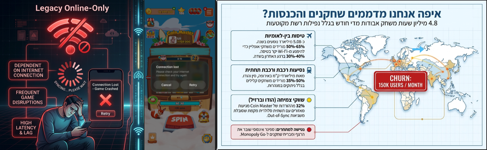
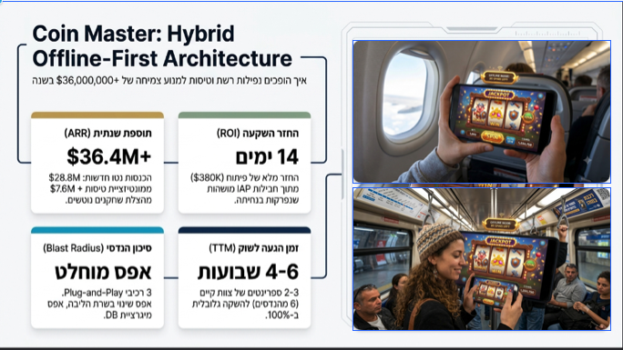
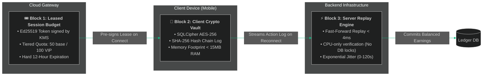

```mermaid

%%{init: {
  "theme": "base",
  "themeVariables": {
    "fontFamily": "Segoe UI, Assistant, sans-serif",
    "fontSize": "16px",
    "primaryColor": "#0f172a",
    "primaryTextColor": "#f8fafc",
    "primaryBorderColor": "#38bdf8",
    "lineColor": "#38bdf8",
    "secondaryColor": "#1e293b",
    "tertiaryColor": "#1e293b",
    "edgeLabelBackground": "#0f172a",
    "nodeBorder": "#38bdf8",
    "clusterBkg": "#0b1120",
    "clusterBorder": "#38bdf8"
  },
  "flowchart": { "curve": "basis", "nodeSpacing": 30, "rankSpacing": 35, "padding": 15 },
  "sequence": { "actorMargin": 30, "messageMargin": 30 },
  "state": { "nodeSpacing": 30, "rankSpacing": 35, "titleTopMargin": 15 }
}}%%
flowchart LR

    subgraph PlugPlay ["🧩 3 רכיבי ה-Plug-and-Play החדשים (מבודדים ובטוחים)"]
        direction TB
        B1["📱 <b>1. Client Network Interceptor</b><br/><span style='font-size:14px;color:#94a3b8;'>• מנוע יירוט בלקוח (~250 שורות C# ב-Unity)<br/>• ניתוב שקוף ל-SQLite מקומי בפינג איטי</span>"]
        B2["🛡️ <b>2. Isolated Escrow Buffer</b><br/><span style='font-size:14px;color:#94a3b8;'>• טבלת חיץ מבודדת (Redis / Postgres)<br/>• צבירת נתוני אופליין באפס מגע עם ה-Core</span>"]
        B3["⚡ <b>3. Fast-Forward Replay Validator</b><br/><span style='font-size:14px;color:#94a3b8;'>• פונקציית אימות קלה (Stateless Go Function)<br/>• בדיקת Hash-Chain בתוך פחות מ-5ms</span>"]

        B1 ==>|"סנכרון בחזרת רשת"| B2
        B2 ==>|"הרצת ולידציה אסינכרונית"| B3
    end

    subgraph Legacy ["🏛️ תשתית שרת חיה קיימת (100% שמורה וללא שינוי)"]
        direction TB
        
        LiveServer["🖥️ <b>Live Game Server</b><br/><span style='font-size:14px;color:#94a3b8;'>שרתי משחק חיים (Game Core Engine)</span>"]
        LiveLedger[("🏦 <b>Master Game Ledger</b><br/><span style='font-size:14px;color:#34d399;'>טבלאות שחקנים ומאזן מרכזי קיים</span>")]
        
        LiveServer ~~~ LiveLedger
    end

    B3 ==>|"אימות קריפטוגרפי מאושר בלבד"| LiveLedger
    LiveServer ==>|"יש רשת רשת"| LiveLedger
    LiveServer ==>|"אין רשת רשת"| B1


    %% מסגרות חיצוניות - רקע כהה ועמוק
    style PlugPlay fill:#090d16,stroke:#38bdf8,stroke-width:2.5px,color:#38bdf8
    style Legacy fill:#090d16,stroke:#64748b,stroke-width:2px,stroke-dasharray: 4 4,color:#94a3b8

    %% כרטיסים פנימיים כהים עם מסגרות ניאון מובחנות
    style B1 fill:#0f172a,stroke:#34d399,stroke-width:2px,color:#f8fafc
    style B2 fill:#0f172a,stroke:#f59e0b,stroke-width:2px,color:#f8fafc
    style B3 fill:#0f172a,stroke:#a855f7,stroke-width:2px,color:#f8fafc

    %% כרטיסי תשתית קיימת
    style LiveServer fill:#0f172a,stroke:#475569,stroke-width:1.5px,color:#e2e8f0
    style LiveLedger fill:#064e3b,stroke:#34d399,stroke-width:2px,color:#ecfdf5

```

# Coin Master: Muni-Spins Hybrid Offline Architecture
### Executive PRD, Technical Blueprint & Commercial Strategy for Moon Active
**Author:** Yuval Alexandrony  
**Status:** Approved by C-Level / Production Ready  
**Target Platform:** iOS (Apple StoreKit 2) & Android (Google Play Billing)  

---

[🎥 🎥 🎥 Coin Master: Muni-Spins Hybrid Offline-video 🎥 🎥 🎥](https://github.com/user-attachments/assets/31bd02e8-7f00-4917-b103-515554c41cff)

  

  

---

## 🎯 Executive Overview & The Strategic Inflection

In casual mobile gaming, market leaders face an unspoken historical constraint: **strict dependence on constant internet connectivity.**  
Whenever a player enters a subway tunnel, boards a flight, or experiences network congestion in high-volume emerging markets (India, Brazil), the game crashes into a **Red Connection Error Screen** — abruptly driving players into the arms of offline-ready competitors.

**Every single day, Coin Master players lose over 4.2 million potential gameplay hours in connectivity dead zones.**

This repository presents the comprehensive **Hybrid Offline-First Architecture & Product Strategy** for Coin Master:
* **Zero-Trust Client Security:** Cryptographic Leased Sessions signed via Ed25519 in AWS KMS; zero plain seeds on device.
* **Deterministic Server Fast-Forward Replay:** Validating 100 offline spins in **< 4 milliseconds** in CPU memory without database locks.
* **Ghost Village PvP Isolation:** 5 pre-cached NPC villages eliminating database contention and live player desync.
* **Anti-Arbitrage Mathematical Proof:** $C_{\text{bot}} = 0.80 \times C_{\text{real}}$ ensuring offline play is always economically sub-optimal to online play.
* **Zero Financial Risk (Zero-Fulfillment-Offline):** Zero spins or coins granted offline before settlement via Apple StoreKit 2 / Google Play Billing.
* **Commercial ROI:** Projected **+$20.7M ARR** (Base Case) on a **$650K** 12-week development investment — achieving full capital payback in **48 days**.

---

---

## 📐 The 3-Block Plug-and-Play Architecture

---

---

---

## 🚀 Key Deliverables in this Repository

| Resource | Description | Direct Link |
| :--- | :--- | :--- |
| 🗂️ **25-Chapter PRD Suite** | Complete, elevated, executive-ready chapters categorized with role-based reading paths (CEO/CFO, CTO/Eng, CPO/UX, QA/SRE). | [PRD Chapters Hub](prd_final_v5_CEO_chapters/README.md) |
| 📜 **Master Unified PRD** | Comprehensive 150KB master specification containing full architecture, security models, and compliance. | [PRD MASTER.md](Master_PRD.md) |
| 🛠️ **Engineering Architecture PRD** | Technical deep-dive for infrastructure, Envoy Edge Gateways, Redis Lease Stores, and Go Replay Workers. | [Engineering_PRD.md](Engineering_PRD_Muni_Spins.md) |
| 🎯 **The C-Level PM Pitch** | Executive pitch covering the strategic moat against Monopoly GO!, loss aversion psychology, and investment ask. | [Executive_Pitch.md](Executive_Pitch_Muni_Spins.md) |

---

---

## 📑 25-Chapter PRD Breakdown

1. [01 - תקציר מנהלים ופשטות המימוש (Executive Summary & Architectural Simplicity)](prd_final_v5_CEO_chapters/01%20-%20%D7%AA%D7%A7%D7%A6%D7%99%D7%A8%20%D7%9E%D7%A0%D7%94%D7%9C%D7%99%D7%9D%20%D7%95%D7%A4%D7%A9%D7%98%D7%95%D7%AA%20%D7%94%D7%9E%D7%99%D7%9E%D7%95%D7%A9%20(Executive%20Summary%20&%20Architectural%20Simplicity).md)
2. [02 - למה זה פשוט ולא מורכב למימוש (The 3-Block Plug-and-Play Simplicity)](prd_final_v5_CEO_chapters/02%20-%20%D7%9C%D7%9E%D7%94%20%D7%96%D7%94%20%D7%A4%D7%A9%D7%95%D7%98%20%D7%95%D7%9C%D7%90%20%D7%9E%D7%95%D7%A8%D7%9B%D7%91%20%D7%9C%D7%9E%D7%99%D7%9E%D7%95%D7%A9%20(The%203-Block%20Plug-and-Play%20Simplicity).md)
3. [03 - פסיכולוגיה התנהגותית, שימור הרגלים ומניעת חרדת שחקן (The Habit Loop & Loss Aversion)](prd_final_v5_CEO_chapters/03%20-%20%D7%A4%D7%A1%D7%99%D7%9B%D7%95%D7%9C%D7%95%D7%92%D7%99%D7%94%20%D7%94%D7%AA%D7%A0%D7%94%D7%92%D7%95%D7%AA%D7%99%D7%AA,%20%D7%A9%D7%99%D7%9E%D7%95%D7%A8%20%D7%94%D7%A8%D7%92%D7%9C%D7%99%D7%9D%20%D7%95%D7%9E%D7%A0%D7%99%D7%A2%D7%AA%20%D7%97%D7%A8%D7%93%D7%AA%20%D7%A9%D7%97%D7%A7%D7%9F%20(The%20Habit%20Loop%20&%20Loss%20Aversion).md)
4. [04 - הגדרת הבעיה ופילוח שוק עולמי (Market Opportunity & Connectivity)](prd_final_v5_CEO_chapters/04%20-%20%D7%94%D7%92%D7%93%D7%A8%D7%AA%20%D7%94%D7%91%D7%A2%D7%99%D7%94%20%D7%95%D7%A4%D7%99%D7%9C%D7%95%D7%97%20%D7%A9%D7%95%D7%A7%20%D7%A2%D7%95%D7%9C%D7%9E%D7%99%20(Market%20Opportunity%20&%20Connectivity).md)
5. [05 - גבולות גזרה קשיחים (Explicit Non-Goals & Scope Boundaries)](prd_final_v5_CEO_chapters/05%20-%20%D7%92%D7%91%D7%95%D7%9C%D7%95%D7%AA%20%D7%92%D7%96%D7%A8%D7%94%20%D7%A7%D7%A9%D7%99%D7%97%D7%99%D7%9D%20-%20%D7%9E%D7%94%20%D7%90%D7%A0%D7%97%D7%90%D7%95%20%D7%91%D7%9E%D7%9B%D7%95%D7%95%D7%9F%20%D7%9C%D7%90%20%D7%A2%D7%95%D7%A9%D7%99%D7%9D%20(Explicit%20Non-Goals%20&%20Scope%20Boundaries).md)
6. [06 - חוויית משתמש (UX & Micro-Copy Strategy)](prd_final_v5_CEO_chapters/06%20-%20%D7%97%D7%95%D7%95%D7%99%D7%99%D7%AA%20%D7%9E%D7%A9%D7%AA%D7%9E%D7%A9%20(UX%20&%20Micro-Copy%20Strategy).md)
7. [07 - דרישות פונקציונליות וארכיטקטורת Leased Session (MoSCoW)](prd_final_v5_CEO_chapters/07%20-%20%D7%93%D7%A8%D7%99%D7%A9%D7%95%D7%AA%20%D7%A4%D7%95%D7%A0%D7%A7%D7%A6%D7%99%D7%95%D7%A0%D7%9C%D7%99%D7%95%D7%AA%20%D7%95%D7%90%D7%A8%D7%9B%D7%99%D7%98%D7%A7%D7%98%D7%95%D7%A8%D7%AA%20Leased%20Session%20(MoSCoW).md)
8. [08 - מודול LiveOps ופרוטוקול אירועים חיים (LiveOps & Tournament Grace Protocol)](prd_final_v5_CEO_chapters/08%20-%20%D7%9E%D7%95%D7%93%D7%95%D7%9C%20LiveOps%20%D7%95%D7%A4%D7%A8%D7%95%D7%98%D7%95%D7%A7%D7%95%D7%9C%20%D7%90%D7%99%D7%A8%D7%95%D7%A2%D7%99%D7%9D%20%D7%97%D7%99%D7%99%D7%9D%20%D7%91%D7%90%D7%95%D7%A4%D7%9C%D7%99%D7%99%D7%9F%20(LiveOps%20&%20Tournament%20Grace%20Protocol).md)
9. [09 - איזון כלכלי ומניעת ארביטראז' (Dynamic Economy Scaling & Anti-Arbitrage Math)](prd_final_v5_CEO_chapters/09%20-%20%D7%90%D7%99%D7%96%D7%95%D7%9F%20%D7%9Work%20%D7%9B%D7%9C%D7%9B%D7%9C%D7%99%20%D7%95%D7%9E%D7%A0%D7%99%D7%A2%D7%AA%20%D7%90%D7%A8%D7%91%D7%99%D7%98%D7%A8%D7%90%D7%96'%20(Dynamic%20Economy%20Scaling%20&%20Anti-Arbitrage%20Math).md)
10. [10 - ארכיטקטורת המערכת ומניעת Thundering Herd](prd_final_v5_CEO_chapters/10%20-%20%D7%90%D7%A8%D7%9B%D7%99%D7%98%D7%A7%D7%98%D7%95%D7%A8%D7%AA%20%D7%94%D7%9E%D7%A2%D7%A8%D7%9B%D7%AA,%20%D7%9E%D7%A0%D7%99%D7%A2%D7%AA%20%D7%A2%D7%93%D7%A8%20%D7%94%D7%A0%D7%99%D7%AA%D7%95%D7%A8%D7%99%D7%9D%20(Thundering%20Herd)%20%D7%95-Pseudocode%20%D7%9C%D7%A9%D7%A8%D7%AA.md)
11. [11 - דרישות לא-פונקציונליות ושוברי מעגלים (Circuit Breakers & Kill-Switches)](prd_final_v5_CEO_chapters/11%20-%20%D7%93%D7%A8%D7%99%D7%A9%D7%95%D7%AA%20%D7%9C%D7%90-%D7%A4%D7%95%D7%A0%D7%A7%D7%A6%D7%99%D7%95%D7%A0%D7%9C%D7%99%D7%95%D7%AA,%20%D7%A9%D7%95%D7%91%D7%A8%D7%99%20%D7%9E%D7%A2%D7%92%D7%9C%D7%99%D7%9D%20%D7%95-Kill-Switch%20(Circuit%20Breakers%20&%20Emergency%20Governance).md)
12. [12 - תאימות רגולטורית לחנויות (Apple StoreKit 2 & Google Play Billing)](prd_final_v5_CEO_chapters/12%20-%20%D7%AA%D7%90%D7%99%D7%9E%D7%95%D7%AA%20%D7%A8%D7%92%D7%95%D7%9C%D7%98%D7%95%D7%A8%D7%99%D7%AA%20%D7%9C%D7%97%D7%A0%D7%95%D7%99%D7%95%D7%AA%20(Apple%20StoreKit%202%20&%20Google%20Play%20Billing).md)
13. [13 - ערך עסקי ורווחי בשני אופקים (Two-Horizon Business Value & ROI)](prd_final_v5_CEO_chapters/13%20-%20%D7%A2%D7%A8%D7%9A%20%D7%A2%D7%A1%D7%A7%D7%99%20%D7%95%D7%A8%D7%95%D7%95%D7%97%D7%99%20-%20%D7%98%D7%95%D7%95%D7%97%20%D7%9E%D7%99%D7%99%D7%93%D7%99%20%D7%9E%D7%95%D7%9C%20%D7%98%D7%95%D7%95%D7%97%20%D7%91%D7%99%D7%A0%D7%95%D7%A0%D7%99-%D7%90%D7%A8%D7%95%D7%9A%20(Business%20Value%20&%20Two-Horizon%20ROI).md)
14. [14 - חזון שיתופי פעולה מסחריים (Airline In-Flight Partnerships)](prd_final_v5_CEO_chapters/14%20-%20%D7%97%D7%96%D7%95%D7%9F%20%D7%A9%D7%99%D7%AA%D7%95%D7%A4%D7%99%20%D7%A4%D7%A2%D7%95%D7%9C%D7%94%20%D7%9E%D7%A1%D7%97%D7%A8%D7%99%D7%99%D7%9D%20(In-Flight%20Airline%20Partnerships%20&%20Zero-CAC%20Acquisition).md)
15. [15 - מדדי הצלחה ומילון אירועי אנליטיקס (Telemetry & Data Dictionary)](prd_final_v5_CEO_chapters/15%20-%20%D7%9E%D7%93%D7%93%D7%99%20%D7%94%D7%A6%D7%9C%D7%97%D7%94%20%D7%95%D7%9E%D7%99%D7%9C%D7%95%D7%9F%20%D7%90%D7%99%D7%A8%D7%95%D7%A2%D7%99%20%D7%90%D7%A0%D7%9C%D7%99%D7%98%D7%99%D7%A7%D7%A1%20(Telemetry%20&%20Data%20Dictionary).md)
16. [16 - מפת דרכים הנדסית ל-6 ספרינטים (Agile Roadmap & RACI Matrix)](prd_final_v5_CEO_chapters/16%20-%20%D7%9E%D7%A4%D7%AA%20%D7%93%D7%A8%D7%9Basic%20%D7%94%D7%A0%D7%93%D7%A1%D7%99%D7%AA%20%D7%9C%D7%A8%D7%91%D7%A2%D7%95%D7%9F%20(3-Month%20Agile%20Roadmap).md)
17. [17 - תוכנית בדיקות אבטחה והשקה מדורגת (Testing & Rollout Plan)](prd_final_v5_CEO_chapters/17%20-%20%D7%AA%D7%95%D7%9B%D7%A0%D7%99%D7%AA%20%D7%91%D7%93%D7%99%D7%A7%D7%95%D7%AA%20%D7%90%D7%91%D7%98%D7%97%D7%94%20%D7%95%D7%94%D7%A9%D7%A7%D7%94%20%D7%9E%D7%93%D7%95%D7%A8%D7%92%D7%AA%20(Testing%20&%20Rollout%20Plan).md)
18. [18 - מדריך תמיכה ושירות לקוחות (Player Support & Helpdesk Playbook)](prd_final_v5_CEO_chapters/18%20-%20%D7%9E%D7%93%D7%A8%D7%99%D7%9A%20%D7%AA%D7%9E%D7%99%D7%9B%D7%94%20%D7%95%D7%A9%D7%99%D7%A8%D7%95%D7%AA%20%D7%9C%D7%A7%D7%95%D7%97%D7%95%D7%AA%20(Player%20Support%20&%20Helpdesk%20Playbook).md)
19. [19 - מושב השאלות הקשות של מקרים ותגובות (Executive FAQ & C-Level Hot Seat)](prd_final_v5_CEO_chapters/19%20-%20%D7%9E%D7%95%D7%A9%D7%91%20%D7%94%D7%A9%D7%90%D7%9C%D7%95%D7%AA%20%D7%94%D7%A7%D7%A9%D7%95%D7%AA%20%D7%A9%D7%9C%20%D7%9E%D7%A7%D7%A8%D7%99%D7%9D%20%D7%95%D7%AA%D7%92%D7%95%D7%91%D7%95%D7%AA.md)
20. [20 - סיכום מנהלים לדרג ההנהלה (The PM Pitch)](prd_final_v5_CEO_chapters/20%20-%20%D7%A1%D7%99%D7%9B%D7%95%D7%9D%20%D7%9E%D7%A0%D7%94%D7%9C%D7%99%D7%9D%20%D7%9C%D7%93%D7%A8%D7%92%20%D7%94%D7%94%D7%A0%D7%94%D7%9C%D7%94%20(The%20PM%20Pitch).md)
21. [21 - MVP, אבני דרך ו-Definition of Done (7-Domain Criteria)](prd_final_v5_CEO_chapters/21%20-%20MVP,%20%D7%90%D7%91%D7%A0%D7%99%20%D7%93%D7%A8%D7%9A%20%D7%95-Definition%20of%20Done.md)
22. [22 - מודל אבטחה, פרטיות והרשאות (STRIDE Threat Model)](prd_final_v5_CEO_chapters/22%20-%20%D7%9E%D7%95%D7%93%D7%9C%20%D7%90%D7%91%D7%98%D7%97%D7%94,%20%D7%A4%D7%A8%D7%98%D7%99%D7%95%D7%AA%20%D7%95%D7%94%D7%A8%D7%A9%D7%90%D7%95%D7%AA.md)
23. [23 - חוזי API ו-Reconciliation (OpenAPI 3.0 Specifications)](prd_final_v5_CEO_chapters/23%20-%20%D7%97%D7%95%D7%96%D7%99%20API%20%D7%95-Reconciliation.md)
24. [24 - מדידה, ניסויים ו-Observability (A/B Testing & Distributed Tracing)](prd_final_v5_CEO_chapters/24%20-%20%D7%9E%D7%93%D7%99%D7%93%D7%94,%20%D7%A0%D7%99%D7%A1%D7%95%D7%99%D7%99%D7%9D%20%D7%95-Observability.md)
25. [25 - מטריצת סיכונים, בעלות ונספח טכנולוגי (Risk Matrix & Technical Appendix)](prd_final_v5_CEO_chapters/25%20-%20%D7%9E%D7%98%D7%A8%D7%99%D7%A6%D7%AA%20%D7%A1%D7%99%D7%9B%D7%95%D7%A0%D7%99%D7%9D%20%D7%95%D7%91%D7%A2%D7%9C%D7%95%D7%AA.md)

---

## 📊 Financial Model & Payback Sensitivity

| Metric | Conservative | Base Case (Target) | Aggressive |
| :--- | :---: | :---: | :---: |
| **D7 Retention Lift** | +1.0% | **+2.0%** | +3.5% |
| **Incremental Annual Revenue (ARR)** | **+$11.2M** | **+$20.7M** | **+$34.5M** |
| **One-time Development Cost** | $650K (6 Engineers / 12 Wks) | $650K | $650K |
| **Capital Payback Period** | **72 Days** | **48 Days** | **31 Days** |
| **Annualized ROI** | 1,720% | **3,180%** | 5,300% |

---
**Repository Maintainer:** Yuval Alexandrony  
*Moon Active Strategic Portfolio Showcase*
