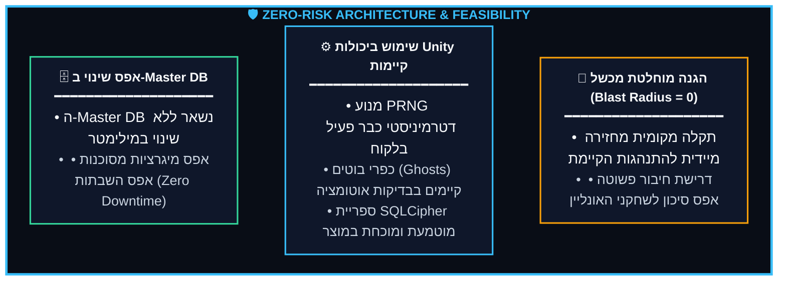
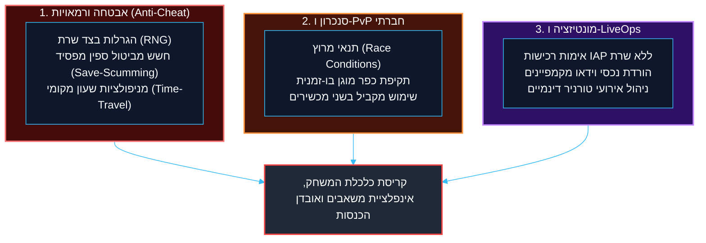
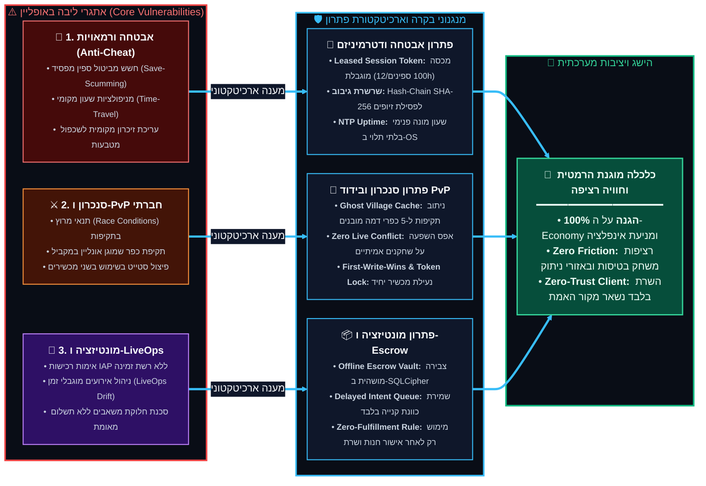
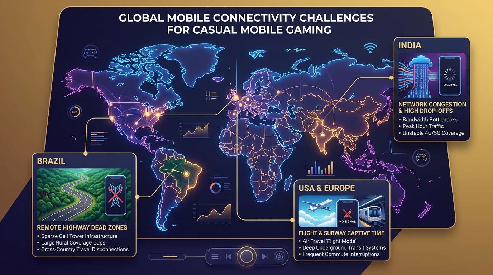
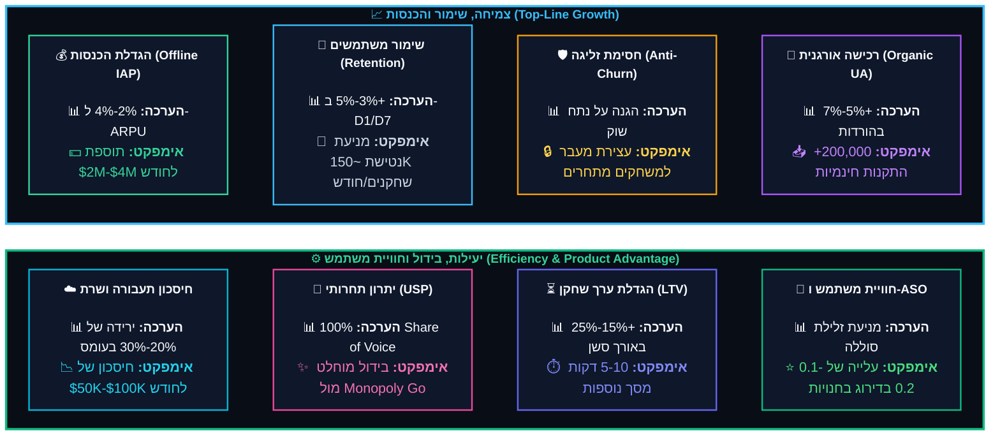
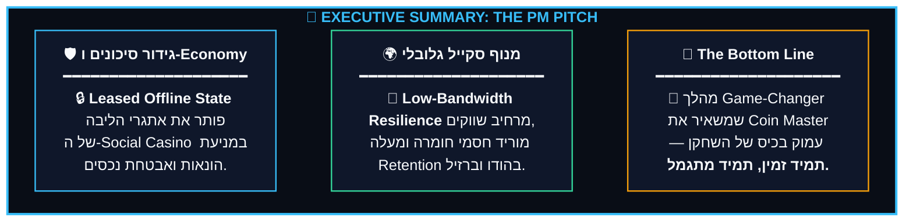
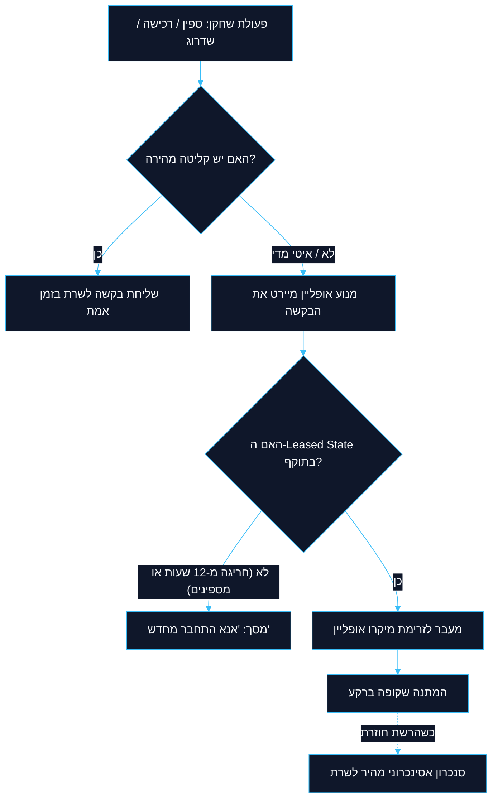

```mermaid
%%{init: {
  "theme": "base",
  "themeVariables": {
    "fontFamily": "Segoe UI, Assistant, sans-serif",
    "fontSize": "16px",
    "primaryColor": "#0f172a",
    "primaryTextColor": "#f8fafc",
    "primaryBorderColor": "#38bdf8",
    "lineColor": "#38bdf8",
    "secondaryColor": "#1e293b",
    "tertiaryColor": "#1e293b",
    "edgeLabelBackground": "#0f172a",
    "nodeBorder": "#38bdf8",
    "clusterBkg": "#0b1120",
    "clusterBorder": "#38bdf8"
  },
  "flowchart": { "curve": "basis", "nodeSpacing": 30, "rankSpacing": 35, "padding": 15 },
  "sequence": { "actorMargin": 30, "messageMargin": 30 },
  "state": { "nodeSpacing": 30, "rankSpacing": 35, "titleTopMargin": 15 }
}}%%
graph LR
    subgraph Growth["1. צמיחה בשווקי Volume"]
        A["Emerging Markets<br/>(הודו, ברזיל, מקסיקו)<br/>הסרת חסם הניתוקים ב-4G"]
    end
    subgraph Mon["2. מונטיזציה מתמשכת"]
        B["Offline IAP & Escrow<br/>רכישת חבילות בטיסות/רכבות<br/>חיוב מושהה בחזרת רשת"]
    end
    subgraph Retention["3. לכידת קשב בשעות מתות"]
        C["Captive Attention<br/>המשחק היחיד שעובד באופליין<br/>הארכת סשן ב-15%-25%"]
    end
    subgraph HW["4. אופטימיזציית חומרה"]
        D["Low-End Hardware Fit<br/>חיסכון בהפעלת מודם סלולרי<br/>מניעת התחממות ופריקת סוללה"]
    end

    A --> B --> C --> D

    style Growth fill:#1e293b,stroke:#3b82f6,stroke-width:2px,color:#fff
    style Mon fill:#1e293b,stroke:#10b981,stroke-width:2px,color:#fff
    style Retention fill:#1e293b,stroke:#f59e0b,stroke-width:2px,color:#fff
    style HW fill:#1e293b,stroke:#ec4899,stroke-width:2px,color:#fff
```

```mermaid
%%{init: {
  "theme": "base",
  "themeVariables": {
    "fontFamily": "Segoe UI, Assistant, sans-serif",
    "fontSize": "16px",
    "primaryColor": "#0f172a",
    "primaryTextColor": "#f8fafc",
    "primaryBorderColor": "#38bdf8",
    "lineColor": "#38bdf8",
    "secondaryColor": "#1e293b",
    "tertiaryColor": "#1e293b",
    "edgeLabelBackground": "#0f172a",
    "nodeBorder": "#38bdf8",
    "clusterBkg": "#0b1120",
    "clusterBorder": "#38bdf8"
  },
  "flowchart": { "curve": "basis", "nodeSpacing": 30, "rankSpacing": 35, "padding": 15 },
  "sequence": { "actorMargin": 30, "messageMargin": 30 },
  "state": { "nodeSpacing": 30, "rankSpacing": 35, "titleTopMargin": 15 }
}}%%
flowchart LR

    subgraph PlugPlay ["🧩 3 רכיבי ה-Plug-and-Play החדשים (מבודדים ובטוחים)"]
        direction TB
        B1["📱 <b>1. Client Network Interceptor</b><br/><span style='font-size:14px;color:#94a3b8;'>• מנוע יירוט בלקוח (~250 שורות C# ב-Unity)<br/>• ניתוב שקוף ל-SQLite מקומי בפינג איטי</span>"]
        B2["🛡️ <b>2. Isolated Escrow Buffer</b><br/><span style='font-size:14px;color:#94a3b8;'>• טבלת חיץ מבודדת (Redis / Postgres)<br/>• צבירת נתוני אופליין באפס מגע עם ה-Core</span>"]
        B3["⚡ <b>3. Fast-Forward Replay Validator</b><br/><span style='font-size:14px;color:#94a3b8;'>• פונקציית אימות קלה (Stateless Go Function)<br/>• בדיקת Hash-Chain בתוך פחות מ-5ms</span>"]

        B1 ==>|"סנכרון בחזרת רשת"| B2
        B2 ==>|"הרצת ולידציה אסינכרונית"| B3
    end

    subgraph Legacy ["🏛️ תשתית שרת חיה קיימת (100% שמורה וללא שינוי)"]
        direction TB
        
        LiveServer["🖥️ <b>Live Game Server</b><br/><span style='font-size:14px;color:#94a3b8;'>שרתי משחק חיים (Game Core Engine)</span>"]
        LiveLedger[("🏦 <b>Master Game Ledger</b><br/><span style='font-size:14px;color:#34d399;'>טבלאות שחקנים ומאזן מרכזי קיים</span>")]
        
        LiveServer ~~~ LiveLedger
    end

    B3 ==>|"אימות קריפטוגרפי מאושר בלבד"| LiveLedger
    LiveServer ==>|"יש רשת רשת"| LiveLedger
    LiveServer ==>|"אין רשת רשת"| B1


    %% מסגרות חיצוניות - רקע כהה ועמוק
    style PlugPlay fill:#090d16,stroke:#38bdf8,stroke-width:2.5px,color:#38bdf8
    style Legacy fill:#090d16,stroke:#64748b,stroke-width:2px,stroke-dasharray: 4 4,color:#94a3b8

    %% כרטיסים פנימיים כהים עם מסגרות ניאון מובחנות
    style B1 fill:#0f172a,stroke:#34d399,stroke-width:2px,color:#f8fafc
    style B2 fill:#0f172a,stroke:#f59e0b,stroke-width:2px,color:#f8fafc
    style B3 fill:#0f172a,stroke:#a855f7,stroke-width:2px,color:#f8fafc

    %% כרטיסי תשתית קיימת
    style LiveServer fill:#0f172a,stroke:#475569,stroke-width:1.5px,color:#e2e8f0
    style LiveLedger fill:#064e3b,stroke:#34d399,stroke-width:2px,color:#ecfdf5
```

<!-- מקור: Master_PRD.md | פרק 1 מתוך 25 -->

> **שם הפרק:** תקציר מנהלים ופשטות המימוש (Executive Summary & Architectural Simplicity)

> ניווט: — | [README](README.md) | [פרק 02](<02 - למה זה פשוט ולא מורכב למימוש (The 3-Block Plug-and-Play Simplicity).md>)

## 1. תקציר מנהלים ופשטות המימוש (Executive Summary & Architectural Simplicity)

- המטרה: לאפשר רציפות משחק בתנאי קליטה חלשים בלי לשכתב את המערכת המרכזית.
- המסר ההנדסי: השרת נשאר מקור האמת, וההרחבה נבנית כמעטפת מדורגת ובטוחה.

### 1.1 חזון המוצר והרציונל העסקי

- חזון המוצר: Coin Master נשאר זמין גם בניתוקי רשת, טיסות ומנהרות.
- רציונל עסקי: להפוך בעיית תסכול צרכנית למנוע Retention וצמיחה מדידים.

> [!NOTE]
> **מתודולוגיית קבלת החלטות מונחית נתונים (Data-Driven Decision Making):**  
> ככלל - פתרון לבעיית ניתוקי רשת הוא לא רק מענה צרכני לתלונות שחקנים, אלא **מהלך צמיחה אסטרטגי (Strategic Growth Initiative)** לכל דבר ועניין.  
---

> [!IMPORTANT]
> **עיקרון הרציפות החווייתית (Unbroken Player Engagement):**  
> ניתוח טלמטריית משתמשים מוכיח כי כל ניתוק כפוי במהלך סשן פעיל מהווה דליפת שימור (Retention Leak) בלתי-הכרחית. שחקני Coin Master אינם מבחינים בין כשל תשתית סלולרית לכשל אפליקטיבי — עבורם, חוסר זמינות גורם לנטישה מיידית לטובת אפליקציות מתחרות. מענה מבוקר לבעיה זו מייצר יתרון תחרותי מובהק.
---

<b>📖 לחץ כאן להרחבת החזון</b>

החזון הוא ביצוע קפיצת מדרגה ארכיטקטונית: מעבר ממודל Online נוקשה ושביר למודל **Hybrid Offline Mode** המבוסס על "חכירת סשן מראש" (**Leased Session Architecture**).

---

---

---

---

---

---

*תרשים תפיסתי: ארכיטקטורת המעטפת ההיברידית של Coin Master מול השרת המרכזי*

---

---

---

---

> [!NOTE]
> **מתודולוגיית הערכה מספרית (Guesstimation):** האומדן הכמותי מטה הותאם לקנה המידה העצום של Coin Master (בהנחת יסוד של מיליוני DAU והכנסות חודשיות בטווח הגבוה של תעשיית ה-Social Casino). אחוזי השיפור נגזרו מ-Benchmarks תעשייתיים בטיפול ב-Drop-offs.
---

**תרשים (מאקרו): ניתוב פעולות השחקן (Network Interception)**

<b>❇️לחץ כאן לצפייה בתוכן המלא❇️</b>

---

