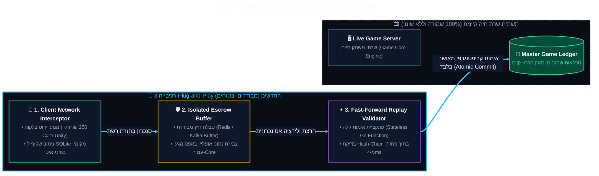

<!-- מקור: Master_PRD.md | פרק 2 מתוך 25 -->

> **שם הפרק:** למה זה פשוט ולא מורכב למימוש? (The 3-Block Plug-and-Play Simplicity)

> ניווט: [פרק 01](<01 - תקציר מנהלים ופשטות המימוש (Executive Summary & Architectural Simplicity).md>) | [README](README.md) | [פרק 03](<03 - פסיכולוגיה התנהגותית, שימור הרגלים ומניעת חרדת שחקן (The Habit Loop & Loss Aversion).md>)

## 2. למה זה פשוט ולא מורכב למימוש? (The 3-Block Plug-and-Play Simplicity)

- פשטות המימוש: התוספת נשענת על 3 רכיבים מבודדים במקום שכתוב רחב של ה-backend.
- עיקרון ליבה: אפס שינוי במאזן המרכזי ואפס פגיעה בזרימת האונליין הקיימת.

> [!TIP]
> **החשש הנפוץ של הנהלה ומובילי פיתוח:** "זה נשמע מורכב, מסוכן, וידרוש שנה של פיתוח ושכתוב שרתי הבקאנד".  
> **המציאות ההנדסית:** **ממש לא.** כ-**85% מהתשתית כבר קיימת כיום ב-Coin Master!** אנו לא משנים שום לוגיקת שרת קיימת, אלא מחברים מעטפת קלה (Sidecar Architecture).
---

### 2.1 שלושת הבלוקים ההנדסיים (The 3 Architectural Building Blocks)

המערכת תוכננה כמעטפת מבודדת (Sidecar Pattern) המתחברת למערכת הקיימת של Coin Master ללא צורך בשכתוב שרתים:

| בלוק הנדסי | מיקום ותפקיד | מפרט טכנולוגי ומשאבים | אימפקט על המערכת הקיימת |
| :--- | :--- | :--- | :--- |
| **1. Client Network Interceptor** | לקוח (Unity C#) – מזהה שיהוי/ניתוק רשת ומנתב שקוף לפעולה מקומית | • זיכרון: < 15MB RAM נוסף • אחסון: מסד SQLite מוצפן (SQLCipher) עד 10MB • ביצועים: שומר על 60 FPS קבוע | אפס שינוי בלוגיקת האונליין הרגילה; הניתוב מתבצע רק כאשר Network Reachability נכשל |
| **2. Isolated Escrow Buffer** | שרת (Redis + Go) – מאגר קליטה מבודד לסשנים המסונכרנים | • זמן חיים: 24 שעות TTL לכל חבילת סשן • תפוקה: תמיכה בעד 25,000 בקשות בשנייה • בידוד: מופרד לחלוטין מ-Master DB | אפס עומס טרנזקציות על ה-Core DB; כל הנתונים נשמרים בחיץ מבודד עד אימות סופי |
| **3. Fast-Forward Replay Validator** | שרת (Go Microservice) – פונקציית אימות קריפטוגרפית דטרמיניסטית | • שיהוי: אימות 50 ספינים בתוך פחות מ-4ms • סמכותיות: אימות שרשרת SHA-256 ושחזור זרם PRNG • זיכרון: Stateless, צריכת זיכרון מזערית | טעינה ל-Master Ledger מתבצעת בטרנזקציה אטומית יחידה רק לאחר שהאימות הקריפטוגרפי עבר ב-100% |

---

---

### 2.2 מודל שלבי הפיתוח: 4-6 שבועות ל-MVP ורבעון להשקה מלאה

ההנהלה שואלת בצדק כיצד ניתן למסור יכולת זו בלוח זמנים הדוק וקצר:

1. **שלב ראשון: MVP אלפא (ספרינטים 1-3, 4-6 שבועות):**
   - מימוש 3 הבלוקים בלבד עבור סשן מנותק בסיסי (מכסת 50 ספינים, כפרי רפאים מוקלטים, ומנוע Replay).
   - **אפס שינוי סכמה ב-Master DB:** טבלאות השחקנים, המאזנים ושרתי ה-Core של Coin Master אינם משתנים. אין מיגרציות מסוכנות, אין השבתות (Zero Downtime).
   - **שימוש ביכולות Unity מוכחות:** מנוע ה-PRNG כבר קיים בלקוח; כפרי בוטים (Ghosts) קיימים מזה שנים במערך ה-QA האוטומטי; וספריית SQLCipher כבר מוטמעת בבילד.
2. **שלב שני: השקה מלאה וייצוב (ספרינטים 4-6, שבועות 7-12 ב-Q1):**
   - שילוב תאימות LiveOps Grace Period (פרק 08), תור סליקה מושהה ל-IAP בחנויות (פרק 12), מנגנון שיטוח עומסים Thundering Herd (פרק 10), והרחבת מכסות מדורגות (עד 100 ספינים ל-VIP).
3. **הגנה מוחלטת מכשל (Blast Radius = 0):**
   - אם רכיב האופליין נתקל בתקלה או בחוסר תאימות – הלקוח מבצע Fallback שקט ומיידי להתנהגות הקיימת (הצגת מסך "No Internet Connection"). אין שום סיכון לשחקני האונליין הרגילים!
---

