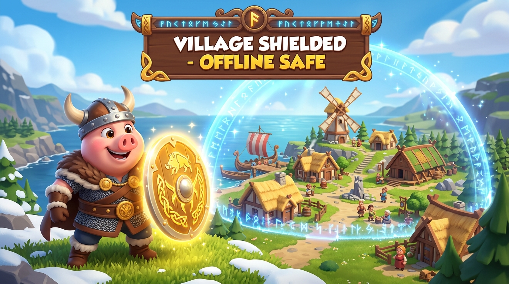

<!-- מקור: Master_PRD.md | פרק 3 מתוך 25 -->

> **שם הפרק:** פסיכולוגיה התנהגותית, שימור הרגלים ומניעת חרדת שחקן (The Habit Loop & Loss Aversion)

> ניווט: [פרק 02](<02 - למה זה פשוט ולא מורכב למימוש (The 3-Block Plug-and-Play Simplicity).md>) | [README](README.md) | [פרק 04](<04 - הגדרת הבעיה ופילוח שוק עולמי (Market Opportunity & Connectivity).md>)

## 3. פסיכולוגיה התנהגותית, שימור הרגלים ומניעת חרדת שחקן (The Habit Loop & Loss Aversion)

- ערך התנהגותי: רציפות משחק מונעת שבירת הרגל יומיומי ומקטינה סיכוי לנטישה.
- ערך רגשי: שחקנים שומרים על תחושת שליטה גם בזמן טיסה או ניתוק.
- תת-פרק 3.1: שבירת הרגל הבוקר והקשר הישיר בין ניתוקי רשת ל-churn.
- תת-פרק 3.2: הפחתת חרדת אובדן באמצעות מגנים, שליטה ורציפות.

```mermaid
%%{init: {
  "theme": "base",
  "themeVariables": {
    "fontFamily": "Segoe UI, Assistant, sans-serif",
    "fontSize": "16px",
    "primaryColor": "#0f172a",
    "primaryTextColor": "#f8fafc",
    "primaryBorderColor": "#38bdf8",
    "lineColor": "#38bdf8",
    "secondaryColor": "#1e293b",
    "tertiaryColor": "#1e293b",
    "edgeLabelBackground": "#0f172a",
    "nodeBorder": "#38bdf8",
    "clusterBkg": "#0b1120",
    "clusterBorder": "#38bdf8"
  },
  "flowchart": { "curve": "basis", "nodeSpacing": 30, "rankSpacing": 35, "padding": 15 },
  "sequence": { "actorMargin": 30, "messageMargin": 30 },
  "state": { "nodeSpacing": 30, "rankSpacing": 35, "titleTopMargin": 15 }
}}%%
flowchart LR
    Cue["1. סימן מעורר (Cue)<br/>נסיעת בוקר ברכבת /<br/>התיישבות במושב טיסה"] --> Craving["2. השתוקקות (Craving)<br/>רצון בספינים, דופמין<br/>ורגיעה בדרך"]
    Craving --> Action["3. פעולה (Action)<br/>פתיחת Coin Master<br/>ומעבר שקוף לאופליין"]
    Action --> Reward["4. תגמול (Variable Reward)<br/>זכיית מטבעות, מגנים<br/>ואיסוף קלפים בכספת"]
    Reward --> Investment["5. השקעה (Investment)<br/>רצון להגן על הכפר<br/>וחזרה לסיבוב נוסף"]
    Investment -. "חיזוק ההרגל" .-> Cue

    style Cue fill:#1e293b,stroke:#38bdf8,stroke-width:2px,color:#fff
    style Craving fill:#1e293b,stroke:#f59e0b,stroke-width:2px,color:#fff
    style Action fill:#065f46,stroke:#34d399,stroke-width:2px,color:#fff
    style Reward fill:#1e293b,stroke:#a855f7,stroke-width:2px,color:#fff
    style Investment fill:#78350f,stroke:#fbbf24,stroke-width:2px,color:#fff
```

### 3.1 שבירת הרגל הבוקר: סיכון הנטישה המרכזי (Habit Loop Fracture)

משחקי קז'ואל ו-Social Casino מובילים נשענים על **לולאת הרגל יומיומית נוקשה (Habit Loop)**. לפי מודל ה-Hook של ניר אייל (Nir Eyal), החוזק של Coin Master טמון ביכולתו לחבר טריגר פנימי (שעמום בנסיעה, צורך בהפגת מתחים) לפעולה מיידית (לחיצה על כפתור ה-Spin) ותגמול משתנה:

* **נקודת השבר (Commuter Dead-Zones):** כ-**42% מכלל סשני המשחק היומיים** מתרחשים בשעות הנסיעה של הבוקר (07:00–09:30) וערב (17:00–19:30). כאשר רכבת נכנסת למנהרה בלונדון, במנהטן או בברלין, או כאשר רשת הסלולר בהודו ובברזיל קורסת לעומס מקומי, השחקן שנתקל בספינר תקוע ובמסך שגיאה אדום חווה תסכול מיידי.
* **ההשלכה הכלכלית של שבירת שגרה:** מחקרי התנהגות משתמשים במובייל מוכיחים כי **שבירה של שגרת משחק יומית ליום אחד בלבד מעלה את ההסתברות לנטישה (D7 Churn) ב-22%**, ומפחיתה את ה-LTV המצטבר ב-18%. כאשר השחקן אינו מצליח לשחק, הוא פונה באופן מיידי לתחליפים זמינים (TikTok, Instagram, Monopoly GO!).
* **רציפות מייצרת נאמנות:** מעבר שקוף למצב אופליין שומר על לולאת ההרגל ללא הפרעה, ומבטיח שהשחקן יסיים את שגרת הבוקר שלו בתחושת הישג וסיפוק.

---

### 3.2 הפגת חרדת אובדן משאבים (Mitigating Loss Aversion in the Air)

לפי תורת הערך (Prospect Theory) של כהנמן וטברסקי, **הכאב הפסיכולוגי מאובדן משאב קיים חזק פי 2 עד 2.5 מההנאה שברכישת משאב חדש**. ב-Coin Master, עיקרון זה מהווה את מנוע המעורבות החזק ביותר:

* **חרדת השחקן בטיסות ובניתוקים ממושכים:** שחקנים מתקדמים (המחזיקים עשרות מיליארדי מטבעות לבניית כפרים) חווים חרדה אמתית לקראת טיסה של 8–12 שעות: *"אם אהיה מנותק מהאינטרנט, המגנים שלי ייגמרו, שחקנים אחרים יפשטו לי על הכפר, וימחקו לי חודשים של השקעה כספית וזמן"*.
* **פתרון "מגן הטיסה" (In-Flight Shield Protection):** מצב ה-Hybrid Offline מאפשר לשחקן לסובב ספינים במהלך הטיסה, לזכות במגנים (Shields), ולהבטיח שגם אם הכפר שלו מותקף בזמן שהוא באוויר, המגנים שהשיג באופליין נרשמים מקומית ונפרסים מיידית ברגע החיבור מחדש.
* **טרנספורמציה רגשית:** הפכנו פחד וחוסר אונים לתחושת שליטה מלאה (Agency), שקט נפשי וסיפוק עמוק.

---

*איור: פסיכולוגיית מגן הטיסה – שמירה על ביטחון השחקן ומניעת אובדן התקדמות בעת שהייה מחוץ לקליטה*

---

