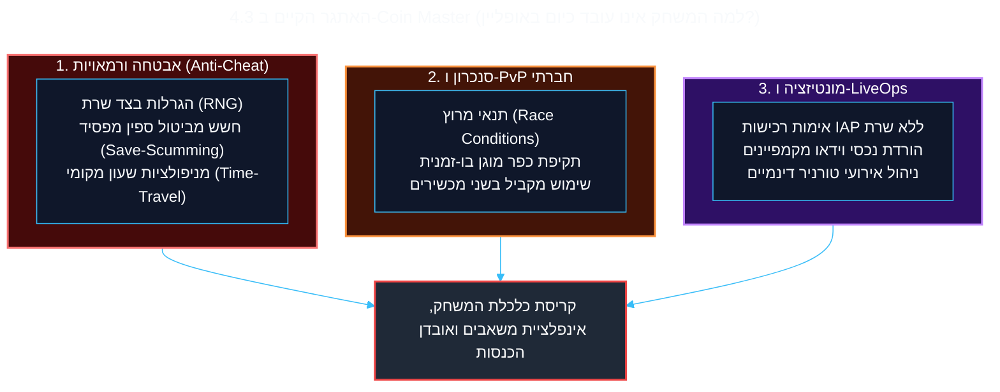
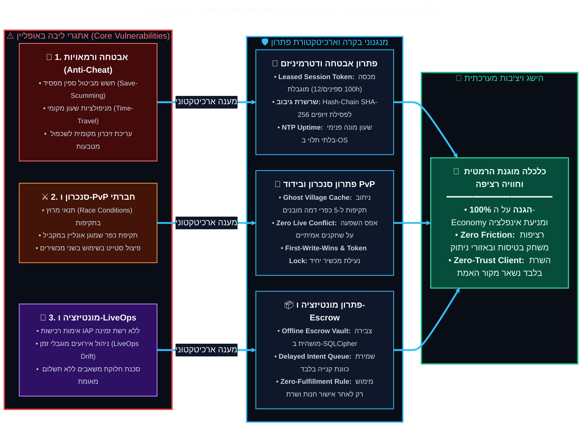

<!-- מקור: Master_PRD.md | פרק 4 מתוך 25 -->

> **שם הפרק:** הגדרת הבעיה ופילוח שוק עולמי (Market Opportunity & Connectivity)

> ניווט: [פרק 03](<03 - פסיכולוגיה התנהגותית, שימור הרגלים ומניעת חרדת שחקן (The Habit Loop & Loss Aversion).md>) | [README](README.md) | [פרק 05](<05 - גבולות גזרה קשיחים - מה אנחנו במכוון לא עושים (Explicit Non-Goals & Scope Boundaries).md>)

## 4. הגדרת הבעיה ופילוח שוק עולמי (Market Opportunity & Connectivity)

- הזדמנות השוק: בעיית הקליטה בולטת במיוחד בשווקי נפח וצמיחה מרכזיים.
- השלכה עסקית: רציפות באזורים חלשים יכולה לשפר גם שימור וגם חוויית מותג.

---

תמונת המצב הנוכחית כשאין / יש בעיית קליטה:

---

### 4.1 תמונת מצב עולמית: אתגרי רשת בשווקי היעד של Coin Master

- תובנת ליבה: “יש/אין קליטה” אינה משקפת את המציאות; הבעיה היא גם פינג, עומס ותנודתיות.
- מיקוד: הודו, ברזיל ונסיעות עירוניות בארה"ב הן נקודות כאב בולטות.

איכות הקליטה בפועל שונה מהותית מהגדרת "יש / אין קליטה". במדינות המובילות בהורדות, התשתית הפיזית אינה מאפשרת חוויית Online רציפה.

---
title: "4.1 תמונת מצב עולמית: אתגרי רשת בשווקי היעד של Coin Master"
---

```mermaid
%%{init: {
  "theme": "base",
  "themeVariables": {
    "fontFamily": "Segoe UI, Assistant, sans-serif",
    "fontSize": "20px",
    "primaryColor": "#0f172a",
    "primaryTextColor": "#f8fafc",
    "primaryBorderColor": "#38bdf8",
    "lineColor": "#38bdf8"
  },
  "flowchart": {
    "nodeSpacing": 30,
    "rankSpacing": 40,
    "padding": 30
  }
}}%%
flowchart TD

    subgraph GLOBAL_STATS ["🌍 <b>4.1 התפלגות הורדות עולמית: שווקי היעד של COIN MASTER</b>"]
        direction LR
        
        M1["🇮🇳 <b>הודו (Volume Market)</b><br/><br/><span style='font-size:26px;color:#38bdf8;'><b>24%</b></span><br/><span style='font-size:15px;color:#94a3b8;'>נפח משתמשים עצום • רשת לא יציבה</span>"]
        M2["🇧🇷 <b>ברזיל (Casual Hub)</b><br/><br/><span style='font-size:26px;color:#34d399;'><b>12%</b></span><br/><span style='font-size:15px;color:#94a3b8;'>שוק קז'ואל מרכזי • ניתוקי דרכים</span>"]
        M3["🇺🇸 <b>ארה''ב (Top Revenue)</b><br/><br/><span style='font-size:26px;color:#fbbf24;'><b>10%</b></span><br/><span style='font-size:15px;color:#94a3b8;'>LTV מקסימלי • טיסות ונסיעות עסקים</span>"]
        M4["🇲🇽 <b>מקסיקו (LATAM)</b><br/><br/><span style='font-size:26px;color:#f472b6;'><b>6%</b></span><br/><span style='font-size:15px;color:#94a3b8;'>שוק בצמיחה מהירה ב-LATAM</span>"]
        M5["🌐 <b>שאר העולם (Row)</b><br/><br/><span style='font-size:26px;color:#a855f7;'><b>48%</b></span><br/><span style='font-size:15px;color:#94a3b8;'>אירופה, אסיה-פסיפיק ועוד</span>"]

        M1 ~~~ M2 ~~~ M3 ~~~ M4 ~~~ M5
    end

    %% סגנון ראשי כהה
    style GLOBAL_STATS fill:#090d16,stroke:#38bdf8,stroke-width:3px,color:#38bdf8

    %% כרטיסים פנימיים כהים
    style M1 fill:#0f172a,stroke:#38bdf8,stroke-width:2px,color:#f8fafc
    style M2 fill:#0f172a,stroke:#34d399,stroke-width:2px,color:#f8fafc
    style M3 fill:#0f172a,stroke:#f59e0b,stroke-width:2px,color:#f8fafc
    style M4 fill:#0f172a,stroke:#ec4899,stroke-width:2px,color:#f8fafc
    style M5 fill:#0f172a,stroke:#8b5cf6,stroke-width:2px,color:#f8fafc
```

### 4.2 ניתוח עומק לפי שווקים גיאוגרפיים

- לכל שוק יש כאב רשת אחר, ולכן גם ערך המוצר נגזר מהקשר שימוש שונה.

<b>❇️לחץ כאן לצפייה בטבלה המלאה❇️</b>

| שוק / מדינה | % הורדות | אופי התשתית ואתגר הרשת | נקודת הכאב של השחקן | ערך מוצר מצב אופליין |
| :--- | :---: | :--- | :--- | :--- |
| **הודו** | **~24%** | כיסוי 4G רחב אך **עומס צפיפות עירוני אדיר** וקפיצות פינג. | 5%-10% מהזמן בקליטה קטועה, קפיאת מסך באמצע ספין ונטישה. | יעד: רציפות מדידה בתנאי רשת מוגבלים, ללא התחייבות לזמינות מוחלטת. |
| **ברזיל** | **~12%** | **מרחקים עצומים וחורי קליטה** בין אנטנות בכבישים מהירים. | ניתוקים פתאומיים של 5-15 דקות במעבר בין מחוזות. | רציפות לולאת משחק בדרכים ומניעת תסכול. |
| **ארה"ב** | **~10%** | **שוק ההכנסות מס' 1.** תשתית מעולה, אך ניתוקים ממוקדים. | נסיעות ברכבת תחתית (Subway), טיסות מסחריות, מעליות. | מונטיזציה של שחקנים בעלי LTV גבוה בדיוק ב"שעות המתות". |
| **מקסיקו** | **~6%** | שילוב בין עומסים עירוניים לפערי כיסוי פריפריאליים. | שחקנים חדשים נוטשים בשלבי ה-FTUE בגלל האטות רשת. | מניעת Drop-offs בשלבי ההצטרפות הראשוניים. |
| **שאר העולם** | **~48%** | אירופה (יוממות במנהרות), אסיה מתפתחת (תנודתיות רשת). | שבירת ה-Flow State כתוצאה ממעבר זמני לחוסר קליטה. | הפיכת המשחק לזמין בכל זמן, ביסוס יתרון תחרותי יחסי (USP). |

---
###  ניתוח רווחים משוערים וערך מוסף 

- הפרק מרכז היפותזות ערך עסקי, חיסכון תפעולי ובידול מוצרי לצורך הערכה הנהלתית.

---

<b>❇️לחץ כאן לצפייה בתוכן המלא❇️</b>

| קטגוריית אימפקט | תיאור ותועלת מוצרית | הערכה משוערת (%) | אומדן כמותי (Coin Master Scale) |
|---|---|---|---|
| **הגדלת הכנסות (Offline IAP)** | אפיק הכנסות ממשתמשים בטיסות ונסיעות. | **2%-4%** ל-ARPU | תוספת הכנסות של כ-**$2M-$4M לחודש** מ-Upsells באופליין. |
| **שימור משתמשים (Retention)** | הפחתת נטישה עקב בעיות רשת בהודו, ברזיל, וגם נטישת משתמשים במדינות אחרות באופן כללי. | גידול **3%-5%** ב-D1/D7 | מניעת נטישה של כ-**150,000 שחקנים** בחודש (חיסכון אדיר ב-UA). |
| **מניעת זליגה למתחרים (Churn to Competitors)** | חסימת המעבר של שחקנים מתוסכלים למשחקי קז'ואל אחרים שכן מאפשרים משחק חלקי או מלא ללא רשת בדרכים. | שמירה על **נתח השוק** הקיים. | חסימה קריטית של שחקנים מלנסות משחקים מתחרים בדיוק בזמנים ה"מתים" שלהם. |
| **חיסכון תעבורה ושרת** | מעבר מ-Ping לעבודת Batch מרוכזת. | הפחתת עומס ב-**20%-30%** | חיסכון תשתית ישיר של **$50K-$100K** בחודש. |
| **יתרון תחרותי יחסי (USP)** | בידול משמעותי מול Monopoly Go ודומיו. | 100% Share of Voice | **Priceless** - המרת שחקני מתחרים שנתקעו בדרכים. |
| **רכישה אורגנית (Organic UA)** | שחקנים מחפשים מראש אפליקציות לפני טיסה. | גידול **5%-7%** בהורדות | **~200,000+ הורדות** חינמיות בתקופות תיירות וחגים. |
| **הגדלת ערך שחקן (LTV)** | הארכת אורך הסשן בשעות ההמתנה. | גידול **15%-25%** בסשן | לכידת **5-10 דקות נוספות** של זמן מסך מהמשתמש. |
| **חיסכון למשתמש (סוללה ודאטה)** | מניעת זלילת סוללה כתוצאה מ-Radio Wakeups. | ירידה עשרות % בתלונות | עלייה משוערת של **0.1-0.2 כוכבים בדירוג החנויות** (ASO). |

---

### 4.3 האתגר הקיים ב-Coin Master (למה המשחק אינו עובד כיום באופליין?)

- החסמים היום: אבטחה, סנכרון PvP, LiveOps ומונטיזציה דורשים סמכות שרת קשיחה.
- המסקנה: Offline אפשרי רק עם בידוד, מגבלות מכסה ואימות replay מלא.

<b>❇️לחץ כאן לצפייה בתוכן המלא❇️</b>

---

---

