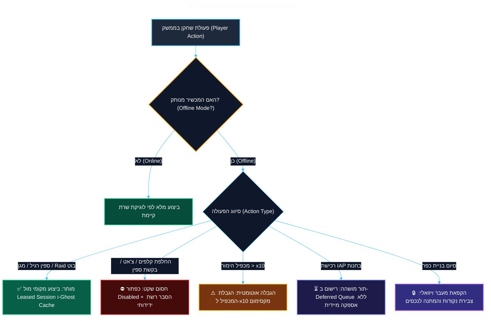

<!-- מקור: Master_PRD.md | פרק 5 מתוך 25 -->

> **שם הפרק:** גבולות גזרה קשיחים: מה אנחנו במכוון *לא* עושים (Explicit Non-Goals & Scope Boundaries)

> ניווט: [פרק 04](<04 - הגדרת הבעיה ופילוח שוק עולמי (Market Opportunity & Connectivity).md>) | [README](README.md) | [פרק 06](<06 - חוויית משתמש (UX & Micro-Copy Strategy).md>)

## 5. גבולות גזרה קשיחים: מה אנחנו במכוון *לא* עושים (Explicit Non-Goals & Scope Boundaries)

- הגדרת Non-Goals קשיחה ומנומקת נועדה להגן על לוחות הזמנים (MVP תוך 4-6 שבועות), לבודד את ה-Blast Radius ולמנוע פרצות כלכליות.
- עיקרון מנחה: כל יכולת שמייצרת סיכון אבטחה, אי-ודאות רגולטורית או עומס סינכרוני מושהית במכוון לשלבים הבאים.

> [!WARNING]
> **עיקרון המיקוד של Senior Director of Product:**  
> היכולת לומר "לא" ברור ומנומק ליכולות מפתות היא הגורם המכריע בין פרויקט מוצר שמספק ערך עסקי מהיר לבין מיזם הנדסי שמתעכב חודשים רבים. עבור גרסת 1.0 (MVP), הגדרנו 8 גבולות גזרה בלתי-עבירים:

---

### 5.1 מטריצת הגבולות הקשיחים (The Explicit Non-Goals Matrix)

| # | תחום ויכולת | סטטוס לגרסה 1.0 | וקטור הסיכון וההונאה שנחסם (Threat & Abuse Vector) | התנהגות המערכת במצב מנותק (Offline Fallback) | תנאי סף לבחינה מחודשת (Phase 2 Gates) |
| :-: | :--- | :---: | :--- | :--- | :--- |
| **1** | **סנכרון PvP חי ותקיפת כפרי שחקנים אמיתיים** | ❌ **Out of Scope** | תנאי מרוץ (Race Conditions), התנגשות מגנים, ושינוי מאזן של שחקן מותקף בזמן שהוא אונליין. | מעבר שקוף לתקיפת כפרי דמה מוקלטים מראש (**Ghost Villages Cache**). | אימוץ Event Sourcing מורכב בשרת המרכזי (אינו נדרש כעת). |
| **2** | **החלפה ומסחר בקלפים (Card Trading & Gifting)** | ❌ **Out of Scope** | שכפול קלפים (Duping Exploits) באמצעות מעבר מכוון למצב טיסה ושליחת אותו קלף למספר שחקנים. | כפתור "שלח לחבר" הופך ללא-פעיל (Disabled) עם אינדיקטור "דורש חיבור רשת". | מערכת Two-Phase Commit קריפטוגרפית עם שריון קלפים מראש. |
| **3** | **צ'אט, הודעות קבוצה ובקשות ספינים** | ❌ **Out of Scope** | אובדן הודעות, תסכול משתמשים מתשובות שלא מגיעות, ועומס סנכרון תורים. | ממשק הצ'אט והצוות מוצג לקריאה בלבד (Read-Only) על בסיס ההיסטוריה האחרונה. | דרישה עסקית חלשה מטלמטריית משתמשים באופליין. |
| **4** | **מכסת ספינים בלתי מוגבלת** | ❌ **Out of Scope** | צבירת חובות ספינים אסטרונומיים, חשיפה להונאות Reverse-Engineering ואובדן שליטה מוניטרית. | הגבלת מכסה הרמטית: **50 ספינים בסיס / עד 100 ל-VIP**, עם פקיעת תוקף (TTL) של 12 שעות. | הגדלת מכסה רק על בסיס מודל סיכון אישי (Risk Scoring). |
| **5** | **אספקת רכישות מקומית (Offline IAP Instant Fulfillment)** | ❌ **Out of Scope** | תרמיות ביטול חיוב (Chargeback Exploits) – שחקן רוכש ספינים באוויר ומבטל את הכרטיס בנחיתה. | הרכישה נכנסת ל-**Deferred Queue**; הספינים מופקדים רק לאחר אישור שרת חתום. | מתן קרדיט זמני מוגבל (Trust Lending) רק לשחקני VIP מוכחים. |
| **6** | **מכפילי הימור גבוהים (Uncapped Bet Multipliers)** | ❌ **Out of Scope** | הגדלת ה-Blast Radius של תקלות אימות: זכייה אחת ב-x100 יכולה לשבש את כלכלת הכפר. | הגבלת מכפיל מקסימלי ל-**x10 בלבד** במצב מנותק (במקום x100 ומעלה באונליין). | אימות אפס-טעויות של מנוע ה-Replay לאורך מיליון סשנים רצופים. |
| **7** | **הורדת נכסי כפרים וגרפיקות חדשות** | ❌ **Out of Scope** | בזבוז חבילות גלישה סלולריות, זמני טעינה אינסופיים וחוויית אפליקציה תקועה. | שחקן המשלים כפר במצב מנותק יכול להמשיך לסובב, אך מעבר ויזואלי לכפר הבא ממתין לרשת. | מנגנון חכם של רקע להורדת נכסי הכפר הבא בעת חיבור Wi-Fi. |
| **8** | **פרסומות וידאו מתגמלות (Rewarded Ads)** | ❌ **Out of Scope** | רשתות מודעות (AppLovin, IronSource) דורשות אימות שרת (SSV) בזמן אמת לאישור צפייה. | כפתור "צפה בווידאו לקבלת ספינים" מוסתר אוטומטית במצב מנותק. | הטמעת Local Ad SDK Caching בשיתוף רשתות הפרסום בגרסה 2.0. |

---

### 5.2 תרשים אכיפת גבולות הגזרה בצד הלקוח (Scope Enforcement Logic)

