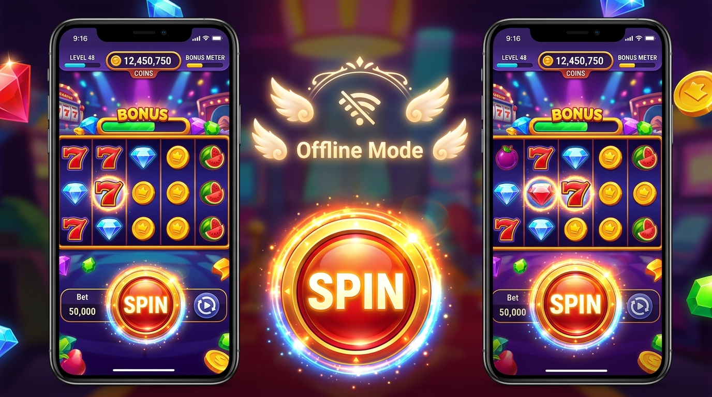
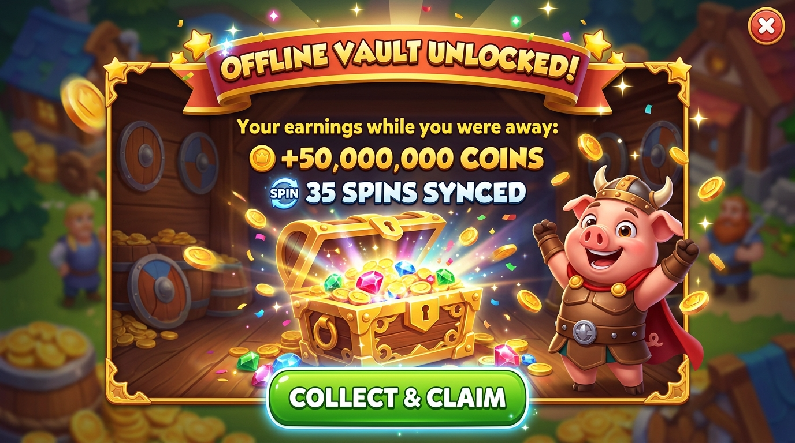
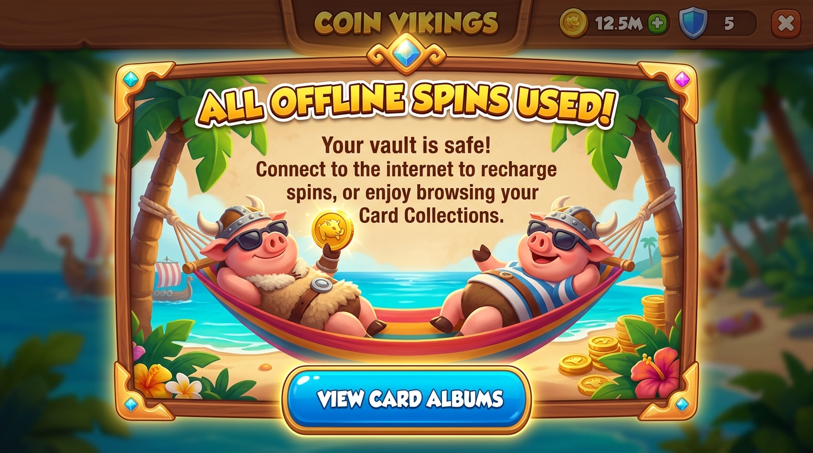
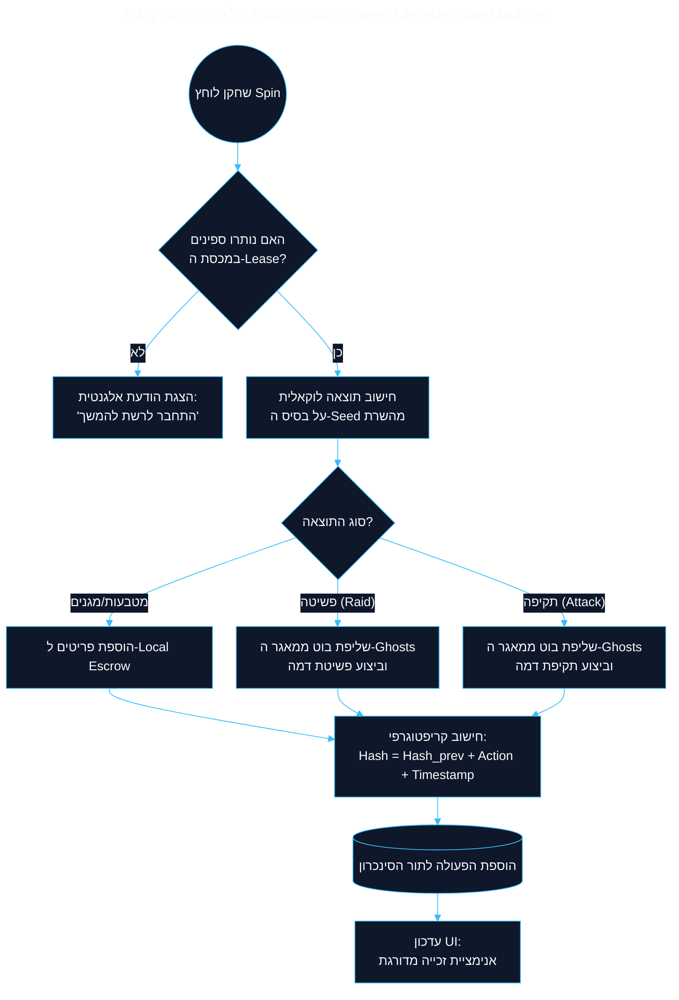
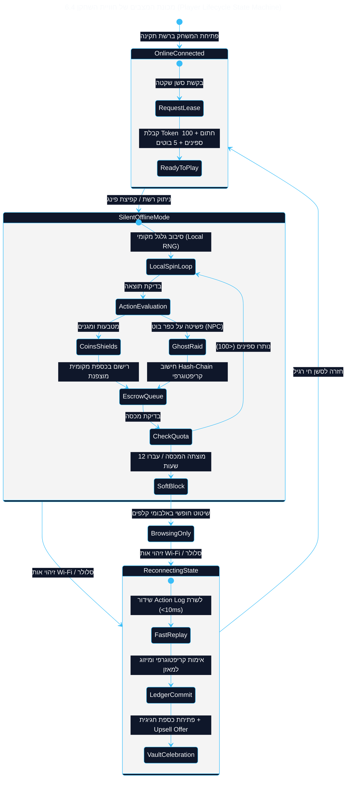
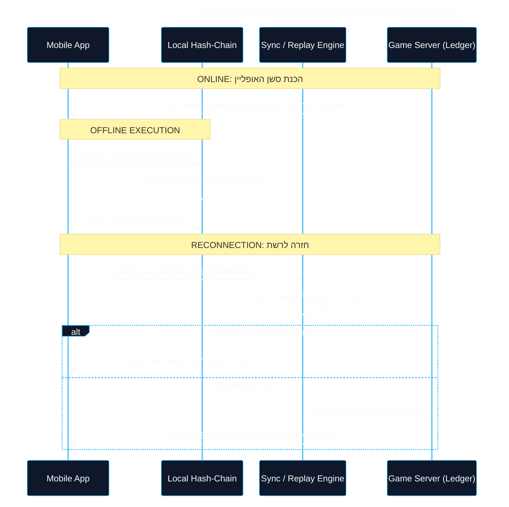
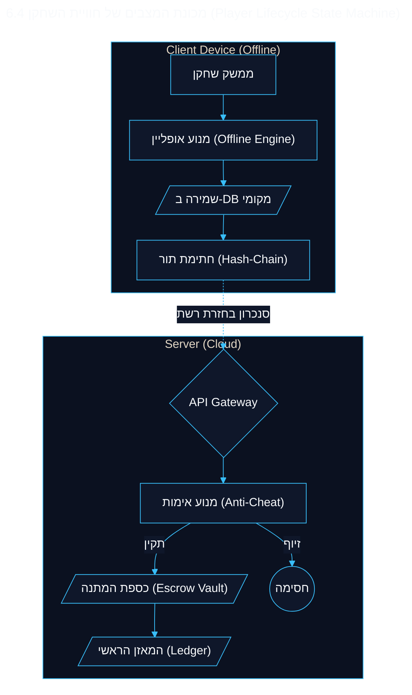

<!-- מקור: Master_PRD.md | פרק 6 מתוך 25 -->

> **שם הפרק:** חוויית משתמש (UX & Micro-Copy Strategy)

> ניווט: [פרק 05](<05 - גבולות גזרה קשיחים - מה אנחנו במכוון לא עושים (Explicit Non-Goals & Scope Boundaries).md>) | [README](README.md) | [פרק 07](<07 - דרישות פונקציונליות וארכיטקטורת Leased Session (MoSCoW).md>)

## 6. חוויית משתמש (UX & Micro-Copy Strategy)

- עיקרון UX: המעבר לאופליין חייב להיות שקט, לא מאיים ולא לשבור Flow.
- החזרה לרשת הופכת לרגע חיובי של תגמול, שקיפות ואפשרות Upsell.

> [!TIP]
> **השורה התחתונה:** המעבר לאופליין חייב להיות שקוף לחלוטין ולשמור על ה-Flow State. אין חסימות, אין פופ-אפים מפחידים.
### 6.1 אינדיקטור שקט (Ambient Offline Indicator)

- המטרה: ליידע שהסשן מוגן בלי להטריד את השחקן בפופ-אפים.

<b>📖 לחץ להרחבת פרטי ה-UX המלאים</b>

* **ללא פופ-אפ חוסם:** כשהרשת מתנתקת, לא קופצת שום התראה מבהילה.
* **הסמן הוויזואלי:** כנפי זהב זעירות (Golden Wings) מופיעות מעל כפתור ה-SPIN עם כיתוב מוזהב מעודן: `OFFLINE: 85 SPINS LEFT`. השחקן מבין מיד שהוא מוגן ושהסשן פעיל.

---

### 6.2 חגיגת החזרה לרשת: אנימציית פתיחת הכספת (The Reconnect Touchpoint)

- רגע החזרה לרשת ממותג כנקודת שיא חיובית (Peak-End Rule) שמחזקת תחושת סיפוק, הישג ונכונות למונטיזציה.
- המעבר אינו מסתכם בסנכרון טכני אילם, אלא באירוע דופמין ויזואלי:

*איור: אנימציית פתיחת הכספת ברגע החזרה לרשת (The Reconnect Touchpoint) – אפקט פיצוץ המטבעות, שחרור המגנים ופריקת השלל*

*מפרט קונספט ויזואלי למסך פתיחת הכספת ומאזן השלל המצטבר*

*שלבי המעבר החווייתי: מזיהוי חיבור הרשת, דרך אנימציית המנעולים ועד להפקדת המטבעות לחשבון השחקן*

* **הודעת חגיגה מונפשת:** *"Offline Vault Unlocked!"* – פיצוץ זהב, אבני חן ומטבעות שנאגרו בסשן המנותק.
* **המרת ספינים ורכישות:** פריקת המטבעות לתוך המאזן הראשי עם צלילי ג'קפוט ואפקט Haptic עשיר.
* **טריגר מונטיזציה מיידי (Loss-Aversion Retargeting):** הופעת הצעת מבצע מוגבלת בזמן (*"היית מדהים בטיסה! המשך את הרצף עם חבילת 250 ספינים ב-50% הנחה"*).

---

### 6.3 מסך Soft-Block בסיום המכסה: מיקרו-קופי אמפתי ורב-לשוני

כאשר מכסת הספינים המנותקת מגיעה לסיומה (50 ספינים בסיס / 100 VIP), הממשק אינו מציג מסך שגיאה אדום ומאיים, אלא מסך **Soft-Block מכבד ואמפתי** המעודד שהייה חיובית באפליקציה:

*מסך ה-Soft-Block המרגיע: הגנה על הכספת, הפניה לאלבומי קלפים ואינדיקטור סנכרון אוטומטי*

*התנהגות הממשק וזרימת הניווט בעת הגעה לקצה מכסת האופליין*

#### מפרט מיקרו-קופי גלובלי (Global Micro-Copy Specification - 4 Languages)

| אלמנט ממשק | English (Global Default) | עברית (Hebrew) | Español (LATAM/ES) | Deutsch (DACH) | רציונל התנהגותי (Behavioral UX) |
| :--- | :--- | :--- | :--- | :--- | :--- |
| **כותרת ראשית** | `ALL OFFLINE SPINS USED!` | `כל הספינים באופליין נוצלו!` | `¡TODAS LAS TIRADAS USADAS!` | `ALLE OFFLINE-SPINS GENUTZT!` | בהירות עובדתית מלאה ללא האשמת המשתמש. |
| **גוף ההודעה** | `Your vault is safe! Connect to the internet to recharge spins, or enjoy browsing your Card Collections.` | `הכספת שלך מאובטחת! התחבר לאינטרנט כדי לטעון ספינים חדשים, או המשך ליהנות מאלבומי הקלפים שלך.` | `¡Tu caja fuerte está a salvo! Conéctate a internet para recargar tiradas o explora tus colecciones de cartas.` | `Dein Tresor ist sicher! Verbinde dich mit dem Internet, um neue Spins zu laden, oder stöbere in deinen Kartensets.` | הרגעת חרדת אובדן משאבים (Loss Aversion) והפניה לפעילות מרגיעה ובלתי מנותקת. |
| **כפתור פעולה ראשי** | `[ VIEW CARD ALBUMS ]` | `[ צפה באלבומי הקלפים ]` | `[ VER COLECCIÓN DE CARTAS ]` | `[ KARTENSETS ANSEHEN ]` | כפתור חיובי המונע תסכול ומאפשר המשך שהייה חיובית באפליקציה. |
| **טקסט עזר תחתון** | `Reconnecting automatically when signal returns...` | `מתחבר אוטומטית כשהקליטה תחזור...` | `Reconectando automáticamente al recuperar la señal...` | `Automatische Wiederverbindung bei Netzempfang...` | הסרת הצורך בלחיצות רענון ידניות מציקות מצד השחקן. |

#### מפרט נגישות ומשוב תחושתי (Accessibility & Haptic Profiles)
- **Screen Reader / TalkBack / VoiceOver:** לכל רכיבי המסך מוגדרים תגי `accessibilityLabel` ברורים (לדוגמה: *"Offline mode active, 32 spins remaining in secure vault"*).
- **פרופיל Haptic (iOS CoreHaptics / Android VibrationEffect):**
  - כניסה למצב מנותק: פעימה קלה עמומה כפולה (Double Subtle Pulse - 40ms, 60ms gap, 40ms).
  - ביצוע ספין באופליין: נקישה חדה וקצרה (Impact Light - 25ms).
  - פתיחת הכספת בחיבור מחדש: רצף ויברציות מתגברות דמויות ג'קפוט (Crescendo Notification Pattern - 150ms).

---

> [!IMPORTANT]
> **מדוע הגבלנו את הסשן ל-12 שעות?**
> 1. **סייבר:** חלון צר מצמצם דרסטית את משטח התקיפה למניפולציות.
> 2. **זיכרון:** מונע התנפחות של Action Log שעלולה לקרוס במכשירי אנדרואיד חלשים.
> 3. **Reconciliation:** מונע "State Drift" אגרסיבי של נתונים מול השרת.
> 4. **סטטיסטיקה:** הסיכוי ששחקן סלולרי לא יהיה בקרבת שום רשת מעל 12 שעות ברציפות שואף לאפס.
> 5. **התרחבות מדורגת:** בשלב הראשון, הפיצ'ר יוגדר לתמוך רק ב"חורי קליטה נקודתיים" (דקות ספורות של ניתוק). רק לאחר שנוכיח יציבות טכנית ופידבק חיובי, נאפשר את פתיחת המכסה לסשנים ארוכים יותר עד למגבלת ה-12 שעות (החזון וההתרחבות העתידית מפורטים בהרחבה בסוף המסמך).
---

### 6.4 מכונת המצבים של חוויית השחקן (Player Lifecycle State Machine)

- הפרק מתאר את המעבר בין Online, Offline, Soft-Block ו-Reconnect בצורה ניהולית וברורה.

---

תרשים  (מיקרו): פירוט לוגיקת המנוע המקומי (Offline Micro-Mechanics) תרשים זה מפרט מה קורה מאחורי הקלעים עבור כל ספין כשהשחקן נמצא באופליין:

---
מכונת המצבים של חוויית השחקן

---

<b>❇️לחץ כאן לצפייה בתרשים המלא</b>

---

---
זרימת סנכרון ו-Reconciliation

---
 ארכיטקטורת נתונים ושמירה מקומית (Data Persistence)
תרשים זה ממחיש כיצד הנתונים נשמרים מקומית באופן מאובטח ומועברים לשרת הראשי ללא סיכון הכלכלה המרכזית.

---

<b>❇️לחץ כאן לצפייה בתרשים המלא</b>

---
---

---

---

