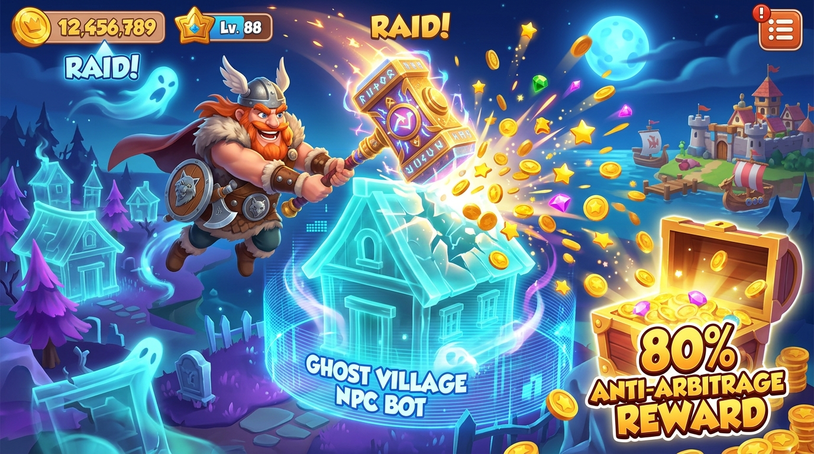

```mermaid
%%{init: {
  "theme": "base",
  "themeVariables": {
    "fontFamily": "Segoe UI, Assistant, sans-serif",
    "fontSize": "16px",
    "primaryColor": "#0f172a",
    "primaryTextColor": "#f8fafc",
    "primaryBorderColor": "#38bdf8",
    "lineColor": "#38bdf8",
    "secondaryColor": "#1e293b",
    "tertiaryColor": "#1e293b",
    "edgeLabelBackground": "#0f172a",
    "nodeBorder": "#38bdf8",
    "clusterBkg": "#0b1120",
    "clusterBorder": "#38bdf8"
  },
  "flowchart": { "curve": "basis", "nodeSpacing": 30, "rankSpacing": 35, "padding": 15 },
  "sequence": { "actorMargin": 30, "messageMargin": 30 },
  "state": { "nodeSpacing": 30, "rankSpacing": 35, "titleTopMargin": 15 }
}}%%
flowchart TD

    subgraph CORE ["🛡️ <b>עקרון אבטחה מחייב: הלקוח אינו מקור אמת (Zero-Trust Client)</b><br/><span style='font-size:24px;color:#94a3b8;'>מצב אופליין מציג פעולות מוגבלות בלבד | השרת בלבד מאשר תוצאה סופית | כל נכס כלכלי מחויב באימות כפול וב-Idempotency</span>"]
        direction LR

        subgraph COL_A ["🎲 <b>א. מודול ההגרלה ומכסת סשן חתומה</b>"]
            direction TB
            A1["🎟️ <b>Lease Token חתום</b><br/><br/><span style='font-size:22px;color:#cbd5e1;'>• חתימת Ed25519 / JWT אסימטרי עם KMS<br/>• תקף עד 100 פעולות או 12 שעות בלבד</span>"]
            A2["🔒 <b>תוצאות אקראיות מאושרות מראש</b><br/><br/><span style='font-size:22px;color:#cbd5e1;'>• רצף תוצאות חתום מראש או Commit/Reveal<br/>• אפס שליחת Server Seed סודי ללקוח</span>"]
            A3["⛓️ <b>שרשרת גיבוב בלתי ניתנת לזיוף</b><br/><br/><span style='font-size:21px;color:#38bdf8;'>Hash_n = SHA-256(Hash_n-1 ∥ Action ∥ Time ∥ Nonce)</span><br/><br/><span style='font-size:22px;color:#f87171;'>עריכת זיכרון שוברת שרשרת ופוסלת סשן</span>"]
        end

        subgraph COL_B ["👻 <b>ב. יריבי דמה (Ghost Village Cache)</b>"]
            direction TB
            B1["🤖 <b>5 כפרי רפאים מובנים</b><br/><br/><span style='font-size:22px;color:#cbd5e1;'>• מאגר בוטים שנשלח מראש בסנכרון האחרון<br/>• מאגרי מטבעות מבוקרים ומנוהלים מראש</span>"]
            B2["🎯 <b>ניתוב בטוח של Raid / Attack</b><br/><br/><span style='font-size:22px;color:#cbd5e1;'>• פעולות התקפה מנותבות אך ורק לבוטים<br/>• אפס פגיעה, קונפליקטים או נזק לשחקנים חיים</span>"]
        end

        subgraph COL_C ["📦 <b>ג. כספת מושהית (Escrow Vault & IAP)</b>"]
            direction TB
            C1["🔐 <b>Offline Escrow Vault</b><br/><br/><span style='font-size:22px;color:#cbd5e1;'>• מטבעות, קלפים ומגנים אינם נרשמים ל-Ledger<br/>• צבירה מקומית מוצפנת ב-SQLCipher AES-256</span>"]
            C2["💳 <b>Offline IAP (לא חלק מ-MVP)</b><br/><br/><span style='font-size:22px;color:#cbd5e1;'>• שמירת Intent בלבד (אפס נכסים לפני אישור)<br/>• כפוף לאישור Legal, ניסוי נפרד ו-Kill Switch</span>"]
        end

        COL_A ~~~ COL_B ~~~ COL_C
    end

    %% מלבן ראשי רחב ועמוק
    style CORE fill:#090d16,stroke:#38bdf8,stroke-width:4px,color:#38bdf8
    style COL_A fill:#0b1120,stroke:#10b981,stroke-width:3px,color:#34d399
    style COL_B fill:#0b1120,stroke:#6366f1,stroke-width:3px,color:#818cf8
    style COL_C fill:#0b1120,stroke:#f59e0b,stroke-width:3px,color:#fbbf24

    %% כרטיסים פנימיים מוגדלים ומרווחים
    style A1 fill:#0f172a,stroke:#334155,stroke-width:2px,color:#f8fafc
    style A2 fill:#0f172a,stroke:#334155,stroke-width:2px,color:#f8fafc
    style A3 fill:#0f172a,stroke:#38bdf8,stroke-width:2px,color:#f8fafc

    style B1 fill:#0f172a,stroke:#334155,stroke-width:2px,color:#f8fafc
    style B2 fill:#0f172a,stroke:#334155,stroke-width:2px,color:#f8fafc

    style C1 fill:#0f172a,stroke:#334155,stroke-width:2px,color:#f8fafc
    style C2 fill:#0f172a,stroke:#e11d48,stroke-width:2px,color:#f8fafc
```

<!-- מקור: Master_PRD.md | פרק 7 מתוך 25 -->

> **שם הפרק:** דרישות פונקציונליות וארכיטקטורת Leased Session (MoSCoW)

> ניווט: [פרק 06](<06 - חוויית משתמש (UX & Micro-Copy Strategy).md>) | [README](README.md) | [פרק 08](<08 - מודול LiveOps ופרוטוקול אירועים חיים באופליין (LiveOps & Tournament Grace Protocol).md>)

## 7. דרישות פונקציונליות וארכיטקטורת Leased Session (MoSCoW)

- המסגרת: Must/Should/Could מגדירה מה חייב להיכנס ל-MVP ומה נשאר להמשך.
- אבן יסוד: Zero-Trust Client עם מכסה חתומה, ghosts ו-escrow מבודד.

```mermaid
%%{init: {
  "theme": "base",
  "themeVariables": {
    "fontFamily": "Segoe UI, Assistant, sans-serif",
    "fontSize": "16px",
    "primaryColor": "#0f172a",
    "primaryTextColor": "#f8fafc",
    "primaryBorderColor": "#38bdf8",
    "lineColor": "#38bdf8",
    "secondaryColor": "#1e293b",
    "tertiaryColor": "#1e293b",
    "edgeLabelBackground": "#0f172a",
    "nodeBorder": "#38bdf8",
    "clusterBkg": "#0b1120",
    "clusterBorder": "#38bdf8"
  },
  "flowchart": { "curve": "basis", "nodeSpacing": 30, "rankSpacing": 35, "padding": 15 },
  "sequence": { "actorMargin": 30, "messageMargin": 30 },
  "state": { "nodeSpacing": 30, "rankSpacing": 35, "titleTopMargin": 15 }
}}%%
flowchart LR

    subgraph Must ["🔴 MUST HAVE (בסיס קריטי)"]
        direction TB
        M1["⏱️ <b>FR-OFF-01: חכירת סשן מוגבלת</b><br/><span style='font-size:16px;color:#475569;'>Capped Budget: 100 Spins / 12h</span>"]
        M2["🔐 <b>FR-OFF-02: שרשור קריפטוגרפי</b><br/><span style='font-size:16px;color:#475569;'>Hash-Chain Log למניעת זיופים</span>"]
        M3["👻 <b>FR-OFF-03: כפרי רפאים</b><br/><span style='font-size:16px;color:#475569;'>Ghost Village NPCs ל-PvP מנותק</span>"]
        M4["📦 <b>FR-OFF-04: כספת אופליין מקומית</b><br/><span style='font-size:16px;color:#475569;'>Offline Escrow Storage</span>"]
    end

    subgraph Should ["🟡 SHOULD HAVE (שכבת מונטיזציה)"]
        direction TB
        S1["💳 <b>FR-MON-01: תור רכישות מושהה</b><br/><span style='font-size:16px;color:#475569;'>Offline IAP Queue לסנכרון</span>"]
        S2["✨ <b>FR-MON-02: אנימציית פתיחת כספת</b><br/><span style='font-size:16px;color:#475569;'>טריגר מונטיזציה בחזרת הרשת</span>"]
        S3["🔒 <b>FR-OPS-01: נעילת מכשיר יחיד</b><br/><span style='font-size:16px;color:#475569;'>Single-Device Token Lock</span>"]
    end

    subgraph Could ["🔵 COULD HAVE (שיפורי עתיד)"]
        direction TB
        C1["✈️ <b>FR-FUT-01: סנכרון P2P מקומי</b><br/><span style='font-size:16px;color:#475569;'>משחק בטיסות בין שחקנים סמוכים</span>"]
        C2["🎬 <b>FR-FUT-02: קאש וידאו מקומי</b><br/><span style='font-size:16px;color:#475569;'>Rewarded Video Ads באופליין</span>"]
    end

    %% חצים להדגשת התקדמות
    Must ==> Should ==> Could

    %% סגנונות עמודות
    style Must fill:#fef2f2,stroke:#ef4444,stroke-width:3px,color:#991b1b
    style Should fill:#fffbeb,stroke:#f59e0b,stroke-width:3px,color:#92400e
    style Could fill:#eff6ff,stroke:#3b82f6,stroke-width:3px,color:#1e40af

    %% סגנונות כרטיסים
    style M1 fill:#ffffff,stroke:#fca5a5,stroke-width:2px,color:#0f172a
    style M2 fill:#ffffff,stroke:#fca5a5,stroke-width:2px,color:#0f172a
    style M3 fill:#ffffff,stroke:#fca5a5,stroke-width:2px,color:#0f172a
    style M4 fill:#ffffff,stroke:#fca5a5,stroke-width:2px,color:#0f172a

    style S1 fill:#ffffff,stroke:#fcd34d,stroke-width:2px,color:#0f172a
    style S2 fill:#ffffff,stroke:#fcd34d,stroke-width:2px,color:#0f172a
    style S3 fill:#ffffff,stroke:#fcd34d,stroke-width:2px,color:#0f172a

    style C1 fill:#ffffff,stroke:#93c5fd,stroke-width:2px,color:#0f172a
    style C2 fill:#ffffff,stroke:#93c5fd,stroke-width:2px,color:#0f172a
```

### 7.1 סיפורי משתמש (User Stories) ותנאי קבלה (Acceptance Criteria)

- מוצג כאן יישור קו בין ערך לשחקן, תנאי QA וקדימות מוצרית.

📖 להרחבה - פרטים טכניים מלאים

| User Story (בתור שחקן, אני רוצה... כדי ש...) | Acceptance Criteria (תנאי קבלה ל-QA) | סטטוס |
| :--- | :--- | :--- |
| **US1:** בתור שחקן, אני רוצה שהמשחק יאפשר לי לסובב את המכונה גם כשאני מאבד קליטה, כדי שלא איאלץ לנטוש באמצע המשחק. | 1. כאשר החיבור אובד (Timeout > 3s), הלקוח עובר ל-Offline Mode. 2. אינדיקטור האופליין מופיע מעל כפתור הספין. 3. כפתור הספין נשאר פעיל כל עוד יש יתרה למכסה. | MUST |
| **US2:** בתור שחקן באופליין, אני רוצה שהכפר שלי יהיה מוגן, כדי שאחרים לא יוכלו לשדוד אותי בזמן שאני מנותק. | 1. השחקן מוסר ממערכת ה-Matchmaking החיה של השרת. 2. אף שחקן אחר לא יכול לתקוף (Attack/Raid) את הכפר שלו במקביל. | MUST |
| **US3:** בתור שחקן שחזר לאונליין, אני רוצה לראות את כל הזכיות שלי מצטברות בבת אחת, כדי להרגיש סיפוק גדול. | 1. מיד עם זיהוי רשת (Ping 200 OK), מופעלת אנימציית "פתיחת הכספת". 2. המטבעות שהרוויח באופליין מתווספים ליתרה הכללית עם אפקט וויזואלי. | SHOULD |
| **US4:** בתור מנהל מערכת, אני רוצה להגן על המוצר מפני ניסיונות זיוף, כדי שהכלכלה לא תיהרס. | 1. כל ספין מקבל חתימה קריפטוגרפית (Hash-Chain) בשרת. 2. בחיבור מחדש, השרת מחשב את החתימות בסדר כרונולוגי ופוסל סשן חריג (Replay Validation). | MUST |

---

### 7.2 פירוט הדרישות ההנדסיות

- הדרישות נשענות על שלושה צירים: מכסת סשן חתומה, יריבי דמה וכספת מושהית.
- כל החלטה הנדסית נשמרת תחת עקרון של אפס אמון בלקוח.
- תת-סעיף א: מודול ההגרלה ומכסת סשן חתומה.
- תת-סעיף ב: החלפת PvP חי ביריבי דמה (Ghost Village Cache).
- תת-סעיף ג: כספת מושהית ורכישות Offline IAP.
---

> 🛡️ **עקרון אבטחה מחייב: הלקוח אינו מקור אמת (Zero-Trust Client)**  
> מצב Offline רשאי להציג ולבצע פעולות מוגבלות בלבד; השרת מאשר את התוצאה הסופית, וכל נכס כלכלי מחויב ב-Idempotency ובאימות כפול.
---

---

<b>❇️לחץ כאן לצפייה בתוכן המלא❇️</b>

### א. מודול ההגרלה ומכסת סשן חתומה (Capped Pre-Signed Budget)
* **כרטיס סשן חתום (Lease Token):** בכל התחברות מוצלחת לרשת, השרת מנפיק Token חתום ב-Ed25519 (או JWT אסימטרי עם מפתח KMS מנוהל) המגדיר מכסה מדורגת של **50 ספינים בסיס (MVP) ועד 100 ספינים לשחקני VIP וכפרים מתקדמים**, עם תוקף מקסימלי של **12 שעות**.
* **תוצאות אקראיות מאושרות מראש (Cryptographic Commitment):** השרת מייצר מחויבות קריפטוגרפית (`outcome_commitment = SHA256(server_seed || device_nonce)`). הסוד (`server_seed`) לעולם אינו נשלח ללקוח, מה שמונע לחלוטין הנדסה לאחור של תוצאות הספינים.
* **שרשרת גיבוב בלתי ניתנת לזיוף (Hash-Chain Action Log):**
  $$\text{Hash}_n = \text{SHA-256}(\text{Hash}_{n-1} \parallel \text{Action}_n \parallel \text{Timestamp}_n \parallel \text{Nonce}_n)$$
  *כל ניסיון עריכת זיכרון (Memory Injection via GameGuardian/Frida) שובר את השרשרת, והסשן נפסל מיידית בשרת בעת ה-Replay.*

#### מכונת המצבים של ה-Lease (Lease Lifecycle State Machine)

| מצב (State) | תיאור וטריגר כניסה | פעולות מותרות | טריגר מעבר למצב הבא |
| :--- | :--- | :--- | :--- |
| `IDLE_ONLINE` | מכשיר מחובר לרשת, משחק מקוון רגיל | ספינים רגילים מול שרת חי, רכישות IAP, צ'אט וקלפים | אובדן קישוריות רשת ➔ מעבר ל-`LEASE_ACTIVE` |
| `LEASE_ACTIVE` | אופליין פעיל; הלקוח צורך מתוך מכסת ה-Lease החתומה | ספינים מקומיים (עד המכסה), מגנים, תקיפת כפרי בוטים | ניצול מלא של המכסה ➔ `QUOTA_DEPLETED` פקיעת 12 שעות ➔ `LEASE_EXPIRED` חזרת רשת ➔ `REPLAY_QUEUED` |
| `QUOTA_DEPLETED` | המכסה (50/100) נוצלה במלואה | צפייה באלבומי קלפים, שדרוג מבנים באמצעות מטבעות שנאגרו | חזרת רשת ➔ `REPLAY_QUEUED` |
| `LEASE_EXPIRED` | חלפו 12 שעות ממועד הנפקת ה-Token | הצגת מסך Soft-Block מכבד | חזרת רשת ➔ `REPLAY_QUEUED` |
| `REPLAY_QUEUED` | המכשיר מזהה קישוריות רשת מחודשת | שליחת Action Log לשרת עם Exponential Backoff | אימות מוצלח ➔ `RECONCILED` אימות נכשל ➔ `AUDIT_REJECTED` |
| `RECONCILED` | שרת ה-Replay אימת את כל ה-Hashes | פתיחת כספת חגיגית, הפקדת המטבעות לחשבון הראשי | חזרה ל-`IDLE_ONLINE` |
| `AUDIT_REJECTED` | שבירת שרשרת גיבוב או זיוף תוצאה | השמטת תוצאות הסשן המזויף, רישום התרעת אבטחה ב-SIEM | התראה לשחקן וחזרה ל-`IDLE_ONLINE` |

---

### ב. החלפת PvP חי ביריבי דמה (Ghost Village Cache)

*מכניקת Raid מנותקת: תקיפת בוט דמה עם חלוקת שלל מותאמת אישית*

*קונספט כפר רפאים: נכסים גראפיים מוקלטים המדמים שחקן אמיתי*

* **אלגוריתם בחירת 5 כפרי רפאים מותאמים:**
  1. בעת הנפקת ה-Lease, השרת שולף ממאגר ה-NPCs חמישה כפרים שערכם הכלכלי תואם את רמת הכפר של השחקן:
     $$\text{Village\_Net\_Worth}_{\text{bot}} = \text{Player\_Village\_Value} \times (1 \pm 0.10)$$
  2. לכל בוט מוגדרים 3 חורי חפירה ל-Raid, עם הסתברות חלוקת שלל קבועה מראש ומאומתת ב-Commitment.
* **בידוד רשת מוחלט:** פעולות Raid או Attack באופליין מנותבות אך ורק לכפרי רפאים אלו, מה שמבטיח **אפס התנגשויות (Zero Race Conditions)** ואפס מנעולי מסד נתונים מול שחקנים חיים.
* **יישוב תקיפות פסיביות (Passive Defense Reconciliation):** אם שחקן חי אחר תקף את כפר המשתמש בזמן שהאחרון שהה באופליין – ברגע החיבור מחדש, השרת מחשב את מאזן המגנים: כל מגן שהשחקן זכה בו באופליין מופעל רטרואקטיבית להגנה על הכפר.

---

### ג. כספת מושהית (Offline Escrow Vault) ורכישות Offline IAP
* **הצפנה ואחסון מבודד בלקוח:** כל המטבעות, הקלפים והמגנים שנאספים באופליין נאגרים במסד נתונים מקומי מוצפן (**SQLCipher AES-256**) במחיצה מבודדת של האפליקציה, עם מפתח הצפנה דינמי הנגזר מה-Keychain / KeyStore של המכשיר.
* **מדיניות Offline IAP מחמירה:** בגרסת ה-MVP, רכישות מנותקות נשמרות אך ורק כ-Purchase Intent בתוך ה-Deferred Queue. **אפס ספינים מסופקים ללא אישור StoreKit 2 / Google Play Billing חתום ומאומת בשרת.**

---

