<!-- מקור: Master_PRD.md | פרק 13 מתוך 25 -->

> **שם הפרק:** ערך עסקי ורווחי: טווח מיידי מול טווח בינוני-ארוך (Business Value & Two-Horizon ROI)

> ניווט: [פרק 12](<12 - תאימות רגולטורית לחנויות (Apple StoreKit 2 & Google Play Billing).md>) | [README](README.md) | [פרק 14](<14 - חזון שיתופי פעולה מסחריים (In-Flight Airline Partnerships & Zero-CAC Acquisition).md>)

## 13. ערך עסקי ורווחי: טווח מיידי מול טווח בינוני-ארוך (Business Value & Two-Horizon ROI)

- כל האומדנים בפרק הם היפותזות עבודה המחייבות baseline וניסוי מבוקר.
- יעד ההנהלה המוצע: ROI עד 90 יום, בכפוף ל-net contribution מאומת.

> [!TIP]
> **הבהרת Business Case:** המספרים להלן הם היפותזות עבודה בלבד. יש לאמת אותם באמצעות baseline, ניסוי מבוקר וניתוח incremental net contribution לפני החלטת rollout.

```mermaid
---
title: "13. ערך עסקי ורווחי: טווח מיידי מול טווח בינוני-ארוך (Business Value & Two-Horizon ROI)"
---
%%{init: {
  "theme": "base",
  "themeVariables": {
    "fontFamily": "Segoe UI, Assistant, sans-serif",
    "fontSize": "16px",
    "primaryColor": "#0f172a",
    "primaryTextColor": "#f8fafc",
    "primaryBorderColor": "#38bdf8",
    "lineColor": "#38bdf8",
    "secondaryColor": "#1e293b",
    "tertiaryColor": "#1e293b",
    "edgeLabelBackground": "#0f172a",
    "nodeBorder": "#38bdf8",
    "clusterBkg": "#0b1120",
    "clusterBorder": "#38bdf8"
  },
  "flowchart": { "curve": "basis", "nodeSpacing": 30, "rankSpacing": 35, "padding": 15 },
  "sequence": { "actorMargin": 30, "messageMargin": 30 },
  "state": { "nodeSpacing": 30, "rankSpacing": 35, "titleTopMargin": 15 }
}}%%
graph LR
    subgraph Horizon1["אופק 1: טווח מיידי (Day 1 עד Q1)"]
        direction TB
        H1_1["החזר השקעה מבוקר: יעד עד 90 יום<br/>(Target Payback <= 90 Days)"]
        H1_2["עצירת נטישה בהודו, ברזיל ורכבות תחתית<br/>חיסכון מוערך של $400K-$800K בחודש ב-UA"]
        H1_3["הכנסות In-Flight חדשות מסליקה מושהית<br/>תוספת של $1.2M-$2.5M בחודש ב-IAP"]
        H1_4["הפחתת עומסי Polling בשרת<br/>חיסכון של עד $40K בחודש בעלויות ענן"]
    end

    subgraph Horizon2["אופק 2: טווח בינוני-ארוך (שנה 1 עד 3 שנים)"]
        direction TB
        H2_1["האצת רווח שנתית מתמשכת<br/>+$18M עד +$36M תוספת שנתית לרווח הנקי"]
        H2_2["הרחבת LTV של שחקני Whale<br/>רציפות משחק במחלקות עסקים ובטיסות טרנס-אטלנטיות"]
        H2_3["Cross-Portfolio Synergy<br/>הטמעת ה-SDK ב-Family Island ו-Zen Match"]
        H2_4["שליטה בקטגוריית ASO<br/>#1 Offline Casual Game בחנויות האפליקציות"]
    end

    Horizon1 ==> Horizon2

    style Horizon1 fill:#0f172a,stroke:#34d399,stroke-width:2px,color:#fff
    style Horizon2 fill:#0f172a,stroke:#fbbf24,stroke-width:2px,color:#fff
    style H1_1 fill:#14532d,stroke:#4ade80,stroke-width:1px,color:#fff
    style H2_1 fill:#78350f,stroke:#f59e0b,stroke-width:1px,color:#fff
```

---

### 13.1 מודל פיננסי תלת-תרחישי (3-Scenario Sensitivity Model)

כל התחזיות הפיננסיות מבוססות על גישה שמרנית ומחושבות נטו לאחר ניכוי עמלות פלטפורמה (30% לחנויות), עלויות תשתית ענן, ותקורה תפעולית:

| פרמטר פיננסי ומבצעי | תרחיש שמרני (Conservative) | תרחיש בסיס (Base Case) | תרחיש אופטימי (Aggressive) |
| :--- | :---: | :---: | :---: |
| **שיפור ב-D1/D7 Retention (שווקי יעד)** | **+0.4%** | **+0.8%** | **+1.5%** |
| **סך הכנסות ברוטו חודשיות חדשות (IAP)** | **$650,000** | **$1,650,000** | **$3,200,000** |
| **עמלות חנויות אפל וגוגל (30%)** | ($195,000) | ($495,000) | ($960,000) |
| **עלויות תשתית ענן ותעבורה (AWS/GCP)** | ($15,000) | ($25,000) | ($45,000) |
| **תקציב תמיכה, Fraud ופיצויים (1%)** | ($6,500) | ($16,500) | ($32,000) |
| **תרומה נקייה חודשית לרווח (Net Contribution)** | **+$433,500** | **+$1,113,500** | **+$2,163,000** |
| **תרומה נקייה שנתית מנורמלת (Run Rate)** | **+$5.2M / שנה** | **+$13.3M / שנה** | **+$25.9M / שנה** |

---

### 13.2 מתמטיקת החזר ההשקעה (Payback Period Formula)

* **אומדן עלות הפיתוח הכוללת (CapEx & OpEx):**
  - צוות ייעודי: 1 Tech Lead + 2 Client (Unity) + 1 Backend (Go) + 1 QA Automation + 1 PM (50%) + 1 Designer (50%).
  - משך פיתוח ל-MVP: 6 שבועות.
  - סך עלות פיתוח ובדיקות: **כ-$180,000**.
* **נוסחת החזר ההשקעה הרשמית:**
  $$\text{Payback Days} = \frac{\text{Total R\&D Investment}}{\text{Daily Incremental Net Contribution}}$$
* **תוצאות החישוב לפי תרחישים:**
  - **בתרחיש שמרני:** החזר השקעה מלא תוך **13 ימים** מתחילת ההשקה המלאה.
  - **בתרחיש בסיס:** החזר השקעה תוך **5 ימים בלבד**.
* **הצהרת הנהלה מחייבת:** כדי להישאר נאמנים לזהירות תקציבית, יעד ההחזר הרשמי המוצג לדירקטוריון מוגדר כ-**עד 90 יום**, מה שמותיר מרווח ביטחון אדיר לכל עיכוב או סטייה סטטיסטית.

---

