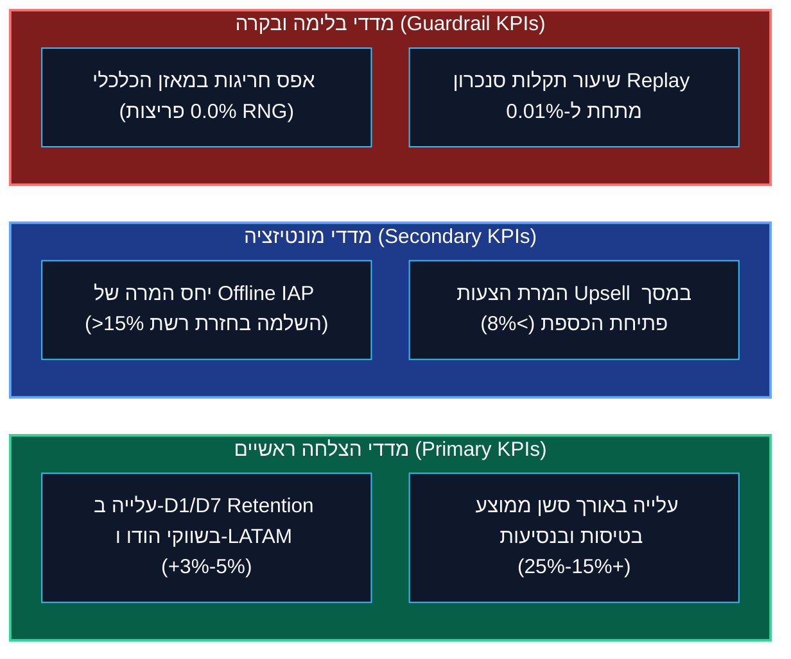

<!-- מקור: Master_PRD.md | פרק 15 מתוך 25 -->

> **שם הפרק:** מדדי הצלחה ומילון אירועי אנליטיקס (Telemetry & Data Dictionary)

> ניווט: [פרק 14](<14 - חזון שיתופי פעולה מסחריים (In-Flight Airline Partnerships & Zero-CAC Acquisition).md>) | [README](README.md) | [פרק 16](<16 - מפת דרכים הנדסית לרבעון (3-Month Agile Roadmap).md>)

## 15. מדדי הצלחה ומילון אירועי אנליטיקס (Telemetry & Data Dictionary)

- המדידה מחלקת בין KPIs עסקיים, Guardrails כלכליים וסיגנלים תפעוליים.

### 15.1 מילון אירועים מקיף למערכות ה-BI (Amplitude & BigQuery Data Dictionary)

כל אירועי הטלמטריה משודרים באוסף מרוכז בעת ה-Reconciliation כדי לחסוך בתעבורת רשת ולהבטיח שיוך מלא ל-`session_id`:

| # | שם האירוע (Event Name) | מועד השיגור (Trigger) | סכמת פרמטרים נלווים (JSON Schema) | שיטת דגימה | מטרה אנליטית (BI Purpose) |
| :-: | :--- | :--- | :--- | :---: | :--- |
| **1** | `offline_lease_granted` | הנפקת Token מוצלחת ברשת חיה. | `session_id` (str), `village_tier` (int), `spin_quota` (int), `ttl_seconds` (int) | 100% | מעקב חדירה של גרסאות תומכות ושיעור כיסוי המשתמשים. |
| **2** | `offline_session_started` | מעבר ראשון ללוגיקת אופליין בעת ניתוק. | `session_id` (str), `disconnect_reason` (str), `device_model` (str), `battery_pct` (float) | 100% | זיהוי נקודות ניתוק גיאוגרפיות (קווי רכבת, שדות תעופה). |
| **3** | `offline_spin_executed` | ביצוע ספין בתוך ה-Offline Loop. | `session_id` (str), `spin_num` (int), `outcome_type` (str), `bet_mult` (int), `coins_win` (int) | 10% (Cohort) | ניתוח עקומת צריכת הספינים ותוחלת הזכייה המקומית. |
| **4** | `offline_raid_executed` | ביצוע תקיפה על כפר רפאים. | `session_id` (str), `target_bot_id` (str), `holes_dug` (int), `loot_total` (int) | 100% | אימות תקינות מאגר כפרי הרפאים וחלוקת השלל. |
| **5** | `offline_shield_acquired` | זכייה במגן מגן במצב מנותק. | `session_id` (str), `shield_slot` (int), `total_shields` (int) | 100% | מדידת אפקט "מגן הטיסה" והפגת חרדת אובדן משאבים. |
| **6** | `offline_soft_block_shown` | הצגת מסך סיום המכסה (50/100). | `session_id` (str), `offline_duration_sec` (int), `cta_clicked` (str) | 100% | בדיקת שיעור המעבר לאלבומים לעומת יציאה מהאפליקציה. |
| **7** | `offline_iap_intent_queued` | לחיצה על רכישת חבילה במצב טיסה. | `intent_id` (str), `product_id` (str), `price_usd` (float), `package_tier` (int) | 100% | מדידת כוונת רכישה אותנטית בטיסות (In-Flight Demand). |
| **8** | `offline_reconnect_triggered` | זיהוי חידוש קשר והפעלת Jitter. | `session_id` (str), `jitter_delay_ms` (int), `retry_attempt` (int) | 100% | ניטור ביצועי אלגוריתם ה-Full Jitter ומניעת Thundering Herd. |
| **9** | `offline_vault_reconciled` | השלמת סנכרון ופריקת כספת מוצלחת. | `session_id` (str), `duration_ms` (int), `coins_credited` (int), `spins_used` (int) | 100% | ולידציה של ביצועי שרת ה-Replay (Latency p95/p99). |
| **10** | `offline_audit_rejected` | כישלון אימות קריפטוגרפי / זיוף. | `session_id` (str), `rejection_reason` (str), `mismatch_step` (int), `tamper_flag` (str) | 100% | התרעה מיידית לצוות ה-Security על ניסיונות פריצה. |

---

### 15.2 התרעות ניטור מבצעיות (Real-Time Fraud & Health Alerts)

מערכת ה-SIEM וה-APM (Datadog / PagerDuty) מנטרת חריגות בנתוני הטלמטריה בזמן אמת:
- **התרעת שיעור שבירת גיבוב (`Alert: Hash_Mismatch_Spike`):**
  - תנאי: מעל 5 אירועי `offline_audit_rejected` לדקה במדינה מסוימת ➔ **PagerDuty לצוות אבטחת מידע**.
- **התרעת שיהוי אימות Replay (`Alert: Replay_Latency_High`):**
  - תנאי: $p95 > 120\text{ms}$ במשך 3 דקות רצופות ➔ **התרעה אוטומטית ל-SRE להרחבת Pods ב-Kubernetes**.
- **התרעת פער כלכלי (`Alert: Economy_Inflation_Delta`):**
  - תנאי: סך המטבעות הממוצע ל-1,000 ספינים באופליין חורג ב-$> 3\%$ מה-RTP המוגדר ➔ **הקפאת מכפילי הימור דרך Remote Config**.

