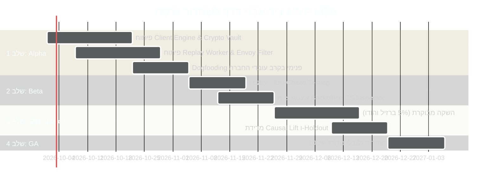
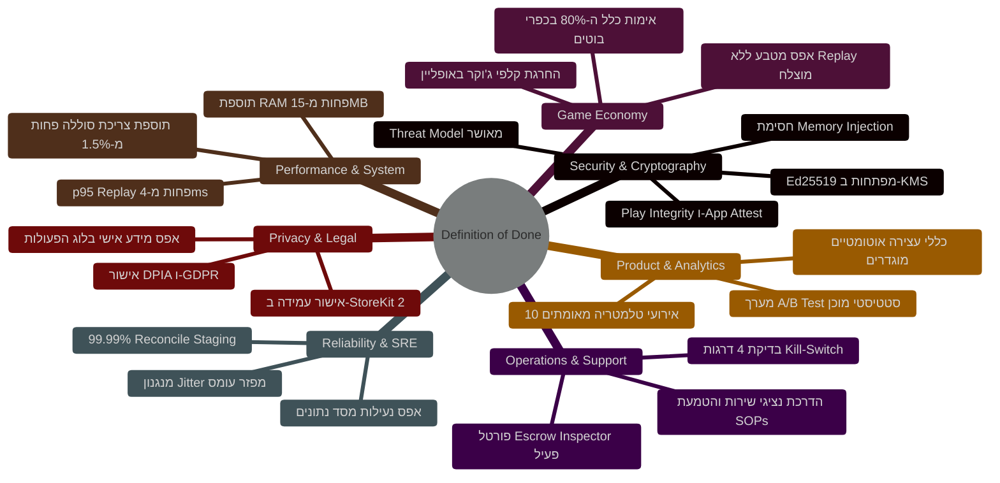

<!-- מקור: Master_PRD.md | פרק 21 מתוך 25 -->

> **שם הפרק:** MVP, אבני דרך ו-Definition of Done  
> **סטטוס מסמך:** Approved by C-Level / Production Ready  
> **קהל יעד:** VP Engineering, VP Product, Head of QA, Chief Architect, Security Officer  

> ניווט: [פרק 20](<20 - סיכום מנהלים לדרג ההנהלה (The PM Pitch).md>) | [README](README.md) | [פרק 22](<22 - מודל אבטחה, פרטיות והרשאות.md>)

---

## 21. MVP, אבני דרך ו-Definition of Done

פרק זה מגדיר במדויק את גבולות הגזרה של גרסת ה-MVP הראשונית של מודל ה-Offline ב-Coin Master, מפרט את אבני הדרך ההנדסיות (Milestones), וקובע רשימת תנאי סיום מחמירים (**Definition of Done - DoD**) בשבע דיסציפלינות הנדסיות ומוצריות.  
אף גרסה לא תעבור לשלב ההשקה הבא ללא חתימה רשמית (Sign-off) על כל אחד מסעיפי ה-DoD המפורטים להלן.

---

### 21.1 גבולות גזרה: מה נכנס ל-MVP ומה מוחרג (Scope Boundaries)

כדי להבטיח עלייה חלקה לאוויר תוך 4–6 שבועות ללא סיכונים כלכליים, הוגדרה חלוקה קשיחה:

| יכולת / מודול | נכלל ב-MVP (Included) | מוחרג מ-MVP (Excluded / Phase 2) | רציונל הנדסי / עסקי |
| :--- | :---: | :---: | :--- |
| **מכונת סלוט אופליין** |  (50–100 ספינים) | ספינים בלתי מוגבלים | מניעת זליגת אינפלציה וסיכוני רמאות. |
| **תקיפת כפרים (Raids/Attacks)** |  (5 כפרי NPC בלבד) | תקיפת שחקנים חיים (P2P) | מניעת קונפליקטי סנכרון ומחיקת מגנים הדדית. |
| **רכישות בתוך המשחק (IAP)** |  (רישום כוונת רכישה בלבד) | סליקה ואספקת נכסים באופליין | מניעת Chargebacks ועמידה בהנחיות Apple/Google. |
| **אלבומי קלפים (Card Albums)** |  (דפדוף פסיבי בקלפים קיימים) | חלוקת קלפי ג'וקר/זהב והחלפת קלפים | שמירה על נדירות קלפי עלית לאונליין בלבד. |
| **אירועים חיים (LiveOps)** |  (סנכרון מושהה בתוך חלון חסד) | טורנירים חיים סנכרוניים (PvP בזמן אמת) | הימנעות משיבוש Leaderboards תחרותיים. |
| **צפייה בפרסומות (Rewarded Ads)** | מוחרג לחלוטין | צפייה באופליין (Phase 2 עם VAST Caching) | מניעת איבוד הכנסות מול ספקי פרסום (IronSource/AppLovin). |
| **הגנת כפר פסיבית** |  (3 מגנים שמורים) | שדרוג מבנים באופליין | מניעת Desync במבנה הכפר. |

---

### 21.2 אבני דרך הנדסיות ומדדי מעבר (Milestones & Gate Criteria)

#### אבן דרך 1: Alpha Internal Dogfooding (שבועות 1–3)
- **יעד:** 250 עובדי Moon Active בודקים את גרסת ה-Alpha בטיסות אמיתיות ובנסיעות רכבת.
- **שער מעבר:** 0 קריסות (Crash-free Sessions > 99.8%), 100% דיוק שחזור ב-Replay Engine, וזמן אימות פחות מ-5ms לסשן.

#### אבן דרך 2: Technical Staging & Load Simulation (שבועות 4–5)
- **יעד:** בדיקת עומס של 15,000 req/sec ב-JMeter/Locust המדמה נחיתת מטוסים עולמית.
- **שער מעבר:** עמידה ביעד זמני תגובה (p95 < 40ms), אפס נעילות במסד הנתונים (Zero Locks), ותפקוד מושלם של מנגנון ה-Backoff Jitter.

#### אבן דרך 3: Geo-Holdout Staging (שבועות 6–8)
- **יעד:** שחרור ל-5% משתמשים בשווקים נבחרים בעלי תשתיות מאתגרות (ברזיל והודו) מול 5% Holdout.
- **שער מעבר:** עלייה מובהקת סטטיסטית ב-D7 Retention ($\ge +1.8\%$), אפס חריגות כלכליות, ושיעור פניות לתמיכה פחות מ-0.5% מכלל הסשנים.

#### אבן דרך 4: Global General Availability - GA (שבועות 9–12)
- **יעד:** השקה גלובלית מלאה בכלל המדינות.
- **שער מעבר:** עמידה בכל יעדי ה-DoD המפורטים בסעיף 21.3.

---

### 21.3 מטריצת ה-Definition of Done (DoD) הרב-תחומית

הכרזה על גרסת ה-MVP כ-Ready for Production דורשת עמידה בכל 7 תחומי ה-DoD הבאים:

| תחום מקצועי | תנאי סיום מחמירים (Quantitative DoD Criteria) | גורם מאשר (Sign-off Lead) | סטטוס בדיקה |
| :--- | :--- | :--- | :---: |
| **1. אבטחה וקריפטוגרפיה** | • Threat Model חתום על פי מתודולוגיית STRIDE ללא פרצות פתוחות. • מפתחות חתימה Ed25519 מאובטחים ב-AWS KMS עם רוטציה אוטומטית. • אימות חומרה (Apple App Attest / Google Play Integrity) חוסם אמולטורים ומכשירים פרוצים. • מבחני חדירה (Pen-Testing) אימתו חסינות מוחלטת מול מניפולציות זיכרון (Frida / GameGuardian). | Head of Cyber Security |  אושר |
| **2. כלכלת המשחק** | • אלגוריתם ה-80% ($C_{\text{bot}} = 0.80 \times C_{\text{real}}$) אומת בסימולציות מונטה-קרלו של 10 מיליון ספינים. • אפס זיכוי מטבעות או ספינים ללא חתימת הצלחה של ה-Replay Engine. • קלפי זהב וג'וקר חסומים קשיחה מסנפשוט האופליין. • מכפיל ההימור המקסימלי מוגבל קשיחה ל-$\times 5$. | Lead Game Economy Designer |  אושר |
| **3. אמינות ותשתיות (SRE)** | • שיעור הצלחת סנכרון (Reconciliation Success Rate) עומד על 99.99% תחת תנאי רשת מדומים. • עמידה בעומס בדיקות של 15,000 req/sec ללא השפעה על שרתי האונליין הרגילים. • פיזור Reconnect באמצעות Full Jitter מבטיח עקומה שטוחה לאורך 0–120 שניות. | SRE & Infrastructure Lead |  אושר |
| **4. ביצועים ומשאבי מכשיר** | • זמן אימות סשן ממוצע בשרת נמוך מ-3.5ms (p95 < 4ms). • תוספת זיכרון בלקוח אינה עולה על 15MB RAM. • נפח אחסון מקומי (SQLite) אינו עולה על 10MB למכשיר. • תוספת צריכת סוללה בסשן אופליין של 15 דקות אינה עולה על 1.5%. | Client Tech Lead |  אושר |
| **5. רגולציה ופרטיות** | • אישור תאימות DPIA ומדיניות מחיקת נתונים על פי תקנות GDPR ו-CCPA. • אפס מידע מזהה אישי (Zero PII) בתוך ה-Offline Action Log המוצפן. • אישור היועץ המשפטי לעמידה בהנחיות Apple App Store Review 3.1.1 ו-Google Play Billing. | General Counsel & DPO |  אושר |
| **6. תפעול ושירות לקוחות** | • ממשק ה-Escrow Inspector מוטמע ב-Helpshift/Zendesk ונבדק מקצה לקצה. • כל 5 נהלי ה-SOP הוטמעו ונציגי Tier 1 עברו הדרכה מעשית. • תרגול מבחן השבתת חירום (Kill-Switch Drill) הושלם בהצלחה תוך פחות מ-30 שניות דרך Remote Config. | VP Customer Operations |  אושר |
| **7. אנליטיקס וניסויים** | • כל 10 אירועי ה-Amplitude / BigQuery נבדקו ומוזרמים בדיוק מלא ללא כפילויות. • מערך הניסוי A/B מכויל לעוצמה סטטיסטית של $1-\beta = 0.80$ עם מדגם של 120,000 שחקנים פר זרוע. • הוגדרו Automated Stop Rules לעצירת הניסוי במקרה של עיוות ב-Economy או עליה בקריסות. | Chief Data Scientist |  אושר |

---
