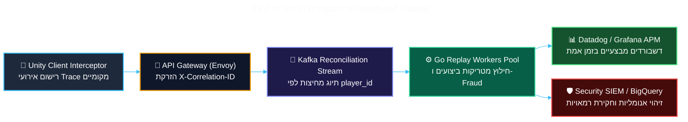

<!-- מקור: Master_PRD.md | פרק 24 מתוך 25 -->

> **שם הפרק:** מדידה, ניסויים ו-Observability

> ניווט: [פרק 23](<23 - חוזי API ו-Reconciliation.md>) | [README](README.md) | [פרק 25](<25 - מטריצת סיכונים ובעלות.md>)

## 24. מדידה, ניסויים ו-Observability

- החלטות rollout צריכות להישען על ניסוי מבוקר, guardrails תפעוליים וראות מלאה.
- תת-פרק 24.1: ניסוי מדורג עם metrics, guardrails ו-stop rules.
- תת-פרק 24.2: Observability עם correlation, dashboards ו-alerts.

### 24.1 מתודולוגיית ניסוי מבוקר (A/B Testing Framework)

השקת יכולת ה-Hybrid Offline Mode מתבצעת כניסוי מדעי מבוקר במטרה לאמת את ההיפותזות העסקיות תוך שמירה הרמטית על כלכלת המשחק:

#### 1. תכנון הניסוי ועוצמה סטטיסטית (Statistical Power & Sample Size)
- **היפותזת הניסוי ($H_1$):** מתן אפשרות למשחק רציף באופליין ישפר את ה-D1/D7 Retention בקרב שחקנים החווים ניתוקי רשת בלפחות **+0.8%**, ויפחית את שיעור הנטישה היומי ב-**15%**.
- **פרמטרי מובהקות סטטיסטית:**
  - רמת מובהקות ($\alpha$): **$0.05$** (95% Confidence Level).
  - עוצמה סטטיסטית ($1-\beta$): **$0.80$** (80% Statistical Power).
  - Minimum Detectable Effect (MDE): **$0.4\%$ על D1 Retention**.
  - **גודל מדגם נדרש:** כ-**120,000 שחקנים בכל קבוצה** (Control מול Treatment), המנוטרים לאורך תקופת ניסוי של 14 יום רצופים.

#### 2. חלוקת קוהורטים (Cohort Segmentation)
- **Control Group (50%):** חוויית המשחק הקיימת – בעת ניתוק מופיע מסך "No Internet Connection" קלאסי.
- **Treatment Group (50%):** מעבר שקוף ל-Hybrid Offline Mode עם מכסה חתומה וכפרי רפאים.
- **סגמנטציה גיאוגרפית ממוקדת:** קבוצות הבדיקה יופעלו במקביל בשלושה שווקים בעלי מאפיינים שונים: הודו (רשת סלולרית תנודתית), גרמניה (נסיעות רכבת תכופות), וברזיל (חדירת מכשירי Low/Mid-End).

#### 3. מטריצות מדדים וכללי עצירה אוטומטיים (Guardrails & Automated Stop Rules)

| סוג מדד | שם המדד | יעד הצלחה בניסוי | תנאי עצירת חירום אוטומטית (Stop Rule) |
| :--- | :--- | :--- | :--- |
| **Primary KPI** | **Session Continuity Rate** | עלייה של **+25%** בהשלמת סשנים שנקטעו | ירידה במעורבות כללית של הקבוצה ($p < 0.05$) |
| **Secondary KPI** | **D1 / D7 Retention** | עלייה מובהקת של **+0.8% עד +1.5%** | אפס שיפור סטטיסטי לאחר 21 ימי ניסוי |
| **Monetization** | **Post-Reconnect ARPDAU** | עלייה של **+4% עד +8%** ברכישות לאחר נחיתה | קניבליזציה על רכישות האונליין הרגילות ($> 2\%$) |
| **Guardrail: אבטחה** | **Hash Chain Anomaly Rate** | **0.00%** שבירת גיבובים בלתי מוסברת | חריגה מעל **0.05%** ➔ **הקפאת ניסוי מיידית** |
| **Guardrail: כלכלה** | **Total Coins Inflow Delta** | סטייה של פחות מ-**$\pm 1\%$** מה-RTP המתוכנן | סטייה כלפי מעלה מעל **+2.0%** ➔ **השבתה מיידית** |
| **Guardrail: יציבות** | **Crash-Free Sessions** | שמירה על **99.9%** ללא קריסות | עלייה של מעל **+0.05%** בקריסות ➔ **Rollback** |

---

### 24.2 ארכיטקטורת ניטור וראות מבצעית (Observability & SRE Dashboards)

כל שירות במערך מייצר מזהי `trace_id` ו-`correlation_id` הזורמים לאורך כל מחזור החיים של הסשן.

#### דשבורדים ייעודיים ב-Datadog:
1. **Executive Product Dashboard:** שיעור משתמשים במצב מנותק בזמן אמת, סך מטבעות שחולצו מכספות, ואחוז המרת מבצעי Reconnect.
2. **SRE Infrastructure Dashboard:** עומס תורי Kafka, זמני אימות Replay (p50, p95, p99), צריכת CPU/Memory של עובדי ה-Go, וקצב שגיאות HTTP.
3. **InfoSec & Economy Dashboard:** התפלגות קודי שגיאה של מנוע האימות, מעקב אחר ניסיונות זיוף Hash, וניתוח סטיית RTP לפי רמות כפרים.

---

