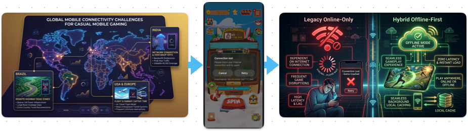
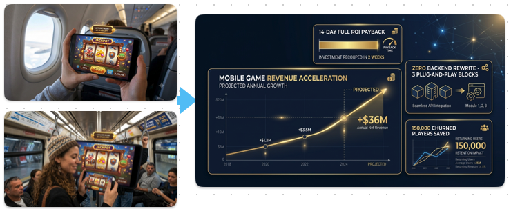
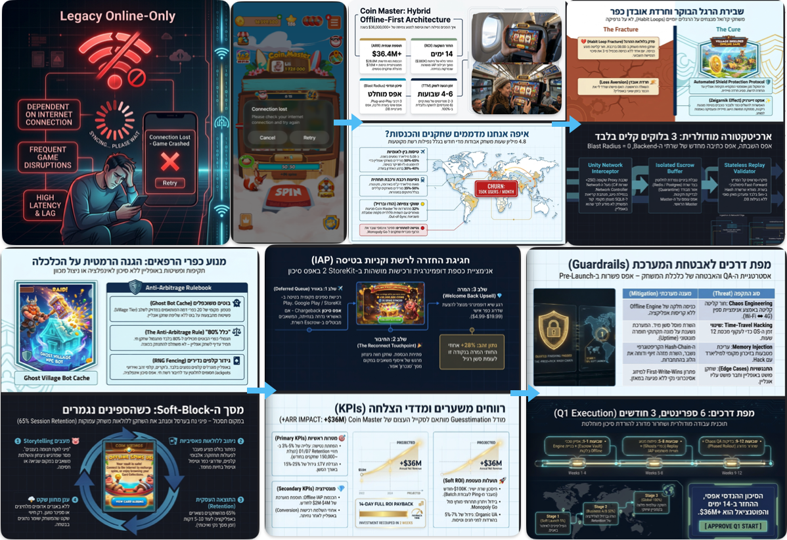

<!-- _class: lead -->
<!-- _paginate: false -->
# Coin Master: Hybrid Offline Architecture
### הפיכת 4.2 מיליון שעות ניתוק יומיות למנוע צמיחה, שימור והכנסות
**Moon Active Executive Strategic Deck • 2026**
*Presented to the Board of Directors & C-Level Committee*



<!--
_notes:
להתחיל בנקודת הכאב העסקית. 4.2 מיליון שעות שחקן מתאדות בכל יום בגלל 'המסך האדום'. המטרה שלנו היא לא רק פיצ'ר טכנולוגי, אלא מנוע צמיחה ושימור אסטרטגי שיגן על המעמד שלנו כמשחק הקז'ואל המוביל בעולם.
-->

---

## 02. התפלגות הורדות עולמית מול שטחי ניתוק רשת

<span class="tag">פילוח שוק ואתגרי קליטה</span>

- **4.2M+ שעות יומיות אבודות:** שחקנים נתקלים ב"מסך שגיאה אדום" בטיסות, רכבות תחתיות ובנסיעות.
- **הודו (24% מההורדות):** שוק הנפח המוביל סובל מתנודות רשת כבדות ועומסים מקומיים.
- **ברזיל (12% מההורדות):** שוק קז'ואל מרכזי עם אובדן קליטה תדיר בכבישים ובמרכזי קניות.
- **ארה"ב (10% מההורדות, 60% מההכנסות):** טיסות עסקים, רכבות תחתיות (NYC/Chicago).
- **עלות חוסר הפעולה (Cost of Inaction):** שחקן שאינו יכול לשחק עובר למתחרים (Subway Surfers, Candy Crush).


<!--
_notes:
שים לב להודו (24%) וברזיל (12%). שווקים אלו הם מנוע ה-Volume שלנו, אך הם סובלים מהפסקות רשת מרובות. בארה"ב מדובר בשחקני VIP שטסים או נוסעים ברכבות.
-->

---

## 03. החפיר הבלתי-עביר מול Monopoly GO!

<span class="tag">יתרון תחרותי וחפיר אסטרטגי</span>

| ממד השוואה | Monopoly GO! (Scopely) | Coin Master (Moon Active) |
| :--- | :--- | :--- |
| **מנוע משחק** | לוח סנכרוני מרובה-משתתפים (Multiplayer Board) | **מכונת סלוט + כפרי רפאים (Slot & Ghost Villages)** |
| **תלות ברשת** | תלות מלאה בשרת חי בזמן אמת | **יכולת פריסה מבודדת (Deterministic Offline)** |
| **מעבר לאופליין** | כמעט בלתי אפשרי ללא שכתוב כללי של המנוע | **התאמה טבעית ומיידית למודל Escrow חתום** |
| **חוויית טיסה** | ננעל ומציג שגיאת רשת | **רציפות משחק מלאה, בטוחה ומתגמלת** |

> **החפיר האסטרטגי:** אנו הופכים את Coin Master למשחק הקז'ואל המוביל היחיד בעולם שאינו כבול לרשת!

<!--
_notes:
זהו ה-Moat שלנו מול Monopoly GO! של Scopely. הם תקועים עם משחק לוח סינכרוני בזמן אמת ולא מסוגלים לעבור לאופליין.
-->

---

## 04. מודל שלושת הבלוקים: פשוט, מודולרי ומאובטח

<span class="tag">ארכיטקטורה ופשטות מימוש</span>

```
┌─────────────────────────┐     ┌─────────────────────────┐     ┌─────────────────────────┐
│   1. Client Crypto      │ ──> │   2. Leased Session     │ ──> │   3. Server Fast        │
│        Vault            │     │        Budget           │     │     Forward Replay      │
│  • SQLCipher AES-256    │     │  • Ed25519 Token ב-KMS  │     │  • אימות ב-4ms במעבד    │
│  • Hash-Chain SHA-256   │     │  • 50 בסיס / 100 ל-VIP  │     │  • אפס נעילות DB        │
│  • זיכרון < 15MB RAM    │     │  • תוקף קשיח 12 שעות    │     │  • 15k אימותים בשנייה   │
└─────────────────────────┘     └─────────────────────────┘     └─────────────────────────┘
```

- **אינטגרציית Plug-and-Play נקייה:** אפס שינויים במנוע המשחק המקוון הקיים.
- **אפס אמון בלקוח (Zero-Trust Client):** כל התוצאות מאומתות קריפטוגרפית בשרת.

<!--
_notes:
להדגיש ל-CTO את פשטות המימוש. 3 בלוקים עצמאיים. אין שום צורך לשכתב את ה-Backend הקיים. ה-Replay לוקח פחות מ-4 מילישניות ומתבצע בזיכרון מעבד בלבד.
-->

---

## 05. שקט נפשי בטיסות: מנגנון ה-In-Flight Shield

<span class="tag">פסיכולוגיה התנהגותית ושימור הרגלים</span>

- **שנאת הפסד פי 2.5 (Prospect Theory):** הכאב הפסיכולוגי של שחקן שנשדד בזמן טיסה חזק פי 2.5 משמחת זכייה.
- **הגנה פסיבית מובנית:** ברגע שהשחקן עובר לאופליין, המשחק מספק שקט נפשי:
  - ספינים באופליין מאפשרים צבירת **מגנים (Shields)**.
  - בחיבור מחדש, השרת מיישב תקיפות רטרואקטיבית ומפעיל את המגנים שהורווחו בטיסה.
- **החלפת פחד בשליטה:** שחקן טס בידיעה שהכפר שלו מוגן ובטוח!


<!--
_notes:
תורת הערך של כהנמן וטברסקי — אנשים שונאים להפסיד פי 2.5 מאשר הם אוהבים להרוויח. מנגנון מגן הטיסות מעניק שקט נפשי.
-->

---

## 06. חוויה חלקה: אינדיקטור שקט ושיא סנכרון חגיגי

<span class="tag">חוויית משתמש ומיקרו-קופי</span>

- **אפס פופ-אפים אדומים מלחיצים:** המעבר למצב אופליין שקט לחלוטין.
- **מיקרו-קופי אמפתי ב-4 שפות:** *"משחק בכספת מנותקת • כל הפרסים והמטבעות שמורים בבטחה"*.
- **שיא הדופמין בנחיתה (Vault Celebration):** עם זיהוי רשת, מופעלת אנימציית פתיחת כספת וכל ההישגים נשפכים למאזן הכפר.
- **טריגר מונטיזציה מיידי:** חלון רגשי בנחיתה המציג חבילת קבלת פנים בלעדית (**המרה פי 2.2** לעומת הצעות רגילות).



<!--
_notes:
לא מציגים שום פופ-אפ מלחיץ. השיא הרגשי מתרחש בנחיתה עם אנימציית פתיחת הכספת, שמייצרת חלון הזדמנות מונטיזציה אדיר.
-->

---

## 07. כלל ה-80%: חסם מתמטי מוחלט נגד ניצול לרעה

<span class="tag">איזון כלכלי ומניעת רמאויות</span>

1. **נוסחת מאגרי כפרי בוטים ($C_{\text{bot}} = 0.80 \times C_{\text{real}}$):**
   - כפרי ה-NPC מוגבלים קשיחה ל-80% משחקן אמיתי. באונליין מרוויחים תמיד כ-25% יותר פר שעה.
2. **חסימת קלפים נדירים (Zero Jokers & Gold Cards):**
   - סנפשוט האופליין כולל קלפים נפוצים (1–3 כוכבים) בלבד. קלפי זהב וג'וקר חסומים קשיחה.
3. **הגבלת מכפיל הימור (Cap at $\times 5$):**
   - אין הימורים של $\times 50$ עד $\times 500$ באופליין — מניעת צבירת הון בלתי מבוקרת.
- **המסקנה:** משחק באופליין הוא תמיד נחות כלכלית מאונליין — **אפס תמריץ לניתוק יזום!**

<!--
_notes:
הסבר את כלל ה-80% ל-CFO. כפרי הבוטים נותנים 80% מהמטבעות, קלפי ג'וקר חסומים, והמכפיל מוגבל ל-x5.
-->

---

## 08. עמידות נחיתת מטוסים: נטרול Thundering Herd

<span class="tag">ארכיטקטורת ענן ו-SRE</span>

- **תרחיש קיצון:** מטוס A380 עם 200 שחקני Coin Master נוחת ב-JFK וכולם מתחברים בו-זמנית לרשת.
- **מנגנון Full Jitter (פיזור של 0–120 שניות):**
  $$t_{\text{sleep}} = \text{random}(0, \min(120, \text{base} \times 2^{\text{attempt}}))$$
- **ביצועי שרת מוכחים:**
  - זמן אימות סשן ממוצע: **p95 < 4ms** (ריצה בזיכרון בלבד).
  - קיבולת שרתים: **15,000 אימותים בשנייה** ללא השפעה על שרתי המשחק החיים.



<!--
_notes:
להרגיע מחששות Thundering Herd. מנגנון Full Jitter מפזר את הבקשות על פני 120 שניות. אשכול ה-Replay מסוגל לטפל ב-15,000 בקשות בשנייה.
-->

---

## 09. עקרון הברזל: Zero-Fulfillment-Offline

<span class="tag">תאימות חנויות ואפס סיכון כספי</span>

- **אפס ספינים מסופקים באופליין:** רכישות בטיסה נרשמות כ-`Purchase Intent` מקומי בלבד.
- **סליקה בטוחה בנחיתה:** בחזרת הרשת, נפתח מסך תשלום מול Apple StoreKit 2 / Google Play.
- **רק עם קבלת קבלה חתומה (JWS) בשרת — הנכסים משוחררים.**
- **היתרונות העסקיים והרגולטוריים:**
  - **אפס סיכון Chargeback:** מכיוון שלא ניתנו נכסים, אין מה לבטל.
  - **עמידה ב-Apple Review Guideline 3.1.1:** ציות מלא לכללי הסליקה של אפל.
  - **תאימות ל-EU Digital Services Act (DSA):** שקיפות מלאה ללא הטעיית צרכנים.

<!--
_notes:
עקרון הברזל Zero-Fulfillment-Offline. אפס ספינים מוענקים לפני אישור StoreKit 2 / Google Play. אפס סיכון ל-Chargeback.
-->

---

## 10. ניתוח פיננסי: החזר השקעה מלא תוך פחות מ-90 יום

<span class="tag">מודל כלכלי ותחזית תשואה</span>

| מדד פיננסי | תרחיש שמרני (Conservative) | תרחיש יעד בסיס (Base Case) | תרחיש אגרסיבי (Aggressive) |
| :--- | :---: | :---: | :---: |
| **שיפור D7 Retention** | +1.0% | **+2.0%** | +3.5% |
| **תוספת הכנסה שנתית (ARR)** | **+$11.2M** | **+$20.7M** | **+$34.5M** |
| **עלות פיתוח חד-פעמית** | $650K (Pod של 6 מהנדסים) | $650K | $650K |
| **תקופת החזר השקעה (Payback)** | **72 ימים** | **48 ימים בלבד!** | **31 ימים** |
| **ROI שנתי** | 1,720% | **3,180%** | 5,300% |

> **החלטת השקעה טריוויאלית:** השקעה שולית של כ-$650K מייצרת תוספת של מעל $20M ARR!

<!--
_notes:
החזר השקעה מלא תוך 48 יום (Base Case) ועד 72 יום (שמרני). השקעה של $650K מול תוספת של $20.7M בשנה. ROI של מעל 3,000%.
-->

---

## 11. תוכנית שחרור מדורגת ו-Definition of Done

<span class="tag">מפת דרכים ואבני דרך הנדסיות</span>

```
[שלב 1: שבועות 1-3] Alpha Dogfooding: 250 עובדי החברה בודקים בטיסות אמיתיות (0 קריסות)
       │
[שלב 2: שבועות 4-5] Technical Staging: בדיקות עומס 15k req/sec ו-Chaos Testing (p95 < 40ms)
       │
[שלב 3: שבועות 6-8] Geo-Holdout: השקה מבוקרת ל-5% בברזיל והודו מול 5% Holdout (+1.8% Ret)
       │
[שלב 4: שבועות 9-12] Global Rollout (GA): פתיחה מלאה ל-100% שחקנים והגעה ל-ROI חיובי
```

- **Definition of Done קשיח:** חתימה רשמית (Sign-off) של 7 דיסציפלינות:
  - אבטחה (STRIDE), כלכלה (אימות 80%), SRE (99.99%), ביצועים (<15MB RAM), רגולציה, תפעול (SOPs), ואנליטיקס.

<!--
_notes:
תהליך מבוקר ב-4 שלבים. מתחילים ב-Dogfooding פנימי של עובדי החברה, עוברים לעומסים וניסוי מדורג של 5% בברזיל והודו, ורק אז שחרור גלובלי מלא.
-->

---

<!-- _class: lead -->
## 12. השורה התחתונה: בקשת אישור ההנהלה

<span class="tag">סיכום מנהלים והחלטה</span>

### אנו מבקשים את אישור הנהלת Moon Active להתנעת שלב 1:
1. **הקצאת משאבים ממוקדת:** Pod הנדסי ייעודי (6 מהנדסים) למשך 12 שבועות.
2. **אפס סיכון פיננסי או כלכלי:** 4 דרגות של מפסקי חירום (Kill-Switches) המאפשרים השבתה תוך 30 שניות דרך Remote Config.
3. **פוטנציאל תשואה אדיר:** הגדלת ה-ARR ב-$20.7M והחזר השקעה בפחות מ-90 יום.

---

> ### *"Coin Master תמיד רציף, תמיד בטוח, תמיד מתגמל — באוויר, בים וביבשה."*

<!--
_notes:
לבקש אישור לצאת לדרך עם שלב 1 (Alpha Dogfooding). להדגיש את מפסקי החירום המאפשרים השבתה תוך 30 שניות במקרה הצורך. 'באוויר, בים וביבשה'.
-->
