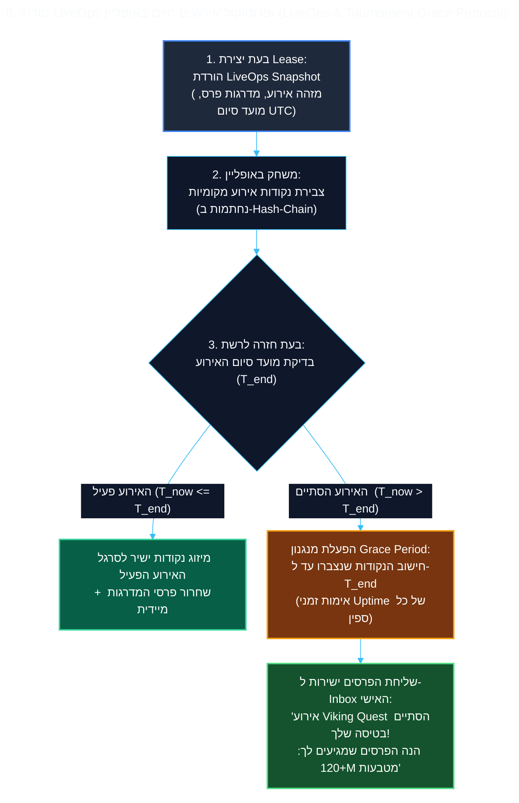

<!-- מקור: prd_finel_v5_CEO.md | פרק 8 מתוך 25 -->

> **שם הפרק:** מודול LiveOps ופרוטוקול אירועים חיים באופליין (LiveOps & Tournament Grace Protocol)

> ניווט: [פרק 07](<07 - דרישות פונקציונליות וארכיטקטורת Leased Session (MoSCoW).md>) | [README](README.md) | [פרק 09](<09 - איזון כלכלי ומניעת ארביטראז' (Dynamic Economy Scaling & Anti-Arbitrage Math).md>)

## 8. מודול LiveOps ופרוטוקול אירועים חיים באופליין (LiveOps & Tournament Grace Protocol)

- המטרה: לאפשר רציפות שחקן בלי לאפשר עקיפה של מועדי סיום אירועים.
- הפרסים נשמרים רק אם הושגו בזמן המאומת של האירוע.

> [!IMPORTANT]
> **האתגר המרכזי:** ב-Coin Master, כ-80% מההכנסות והמעורבות מונעות מאירועים מתוזמנים (*Viking Quest*, *Attack Madness*, *Tournament of Champions*). אם שחקן משחק בטיסה והאירוע מסתיים בזמן שהוא מנותק – אסור בשום אופן שההתקדמות שלו תימחק, ומאידך אסור לאפשר עקיפת מועד סיום האירוע.


### 8.1 מנגנון ה-Grace Period ואימות זמנים מונוטוניים

ב-Coin Master, כ-80% מההכנסות והמעורבות היומית נשענות על אירועים מתוזמנים (*Viking Quest*, *Attack Madness*, *Tournament of Champions*). כאשר שחקן טס או מנותק בעת סיום אירוע, נדרש איזון עדין בין הגנה על הישגי השחקן לבין שמירה על ההגינות התחרותית:

#### 1. מבנה ה-LiveOps Snapshot
בעת הנפקת ה-Lease Token, הלקוח מקבל אובייקט JSON קומפקטי (כ-4KB בלבד) המגדיר את האירועים הפעילים:
```json
{
  "active_events": [
    {
      "event_id": "viking_quest_w12",
      "type": "progression_milestones",
      "end_time_utc": 1773100800,
      "grace_period_seconds": 1800,
      "points_per_action": { "raid": 15, "attack": 10, "spin_symbol_match": 50 }
    }
  ],
  "server_time_utc": 1773057600,
  "client_boot_uptime_ms": 48291040
}
```

#### 2. מניעת תרמיות שינוי שעון (Anti Time-Travel Protocol)
שחקנים רבים עשויים לנסות להחזיר את שעון המכשיר לאחור כדי להמשיך להשתתף באירוע שהסתיים. כדי למנוע זאת הרמטית:
- **שעון מונוטוני מוגן חומרה:** הלקוח אינו משתמש בשעון הקיר (`System.currentTimeMillis`), אלא במונה חומרה מונוטוני רציף שאינו מושפע משינויי זמן ידניים – `SystemClock.elapsedRealtime()` ב-Android ו-`mach_continuous_time()` ב-iOS.
- **אימות רצף בשרת:** בעת סנכרון ה-Replay, השרת מחשב את שעת הפעולה האמיתית:
  $$T_{\text{action}} = T_{\text{lease\_start\_utc}} + (\text{Uptime}_{\text{action}} - \text{Uptime}_{\text{lease\_start}})$$
  כל פעולה שה-Uptime שלה חורג ממועד הסיום הרשמי של האירוע אינה מזכה בנקודות אירוע (אך המטבעות והספינים הרגילים נשמרים).

#### 3. חלון חסד של 30 דקות (The 30-Minute Grace Period)
- אם השחקן חזר לרשת בתוך חלון של 30 דקות מסיום האירוע הרשמי, נקודות שנצברו לפני מועד הסיום ממוזגות לסרגל ההתקדמות.
- פרסי מדרגות (Milestone Rewards) שנפתחו במהלך הטיסה נפרקים מיידית במסך חגיגה ייעודי.

#### 4. יישוב טורנירים תחרותיים (Leaderboard Tournaments Reconciliation)
באירועי לוח מובילים מול שחקנים אחרים:
- במהלך האופליין, השחקן רואה לוח מוקפא עם חיווי ברור: *"דירוג משוער (סנכרון יתבצע עם שוב הרשת)"*.
- בעת חידוש הקשר לאחר שהטורניר כבר נסגר, השרת לוקח את צילום המצב הסופי (Frozen Final Standings) של הטורניר, מוסיף את הנקודות שצבר השחקן טרם הסגירה, ומחשב את מיקומו היחסי המדויק.
- הפרס המגיע מועבר ישירות לתיבת הדואר של השחקן (Player Inbox) בצירוף הודעה מותאמת אישית:
  > *"אירוע Tournament of Champions הסתיים בזמן שהיית בנסיעה! צברת 4,200 נקודות וסיימת במקום ה-7. הנה הפרס שלך: 150M מטבעות ו-75 ספינים!"*

---

