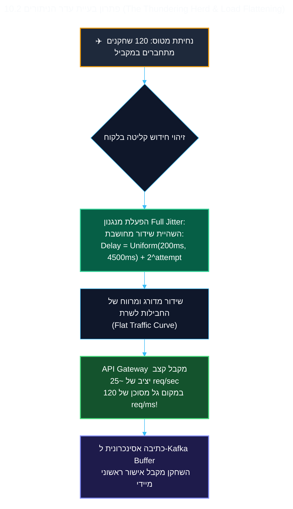

<!-- מקור: prd_finel_v5_CEO.md | פרק 10 מתוך 25 -->

> **שם הפרק:** ארכיטקטורת המערכת, מניעת עדר הניתורים (Thundering Herd) ו-Pseudocode לשרת

> ניווט: [פרק 09](<09 - איזון כלכלי ומניעת ארביטראז' (Dynamic Economy Scaling & Anti-Arbitrage Math).md>) | [README](README.md) | [פרק 11](<11 - דרישות לא-פונקציונליות, שוברי מעגלים ו-Kill-Switch (Circuit Breakers & Emergency Governance).md>)

## 10. ארכיטקטורת המערכת, מניעת עדר הניתורים (Thundering Herd) ו-Pseudocode לשרת

- התמונה הכוללת: הלקוח צובר בבטחה, והשרת מאמת וממזג מחדש עם guardrails.
- סכמות ו-pseudocode מלאים נשמרים להרחבה כדי להשאיר את קריאת ההנהלה נקייה.

### 10.1 ארכיטקטורת השרת וזרימת הנתונים (Distributed Architecture Blueprint)

*תרשים זרימה טכנולוגי: מעטפת האופליין מול שירותי המשחק המרכזיים*

*מבנה ה-Microservices בענן: Gateway, תורי Kafka, מנועי אימות Replay ומאגרי נתונים*

המערכת בנויה משכבות עצמאיות המבטיחות שביצועי ה-Core Game אינם מושפעים מסנכרוני אופליין:

1. **API Gateway (Envoy / Kong):**
   - מבצע אימות ראשוני של חתימת המכשיר (App Attest / Play Integrity).
   - מפעיל Rate Limiting ברמת IP ומזהה שחקן (`Token Bucket` מקומי).
2. **Lease Manager Service (Go Microservice):**
   - מנפיק וחותם את ה-`LeaseToken` באמצעות מפתח אסימטרי Ed25519 המנוהל ב-KMS.
   - מתעד את ה-Commitment והמכסה ב-Redis Cluster עם TTL של 12 שעות.
3. **Kafka Ingestion Buffer (Reconciliation Event Stream):**
   - כל חבילת Action Log המגיעה בעת Reconnect נכתבת מיידית ל-Topic ייעודי: `offline-reconciliation-stream`.
   - המחיצות (Partitions) ממופתחות לפי `player_id`, מה שמבטיח עיבוד עקבי וסדר פעולות קפדני לכל שחקן ללא נעילות גלובליות.
4. **Replay Worker Pool (Stateless Go Consumers):**
   - צרכנים אופקיים המריצים את מנוע ה-Fast-Forward Replay.
   - אימות 50 ספינים בתוך פחות מ-4ms ללא שום מגע או נעילה של מסד הנתונים הראשי.
5. **Ledger Integration Service:**
   - רק לאחר שסשן מאומת ב-100%, מועברת פקודת `Atomic Credit` יחידה ל-Master Database בטרנזקציה אטומית.

---

### 10.2 פתרון בעיית "עדר הניתורים" בענן (The Thundering Herd & Load Flattening)

> [!IMPORTANT]
> **התרחיש המבצעי:** מטוס בואינג 777 עם 350 נוסעים נוחת בנמל תעופה. בבת אחת, כ-120 שחקני Coin Master מכבים את ה-Airplane Mode.  
> **הסכנה התשתיתית:** 120 בקשות סנכרון Batch כבדות פוגעות באותה אלפית שנייה ב-API Gateway ומאיימות לייצר עומס רגעי (Spike) שיגרור שרשרת קריסות (Cascading Failure)!

#### אלגוריתם ה-Full Jitter בצד הלקוח:
למניעת סנכרון תהליכים, הלקוח מחשב את שעת השידור לפי עקרון Full Jitter:

$$T_{\text{delay}} = \text{UniformRandom}(0, \min(M, B \times 2^{\text{attempt}})) + \text{BaseOffset}$$

* $B = 500\text{ms}$ (בסיס השהייה).
* $M = 8000\text{ms}$ (תקרת השהייה מקסימלית).
* $\text{BaseOffset} = \text{UniformRandom}(200\text{ms}, 2500\text{ms})$.
* המנגנון משטח את עקומת התעבורה לאורך חלון של מספר שניות, כך ששרתי ה-Gateway אינם חווים שום Spike מסוכן.

---

### 10.3 מנוע האימות (Fast-Forward Replay Engine)
- המנוע בצד השרת כתוב ב-Go ומבוסס על פונקציות טהורות (Pure Functions).
- מאמת 50 ספינים בתוך פחות מ-4ms: משחזר את זרם ה-PRNG מתוך ה-Seed החסוי של השרת, משווה את תוצאת כל ספין, מחשב מחדש את שרשרת ה-SHA-256, ומוודא שהחתימה הסופית (`FinalHash`) תואמת לחישוב המקומי.
- קוד המקור המלא והמפורט של מנוע ה-Replay מופיע ב**נספח א'** שבסוף המסמך ([פרק 25](<25 - מטריצת סיכונים ובעלות.md>)).

---

