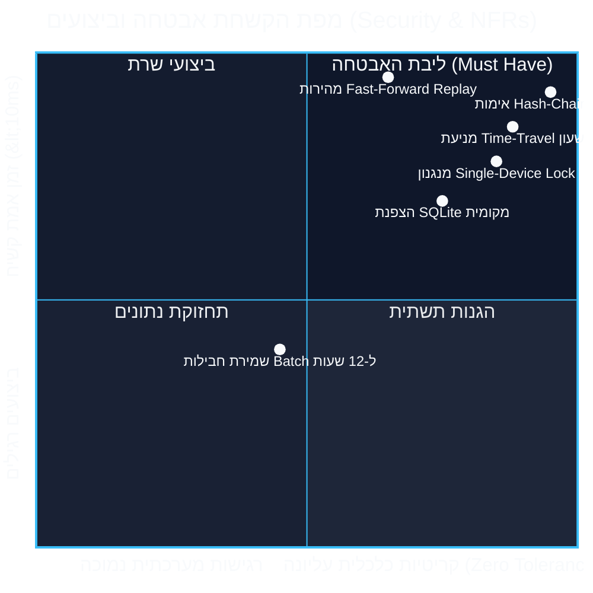
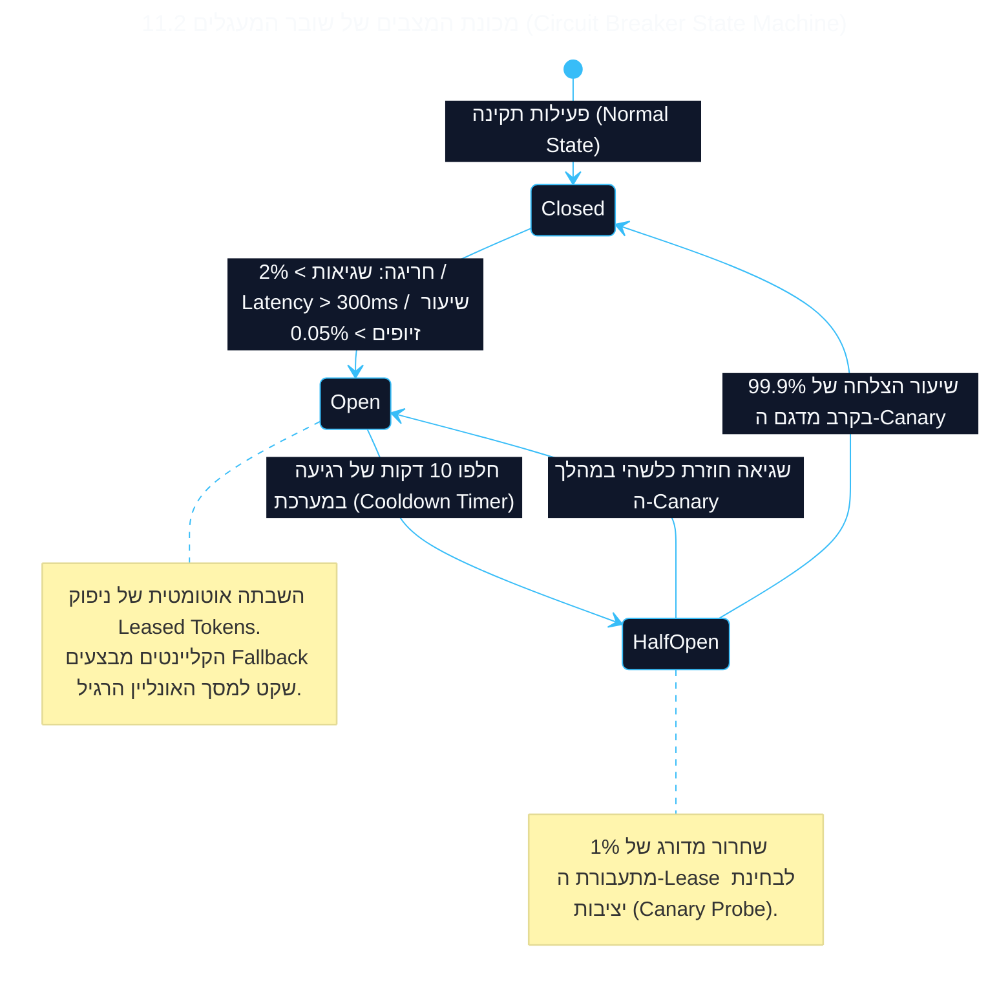

<!-- מקור: prd_finel_v5_CEO.md | פרק 11 מתוך 25 -->

> **שם הפרק:** דרישות לא-פונקציונליות, שוברי מעגלים ו-Kill-Switch (Circuit Breakers & Emergency Governance)

> ניווט: [פרק 10](<10 - ארכיטקטורת המערכת, מניעת עדר הניתורים (Thundering Herd) ו-Pseudocode לשרת.md>) | [README](README.md) | [פרק 12](<12 - תאימות רגולטורית לחנויות (Apple StoreKit 2 & Google Play Billing).md>)

## 11. דרישות לא-פונקציונליות, שוברי מעגלים ו-Kill-Switch (Circuit Breakers & Emergency Governance)

- הפרק מרכז זמינות, ביצועים ויכולת השבתה מהירה במקרה של חריגה או הונאה.



### 11.1 מפרט דרישות לא-פונקציונליות ו-SLAs (Non-Functional Requirements)

| קטגוריה | מדד (Metric) | יעד SLA / סף ביצועים מחייב | מתודולוגיית מדידה ובקרה |
| :--- | :--- | :--- | :--- |
| **זמני תגובה (Latency)** | זמן אימות סשן בשרת (p95) | **< 40ms** עבור סשן מלא של 50 ספינים | מדידת משך ביצוע בתוך ה-Go Replay Worker (ללא זמן רשת) |
| **זמני תגובה (Latency)** | זמן אימות סשן בשרת (p99) | **< 100ms** תחת עומס שיא | ניטור מתמיד ב-Datadog / Prometheus APM |
| **תפוקת שיא (Throughput)** | קצב עיבוד אימותים בענן | **15,000 reconciliations / sec** | בדיקות עומס תקופתיות (Distributed Locust / k6) |
| **ביצועי קליינט (Client RAM)** | תוספת צריכת זיכרון מקומי | **< 15MB RAM** מעבר לבילד הרגיל | פרופיילינג רציף ב-Unity Memory Profiler על מכשירי Low-End |
| **צריכת סוללה (Battery Drain)** | תוספת פריקת סוללה | **< 1.5% לשעה** של משחק באופליין | בדיקות מעבדה מבוקרות (Battery Historian על Android 10-14) |
| **נפח אפליקציה (Binary Size)** | תוספת משקל ל-APK / IPA | **< 3.2MB** נטו | מעקב גודל בילד ב-CI/CD (SQLCipher + לוגיקת Interceptor) |
| **אחסון מקומי (Local Storage)** | תקרת נפח מסד נתונים מקומי | **מקסימום 12MB** (מחיקה לאחר סנכרון) | אכיפת Quota קשיחה ב-SQLite וניקוי אוטומטי בעת Reconciliation |

---

### 11.2 ארכיטקטורת השבתת חירום רב-שכבתית (Multi-Tiered Kill-Switch)

למניעת כל סיכון תפעולי או פיננסי, תוכננה מערכת השבתה מדורגת המאפשרת תגובה כירורגית ללא פגיעה בכלל שחקני המשחק:



#### שכבות ההשבתה המנוהלות (Controlled Fallback Levels):
1. **Level 0 – Hard Global Kill:** השבתה מיידית של כלל תשתית האופליין ברחבי העולם באמצעות דגל Remote Config תוך פחות מ-60 שניות:
   ```json
   { "offline_feature_v1_enabled": false }
   ```
2. **Level 1 – Geo-Fenced Kill:** השבתת היכולת רק במדינה או אזור מסוים שבו זוהה ניסיון התקפה מאורגן או כשל ספק תקשורת מקומי:
   ```json
   { "disabled_regions": ["BR", "IN", "PH"] }
   ```
3. **Level 2 – Version/OS Specific Kill:** השבתה רק עבור גרסת אפליקציה פגיעה (למשל: גרסה שבה זוהה ניסיון Jailbreak Bypass פעיל).
4. **Level 3 – Sub-Feature Granular Kill:** השבתה נקודתית של רכיב בודד (לדוגמה: הקפאת תור ה-Deferred IAP או השבתת כפרי רפאים בלבד) תוך השארת ספינים בסיסיים פעילים.
---

