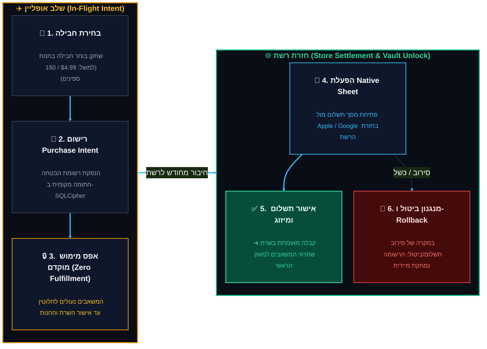

<!-- מקור: prd_finel_v5_CEO.md | פרק 12 מתוך 25 -->

> **שם הפרק:** תאימות רגולטורית לחנויות (Apple StoreKit 2 & Google Play Billing)

> ניווט: [פרק 11](<11 - דרישות לא-פונקציונליות, שוברי מעגלים ו-Kill-Switch (Circuit Breakers & Emergency Governance).md>) | [README](README.md) | [פרק 13](<13 - ערך עסקי ורווחי - טווח מיידי מול טווח בינוני-ארוך (Business Value & Two-Horizon ROI).md>)

## 12. תאימות רגולטורית לחנויות (Apple StoreKit 2 & Google Play Billing)

- הקו המנחה: אין להניח אישור רגולטורי מראש; כל זרימה תעבור Legal ו-Platform.
- ב-MVP נשמרת לכל היותר כוונת רכישה, ולא מוענקים נכסים לפני אישור מאומת.

> [!IMPORTANT]
> **שאלת הנהלה מרכזית:** האם אפל וגוגל מאשרות מודל של "רכישה באופליין" (Offline IAP)?
### 12.1 יישום מבוסס StoreKit 2 ו-Google Play Billing Deferred Queue

- המודל מבדיל בין intent אופלייני לבין settlement אונלייני מאומת ו-idempotent.
<details>
<summary>📖 להרחבה - פרטים טכניים מלאים</summary>

המסמך אינו קובע תאימות רגולטורית מראש. כל זרימת רכישה תחייב סקירה ואישור עדכניים של Apple, Google והייעוץ המשפטי. ב-MVP נשמרת לכל היותר כוונת רכישה מקומית; fulfillment מתבצע רק לאחר transaction מאומתת ו-idempotent:

</details>

12.1 יישום מבוסס StoreKit 2 ו-Google Play Billing Deferred Queue


---

### 12.2 מפרט טכנולוגי: Apple StoreKit 2 ו-Google Play Billing Deferred Queue

כדי להבטיח עמידה בלתי מתפשרת בדרישות חברות אפל וגוגל, יישום הרכישות באופליין אינו כולל אספקה מוקדמת של מוצרים:

#### 1. יישום מבוסס Apple StoreKit 2 (iOS)
- הלקוח עושה שימוש במנגנון ה-`Transaction.updates` האסינכרוני של StoreKit 2.
- בעת בחירת חבילת ספינים במצב טיסה, נוצרת רשומת `SignedPurchaseIntent` מקומית המוצפנת ב-Keychain:
  ```json
  {
    "intent_id": "pi_9921_apple",
    "product_id": "com.moonactive.coinmaster.spins150",
    "price_tier": "USD_4_99",
    "local_timestamp": 1773061200,
    "device_key_attestation": "attest_p256_sig"
  }
  ```
- ברגע חידוש הקשר, האפליקציה מזניקה את ה-Native StoreKit Sheet לסליקה רשמית מול שרתי Apple.
- ה-Server-to-Server Webhook (`App Store Server Notifications V2`) מאמת את ה-JWS Transaction, ורק אז מזכה את ה-Master Ledger.

#### 2. יישום מבוסס Google Play Billing Library 6.x+ (Android)
- שימוש במנגנון ה-Deferred Purchase Intent.
- כל עוד המכשיר ללא חיבור רשת, ספריית `BillingClient` אינה מנסה ליצור תקשורת כושלת, אלא ממתינה לאירוע `onBillingServiceDisconnected` / `onNetworkReconnected`.
- אימות קבלה סופי מתבצע דרך `Google Play Developer API` (Google Cloud Pub/Sub Topic) לפני פריקת המטבעות לחשבון.

---

### 12.3 תאימות משפטית, רגולציית הימורים והגנת הצרכן (Legal & Compliance)

1. **עמידה בהנחיות Apple Guideline 3.1.1 ו-Google Play Monetization:**
   - כלל הברזל: **אפס מימוש ללא תשלום (Zero Unverified Fulfillment)** מבטיח שאפל וגוגל מקבלות את מלוא עמלת ה-30% שלהן, ללא שום חשד למעקף סליקה או עסקאות שחורות.
2. **הגנה מטענות "הימורים ללא רישיון" (Social Casino Regulations):**
   - המשחק אינו מאפשר פדיון כספי של מטבעות וירטואליים.
   - מאחר שתוצאות הספינים באופליין נקבעות על ידי מנוע PRNG דטרמיניסטי חתום מראש ולא על ידי אלגוריתם מקומי הניתן למניפולציה, המשחק עומד בתקני השקיפות של ה-UK Gambling Commission ו-EU Digital Services Act (DSA).
3. **ניהול סיכוני Chargeback ו-Refunds:**
   - במקרה ששחקן מבצע רכישה, מתחרט ומבטל את העסקה מול הבנק או חנות האפליקציות לאחר הנחיתה – מערכת ה-Reconciliation מזהה את ביטול ה-Transaction ומבצעת ביטול (Rollback) אוטומטי של הספינים והמטבעות שהיו בכספת טרם פריקתם.

