<!-- מקור: prd_finel_v5_CEO.md | פרק 14 מתוך 25 -->

> **שם הפרק:** חזון שיתופי פעולה מסחריים (In-Flight Airline Partnerships & Zero-CAC Acquisition)

> ניווט: [פרק 13](<13 - ערך עסקי ורווחי - טווח מיידי מול טווח בינוני-ארוך (Business Value & Two-Horizon ROI).md>) | [README](README.md) | [פרק 15](<15 - מדדי הצלחה ומילון אירועי אנליטיקס (Telemetry & Data Dictionary).md>)

## 14. חזון שיתופי פעולה מסחריים (In-Flight Airline Partnerships & Zero-CAC Acquisition)

- הזדמנות אסטרטגית: להפוך את Coin Master לבחירת ברירת מחדל בנסיעות ובטיסות.
- היתרון: חשיפה לקהל פרימיום עם פוטנציאל CAC נמוך במיוחד.

> [!TIP]
> **מהלך אסטרטגי לצמיחה בעלות אפסית:**  
> הפיכת Coin Master ל-*"Official In-Flight Casual Game"* בשיתוף חברות תעופה גלובליות מובילות (Delta, United, Emirates, Ryanair, El Al).
---

### 14.1 מודל שיתוף הפעולה העסקי מול חברות תעופה (B2B Commercial Blueprint)

כיום, שחקני מובייל המובילים מוציאים עשרות מיליוני דולרים בחודש בערוצי רכישת משתמשים (UA) מסורתיים (Meta, Google, TikTok, AppLovin). שותפות אסטרטגית עם חברות תעופה גלובליות (Delta, United, Lufthansa, Emirates, Ryanair, British Airways) וספקיות תקשורת מוטסות (Viasat, Panasonic Avionics, Intelsat/Gogo) מייצרת **ערוץ רכישת שחקנים פרימיום בעל יתרון תחרותי שאינו ניתן להעתקה**:

#### 1. מבנה העסקה המסחרית (Revenue Share & Zero-CAC Barter)
- **מודל מבוסס חלוקת הכנסות (15%–20% Rev-Share):** חברת התעופה מקבלת 15%–20% מכלל ההכנסות הנקיות מרכישות IAP שמבוצעות בטיסותיה.
- **חשיפה ב-Zero-CAC:** בתמורה, חברת התעופה משלבת את Coin Master בפורטל ה-Wi-Fi המטוסי (Captive Portal), במגזין הטיסה, ובמסכי הבידור האישיים (Seatback IFE Screens).
- **השוואת Unit Economics:**
  - רכישת שחקן Tier-1 US/UK בערוצי UA מסורתיים: **$9.50 – $14.00 CAC** (זמן החזר השקעה של 180–270 ימים).
  - רכישת שחקן בטיסה דרך פורטל התעופה: **$0.40 – $1.10 Effective CAC** בלבד! החזר ההשקעה מושג לעיתים קרובות עוד לפני שהמטוס נוחת.

---

### 14.2 אינטגרציה טכנולוגית: פורטל ה-Wi-Fi וה-Local Intranet Caching

```mermaid
---
title: "14.2 ארכיטקטורת אינטגרציה בטיסה (In-Flight Captive Portal Architecture)"
---
%%{init: {
  "theme": "base",
  "themeVariables": {
    "fontFamily": "Segoe UI, Assistant, sans-serif",
    "fontSize": "16px",
    "primaryColor": "#0f172a",
    "primaryTextColor": "#f8fafc",
    "primaryBorderColor": "#38bdf8",
    "lineColor": "#38bdf8",
    "secondaryColor": "#1e293b",
    "tertiaryColor": "#1e293b",
    "edgeLabelBackground": "#0f172a",
    "nodeBorder": "#38bdf8",
    "clusterBkg": "#0b1120",
    "clusterBorder": "#38bdf8"
  },
  "flowchart": { "curve": "basis", "nodeSpacing": 30, "rankSpacing": 35, "padding": 15 },
  "sequence": { "actorMargin": 30, "messageMargin": 30 },
  "state": { "nodeSpacing": 30, "rankSpacing": 35, "titleTopMargin": 15 }
}}%%
flowchart LR
    Passenger["👤 נוסע מתיישב במושב<br/>מתחבר לרשת ה-Wi-Fi של המטוס"] --> Portal["🌐 פורטל כניסה של חברת התעופה<br/>(Captive Portal Splash Screen)"]
    
    Portal --> Decision{"האם לרכוש אינטרנט ב-$15?"}
    
    Decision -- "לא רוכש אינטרנט" --> AdBanner["🎰 באנר ייעודי של Coin Master:<br/>'שחק עכשיו חינם בטיסה ללא צורך באינטרנט!'"]
    
    AdBanner --> LaunchApp["📱 פתיחת האפליקציה ב-Deep Link<br/>coinmaster://flight_mode?airline=delta"]
    
    LaunchApp --> LocalFlightBonus["🎁 שחרור בונוס עננים: 50 ספינים מתנה בטיסה<br/>חוויית משחק מנותקת חלקה לאורך כל הטיסה"]

    style Passenger fill:#1e293b,stroke:#38bdf8,stroke-width:2px,color:#fff
    style Portal fill:#0f172a,stroke:#f59e0b,stroke-width:2px,color:#fff
    style AdBanner fill:#78350f,stroke:#fbbf24,stroke-width:2px,color:#fff
    style LaunchApp fill:#065f46,stroke:#34d399,stroke-width:2px,color:#fff
    style LocalFlightBonus fill:#14532d,stroke:#4ade80,stroke-width:2px,color:#fff
```

#### נדבכי היישום הטכנולוגי:
1. **Walled Garden Whitelist:** ספקיות ה-Wi-Fi מאשרות מעבר חופשי (Zero-Rating) לכתובות ה-API הקלות של Coin Master לצורך קבלת ה-Lease הראשוני ללא חיוב הנוסע.
2. **On-Board Content Caching:** שרתי ה-Media המקומיים במטוס שומרים Cache של נכסי המשחק העדכניים, כך שנוסעים שמתקינים או פותחים את המשחק מקבלים עדכונים במהירות רשת מקומית גבוהה.
3. **Deep Link ייעודי:** סריקת QR קוד על גבי מושב המטוס או כרטיס העלייה למטוס פותחת את המשחק ישירות במצב טיסה עם חבילת הטבה ממותגת (*"Delta SkySpins"*).

---

### 14.3 פסיכולוגיית הקהל השבוי (The Captive Audience Advantage)
- **4 עד 12 שעות של זמן מת:** נוסע בטיסה מנותק מכל הסחות הדעת הרגילות (YouTube, TikTok, חדשות, וואטסאפ). Coin Master הופך למקור הבידור האינטראקטיבי המרכזי שלו.
- **פרופיל דמוגרפי יוקרתי:** נוסעי טיסות בינלאומיות ומחלקות עסקים מאופיינים ב-ARPPU ו-LTV הגבוהים פי 3 עד 4 מהממוצע העולמי, מה שממקסם את יעילות המונטיזציה בסנכרון הנחיתה.

