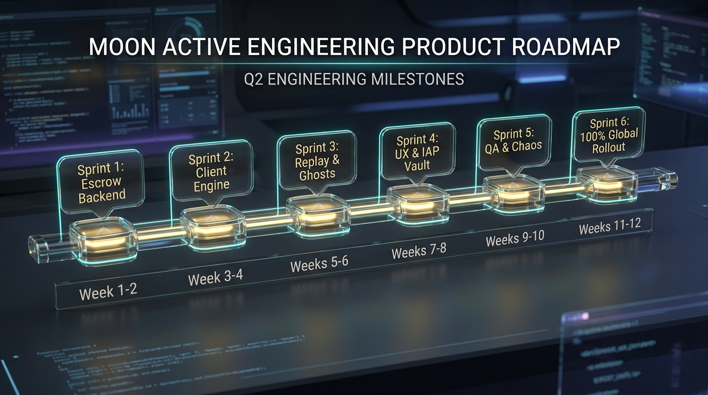

<!-- מקור: prd_finel_v5_CEO.md | פרק 16 מתוך 25 -->

> **שם הפרק:** מפת דרכים הנדסית לרבעון (3-Month Agile Roadmap)

> ניווט: [פרק 15](<15 - מדדי הצלחה ומילון אירועי אנליטיקס (Telemetry & Data Dictionary).md>) | [README](README.md) | [פרק 17](<17 - תוכנית בדיקות אבטחה והשקה מדורגת (Testing & Rollout Plan).md>)

## 16. מפת דרכים הנדסית לרבעון (3-Month Agile Roadmap)

- מפת הדרכים מציגה רצף ביצוע בן שישה ספרינטים: תשתית, לקוח, replay, UX, QA ו-rollout.

### 16.1 פירוט מפת הדרכים לספרינטים (6 Two-Week Agile Sprints)

תוכנית הפיתוח מובנית ב-6 ספרינטים של שבועיים (12 שבועות סה"כ ברבעון Q1), כאשר בתום ספרינט 3 מושגת אבן דרך מחייבת של **MVP אלפא פעיל (4-6 שבועות)**:

| ספרינט | מוקד טכנולוגי | משימות עיקריות ו-Deliverables | תוצר מחייב (Milestone Exit Gate) | צוות מוביל |
| :---: | :--- | :--- | :--- | :---: |
| **Sprint 1** | **Backend Lease & KMS** | • הקמת שירות Lease Manager ב-Go • שילוב מפתחות Ed25519 ב-Cloud KMS • הגדרת Redis Cluster לניהול מכסות ו-TTL | חוזה API של `POST /offline/lease` נבדק ב-Postman/Staging | Backend |
| **Sprint 2** | **Client Interceptor & Crypto** | • פיתוח Network Interceptor ב-Unity (C#) • הטמעת מסד SQLite מוצפן (SQLCipher AES-256) • מימוש שרשור גיבוב SHA-256 ושעון מונוטוני | לקוח Unity מריץ 50 ספינים באופליין ומפיק Hash-Chain חתום | Client |
| **Sprint 3** | **Replay Engine & Ghost NPCs** | • פיתוח מנוע Fast-Forward Replay ב-Go ($<4\text{ms}$) • הקמת Kafka Reconciliation Topic (`partition by player_id`) • יצירת מאגר 5 כפרי רפאים (Ghost Villages Cache) | **אבן דרך: MVP אלפא שלם** אימות סשן מלא מקצה לקצה ב-Staging | Backend + Client |
| **Sprint 4** | **StoreKit Queue & LiveOps** | • מימוש תור רכישות מושהה (StoreKit 2 / Google Play Billing) • שילוב פרוטוקול LiveOps Grace Period (30 דקות) • פיתוח מנגנון פריקת כספת ואנימציית Reconnect | מנגנון רכישות מאושר על ידי Legal; אירועי LiveOps מסונכרנים לתיבה | Client + LiveOps |
| **Sprint 5** | **Chaos & Pen-Testing** | • בדיקות חוסן קיצוניות (ניתוק באמצע ספין, סוללה כבית) • מבדקי חדירה (Pen-Testing) לזיכרון באמצעות Frida • בדיקות עומס Thundering Herd (15,000 req/sec ב-k6) | דוח אבטחה חתום על ידי InfoSec; אפס תקלות קריטיות | QA + Security + SRE |
| **Sprint 6** | **Canary & Global Rollout** | • שחרור 1% בפיליפינים ובניו זילנד (Canary) • השקת ניסוי A/B של 50% בהודו וברזיל • הרחבה הדרגתית ל-25%, 50% ו-**100% שחרור גלובלי** | השקה גלובלית מלאה (100% GA) ועמידה בכל יעדי ה-SLAs | PM + DevOps + CS |

---

### 16.2 מטריצת תחומי אחריות ובעלות (Cross-Functional RACI Matrix)

| שלב ותוצר בפרויקט | Product (PM) | Client Team (Unity) | Backend Team (Go) | InfoSec / Security | LiveOps & Economy | Customer Support | SRE / DevOps |
| :--- | :---: | :---: | :---: | :---: | :---: | :---: | :---: |
| **אפיון חוזי API ו-MoSCoW** | **A / R** | C | C | C | C | I | I |
| **פיתוח ה-Client Interceptor** | I | **A / R** | C | C | I | I | I |
| **מנוע ה-Replay ותשתית Kafka** | I | C | **A / R** | C | I | I | C |
| **אבטחה, KMS ומבדקי חדירה** | I | C | C | **A / R** | I | I | C |
| **כיול כלכלי ו-Ghost Loot** | C | I | C | I | **A / R** | I | I |
| **מסך CS Escrow Inspector** | C | I | C | I | I | **A / R** | I |
| **פריסה מדורגת וניטור חי** | **A** | C | C | C | C | C | **R** |

*מקרא: **R** = אחראי לביצוע (Responsible), **A** = בעל סמכות עליונה (Accountable), **C** = גורם מייעץ (Consulted), **I** = מועדכן ומודע (Informed).*

---

### 16.3 הנתיב הקריטי וניהול תלויות (Critical Path Analysis)
- **תלות קריטית 1 (ספרינט 2 ➔ ספרינט 3):** לא ניתן להתחיל את אימות ה-Replay בשרת ללא חתימת מבנה ה-Action Log הסופי בלקוח.
- **תלות קריטית 2 (ספרינט 4 ➔ ספרינט 5):** שילוב תור ה-IAP מחייב בדיקת אימות מול Sandboxes של אפל וגוגל לפני תחילת מבדקי ה-Chaos.
- **תלות קריטית 3 (ספרינט 5 ➔ ספרינט 6):** חתימה רשמית (Sign-Off) של ראש צוות אבטחת מידע היא תנאי סף בלתי ניתן לעקיפה לעליית ה-Canary בפיליפינים.
---

