<!-- מקור: prd_finel_v5_CEO.md | פרק 17 מתוך 25 -->

> **שם הפרק:** תוכנית בדיקות אבטחה והשקה מדורגת (Testing & Rollout Plan)

> ניווט: [פרק 16](<16 - מפת דרכים הנדסית לרבעון (3-Month Agile Roadmap).md>) | [README](README.md) | [פרק 18](<18 - מדריך תמיכה ושירות לקוחות (Player Support & Helpdesk Playbook).md>)

## 17. תוכנית בדיקות אבטחה והשקה מדורגת (Testing & Rollout Plan)

- הפיצ׳ר מחייב הוכחת יציבות באבטחה, רשת, כלכלה ותפעול לפני הרחבת הפריסה.

### 17.1 סביבות בדיקה ותרחישי קיצון (Chaos Engineering & Security Stress Tests)

כדי לאמת שהמערכת עמידה בפני כל כשל חומרתי, ניסיונות פריצה או תנודות רשת אלימות, צוות ה-QA Automation וה-InfoSec יבצע סדרת מבחני קיצון מחמירים:

| קטגוריית בדיקה | תרחיש קיצון מבחן (Extreme Stress Test) | התנהגות מצופה וקריטריון הצלחה (Pass Criteria) |
| :--- | :--- | :--- |
| **Chaos: ניתוק אלים** | מעבר חד מרשת Wi-Fi מהירה לניתוק מוחלט בדיוק בשבריר השנייה שבו הגלגלים מסתובבים. | ה-Interceptor מזהה את הניתוק ללא חסימת Thread; האנימציה מסתיימת ב-60 FPS ללא ספינר שגיאה. |
| **Hardware: כיבוי פתאומי** | סוללת המכשיר מתרוקנת והטלפון כבה באמצע חישוב ה-SHA-256 של ספין מס' 34. | מסד הנתונים SQLCipher מוגן ב-WAL Mode (Write-Ahead Logging); בהדלקה חוזרת ה-State משוחזר לספין 33 ללא השחתת קובץ. |
| **Storage: דיסק מלא** | זיכרון המכשיר מלא ב-100% והאפליקציה אינה יכולה לכתוב שורות חדשות ל-SQLite. | הלקוח מזהה `DiskFullException`, נועל בעדינות את מצב האופליין ומציג: *"פנה שטח אחסון כדי להמשיך לשחק במצב מנותק"*. |
| **Security: שינוי שעון** | השחקן מקדם את שעון המכשיר ב-7 ימים כדי להמשיך סשן שפג תוקפו או לפתוח אירועים. | מנוע האופליין מזהה סטייה בין `System.currentTimeMillis` ל-`SystemClock.elapsedRealtime`, נועל את ה-Lease, והשרת פוסל את הסשן. |
| **Security: הזרקת זיכרון** | שימוש ב-Frida / Cheat Engine להקפצת מאזן המטבעות המקומי ב-100,000,000 מטבעות. | שרשרת הגיבוב נשברת במקום (`computedHash != actionHash`). שרת ה-Replay מזהה את השבירה, פוסל את הסשן, ומחזיר את המאזן המקורי. |
| **Concurrency: תקיפה מקבילה** | שחקן פושט על בוט באופליין, ובדיוק באותה שנייה שחקן חי אחר תוקף את כפר המשתמש באונליין. | השרת מיישב את האירועים ללא Race Conditions: מגן שהושג באופליין מופעל רטרואקטיבית להגנה על הכפר. |

---

### 17.2 אסטרטגיית שחרור מדורגת ושערי מעבר (Phased Rollout Strategy & Quality Gates)

ההשקה תתבצע ב-4 שלבים מבוקרים. מעבר בין שלב לשלב מותנה בעמידה בשערי איכות (Quality Gates) חד-משמעיים:

```mermaid
---
title: "17.2 תוכנית שחרור מדורג ו-Quality Gates"
---
%%{init: {
  "theme": "base",
  "themeVariables": {
    "fontFamily": "Segoe UI, Assistant, sans-serif",
    "fontSize": "16px",
    "primaryColor": "#0f172a",
    "primaryTextColor": "#f8fafc",
    "primaryBorderColor": "#38bdf8",
    "lineColor": "#38bdf8",
    "secondaryColor": "#1e293b",
    "tertiaryColor": "#1e293b",
    "edgeLabelBackground": "#0f172a",
    "nodeBorder": "#38bdf8",
    "clusterBkg": "#0b1120",
    "clusterBorder": "#38bdf8"
  },
  "flowchart": { "curve": "basis", "nodeSpacing": 30, "rankSpacing": 35, "padding": 15 },
  "sequence": { "actorMargin": 30, "messageMargin": 30 },
  "state": { "nodeSpacing": 30, "rankSpacing": 35, "titleTopMargin": 15 }
}}%%
flowchart LR
    Phase0["שלב 0: Internal Alpha<br/><b>500 עובדי Moon Active</b><br/>Dogfooding בטיסות ובחופשות"] --> Gate0{"Gate 0:<br/>0 קריסות<br/>0 דליפות זיכרון"}
    
    Gate0 -- "אושר" --> Phase1["שלב 1: Canary Soft Launch<br/><b>1% - 5% מהמשתמשים</b><br/>הפיליפינים וניו זילנד"]
    
    Phase1 --> Gate1{"Gate 1:<br/>הצלחת Replay > 99.9%<br/>0 תלונות אבטחה"}
    
    Gate1 -- "אושר" --> Phase2["שלב 2: Regional A/B Test<br/><b>25% - 50% מהמשתמשים</b><br/>הודו, ברזיל, גרמניה"]
    
    Phase2 --> Gate2{"Gate 2:<br/>עלייה מובהקת ב-D1 (+0.8%)<br/>סטיית כלכלה < 1%"}
    
    Gate2 -- "אושר" --> Phase3["שלב 3: Global Launch (100%)<br/><b>פריסה עולמית מלאה</b><br/>קמפיין שיווקי עולמי"]

    style Phase0 fill:#1e293b,stroke:#94a3b8,stroke-width:2px,color:#fff
    style Phase1 fill:#1e293b,stroke:#f59e0b,stroke-width:2px,color:#fff
    style Phase2 fill:#1e293b,stroke:#3b82f6,stroke-width:2px,color:#fff
    style Phase3 fill:#065f46,stroke:#34d399,stroke-width:2px,color:#fff
    style Gate0 fill:#0f172a,stroke:#38bdf8,stroke-width:1.5px,color:#fff
    style Gate1 fill:#0f172a,stroke:#38bdf8,stroke-width:1.5px,color:#fff
    style Gate2 fill:#0f172a,stroke:#34d399,stroke-width:1.5px,color:#fff
```

#### תנאי המעבר לשחרור גלובלי (Global GA Criteria):
1. **יציבות:** שיעור סשנים ללא קריסות (Crash-Free Sessions) מעל **99.95%**.
2. **אמינות שרת:** שיהוי אימות Replay בשרת (p95) מתחת ל-**40ms** לאורך שבוע שלם של עומס שיא.
3. **אבטחה וכלכלה:** אפס אירועי פריצת PRNG או כפל מטבעות, ושיעור ביטולי עסקאות (Chargeback) נמוך מ-**0.1%**.

---

