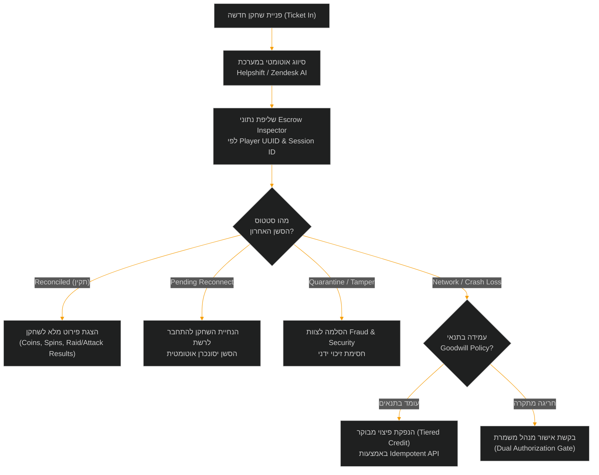
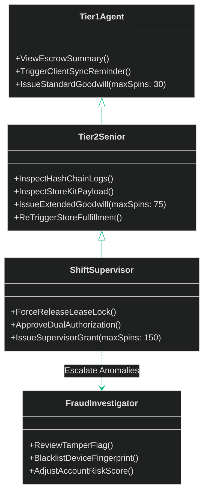

<!-- מקור: prd_finel_v5_CEO.md | פרק 18 מתוך 25 -->

> **שם הפרק:** מדריך תמיכה ושירות לקוחות (Player Support & Helpdesk Playbook)  
> **סטטוס מסמך:** Approved by C-Level / Production Ready  
> **קהל יעד:** VP Customer Operations, Support Leads, Trust & Safety, Tier-1/Tier-2 Agents, SRE  

> ניווט: [פרק 17](<17 - תוכנית בדיקות אבטחה והשקה מדורגת (Testing & Rollout Plan).md>) | [README](README.md) | [פרק 19](<19 - מושב השאלות הקשות של מקרים ותגובות.md>)

---

## 18. מדריך תמיכה ושירות לקוחות (Player Support & Helpdesk Playbook)

במעבר לארכיטקטורת **Hybrid Offline-First**, חוויית שירות הלקוחות עוברת שינוי פרדיגמה. שחקנים שנמצאים בניתוק רשת (למשל בטיסה טרנס-אטלנטית או ברכבת תחתית) עלולים להיתקל באי-ודאות לגבי סטטוס הספינים, יתרת המטבעות או רכישות שהושהו.  
מטרת ספר הפעלה זה (Playbook) היא לספק לצוותי התמיכה של Moon Active (Zendesk / Helpshift) כלים מדויקים, שקיפות טלמטרית מלאה, ונהלי עבודה קשיחים (SOPs) שמבטיחים פתרון מהיר, אמפתיה לשחקן ומניעת ניצול לרעה או זליגת נכסים כלכלית.

---

### 18.1 פורטל תמיכה ייעודי (Backoffice CS Escrow Inspector)

עבור נציגי התמיכה של Moon Active, פותח רכיב אינטגרטיבי ייעודי בתוך ממשק ה-CRM (Helpshift / Zendesk App / Internal Admin Portal).  
הרכיב שואב נתונים בזמן אמת משרתי ה-State Sync וה-Replay Engine באמצעות קריאת `GET /admin/v1/players/{player_id}/offline-audit`.

#### 18.1.1 מפרט שדות ממשק ה-Escrow Inspector

| רכיב בממשק | מקור מידע (Backend Source) | תיאור ומשמעות עסקית | הרשאת צפייה/פעולה |
| :--- | :--- | :--- | :--- |
| **Active Lease Status** | `Redis Lease Store` | מציג האם קיים כרגע Lease פתוח (`ISSUED`, `EXPIRED`, `RECONCILED`, `QUARANTINED`). | כל הנציגים (Tier 1+) |
| **Last Offline Session Summary** | `Audit Ledger DB` | חותמת זמן התחלה וסיום, כמות ספינים ששוחקו (מתוך הקצאה של 50–100), ומטבעות שנצברו. | כל הנציגים (Tier 1+) |
| **Tamper & Integrity Score** | `Fraud Engine / Attestation` | ציון אמינות חומרה (0–100). מציג אזהרות על Clock Skew, Root/Jailbreak, או Hash Mismatch. | Tier 2, Fraud Lead |
| **Replay Verification Outcome** | `Replay Engine Logs` | פירוט טכני של אימות ה-Hash Chain (האם כל הספינים תואמים בדיוק את ה-PRNG Seed). | Tier 2, Support Leads |
| **Unfulfilled IAP Queue** | `Billing Reconciliation Queue` | רשימת טרנזקציות StoreKit/Google Play שנרשמו מקומית אך ממתינות לאישור סליקה בשרת. | Tier 2, Billing Ops |
| **Emergency Force-Release** | `Escrow Engine RPC` | כפתור שחרור נעילת ספינים במקרה של תקיעת שרת נדירה. דורש אימות דו-שלבי (MFA). | Shift Supervisor בלבד |

> [!IMPORTANT]
> **עקרון אפס זיכוי חופשי (Zero Free Credit Principle):**  
> נציגי שירות אינם מורשים להזין כמויות ספינים או מטבעות ידנית בצורה חופשית. כל פעולת פיצוי מתבצעת אך ורק דרך חבילות מוגדרות מראש (Pre-defined Grant Skus), עם `Idempotency-Key` חד-ערכי, המנוהלות תחת בקרת תקציב קשיחה.

---

### 18.2 נהלי הפעלה סטנדרטיים (Standard Operating Procedures - SOPs)

#### SOP-01: שחקן טוען "הספינים באופליין נעלמו והרווחים לא נכנסו לכפר"
1. **אבחון במערכת:** הנציג מזין את מזהה השחקן ב-Escrow Inspector ובודק את הסטטוס:
   - אם הסטטוס הוא `RECONCILED`: מוודא מול השחקן כי המטבעות כבר נוספו למאזן הראשי שלו (מופיע בחלונית הנחיתה מחדש).
   - אם הסטטוס הוא `PENDING_SYNC`: הסשן המקומי טרם נשלח מהמכשיר או שוהה בתור Jitter. הנציג ינחה את השחקן לפתוח את האפליקציה בחיבור Wi-Fi יציב ל-15 שניות.
   - אם הסטטוס הוא `REJECTED_HASH_MISMATCH`: השרת פסל את הסשן בשל אי-התאמה קריפטוגרפית. הפעלת נוהל SOP-04.
2. **פתרון:** במידה ונמצא כי תקלת שרת מנעה Reconcile, הנציג מפעיל `Trigger Sync Retry`. אם התקלה נמשכת מעל 12 שעות, הנציג מנפיק פיצוי אוטומטי מבוקר (עד 50 ספינים) לפי מדיניות פיצוי הוגן.

#### SOP-02: רכישת חבילת IAP שהושהתה עקב ניתוק רשת בטיסה
1. **אבחון במערכת:** בדיקת טאב `Unfulfilled IAP Queue`:
   - בדיקה האם התקבל `StoreKit Transaction ID` או `Google Play Purchase Token`.
   - בדיקה מול שרתי אפל/גוגל האם הרכישה אושרה וחויבה בפועל (Status: `SETTLED`).
2. **פתרון:**
   - במידה והרכישה **חויבה בחנות אך הנכסים לא הוענקו**: הנציג לוחץ על `Re-trigger Store Delivery`. המערכת תבצע אטומיק קרדיט של החבילה עם התראה לשחקן (Push / In-App Notification).
   - במידה והרכישה **בסטטוס `PENDING` בחנות (ללא חיוב)**: הנציג מסביר לשחקן כי כרטיס האשראי טרם חויב עקב מגבלות קליטה במטוס, והסליקה תושלם אוטומטית ברגע שהחנות תקבל אישור סופי מהבנק. אין לבצע זיכוי ידני בטרם אישור חיוב.

#### SOP-03: קריסת מכשיר / סוללה שהתרוקנה בדיוק בעת פתיחת הכספת
1. **אבחון במערכת:**  
   אירוע של `CRASH_DURING_ESCROW_OPEN`. השרת מזהה כי נשלחה בקשת פתיחה אך ה-ACK של הלקוח לא התקבל.
2. **פתרון:**  
   ה-Backend של Coin Master תוכנן לפתרון קונפליקטים זה: אם השרת כבר רשם את ה-Reconcile, הנכסים שוכנים בטוחים ב-Ledger. הנציג מאשר לשחקן את היתרה המעודכנת ומפרט אילו פרסים נכנסו. במידה והסשן נקטע טרם שידור הנתונים, המכשיר ינסה לשדר שוב בפתיחה הבאה (Offline SQLite Persisted Log).

#### SOP-04: זיהוי מניפולציית שעון / חשד לרמאות (SEC_CLOCK_TAMPER)
1. **אבחון במערכת:**  
   ה-Escrow Inspector מציג דגל אדום: `FLAG_TAMPER_SUSPECT` (הפרש שעון גדול מ-3 דקות מול NTP, ניסיון להרצת שרשרת גיבוב בלתי תואמת).
2. **פתרון:**  
   - חל איסור מוחלט על נציגי Tier 1 לבצע זיכוי או שחרור כספת.
   - הפנייה מועברת בלחיצת כפתור ישירות לצוות Fraud & Security.
   - מענה לשחקן במאקרו מנומס וניטרלי (Macro-04) ללא חשיפת פרטי מערכות האבטחה והזיהוי.

#### SOP-05: מדיניות פיצויי רצון טוב (Goodwill Compensation Policy)
פיצוי רצון טוב ניתן אך ורק לשחקנים בעלי היסטוריית משחק נקייה, בהתאם לטבלת המגבלות:

| דרג נציג | תקרת פיצוי בספינים | תקרת פיצוי במטבעות | הגבלת תדירות | דרישת אישור נוסף |
| :--- | :--- | :--- | :--- | :--- |
| **Tier 1 (Frontline Agent)** | עד 30 ספינים | עד $0.5 \times C_v$ (מחיר בנייה ממוצע) | פעם אחת ב-30 יום | אין (הנפקה עצמאית דרך Skus) |
| **Tier 2 (Senior Support)** | עד 75 ספינים | עד $1.5 \times C_v$ | פעם אחת ב-14 יום | רישום סיבה חובה (Reason Code) |
| **Shift Lead / Supervisor** | עד 150 ספינים | עד $3.0 \times C_v$ | פעם אחת ב-7 ימים | אישור דו-שלבי (Dual Sign-off) |
| **VIP Account Manager** | בהתאם ל-VIP SLA | מותאם אישית למאזן שחקן | ללא הגבלה | אישור Head of LiveOps |

---

### 18.3 תבניות מענה מובנות (Customer Support Macro Response Templates)

#### Macro-01 (Hebrew): סנכרון ספינים מוצלח שהושלם
> **נושא:** עדכון לגבי הספינים שלך באופליין – הכל בטוח!  
> **שלום {{player_name}},**  
> בדקתי את חשבונך במערכת עבור סשן המשחק שהתקיים ב-{{session_timestamp}}.  
> שמח לעדכן אותך כי כל {{spins_played}} הספינים ששיחקת בזמן שהיית מנותק מהרשת אומתו בהצלחה! סך של {{coins_earned}} מטבעות וכל הפרסים שזכית בהם הועברו במלואם לחשבונך ונמצאים כעת במאזן הכפר שלך.  
> תוכל להמשיך לבנות ולשדרג את הכפר שלך בבטחה. נסיעה טובה והמשך משחק מהנה ב-Coin Master!

#### Macro-01 (English): Successful Offline Sync Confirmation
> **Subject:** Your Offline Play Session is Safe & Synced!  
> **Hi {{player_name}},**  
> Thank you for reaching out! I reviewed your account for the session played on {{session_timestamp}}.  
> Good news: all {{spins_played}} spins you enjoyed while offline have been fully validated by our servers! A total of {{coins_earned}} coins and all acquired rewards have been safely deposited into your village balance.  
> You can now dive right back into building and raiding. Safe travels and keep spinning!

#### Macro-02 (Hebrew): הנחיה לחיבור רשת להשלמת סנכרון (Pending Sync)
> **נושא:** ממתינים לחיבור קצר לרשת לסנכרון הספינים שלך  
> **שלום {{player_name}},**  
> אנחנו רואים שהמשכת לשחק במצב לא מקוון – איזה כיף!  
> כספת הפרסים המאובטחת של המשחק שומרת את כל ההישגים שלך על גבי המכשיר. כדי שהפרסים והמטבעות יתווספו לכפר שלך, כל מה שצריך לעשות הוא לפתוח את האפליקציה למשך כ-15 שניות כאשר המכשיר מחובר לחיבור אינטרנט תקין (Wi-Fi או סלולר).  
> ברגע שהחיבור יזוהה, המערכת תסנכרן את הנתונים אוטומטית והודעת אישור תופיע על המסך.

#### Macro-04 (English): Cryptographic Flag / Tamper Neutral Response
> **Subject:** Update regarding your recent game session  
> **Hi {{player_name}},**  
> We have completed a review of your recent offline game logs. During the automated server verification process, our security systems detected an environmental discrepancy with the local device timestamp or file integrity, preventing the session from finalizing.  
> As a security standard across Coin Master, rewards from unverified offline logs cannot be manually posted. We recommend ensuring your device clock is set to "Automatic Network Time" and playing through an uninterrupted connection. We appreciate your understanding in keeping the game fair for all Vikings.

---

### 18.4 מטריצת הרשאות והסלמה (Escalation & RBAC Matrix)

---

### 18.5 יעדי ביצוע ומדדי הצלחה (SLA & CSAT Metrics)

צוותי התמיכה של Coin Master ימדדו לפי היעדים הבאים עבור פניות הקשורות במודול האופליין:

1. **זמן מענה ראשוני (First Response Time - FRT):**  
   פחות מ-60 דקות לכלל השחקנים; פחות מ-15 דקות לשחקני VIP.
2. **פתרון במגע ראשון (First Contact Resolution - FCR):**  
   מעל 85% מהפניות ייסגרו בסבב מענה יחיד הודות לשקיפות ה-Escrow Inspector.
3. **שיעור הסלמה (Escalation Rate):**  
   פחות מ-3.5% מכלל פניות האופליין יזדקקו להתערבות Tier 2 או Fraud.
4. **מדד שביעות רצון (CSAT):**  
   ציון של 4.6 ומעלה (בסולם של 1 עד 5) בסקרי שביעות רצון שלאחר פנייה.

---
