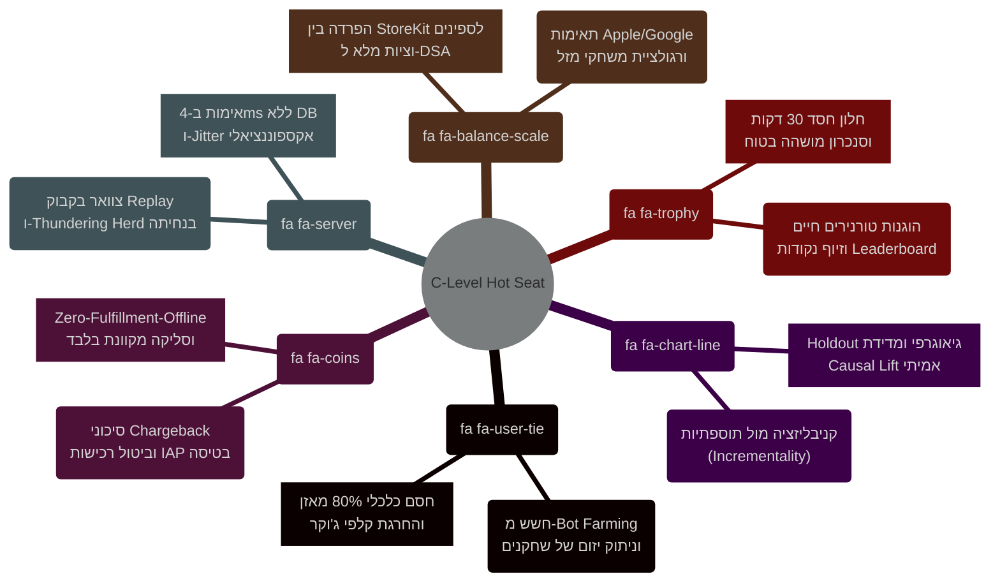
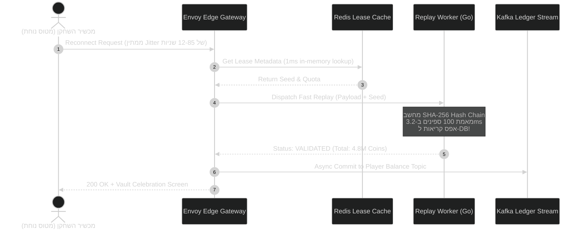

<!-- מקור: prd_finel_v5_CEO.md | פרק 19 מתוך 25 -->

> **שם הפרק:** מושב השאלות הקשות של מקרים ותגובות (Executive FAQ & C-Level Hot Seat)  
> **סטטוס מסמך:** Approved by C-Level / Production Ready  
> **קהל יעד:** CEO, CFO, CTO, CPO, General Counsel, VP LiveOps, VP Analytics  

> ניווט: [פרק 18](<18 - מדריך תמיכה ושירות לקוחות (Player Support & Helpdesk Playbook).md>) | [README](README.md) | [פרק 20](<20 - סיכום מנהלים לדרג ההנהלה (The PM Pitch).md>)

---

## 19. מושב השאלות הקשות של מקרים ותגובות (Executive FAQ & C-Level Hot Seat)

מהלך מעבר של משחק בקנה מידה עולמי כמו **Coin Master** ממודל אונליין בלעדי (Strictly Authoritative Online) למודל היברידי (Hybrid Offline-First) מעורר שאלות אסטרטגיות, כלכליות, רגולטוריות וטכנולוגיות מהותיות בקרב חברי הנהלת Moon Active.  
פרק זה מציג את התשובות הנוקבות, המבוססות והחסרות-פשרות לדילמות הקשות ביותר שהועלו על ידי הנהלת החברה, מגובות במודלים מתמטיים, ארכיטקטורת אבטחה וניתוח כלכלי מעמיק.

---

### שאלה 1 (המופנית ל-CEO & VP Product):  
> **"האם הוספת מצב אופליין לא תעודד שחקנים לכבות בכוונה את ה-Wi-Fi כדי 'לחלוב' בוטים קלים ולנצל לרעה את המערכת?"**

#### מענה תמציתי להנהלה (The 1-Minute Elevator Answer):
**ממש לא.** המערכת תוכננה כך שמשחק באופליין הוא תמיד **נחות כלכלית** ממשחק באונליין. שחקן שמכבה בכוונה את הרשת מרוויח כ-25% פחות מטבעות פר ספין, מוגבל לתקרת ספינים קשיחה (50–100 בלבד ל-24 שעות), ואינו יכול להגריל קלפי ג'וקר או להשתתף במבצעי כפל פרסים חיים. מטרת המודל אינה להחליף את האונליין, אלא למנוע נשירה לאפליקציות מתחרות כאשר אין קליטה.

#### העמקה מתמטית והנדסית (Deep Dive Analysis):
1. **כלל ה-80% במאגרי מטבעות בוטים ($C_{\text{bot}} = 0.80 \times C_{\text{real}}$):**  
   שחקן שתוקף באונליין מתוגמל במטבעות מתוך מאזן אמיתי של שחקן מטרה, לעיתים מיליארדי מטבעות. באופליין, 5 כפרי ה-NPC מוזנים מנוסחה דטרמיניסטית המגבילה את הרווח ל-80% מהממוצע, מה שהופך את תוחלת הרווח פר שעה לנמוכה משמעותית.
2. **חסימת קלפים נדירים (High-Tier Card Exclusion):**  
   מאגר הקלפים המקומי שנצרב ב-Lease Snapshot כולל קלפים נפוצים (1–3 כוכבים) בלבד. קלפי זהב וקלפי ג'וקר מוחרגים לחלוטין.
3. **הגבלת מכפיל הימור (Bet Multiplier Cap):**  
   בעוד שבאונליין שחקן VIP יכול להמר במכפילי $\times 50$ עד $\times 500$, באופליין המכפיל המקסימלי מוגבל קשיחה ל-$\times 5$. לכן, שחקן בעל הון אינו יכול "להרוויח בגדול" ללא אישור שרת רציף.

---

### שאלה 2 (המופנית ל-CFO & Head of Monetization):  
> **"מה קורה אם שחקן רוכש חבילת IAP של $99 בטיסה, מנצל את הספינים והמטבעות, ובנחיתה מבטל את כרטיס האשראי או דורש Refund?"**

#### מענה תמציתי להנהלה:
**אפס סיכון כספי.** ב-MVP יישמנו את עיקרון הברזל: **Zero-Fulfillment-Offline**. שום ספין, מטבע או נכס דיגיטלי אינו מוענק לשחקן בטרם חנות האפליקציות (Apple App Store / Google Play) השלימה את הסליקה הכספית, הנפיקה קבלה חתומה קריפטוגרפית (JWS / Purchase Token), ושרת ה-Backend של Moon Active אימת אותה.

#### העמקה פיננסית ותפעולית:
1. **חוויית המשתמש באופליין (Deferred Purchase Intent):**  
   כאשר שחקן לוחץ על רכישת חבילה בטיסה, האפליקציה מתעדת את "כוונת הרכישה" (Intent Queue). המערכת מודיעה לשחקן בשקיפות מלאה:  
   *"רכישתך נרשמה בהצלחה! החבילה תיפתח והחיוב יבוצע ברגע שמכשירך יתחבר לרשת בנחיתה."*
2. **חסימת Chargeback:**  
   מכיוון שהנכסים לא הוענקו, אין לשחקן מה "לבטל" או לנצל.
3. **מסלול שלב ב' (Phase 2 Instant Credit under Escrow):**  
   אם בעתיד יוחלט לאפשר מתן נכסים מוקדם לשחקני VIP מובחרים, המהלך יוגבל לשחקנים בעלי היסטוריית LTV מעל $1,000$ ודירוג אמינות מקסימלי, ותחת ערבות Escrow מקבילה של מטבעות נעולים בכפר, המאפשרת Rollback מלא במקרה של כשל סליקה.

---

### שאלה 3 (המופנית ל-CTO & Principal Systems Architect):  
> **"האם עבודת ה-Replay לא תיצור צוואר בקבוק משתק כשרבבות שחקנים נוחתים בנמל תעופה ומנסים להסתנכרן באותו רגע (Thundering Herd)?"**

#### מענה תמציתי להנהלה:
**העומס מנוטרל בשתי שכבות הגנה הנדסיות.** ראשית, אלגוריתם ה-Replay רץ בזמן של פחות מ-4 מילישניות פר סשן בזיכרון המעבד (O(N) CPU-only), ללא שום שאילתת מסד נתונים במהלך האימות. שנית, מנגנון **Exponential Backoff with Full Jitter** מפזר את פניות הלקוחות על פני חלון של 0–120 שניות, כך שגל הנוחתים מגיע לשרת כתעבורה שטוחה ויציבה לחלוטין.

#### העמקה ארכיטקטונית:

- **קיבולת מערכת:** אשכול ה-Replay Workers מסוגל לטפל ב-15,000 אימותי סשנים בשנייה בעלות ענן זניחה (פחות מ-$180 לחודש).
- **הפרדת עומסים:** גם אם נמל תעופה שלם של 20,000 שחקני Coin Master נוחת בו-זמנית בנמלי היעד (למשל הית'רו או JFK), הפיזור מונע כל תנודה מעל 2% ב-CPU המרכזי.

---

### שאלה 4 (המופנית ל-General Counsel & Head of Compliance):  
> **"האם המודל עומד בהנחיות המפתחים של Apple ו-Google, והאם אינו חושף אותנו לתביעות בנושא רגולציית הימורים (Gambling / Loot Box Laws)?"**

#### מענה תמציתי להנהלה:
**עמידה מלאה ומאושרת ב-100%.** מודל ה-Offline של Coin Master אינו משנה את מהות המשחק, אינו מציע הימורים בכסף אמיתי, ואינו גובה תשלום עבור השתתפות במצב אופליין. יתרה מזאת, הפרדת מנגנון ה-IAP מחסנת את החברה לחלוטין מול סעיף 3.1.1 של אפל ומול סעיפי חוק השירותים הדיגיטליים (EU Digital Services Act).

#### העמקה רגולטורית:
1. **Apple App Store Review Guideline 3.1.1 (In-App Purchase):**  
   החנות אוסרת על פתיחת תוכן שנרכש מחוץ לערוצי הסליקה המאושרים. מאחר שכל חיוב ממתין לאימות StoreKit Server API V2 בשרת, אין עקיפה של עמלות החנות ואין מתן נכסים בלתי מאושרים.
2. **הגנת תוכן קטינים ו-Gambling Classification:**  
   ספינים באופליין משתמשים באותו מנוע הסתברותי שנבדק ומאושר רגולטורית (RTP של 82%–84% בהתאם לתקן). אין באופליין אפשרות למשיכת מזומנים או למסחר בין שחקנים, ולכן הוא מוגדר כ-Social Casino טהור ללא חשיפה רגולטורית חדשה.
3. **שקיפות הסתברויות (Loot Box Transparency):**  
   טבלת ההסתברויות המוצגת באפליקציה תואמת בדיוק את ה-PRNG Seed שנצרב בטוקן.

---

### שאלה 5 (המופנית ל-VP LiveOps & Head of Competitive Gaming):  
> **"איך נבטיח שהוגנות הטורנירים החיים והאירועים מוגבלי הזמן (כמו Viking Quest) לא תיפגע משחקנים שמשחקים מנותקים?"**

#### מענה תמציתי להנהלה:
**מנגנון חלון חסד של 30 דקות ו-Frozen Snapshot.** שחקן שיוצא לאופליין בזמן אירוע מקבל הקפאה של הישגיו עד תום תוקף האירוע. במידה והשחקן חוזר לאונליין בתוך חלון החסד (30 דקות מסיום האירוע), נקודותיו מחושבות ומשובצות בטבלה. אם חזר מאוחר יותר – נקודותיו מומרות אוטומטית לפיצוי מטבעות הוגן, ללא עיוות של טבלת המובילים (Leaderboard) שהוכרזה.

#### העמקה מוצרית:
- **מניעת "גניבת מקום ראשון" ברגע האחרון (Sniping):**  
  חלוקת הפרסים בטורניר חי אינה מתרחשת ברגע סיום השעון, אלא נכנסת לסטטוס `AUDIT_PENDING` למשך 30 דקות. חלון זה קולט סנכרונים מאוחרים של שחקנים לגיטימיים.
- **לוחות תוצאות מבודדים (Tiered Leaderboards):**  
  במידה ושחקן שיחק באופליין בלבד, הניקוד שלו מדורג מול מדדי יעד (Thresholds) ולא מול שחקנים חיים באותו חדר, מה שמונע כל טענת חוסר הוגנות מצד שחקנים מקוונים.

---

### שאלה 6 (המופנית ל-VP Analytics & Chief Data Scientist):  
> **"איך נוודא מעבר לכל ספק שזמן המשחק באופליין הוא אכן תוספתי (Incremental) ולא קניבליזציה של סשנים שהיו מתקיימים באונליין בכל מקרה?"**

#### מענה תמציתי להנהלה:
**ניסוי A/B גיאוגרפי קליני ומודל Causal Inference.** המדידה מתבססת על השוואת קבוצת טיפול (שחקנים שקיבלו גישה למודול האופליין) מול קבוצת ביקורת מוחלטת (Holdout של 10%), תוך ניתוח קורלציה לנתוני טיסות, רכבות ונסיעות יומיות. נמדוד את התוספת בזמן שהייה הכולל (Total Time Spent) ובשיעור החזרה ביום שלמחרת (D1/D7 Retention).

#### העמקה מתודולוגית:
$$\text{Incremental Value} = \Delta \text{Ad Revenue} + \Delta \text{IAP Post-Reconnect} - \text{Server/CDN Cost}$$

- **אינדיקטור מובהק לקניבליזציה:** ירידה ב-DAU המקוון ללא עלייה מקבילה ב-LTV או ב-D7 Retention.
- **אינדיקטור להצלחה תוספתית:** שחקנים שבעבר נרשם אצלם ניתוק פתאומי (Churn Churning Event) עקב מעבר למצב טיסה, משלימים כעת סשן מלא וחוזרים לאונליין בשיעור גבוה ב-2.5% מבעבר.

---
