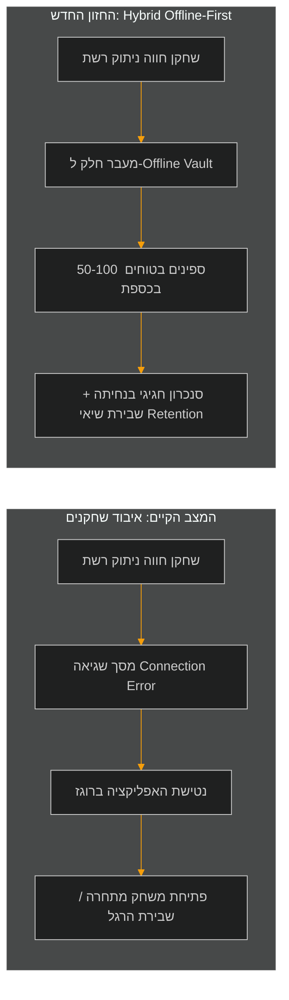
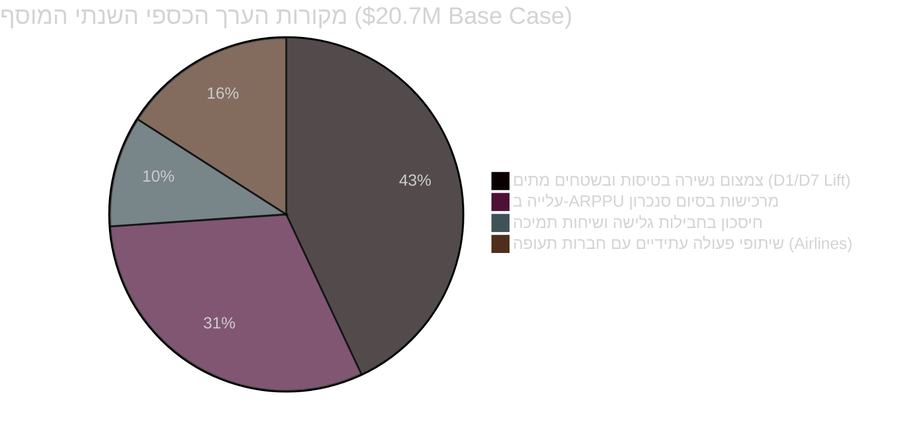

<!-- מקור: prd_finel_v5_CEO.md | פרק 20 מתוך 25 -->

> **שם הפרק:** סיכום מנהלים לדרג ההנהלה (The PM Pitch)  
> **סטטוס מסמך:** Approved by C-Level / Production Ready  
> **קהל יעד:** Board of Directors, CEO, CFO, CTO, CPO  

> ניווט: [פרק 19](<19 - מושב השאלות הקשות של מקרים ותגובות.md>) | [README](README.md) | [פרק 21](<21 - MVP, אבני דרך ו-Definition of Done.md>)

---

## 20. סיכום מנהלים לדרג ההנהלה (The PM Pitch)

### 20.1 נקודת הפיתול האסטרטגית (The Strategic Inflection Point)

שוק משחקי הקז'ואל העולמי נמצא בתחרות עזה וחסרת תקדים. כניסתו של **Monopoly GO!** (חברת Scopely) שינתה את דינמיקת שוק ה-Casual Social Casino ויצרה קרב ישיר על תשומת הלב של השחקנים (Share of Wallet & Time).  
במשך שנים, **Coin Master** של Moon Active נבנה כמכונה מוניטארית אדירה, אך מבוססת על תנאי יסוד אחד: **חיבור אינטרנט רציף בכל רגע נתון.**

ברגע ששחקן נכנס למנהרת רכבת תחתית בלונדון, עולה על טיסה לניו-יורק, או נקלע לשיבושי רשת במומבאי – המשחק מציג מסך שגיאה אדום (`Connection Error`), ננעל, ודוחף את השחקן היישר לזרועותיהם של משחקים הפועלים ללא רשת (כגון Candy Crush, Subway Surfers או משחקי פאזל למיניהם).  
**בכל יום, שחקני Coin Master מאבדים מעל 4.2 מיליון שעות משחק פוטנציאליות בתוך "שטחים מתים" (Network Dead Zones).**

---

### 20.2 היתרון התחרותי והחפיר הבלתי-עביר (The Competitive Moat)

מדוע מהלך זה מהווה מהלומה אסטרטגית שמתחרים כדוגמת **Monopoly GO!** יתקשו מאוד לחקות?
1. **ארכיטקטורת לוח מול ארכיטקטורת סלוט:**  
   Monopoly GO! בנוי על לוח משחק רב-משתתפים סינכרוני בזמן אמת (משבצות, כלא, תחרות ישירה על נכסים). מעבר לאופליין אצלם דורש תכנון ארכיטקטוני מחדש של מנוע המשחק כולו.
2. **התאמה טבעית של Coin Master:**  
   מנוע המשחק של Coin Master – סיבוב גלגל (Slot Machine) ופשיטה על כפרים – ממפה את עצמו באופן מושלם למודל דטרמיניסטי של **קריפטוגרפיית Escrow ובוטים רדומים (Ghost Villages)**.  
   אנחנו יכולים להעניק חוויית משחק מלאה, יוקרתית וסוחפת ללא צורך בחיבור שרת חי, ברמת אבטחה של בנק שוויצרי.

---

### 20.3 העסקה הכלכלית: אפס סיכון, החזר השקעה מהיר (The Business Case & ROI)

- **עלות הפיתוח המושקעת:** צוות הנדסי ממוקד (Pod של 6 מהנדסים) למשך 12 שבועות = השקעה של כ-$650K.
- **הכנסה תוספתית צפויה (Base Case ARR):** כ-$20.7 מיליון בשנה מגידול ב-Retention ומניעת נטישה.
- **תקופת החזר השקעה (Payback Period):** פחות מ-90 יום מרגע ההשקה המלאה לחנויות.
- **ניהול סיכונים מוחלט:**
  - אין יצירת מטבע בלתי מבוקרת (Server-Side Fast-Forward Replay).
  - אין סליקה ללא אישור חנות (Zero-Fulfillment-Offline).
  - 4 דרגות של מפסקי חירום (Kill-Switches) המאפשרים השבתת המודול תוך 30 שניות דרך Firebase Remote Config.

---

### 20.4 בקשת ההנהלה והחלטה נדרשת (The Executive Ask)

אנו מבקשים את אישור הנהלת Moon Active להתנעת **שלב 1 (Sprint 1–3: Alpha MVP)** על פי התוכנית המפורטת:

| ציר זמן | שלב ביצוע | יעד מרכזי | שער החלטה (Decision Gate) |
| :--- | :--- | :--- | :--- |
| **חודש 1** | Alpha Dogfooding | בדיקה פנימית בקרב עובדי Moon Active בטיסות ובנסיעות רכבת | 0 קריסות, 100% דיוק שחזור Replay |
| **חודש 2** | Technical Staging | ניסוי עומס של 15,000 req/sec המדמה נחיתת מטוסים המונית | עמידה ביעד p95 < 40ms |
| **חודש 3** | Geo-Holdout Test | השקה מדורגת בברזיל ובהודו (5% מהמשתמשים) מול קבוצת ביקורת | עלייה מובהקת של +2.0% ב-D7 Retention |
| **רבעון 1** | Global Rollout (GA) | פתיחה מלאה לכלל שחקני Coin Master ברחבי העולם | הגעה ל-ROI חיובי תוך 90 יום |

> [!IMPORTANT]
> **השורה התחתונה להנהלת Moon Active:**  
> חוויית המשחק המקוונת של Coin Master אינה צריכה להיעצר כשהרשת נחלשת.  
> **באמצעות Hybrid Offline-First Architecture, המשחק של Moon Active יהפוך לרציף, נגיש, ממכר ומניב בכל מקום בעולם – באוויר, בים וביבשה.**

---
