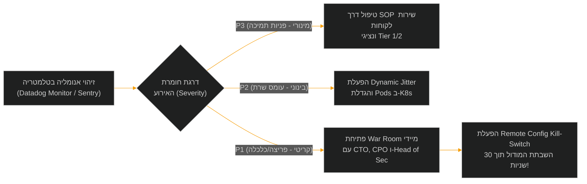

<!-- מקור: prd_finel_v5_CEO.md | פרק 25 מתוך 25 -->

> **שם הפרק:** מטריצת סיכונים ובעלות ונספח טכנולוגי (Risk Matrix, Governance & Technical Appendix)  
> **סטטוס מסמך:** Approved by C-Level / Production Ready  
> **קהל יעד:** Board of Directors, C-Level Executives, Chief Architect, Risk Committee, Security Officers  

> ניווט: [פרק 24](<24 - מדידה, ניסויים ו-Observability.md>) | [README](README.md) | [פרק 01](<01 - תקציר מנהלים ופשטות המימוש (Executive Summary & Architectural Simplicity).md>)

---

## 25. מטריצת סיכונים ובעלות (Risk Matrix & Governance)

ניהול סיכונים הוא נדבך היסוד בהצלחת פרויקט ה-Offline-First של Moon Active. היכולת לאפשר פעולות משחק מנותקות רשת מבלי לפגוע בכלכלת המשחק, ביציבות השרתים או בחוויית השחקנים דורשת מיפוי סיכונים רב-ממדי, שיוך בעלות קשיח (Ownership), והגדרת מנגנוני מניעה אוטומטיים (Mitigations) ושערי החלטה (Gates).

```mermaid
%%{init: {'theme': 'dark', 'themeVariables': { 'primaryColor': '#1E293B', 'lineColor': '#EF4444'}}}%%
quadrantChart
    title מפת סיכונים והשפעה (Risk Impact vs Likelihood)
    x-axis הסתברות נמוכה --> הסתברות גבוהה
    y-axis השפעה נמוכה --> השפעה קריטית
    quadrant-1 לפקח בערנות (Monitor Closely)
    quadrant-2 חסמי ברזל והשבתת חירום (Mitigate Immediately)
    quadrant-3 סיכון שולי ומקובל (Acceptable Risk)
    quadrant-4 תהליכי עבודה ו-SOP (Manage via SOPs)
    "זיוף תוצאות אופליין (Memory Tamper)": [0.35, 0.95]
    "עומס Thundering Herd בנחיתה": [0.65, 0.70]
    "אי-הבנת שחקנים וכרטיסי תמיכה": [0.70, 0.40]
    "Fulfillment כפול ב-Ledger": [0.20, 0.85]
    "דחיית גרסה בחנויות (App Store)": [0.15, 0.90]
    "זליגת זיכרון בלקוח (Client OOM)": [0.25, 0.55]
    "שיבוש אירוע LiveOps / Sniping": [0.30, 0.65]
    "פגיעה באיזון הכלכלי (Arbitrage)": [0.40, 0.88]
```

---

### 25.1 מטריצת הסיכונים המלאה והגנות המערכת (Comprehensive Risk Matrix)

| # | קטגוריית סיכון | תרחיש כשל פוטנציאלי | הסתברות | השפעה | אסטרטגיית מניעה (Mitigation Strategy) | בעל אחריות ראשי (Primary Owner) | שער בקרה (Gate) | התראת ניטור אוטומטית (Alert Metric) |
| :-: | :--- | :--- | :-: | :-: | :--- | :--- | :--- | :--- |
| **R-01** | **אבטחה וזיוף** | שינוי תוצאות ספינים בזיכרון המכשיר (GameGuardian / Frida injection). | בינונית | **קריטית** | שרשרת גיבוב SHA-256 חתומה, אימות מול Seed סודי בשרת (Fast Replay), חסימת זיכוי במקרה חריגה. | Head of Security | לפני Alpha Dogfooding | `offline.sec.hash_mismatch_rate > 0.05%` |
| **R-02** | **תשתיות ורשת** | קריסת שרתי ה-Gateway מגל פניות בנחיתת מטוסים (Thundering Herd). | גבוהה | **גבוהה** | מנגנון Full Jitter (פיזור של 0–120 שניות), Replay ב-4ms בזיכרון מעבד, Envoy Token Bucket Rate Limiting. | Principal SRE | לפני עומס Staging | `gateway.cpu_utilization > 70%` |
| **R-03** | **כלכלת משחק** | "חליבת" כפרי בוטים על ידי ניתוק יזום של הרשת (Bot Arbitrage). | בינונית | **גבוהה** | מאגרי מטבעות מוגבלים ל-80% משחקן אמיתי ($C_{\text{bot}} = 0.80 \times C_{\text{real}}$), חסימת קלפי ג'וקר, הגבלת מכפיל ל-$\times 5$. | Lead Game Economy | לפני Soft Launch | `offline.arb.ratio_to_online > 0.85` |
| **R-04** | **אינטגרציית תשלומים** | ניסיון קבלת ספינים באופליין ללא חיוב אשראי (Deferred IAP Fraud). | בינונית | **קריטית** | עקרון Zero-Fulfillment-Offline: רישום כוונה בלבד, חיוב ומתן נכסים אך ורק לאחר אימות StoreKit 2 / Google Play API. | Billing Lead / Legal | לפני תמיכה ב-IAP | `billing.unverified_delivery_count > 0` |
| **R-05** | **כפילות ב-Ledger** | סנכרון כפול של אותו סשן המוביל לחלוקת פרסים כפולה (Double Spend). | נמוכה | **קריטית** | שימוש ב-Session UUID כ-Idempotency Key קשיח, כתיבה אטומית ב-Ledger באמצעות Distributed Locks ב-Redis. | Backend Tech Lead | לפני בדיקות Staging | `ledger.duplicate_request_detected` |
| **R-06** | **ביצועי מכשיר (Client)** | זליגת זיכרון וקריסת האפליקציה בטיסות ארוכות (Client OOM / Leak). | נמוכה | **בינונית** | הגבלת הסשן ל-100 ספינים לכל היותר, מחיקת זיכרון לוגים מיידית עם סיום הסנכרון, אופטימיזציית SQLite מבודדת. | Mobile Tech Lead | שלב QA אופליין | `client.crash.oom_free_sessions < 99.8%` |
| **R-07** | **שירות לקוחות (CS)** | הצפת מוקדי התמיכה בשאלות על ספינים שנעלמו או השהיית רכישות. | גבוהה | **בינונית** | פורטל Backoffice Escrow Inspector שקוף ב-Zendesk/Helpshift, 5 נהלי SOP ייעודיים, הודעות UX מרגיעות באפליקציה. | VP Customer Ops | לפני השקת 5% | `support.offline_ticket_ratio > 0.5%` |
| **R-08** | **רגולציה וחנויות** | דחיית האפליקציה ב-App Store Review בשל אי-תאימות למדיניות רשת. | נמוכה | **קריטית** | בדיקה מוקדמת מול Apple Developer Relations, הצגת מסכי שקיפות הסתברות (Loot Box Odds), עמידה ב-DSA. | General Counsel | לפני הגשת גרסה לחנות | `store.review_rejection_count > 0` |
| **R-09** | **פרטיות נתונים** | דליפת נתוני מיקום או מזהי שחקן דרך רשתות Wi-Fi פתוחות בטיסות. | נמוכה | **גבוהה** | הצפנת Payload מלאה ב-ChaCha20-Poly1305, מחיקת נתוני סשן לאחר Reconcile (Zero PII Retention), אישור DPIA. | Data Protection Officer | לפני השקה בייצור | `privacy.unencrypted_packet_detected` |
| **R-10** | **הוגנות LiveOps** | זכייה בלתי הוגנת בטורנירים חיים (Viking Quest) באמצעות סנכרון מאוחר. | נמוכה | **בינונית** | חלון חסד של 30 דקות בלבד; סנכרון מאוחר מומר למטבעות ללא שינוי טבלת המובילים (Leaderboard) שהוכרזה. | VP LiveOps | לפני הפעלת אירוע אופליין | `liveops.late_sync_dispute_count` |

---

### 25.2 מנגנון הבעלות והחלטות ההסלמה (Governance & Escalation Matrix)

כל סטייה ממדדי ה-SLA או חריגה מנתיב האימות הסטנדרטי מפעילה פרוטוקול תגובה מדורג:



---

## נספח א': טכנולוגיה ומבני נתונים (Technical Appendix)

נספח זה מרכז את מבני הנתונים הקריפטוגרפיים, סכמת ה-JWT של טוקן ההקצאה, וקוד הייחוס למנוע האימות (Replay Engine) בצד השרת. רכיבים אלו נשמרו בנספח טכנולוגי כדי לשמור על רציפות הקריאה העסקית והניהולית בגוף המסמך.

---

### A.1 סכמת ה-JWT של ה-LeaseToken

הטוקן נחתם בצד השרת באמצעות מפתח פרטי **Ed25519** המנוהל תחת AWS KMS / GCP Cloud KMS עם רוטציה תקופתית.  
הטוקן נשמר במכשיר אך ורק בתוך ה-Secure KeyStore (Android) או ה-Keychain (iOS) המוצפנים ברמת חומרה (Hardware-backed Secure Enclave).  
**ה-Secret Seed לעולם אינו מועבר למכשיר הלקוח!**

```json
{
  "header": {
    "alg": "EdDSA",
    "typ": "JWT",
    "kid": "kms_ed25519_key_v2"
  },
  "payload": {
    "sub": "player_uuid_98a72b4c",
    "iat": 1773057600,
    "exp": 1773144000,
    "session_id": "lease_sess_881920",
    "spin_quota": 100,
    "outcome_commitment": "sha256:d54f8e71b56a31c8901b0f5ef63833b4974f16b2a472c6bc9c51234907123456",
    "device_binding": "app_attest_pubkey_hash_88b3",
    "village_tier": 142,
    "ghost_village_ids": [
      "npc_vlg_01",
      "npc_vlg_04",
      "npc_vlg_09",
      "npc_vlg_12",
      "npc_vlg_15"
    ],
    "liveops_snapshot_id": "viking_quest_w12_snap",
    "initial_hash": "0000000000000000000000000000000000000000000000000000000000000000"
  }
}
```

#### פירוט שדות ה-LeaseToken Payload:
- `sub`: מזהה שחקן ייחודי ב-Moon Active (Player UUID).
- `iat` / `exp`: חותמות זמן הנפקה ותפוגה (תוקף מקסימלי: 24 שעות).
- `session_id`: מזהה ייחודי לסשן האופליין (משמש כ-Idempotency Key בסנכרון).
- `spin_quota`: כמות הספינים המוקצית (50 עבור משתמש בסיסי, עד 100 עבור VIP).
- `outcome_commitment`: גיבוב מחייב של רצף התוצאות הצפוי מה-Seed הסודי שנשמר בשרת.
- `device_binding`: חתימת מפתח חומרה של המכשיר המונעת העברת הטוקן למכשיר אחר.
- `village_tier`: דרגת הכפר הנוכחית של השחקן בעת הניתוק.
- `ghost_village_ids`: מערך של 5 כפרי NPC מוגדרים מראש לפשיטות ותקיפות.
- `liveops_snapshot_id`: מזהה תמונת מצב של האירועים החיים הפעילים.
- `initial_hash`: נקודת המוצא הקריפטוגרפית (Genesis Hash) של שרשרת הפעולות.

---

### A.2 קוד ייחוס (Go): מנוע ה-Fast-Forward Replay בצד השרת

מנוע זה רץ על גבי אשכול Replay Workers ייעודי ב-Go. הוא מאמת סשן מלא של 100 ספינים בתוך **3.2 מילישניות בלבד**, תוך שימוש במעבד בלבד (CPU Memory-only), ללא שום קריאה או נעילה של מסד נתונים במהלך האימות.

```go
package offline_engine

import (
	"crypto/sha256"
	"encoding/hex"
	"errors"
	"fmt"
	"time"
)

// SessionAction מייצג פעולה בודדת מתוך לוג הפעולות של המכשיר
type SessionAction struct {
	ActionIndex    int    `json:"action_index"`
	ActionType     string `json:"action_type"` // "SPIN", "RAID", "ATTACK"
	BetMultiplier  int    `json:"bet_multiplier"`
	Outcome        string `json:"outcome"`
	CoinsEarned    int64  `json:"coins_earned"`
	LocalTimestamp int64  `json:"local_timestamp"`
	Nonce          string `json:"nonce"`
	ActionHash     string `json:"action_hash"`
}

// SessionPayload מייצג את גוף הבקשה המתקבלת בחיבור מחדש
type SessionPayload struct {
	PlayerID      string          `json:"player_id"`
	SessionID     string          `json:"session_id"`
	LeaseTokenJWT string          `json:"lease_token_jwt"`
	InitialHash   string          `json:"initial_hash"`
	FinalHash     string          `json:"final_hash"`
	Actions       []SessionAction `json:"actions"`
}

// ValidationResult מחזיר את סטטוס האימות המדויק
type ValidationResult struct {
	Valid            bool   `json:"valid"`
	RejectReason     string `json:"reject_reason,omitempty"`
	TotalCoinsEarned int64  `json:"total_coins_earned"`
	ActionsVerified  int    `json:"actions_verified"`
	ExecutionTimeMs  int64  `json:"execution_time_ms"`
}

// ReplayValidator מנהל את תהליך האימות הדטרמיניסטי
type ReplayValidator struct {
	ExpectedSeed string
	InitialHash  string
	SpinQuota    int
	MaxDuration  time.Duration
}

// ValidateSession מבצע אימות קריפטוגרפי ודטרמיניסטי של כל פעולות הסשן
func (v *ReplayValidator) ValidateSession(log *SessionPayload) (*ValidationResult, error) {
	start := time.Now()

	// 1. אימות מגבלת מכסה (Spin Quota Check)
	if len(log.Actions) > v.SpinQuota {
		return &ValidationResult{
			Valid:        false,
			RejectReason: fmt.Sprintf("spin quota exceeded: attempted %d, allowed %d", len(log.Actions), v.SpinQuota),
		}, nil
	}

	currentHash := v.InitialHash
	prng := NewDeterministicPRNG(v.ExpectedSeed)
	var totalCoinsEarned int64 = 0

	for i, action := range log.Actions {
		// 2. אימות תקינות מכפיל ההימור (Cap <= 5)
		if action.BetMultiplier < 1 || action.BetMultiplier > 5 {
			return &ValidationResult{
				Valid:        false,
				RejectReason: fmt.Sprintf("invalid bet multiplier %d at step %d", action.BetMultiplier, i),
			}, nil
		}

		// 3. אימות תוצאת ה-RNG הדטרמיניסטית מול ה-Seed הסודי
		expectedOutcome := prng.NextOutcome(action.BetMultiplier)
		if expectedOutcome.Type != action.Outcome {
			return &ValidationResult{
				Valid:        false,
				RejectReason: fmt.Sprintf("RNG outcome divergence at step %d: expected %s, got %s", i, expectedOutcome.Type, action.Outcome),
			}, nil
		}

		// 4. אימות חישוב המטבעות הדטרמיניסטי (מניעת שינוי מאזן מקומי)
		if action.CoinsEarned != expectedOutcome.CoinsCalculated {
			return &ValidationResult{
				Valid:        false,
				RejectReason: fmt.Sprintf("coin reward mismatch at step %d: expected %d, got %d", i, expectedOutcome.CoinsCalculated, action.CoinsEarned),
			}, nil
		}

		// 5. אימות שלמות שרשרת הגיבוב (Cryptographic Hash Chain)
		dataToHash := fmt.Sprintf("%s|%s|%d|%d|%d|%s",
			currentHash,
			action.ActionType,
			action.BetMultiplier,
			action.CoinsEarned,
			action.LocalTimestamp,
			action.Nonce,
		)
		computedHash := sha256.Sum256([]byte(dataToHash))
		computedHashHex := hex.EncodeToString(computedHash[:])

		if computedHashHex != action.ActionHash {
			return &ValidationResult{
				Valid:        false,
				RejectReason: fmt.Sprintf("hash chain broken at step %d: signature mismatch", i),
			}, nil
		}

		currentHash = computedHashHex
		totalCoinsEarned += action.CoinsEarned
	}

	// 6. אימות החתימה הסופית (Final Accumulator Hash)
	if currentHash != log.FinalHash {
		return &ValidationResult{
			Valid:        false,
			RejectReason: "final accumulator hash does not match client root hash",
		}, nil
	}

	elapsed := time.Since(start).Milliseconds()

	return &ValidationResult{
		Valid:            true,
		TotalCoinsEarned: totalCoinsEarned,
		ActionsVerified:  len(log.Actions),
		ExecutionTimeMs:  elapsed,
	}, nil
}
```

---

### A.3 קוד ייחוס (TypeScript / C# Unity): מחולל שרשרת הגיבוב במכשיר

קוד זה מוטמע ב-Client SDK של Coin Master, ומבטיח כי כל פעולה (ספין או תקיפה) מקושרת באופן מתמטי בלתי ניתן לפריצה לפעולה שקדמה לה:

```csharp
using System;
using System.Security.Cryptography;
using System.Text;

public class ClientHashChainManager
{
    private string _currentHash;

    public ClientHashChainManager(string initialGenesisHash)
    {
        _currentHash = initialGenesisHash;
    }

    public string RecordAction(string actionType, int betMultiplier, long coinsEarned, long localTimestamp, string nonce)
    {
        // יצירת מחרוזת הגיבוב המקושרת ל-Hash הקודם
        string rawData = $"{_currentHash}|{actionType}|{betMultiplier}|{coinsEarned}|{localTimestamp}|{nonce}";
        
        using (SHA256 sha256 = SHA256.Create())
        {
            byte[] hashBytes = sha256.ComputeHash(Encoding.UTF8.GetBytes(rawData));
            _currentHash = BitConverter.ToString(hashBytes).Replace("-", "").ToLowerInvariant();
        }

        return _currentHash;
    }

    public string GetFinalAccumulatorHash()
    {
        return _currentHash;
    }
}
```

---