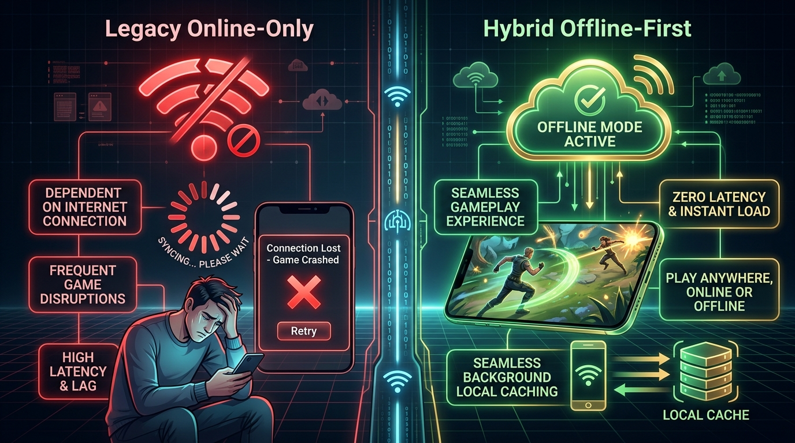
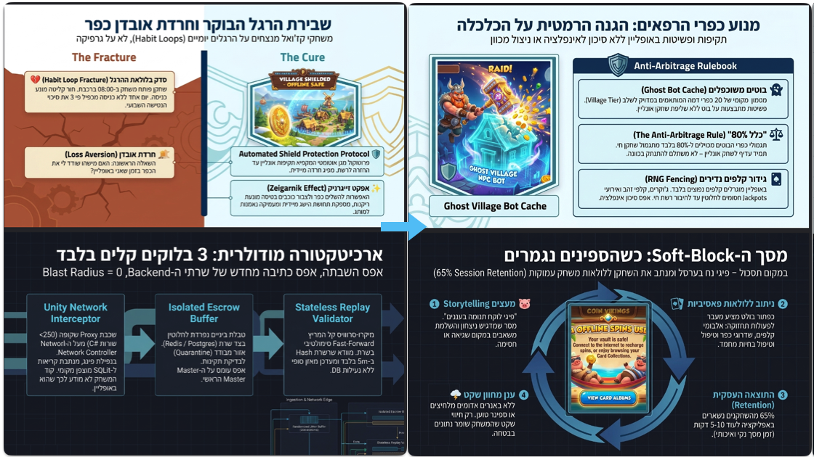

```mermaid
---
title: "כרטיסיית מנהלים מקוצרת (Executive Snapshot: Why This Wins)"
---
%%{init: {
  "theme": "base",
  "themeVariables": {
    "fontFamily": "Segoe UI, Assistant, sans-serif",
    "fontSize": "16px",
    "primaryColor": "#0f172a",
    "primaryTextColor": "#f8fafc",
    "primaryBorderColor": "#38bdf8",
    "lineColor": "#38bdf8",
    "secondaryColor": "#1e293b",
    "tertiaryColor": "#1e293b",
    "edgeLabelBackground": "#0f172a",
    "nodeBorder": "#38bdf8",
    "clusterBkg": "#0b1120",
    "clusterBorder": "#38bdf8"
  },
  "flowchart": { "curve": "basis", "nodeSpacing": 30, "rankSpacing": 35, "padding": 15 },
  "sequence": { "actorMargin": 30, "messageMargin": 30 },
  "state": { "nodeSpacing": 30, "rankSpacing": 35, "titleTopMargin": 15 }
}}%%
flowchart LR
    subgraph HEADER ["🚀 <b>COIN MASTER HYBRID OFFLINE-FIRST</b>"]
        direction LR
        C1["💰 <b>החזר השקעה (ROI)</b><br/>━━━━━━━━━━━━━━━<br/><span style='font-size:18px;color:#38bdf8;'>🎯 <b>יעד החזר:</b> עד 90 יום</span><br/><span style='font-size:18px;color:#94a3b8;'>⏱️ <b>פיתוח:</b> MVP תוך 4-6 שבועות</span>"]
        C2["⚙️ <b>פשטות המימוש</b><br/>━━━━━━━━━━━━━━━<br/><span style='font-size:18px;color:#38bdf8;'>🧱 <b>3 רכיבי MVP</b> מדורגים</span><br/><span style='font-size:18px;color:#94a3b8;'>🔒 <b>שינויי שרת</b> מוגבלים</span>"]
        C3["⚡ <b>אימפקט מיידי (Q1)</b><br/>━━━━━━━━━━━━━━━<br/><span style='font-size:18px;color:#38bdf8;'>📉 <b>יעד:</b> ירידת נטישה מדידה</span><br/><span style='font-size:18px;color:#94a3b8;'>🧪 <b>נמדד בניסוי מבוקר</b></span>"]
        C4["📈 <b>אופק ארוך (+36M$)</b><br/>━━━━━━━━━━━━━━━<br/><span style='font-size:18px;color:#38bdf8;'>📊 <b>תרחיש יעד</b></span><br/><span style='font-size:18px;color:#94a3b8;'>📑 <b>מחייב Case</b> נפרד</span>"]

        %% כפיית סדר אופקי רציף
        C1 ~~~ C2 ~~~ C3 ~~~ C4
    end

    %% מסגרת עליונה כהה
    style HEADER fill:#090d16,stroke:#38bdf8,stroke-width:3px,color:#38bdf8

    %% כרטיסים פנימיים כהים ומודגשים
    style C1 fill:#0f172a,stroke:#34d399,stroke-width:2px,color:#f8fafc
    style C2 fill:#0f172a,stroke:#38bdf8,stroke-width:2px,color:#f8fafc
    style C3 fill:#0f172a,stroke:#f59e0b,stroke-width:2px,color:#f8fafc
    style C4 fill:#0f172a,stroke:#a855f7,stroke-width:2px,color:#f8fafc
```

# Master PRD — חלוקה לפרקים

התיקייה הזו היא גרסה מפוצלת של [Master PRD המלא](../MASTER_PRD.md) עבור **Coin Master — Muni-Spins Hybrid Offline Mode**.

  

## מבנה

- כל אחד מ-25 הפרקים הראשיים נמצא בקובץ נפרד: `01 - תקציר מנהלים ופשטות המימוש.md` עד `25 - מטריצת סיכונים ובעלות.md`.
- [25 - מטריצת סיכונים ובעלות.md](<25 - מטריצת סיכונים ובעלות.md>) כולל גם את **נספח א׳ — Technical Appendix**, כדי לשמור על כל תוכן המסמך בלי ליצור קובץ פרק 26.
- התמונות נשארו בתיקיית האב `assets/pic/`; קישורי התמונות עודכנו בהתאם לנתיב החדש.
- דיאגרמות Mermaid נשמרו בתוך הפרקים, כולל תיקוני ה-frontmatter הנדרשים לרינדור תקין.
- בכל קובץ יש שורת ניווט ל-README, לפרק הקודם ולפרק הבא.

## רשימת פרקים

1. [תקציר מנהלים ופשטות המימוש (Executive Summary & Architectural Simplicity)](<./01 - תקציר מנהלים ופשטות המימוש (Executive Summary & Architectural Simplicity).md>)
2. [למה זה פשוט ולא מורכב למימוש? (The 3-Block Plug-and-Play Simplicity)](<./02 - למה זה פשוט ולא מורכב למימוש (The 3-Block Plug-and-Play Simplicity).md>)
3. [פסיכולוגיה התנהגותית, שימור הרגלים ומניעת חרדת שחקן (The Habit Loop & Loss Aversion)](<./03 - פסיכולוגיה התנהגותית, שימור הרגלים ומניעת חרדת שחקן (The Habit Loop & Loss Aversion).md>)
4. [הגדרת הבעיה ופילוח שוק עולמי (Market Opportunity & Connectivity)](<./04 - הגדרת הבעיה ופילוח שוק עולמי (Market Opportunity & Connectivity).md>)
5. [גבולות גזרה קשיחים: מה אנחנו במכוון *לא* עושים (Explicit Non-Goals & Scope Boundaries)](<./05 - גבולות גזרה קשיחים - מה אנחנו במכוון לא עושים (Explicit Non-Goals & Scope Boundaries).md>)
6. [חוויית משתמש (UX & Micro-Copy Strategy)](<./06 - חוויית משתמש (UX & Micro-Copy Strategy).md>)
7. [דרישות פונקציונליות וארכיטקטורת Leased Session (MoSCoW)](<./07 - דרישות פונקציונליות וארכיטקטורת Leased Session (MoSCoW).md>)
8. [מודול LiveOps ופרוטוקול אירועים חיים באופליין (LiveOps & Tournament Grace Protocol)](<./08 - מודול LiveOps ופרוטוקול אירועים חיים באופליין (LiveOps & Tournament Grace Protocol).md>)
9. [איזון כלכלי ומניעת ארביטראז' (Dynamic Economy Scaling & Anti-Arbitrage Math)](<./09 - איזון כלכלי ומניעת ארביטראז' (Dynamic Economy Scaling & Anti-Arbitrage Math).md>)
10. [ארכיטקטורת המערכת, מניעת עדר הניתורים (Thundering Herd) ו-Pseudocode לשרת](<./10 - ארכיטקטורת המערכת, מניעת עדר הניתורים (Thundering Herd) ו-Pseudocode לשרת.md>)
11. [דרישות לא-פונקציונליות, שוברי מעגלים ו-Kill-Switch (Circuit Breakers & Emergency Governance)](<./11 - דרישות לא-פונקציונליות, שוברי מעגלים ו-Kill-Switch (Circuit Breakers & Emergency Governance).md>)
12. [תאימות רגולטורית לחנויות (Apple StoreKit 2 & Google Play Billing)](<./12 - תאימות רגולטורית לחנויות (Apple StoreKit 2 & Google Play Billing).md>)
13. [ערך עסקי ורווחי: טווח מיידי מול טווח בינוני-ארוך (Business Value & Two-Horizon ROI)](<./13 - ערך עסקי ורווחי - טווח מיידי מול טווח בינוני-ארוך (Business Value & Two-Horizon ROI).md>)
14. [חזון שיתופי פעולה מסחריים (In-Flight Airline Partnerships & Zero-CAC Acquisition)](<./14 - חזון שיתופי פעולה מסחריים (In-Flight Airline Partnerships & Zero-CAC Acquisition).md>)
15. [מדדי הצלחה ומילון אירועי אנליטיקס (Telemetry & Data Dictionary)](<./15 - מדדי הצלחה ומילון אירועי אנליטיקס (Telemetry & Data Dictionary).md>)
16. [מפת דרכים הנדסית לרבעון (3-Month Agile Roadmap)](<./16 - מפת דרכים הנדסית לרבעון (3-Month Agile Roadmap).md>)
17. [תוכנית בדיקות אבטחה והשקה מדורגת (Testing & Rollout Plan)](<./17 - תוכנית בדיקות אבטחה והשקה מדורגת (Testing & Rollout Plan).md>)
18. [מדריך תמיכה ושירות לקוחות (Player Support & Helpdesk Playbook)](<./18 - מדריך תמיכה ושירות לקוחות (Player Support & Helpdesk Playbook).md>)
19. [מושב השאלות הקשות של מקרים ותגובות](<./19 - מושב השאלות הקשות של מקרים ותגובות.md>)
20. [סיכום מנהלים לדרג ההנהלה (The PM Pitch)](<./20 - סיכום מנהלים לדרג ההנהלה (The PM Pitch).md>)
21. [MVP, אבני דרך ו-Definition of Done](<./21 - MVP, אבני דרך ו-Definition of Done.md>)
22. [מודל אבטחה, פרטיות והרשאות](<./22 - מודל אבטחה, פרטיות והרשאות.md>)
23. [חוזי API ו-Reconciliation](<./23 - חוזי API ו-Reconciliation.md>)
24. [מדידה, ניסויים ו-Observability](<./24 - מדידה, ניסויים ו-Observability.md>)
25. [מטריצת סיכונים ובעלות](<./25 - מטריצת סיכונים ובעלות.md>)

## מסלולי קריאה מותאמים לתפקיד (Tailored Reading Paths)

כדי לאפשר קריאה יעילה ואפקטיבית לפי תחום אחריות:
- **מסלול מנכ"ל וסמנכ"ל כספים (CEO / CFO / Board Path):**
  [פרק 01 (תקציר מנהלים)](<01 - תקציר מנהלים ופשטות המימוש (Executive Summary & Architectural Simplicity).md>) ➔ [פרק 04 (פילוח שוק והזדמנות)](<04 - הגדרת הבעיה ופילוח שוק עולמי (Market Opportunity & Connectivity).md>) ➔ [פרק 13 (ערך עסקי ו-ROI)](<13 - ערך עסקי ורווחי - טווח מיידי מול טווח בינוני-ארוך (Business Value & Two-Horizon ROI).md>) ➔ [פרק 14 (שותפויות תעופה)](<14 - חזון שיתופי פעולה מסחריים (In-Flight Airline Partnerships & Zero-CAC Acquisition).md>) ➔ [פרק 19 (שאלות הנהלה קשות)](<19 - מושב השאלות הקשות של מקרים ותגובות.md>) ➔ [פרק 20 (The PM Pitch)](<20 - סיכום מנהלים לדרג ההנהלה (The PM Pitch).md>).
- **מסלול CTO, סמנכ"ל הנדסה ואבטחה (CTO / VP Engineering / InfoSec Path):**
  [פרק 02 (פשטות ה-3-Blocks)](<02 - למה זה פשוט ולא מורכב למימוש (The 3-Block Plug-and-Play Simplicity).md>) ➔ [פרק 07 (ארכיטקטורת Leased Session)](<07 - דרישות פונקציונליות וארכיטקטורת Leased Session (MoSCoW).md>) ➔ [פרק 10 (ארכיטקטורת מערכת ו-Thundering Herd)](<10 - ארכיטקטורת המערכת, מניעת עדר הניתורים (Thundering Herd) ו-Pseudocode לשרת.md>) ➔ [פרק 11 (שוברי מעגלים ו-Kill-Switch)](<11 - דרישות לא-פונקציונליות, שוברי מעגלים ו-Kill-Switch (Circuit Breakers & Emergency Governance).md>) ➔ [פרק 22 (מודל אבטחה ו-STRIDE)](<22 - מודל אבטחה, פרטיות והרשאות.md>) ➔ [פרק 23 (חוזי API ו-Reconciliation)](<23 - חוזי API ו-Reconciliation.md>) ➔ [פרק 25 ונספח א' (קוד Replay ב-Go ומטריצת סיכונים)](<25 - מטריצת סיכונים ובעלות.md>).
- **מסלול מוצר, עיצוב וכלכלת משחק (CPO / Game Designer / Head of Economy Path):**
  [פרק 03 (פסיכולוגיה התנהגותית ולולאת הרגל)](<03 - פסיכולוגיה התנהגותית, שימור הרגלים ומניעת חרדת שחקן (The Habit Loop & Loss Aversion).md>) ➔ [פרק 05 (גבולות גזרה ו-Non-Goals)](<05 - גבולות גזרה קשיחים - מה אנחנו במכוון לא עושים (Explicit Non-Goals & Scope Boundaries).md>) ➔ [פרק 06 (UX, כספת ומיקרו-קופי)](<06 - חוויית משתמש (UX & Micro-Copy Strategy).md>) ➔ [פרק 08 (LiveOps ואירועים חיים)](<08 - מודול LiveOps ופרוטוקול אירועים חיים באופליין (LiveOps & Tournament Grace Protocol).md>) ➔ [פרק 09 (איזון כלכלי ומניעת ארביטראז')](<09 - איזון כלכלי ומניעת ארביטראז' (Dynamic Economy Scaling & Anti-Arbitrage Math).md>) ➔ [פרק 12 (תאימות רגולטורית לחנויות)](<12 - תאימות רגולטורית לחנויות (Apple StoreKit 2 & Google Play Billing).md>).
- **מסלול אופרציה, בדיקות ואנליטיקס (QA / CS / BI / SRE Path):**
  [פרק 15 (מילון טלמטריה ואנליטיקס)](<15 - מדדי הצלחה ומילון אירועי אנליטיקס (Telemetry & Data Dictionary).md>) ➔ [פרק 16 (מפת דרכים הנדסית לספרינטים)](<16 - מפת דרכים הנדסית לרבעון (3-Month Agile Roadmap).md>) ➔ [פרק 17 (בדיקות Chaos והשקה מדורגת)](<17 - תוכנית בדיקות אבטחה והשקה מדורגת (Testing & Rollout Plan).md>) ➔ [פרק 18 (מדריך תמיכה ושירות לקוחות)](<18 - מדריך תמיכה ושירות לקוחות (Player Support & Helpdesk Playbook).md>) ➔ [פרק 21 (MVP ו-Definition of Done)](<21 - MVP, אבני דרך ו-Definition of Done.md>) ➔ [פרק 24 (מדידה, ניסויים ו-Observability)](<24 - מדידה, ניסויים ו-Observability.md>).

## מודל שלבי הפיתוח וההשקה (Structured Delivery Phasing)
1. **שלב 1: MVP אלפא (ספרינטים 1-3 / 4-6 שבועות)** – ליבת ה-Leased Session, מנוע אימות Replay מהיר, כפרי רפאים מוקלטים ומכסה בסיסית של 50 ספינים.
2. **שלב 2: השקה מלאה וייצוב (ספרינטים 4-6 / 12 שבועות סה"כ ב-Q1)** – תאימות LiveOps Grace Period, תורי IAP מושהים של StoreKit/Google Play, מנגנון שיטוח עומסים Thundering Herd, והשקה מדורגת גלובלית (Tiered Quotas של עד 100 ספינים ל-VIP).
3. **שלב 3: הרחבת אופק עסקי (Horizon 2 / 2-3 רבעונים)** – שותפויות Wi-Fi עם חברות תעופה גלובליות, פיתוח ערוץ הפצה ב-Zero-CAC, והרחבת ה-SDK המנותק לכלל משחקי הפורטפוליו של Moon Active.
## תקציר מנהלים ותוכן מקדים

#  Coin Master: Muni-Spins - Hybrid Offline-Mode - Feature 

# Master PRD: Product Strategy, Engineering Architecture, Monetization, and Game Economics

> [!IMPORTANT]
> **מסמך הגדרת מוצר ראשי    (Tier-1 Senior PM & VP Product Benchmark).**  
> מסמך זה מגדיר את אסטרטגיית המוצר, הפסיכולוגיה ההתנהגותית, הארכיטקטורה הטכנולוגית, מודל המונטיזציה, ניהול הסיכונים וכלכלת המשחק עבור יכולות **Muni-Spins - Feature** ב-**Coin Master**.  
---

## תוכן עניינים (Table of Contents)

- להתמצאות מהירה: תוכן העניינים המלא נשמר מאחורי הרחבה כדי להשאיר את גרסת ההנהלה נקייה וקלה לסריקה.

<b>❇️לחץ כאן לצפייה בטבלת תוכן העניינים המלאה❇️</b>

- [Master PRD: Hybrid Offline-First Architecture - Coin Master](#master-prd-hybrid-offline-first-architecture---coin-master)
  - [אסטרטגיית מוצר, ארכיטקטורה הנדסית, מונטיזציה וכלכלת משחק (Moon Active)](#אסטרטגיית-מוצר-ארכיטקטורה-הנדסית-מונטיזציה-וכלכלת-משחק-moon-active)
  - [כרטיסיית מנהלים מקוצרת (Executive Snapshot: Why This Wins)](#כרטיסיית-מנהלים-מקוצרת-executive-snapshot-why-this-wins)
  - [תוכן עניינים (Table of Contents)](#תוכן-עניינים-table-of-contents)
  - [1. תקציר מנהלים ופשטות המימוש (Executive Summary \& Architectural Simplicity)](#1-תקציר-מנהלים-ופשטות-המימוש-executive-summary--architectural-simplicity)
    - [1.1 חזון המוצר והרציונל העסקי](#11-חזון-המוצר-והרציונל-העסקי)
  - [2. למה זה פשוט ולא מורכב למימוש? (The 3-Block Plug-and-Play Simplicity)](#2-למה-זה-פשוט-ולא-מורכב-למימוש-the-3-block-plug-and-play-simplicity)
    - [למה הפיתוח דורש רק 2-3 ספרינטים (4-6 שבועות)?](#למה-הפיתוח-דורש-רק-2-3-ספרינטים-4-6-שבועות)
  - [3. פסיכולוגיה התנהגותית, שימור הרגלים ומניעת חרדת שחקן (The Habit Loop \& Loss Aversion)](#3-פסיכולוגיה-התנהגותית-שימור-הרגלים-ומניעת-חרדת-שחקן-the-habit-loop--loss-aversion)
    - [3.1 שבירת הרגל הבוקר: סיכון הנטישה הגדול (Habit Loop Fracture)](#31-שבירת-הרגל-הבוקר-סיכון-הנטישה-הגדול-habit-loop-fracture)
    - [3.2 הפגת חרדת אובדן משאבים (Mitigating Loss Aversion in the Air)](#32-הפגת-חרדת-אובדן-משאבים-mitigating-loss-aversion-in-the-air)
  - [4. הגדרת הבעיה ופילוח שוק עולמי (Market Opportunity \& Connectivity)](#4-הגדרת-הבעיה-ופילוח-שוק-עולמי-market-opportunity--connectivity)
    - [4.1 תמונת מצב עולמית: אתגרי רשת בשווקי היעד של Coin Master](#41-תמונת-מצב-עולמית-אתגרי-רשת-בשווקי-היעד-של-coin-master)
    - [4.2 ניתוח עומק לפי שווקים גיאוגרפיים](#42-ניתוח-עומק-לפי-שווקים-גיאוגרפיים)
    - [4.3 האתגר הקיים ב-Coin Master (למה המשחק אינו עובד כיום באופליין?)](#43-האתגר-הקיים-ב-coin-master-למה-המשחק-אינו-עובד-כיום-באופליין)
  - [5. גבולות גזרה קשיחים: מה אנחנו במכוון *לא* עושים (Explicit Non-Goals \& Scope Boundaries)](#5-גבולות-גזרה-קשיחים-מה-אנחנו-במכוון-לא-עושים-explicit-non-goals--scope-boundaries)
  - [6. חוויית משתמש (UX), לולאת דופמין ומיקרו-קופי (UX \& Micro-Copy Strategy)](#6-חוויית-משתמש-ux-לולאת-דופמין-ומיקרו-קופי-ux--micro-copy-strategy)
    - [6.1 אינדיקטור שקט (Ambient Offline Indicator)](#61-אינדיקטור-שקט-ambient-offline-indicator)
    - [6.2 חגיגת החזרה לרשת: אנימציית פתיחת הכספת (The Reconnect Touchpoint)](#62-חגיגת-החזרה-לרשת-אנימציית-פתיחת-הכספת-the-reconnect-touchpoint)
    - [6.3 מסך Soft-Block בסיום המכסה: מיקרו-קופי אמפתי](#63-מסך-soft-block-בסיום-המכסה-מיקרו-קופי-אמפתי)
      - [טבלת מיקרו-קופי רשמי (Micro-Copy Specification)](#טבלת-מיקרו-קופי-רשמי-micro-copy-specification)
    - [6.4 מכונת המצבים של חוויית השחקן (Player Lifecycle State Machine)](#64-מכונת-המצבים-של-חוויית-השחקן-player-lifecycle-state-machine)
  - [7. דרישות פונקציונליות וארכיטקטורת Leased Session (MoSCoW)](#7-דרישות-פונקציונליות-וארכיטקטורת-leased-session-moscow)
    - [7.1 פירוט הדרישות ההנדסיות](#71-פירוט-הדרישות-ההנדסיות)
      - [א. מודול ההגרלה ומכסת סשן חתומה (Capped Pre-Signed Budget)](#א-מודול-ההגרלה-ומכסת-סשן-חתומה-capped-pre-signed-budget)
      - [ב. החלפת PvP חי ביריבי דמה (Ghost Village Cache)](#ב-החלפת-pvp-חי-ביריבי-דמה-ghost-village-cache)
      - [ג. כספת מושהית (Offline Escrow Vault) ורכישות Offline IAP](#ג-כספת-מושהית-offline-escrow-vault-ורכישות-offline-iap)
  - [8. מודול LiveOps ופרוטוקול אירועים חיים באופליין (LiveOps \& Tournament Grace Protocol)](#8-מודול-liveops-ופרוטוקול-אירועים-חיים-באופליין-liveops--tournament-grace-protocol)
    - [8.1 מנגנון ה-Grace Period ואימות זמנים](#81-מנגנון-ה-grace-period-ואימות-זמנים)
  - [9. איזון כלכלי ומניעת ארביטראז' (Dynamic Economy Scaling \& Anti-Arbitrage Math)](#9-איזון-כלכלי-ומניעת-ארביטראז-dynamic-economy-scaling--anti-arbitrage-math)
    - [9.1 נוסחת התגמול המותאמת לכפר (Dynamic Payout Formula)](#91-נוסחת-התגמול-המותאמת-לכפר-dynamic-payout-formula)
    - [9.2 כלל מניעת ארביטראז' (The Anti-Arbitrage 80% Rule)](#92-כלל-מניעת-ארביטראז-the-anti-arbitrage-80-rule)
  - [10. ארכיטקטורת המערכת, מניעת עדר הניתורים (Thundering Herd) ו-Pseudocode לשרת](#10-ארכיטקטורת-המערכת-מניעת-עדר-הניתורים-thundering-herd-ו-pseudocode-לשרת)
    - [10.1 סכמת ה-JWT של ה-LeaseToken](#101-סכמת-ה-jwt-של-ה-leasetoken)
    - [10.2 פתרון בעיית "עדר הניתורים" בענן (The Thundering Herd \& Load Flattening)](#102-פתרון-בעיית-עדר-הניתורים-בענן-the-thundering-herd--load-flattening)
    - [10.3 קוד ייחוס (Pseudocode): מנוע ה-Fast-Forward Replay בצד השרת](#103-קוד-ייחוס-pseudocode-מנוע-ה-fast-forward-replay-בצד-השרת)
  - [11. דרישות לא-פונקציונליות, שוברי מעגלים ו-Kill-Switch (Circuit Breakers \& Emergency Governance)](#11-דרישות-לא-פונקציונליות-שוברי-מעגלים-ו-kill-switch-circuit-breakers--emergency-governance)
    - [11.1 מנגנון השבתת חירום ושוברי מעגלים (Kill-Switch Protocol)](#111-מנגנון-השבתת-חירום-ושוברי-מעגלים-kill-switch-protocol)
  - [12. תאימות רגולטורית לחנויות (Apple StoreKit 2 \& Google Play Billing)](#12-תאימות-רגולטורית-לחנויות-apple-storekit-2--google-play-billing)
    - [12.1 יישום מבוסס StoreKit 2 ו-Google Play Billing Deferred Queue](#121-יישום-מבוסס-storekit-2-ו-google-play-billing-deferred-queue)
  - [13. ערך עסקי ורווחי: טווח מיידי מול טווח בינוני-ארוך (Business Value \& Two-Horizon ROI)](#13-ערך-עסקי-ורווחי-טווח-מיידי-מול-טווח-בינוני-ארוך-business-value--two-horizon-roi)
    - [13.1 טבלת השוואת אימפקט פיננסי: טווח מיידי מול טווח ארוך](#131-טבלת-השוואת-אימפקט-פיננסי-טווח-מיידי-מול-טווח-ארוך)
    - [13.2 מתמטיקת החזר ההשקעה (Payback Model)](#132-מתמטיקת-החזר-ההשקעה-payback-model)
  - [14. חזון שיתופי פעולה מסחריים (In-Flight Airline Partnerships \& Zero-CAC Acquisition)](#14-חזון-שיתופי-פעולה-מסחריים-in-flight-airline-partnerships--zero-cac-acquisition)
  - [15. מדדי הצלחה ומילון אירועי אנליטיקס (Telemetry \& Data Dictionary)](#15-מדדי-הצלחה-ומילון-אירועי-אנליטיקס-telemetry--data-dictionary)
    - [15.1 מילון אירועים למערכות ה-BI (Amplitude / BigQuery Telemetry Dictionary)](#151-מילון-אירועים-למערכות-ה-bi-amplitude--bigquery-telemetry-dictionary)
  - [16. מפת דרכים הנדסית לרבעון (3-Month Agile Roadmap)](#16-מפת-דרכים-הנדסית-לרבעון-3-month-agile-roadmap)
  - [17. תוכנית בדיקות אבטחה והשקה מדורגת (Testing \& Rollout Plan)](#17-תוכנית-בדיקות-אבטחה-והשקה-מדורגת-testing--rollout-plan)
    - [17.1 סביבות בדיקה ותרחישי קיצון (Chaos Engineering \& Pen-Testing)](#171-סביבות-בדיקה-ותרחישי-קיצון-chaos-engineering--pen-testing)
    - [17.2 תוכנית שחרור הדרגתי (Phased Rollout Strategy)](#172-תוכנית-שחרור-הדרגתי-phased-rollout-strategy)
  - [18. מדריך תמיכה ושירות לקוחות (Player Support \& Helpdesk Playbook)](#18-מדריך-תמיכה-ושירות-לקוחות-player-support--helpdesk-playbook)
    - [18.1 פורטל תמיכה ייעודי (Backoffice CS Escrow Inspector)](#181-פורטל-תמיכה-ייעודי-backoffice-cs-escrow-inspector)
  - [19. מושב השאלות הקשות של ההנהלה (Executive FAQ / C-Level Hot Seat)](#19-מושב-השאלות-הקשות-של-ההנהלה-executive-faq--c-level-hot-seat)
      - [שאלת המנכ"ל (CEO): *"האם זה לא יעודד שחקנים להתנתק בכוונה כדי לשחק מול בוטים קלים?"*](#שאלת-המנכל-ceo-האם-זה-לא-יעודד-שחקנים-להתנתק-בכוונה-כדי-לשחק-מול-בוטים-קלים)
      - [שאלת סמנכ"ל הכספים (CFO): *"מה קורה אם שחקן רוכש חבילת IAP של $99 בטיסה ומבטל את כרטיס האשראי בנחיתה?"*](#שאלת-סמנכל-הכספים-cfo-מה-קורה-אם-שחקן-רוכש-חבילת-iap-של-99-בטיסה-ומבטל-את-כרטיס-האשראי-בנחיתה)
      - [שאלת סמנכ"ל הטכנולוגיות (CTO): *"האם עבודת ה-Replay לא תיצור צוואר בקבוק כבד על שרתי ה-Backend?"*](#שאלת-סמנכל-הטכנולוגיות-cto-האם-עבודת-ה-replay-לא-תיצור-צוואר-בקבוק-כבד-על-שרתי-ה-backend)
      - [שאלת היועץ המשפטי (General Counsel): *"האם מתן ספינים לפני סליקה סופית עומד בהנחיות חנויות האפליקציות?"*](#שאלת-היועץ-המשפטי-general-counsel-האם-מתן-ספינים-לפני-סליקה-סופית-עומד-בהנחיות-חנויות-האפליקציות)
  - [20. סיכום מנהלים לדרג ההנהלה (The PM Pitch)](#20-סיכום-מנהלים-לדרג-ההנהלה-the-pm-pitch)
  - [21. MVP, אבני דרך ו-Definition of Done](#21-mvp-אבני-דרך-ו-definition-of-done)
    - [21.1 גבולות ה-MVP](#211-גבולות-ה-mvp)
    - [21.2 Definition of Done](#212-definition-of-done)
  - [22. מודל אבטחה, פרטיות והרשאות](#22-מודל-אבטחה-פרטיות-והרשאות)
    - [22.1 Threat model מחייב](#221-threat-model-מחייב)
    - [22.2 בקרות אבטחה](#222-בקרות-אבטחה)
    - [22.3 פרטיות ומחזור חיים](#223-פרטיות-ומחזור-חיים)
  - [23. חוזי API ו-Reconciliation](#23-חוזי-api-ו-reconciliation)
    - [23.1 חוזי API מינימליים](#231-חוזי-api-מינימליים)
    - [23.2 כללי reconciliation](#232-כללי-reconciliation)
  - [24. מדידה, ניסויים ו-Observability](#24-מדידה-ניסויים-ו-observability)
    - [24.1 ניסוי מדורג](#241-ניסוי-מדורג)
    - [24.2 Observability](#242-observability)
  - [25. מטריצת סיכונים ובעלות](#25-מטריצת-סיכונים-ובעלות)

---

## כרטיסיית מנהלים מקוצרת (Executive Snapshot: Why This Wins)

- ליבת הערך: שיפור רציפות חוויית המשחק בלי לפגוע בסמכות השרת או בכלכלת המשחק.
- מסר הנהלה: מדובר בהיפותזה עסקית מדידה עם guardrails ברורים, לא בהתחייבות פיננסית מוקדמת.

---

---
> **החזון המוצרי:** מעבר מרשת תלויה ושבירה לרציפות חווייתית בטוחה בתנאי קליטה מקוטעת – תוך שמירה על סמכות השרת, מניעת זיופים, תאימות ל-LiveOps ומדידה מבוקרת של השפעת המוצר. כל יעד עסקי במסמך הוא היפותזה הניתנת לאימות, לא התחייבות.
---

---

---

*תרשים זרימה טכנולוגי: מעטפת האופליין מול שירותי המשחק המרכזיים*
---
